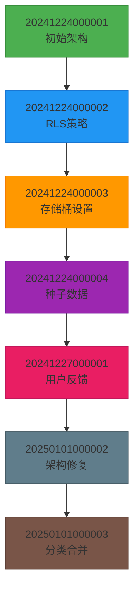
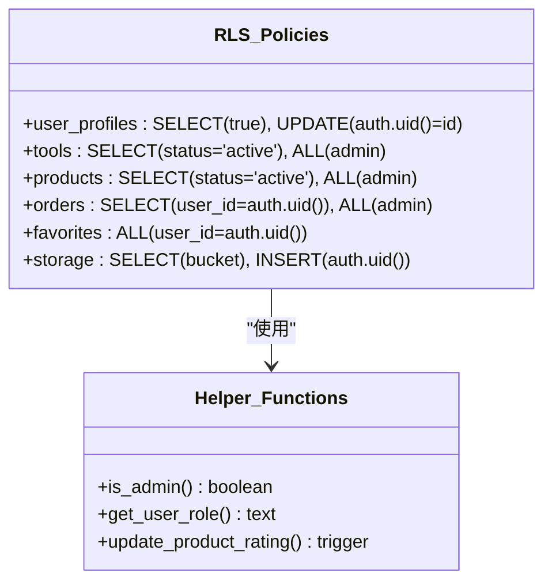
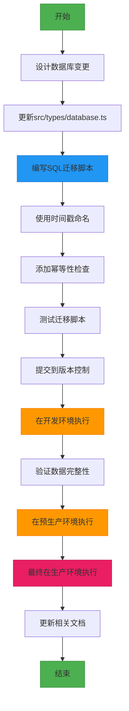

# 数据库迁移

<cite>
**本文档引用的文件**
- [20241224000001_initial_schema.sql](file://supabase/migrations/20241224000001_initial_schema.sql)
- [20241224000002_rls_policies.sql](file://supabase/migrations/20241224000002_rls_policies.sql)
- [20241224000003_storage_setup.sql](file://supabase/migrations/20241224000003_storage_setup.sql)
- [20241224000004_seed_data.sql](file://supabase/migrations/20241224000004_seed_data.sql)
- [20241227000001_user_feedback.sql](file://supabase/migrations/20241227000001_user_feedback.sql)
- [20250101000002_fix_schema_issues.sql](file://supabase/migrations/20250101000002_fix_schema_issues.sql)
- [20250101000003_merge_categories.sql](file://supabase/migrations/20250101000003_merge_categories.sql)
- [config.toml](file://supabase/config.toml)
- [database.ts](file://src/types/database.ts)
</cite>

## 目录
1. [引言](#引言)
2. [迁移目录结构](#迁移目录结构)
3. [迁移执行顺序与依赖关系](#迁移执行顺序与依赖关系)
4. [核心迁移文件分析](#核心迁移文件分析)
5. [数据库配置分析](#数据库配置分析)
6. [数据库模式与前端类型同步](#数据库模式与前端类型同步)
7. [迁移流程图](#迁移流程图)
8. [迁移操作指南](#迁移操作指南)
9. [结论](#结论)

## 引言
本文档深入解析Supabase数据库迁移机制，详细说明migrations目录中各SQL迁移脚本的版本控制策略、执行顺序与依赖关系。文档分析每个迁移文件的核心变更内容，包括表结构定义、RLS策略配置、存储桶设置、初始数据插入等。同时阐述config.toml中的数据库配置参数及其对迁移过程的影响，并结合src/types/database.ts中的TypeScript类型定义，说明数据库模式与前端类型的同步机制。最后提供迁移流程图，指导开发者如何安全地添加新迁移、处理迁移冲突以及回滚错误迁移。

## 迁移目录结构
Supabase项目的数据库迁移文件集中存放在`supabase/migrations`目录中，采用基于时间戳的命名约定，确保迁移脚本按正确顺序执行。每个迁移文件以UTC时间戳开头，后跟描述性名称，使用下划线连接，以`.sql`为扩展名。

当前项目包含以下迁移文件：
- `20241224000001_initial_schema.sql`：初始数据库架构
- `20241224000002_rls_policies.sql`：行级安全策略
- `20241224000003_storage_setup.sql`：存储桶设置
- `20241224000004_seed_data.sql`：种子数据
- `20241227000001_user_feedback.sql`：用户反馈系统
- `20250101000002_fix_schema_issues.sql`：架构问题修复
- `20250101000003_merge_categories.sql`：分类表合并

这种命名方案确保了迁移文件按时间顺序执行，避免了版本冲突和执行顺序错误。

**Section sources**
- [20241224000001_initial_schema.sql](file://supabase/migrations/20241224000001_initial_schema.sql)
- [20241224000002_rls_policies.sql](file://supabase/migrations/20241224000002_rls_policies.sql)
- [20241224000003_storage_setup.sql](file://supabase/migrations/20241224000003_storage_setup.sql)

## 迁移执行顺序与依赖关系
Supabase迁移系统按照文件名的字典顺序执行迁移脚本，确保数据库架构按预定顺序演进。迁移执行顺序严格遵循时间戳顺序，形成清晰的依赖链。

迁移依赖关系如下：
1. **初始架构**：`20241224000001_initial_schema.sql`必须首先执行，创建所有基础表和枚举类型
2. **安全策略**：`20241224000002_rls_policies.sql`依赖于初始架构，为所有表配置RLS策略
3. **存储配置**：`20241224000003_storage_setup.sql`在基础架构上配置存储桶和访问策略
4. **数据初始化**：`20241224000004_seed_data.sql`依赖于所有表结构，插入初始数据
5. **功能扩展**：`20241227000001_user_feedback.sql`添加新的用户反馈功能
6. **架构优化**：`20250101000002_fix_schema_issues.sql`修复和优化现有架构
7. **结构重构**：`20250101000003_merge_categories.sql`重构分类表结构

每个后续迁移都依赖于前面迁移创建的数据库状态，形成严格的执行序列。



**Diagram sources**
- [20241224000001_initial_schema.sql](file://supabase/migrations/20241224000001_initial_schema.sql)
- [20241224000002_rls_policies.sql](file://supabase/migrations/20241224000002_rls_policies.sql)
- [20241224000003_storage_setup.sql](file://supabase/migrations/20241224000003_storage_setup.sql)
- [20241224000004_seed_data.sql](file://supabase/migrations/20241224000004_seed_data.sql)
- [20241227000001_user_feedback.sql](file://supabase/migrations/20241227000001_user_feedback.sql)
- [20250101000002_fix_schema_issues.sql](file://supabase/migrations/20250101000002_fix_schema_issues.sql)
- [20250101000003_merge_categories.sql](file://supabase/migrations/20250101000003_merge_categories.sql)

**Section sources**
- [20241224000001_initial_schema.sql](file://supabase/migrations/20241224000001_initial_schema.sql)
- [20241224000002_rls_policies.sql](file://supabase/migrations/20241224000002_rls_policies.sql)
- [20241224000003_storage_setup.sql](file://supabase/migrations/20241224000003_storage_setup.sql)
- [20241224000004_seed_data.sql](file://supabase/migrations/20241224000004_seed_data.sql)
- [20241227000001_user_feedback.sql](file://supabase/migrations/20241227000001_user_feedback.sql)
- [20250101000002_fix_schema_issues.sql](file://supabase/migrations/20250101000002_fix_schema_issues.sql)
- [20250101000003_merge_categories.sql](file://supabase/migrations/20250101000003_merge_categories.sql)

## 核心迁移文件分析
### 初始架构迁移
`20241224000001_initial_schema.sql`文件创建了数据库的基础架构，包括所有核心表、枚举类型、索引和触发器。该迁移使用幂等性设计，通过`IF NOT EXISTS`条件确保可重复执行而不产生错误。

核心变更包括：
- 创建`user_profiles`、`tools`、`products`等核心表
- 定义`user_role`、`tool_status`等枚举类型
- 为所有表创建必要的索引以优化查询性能
- 创建`update_updated_at_column`触发器函数，自动更新记录的修改时间

该迁移是整个数据库架构的基础，后续所有迁移都依赖于此。

**Section sources**
- [20241224000001_initial_schema.sql](file://supabase/migrations/20241224000001_initial_schema.sql)

### RLS策略迁移
`20241224000002_rls_policies.sql`文件为所有表配置行级安全（RLS）策略，实现细粒度的访问控制。每个表的RLS策略根据业务需求定制，确保数据安全。

主要策略包括：
- **用户资料**：用户只能查看和更新自己的资料
- **工具和产品**：所有人可以查看活跃状态的记录，管理员可以管理所有记录
- **订单和支付**：用户只能访问自己的订单信息，管理员有完全访问权限
- **收藏**：用户只能管理自己的收藏列表

该迁移还创建了辅助函数`is_admin()`和`get_user_role()`，简化权限检查逻辑。



**Diagram sources**
- [20241224000002_rls_policies.sql](file://supabase/migrations/20241224000002_rls_policies.sql)

**Section sources**
- [20241224000002_rls_policies.sql](file://supabase/migrations/20241224000002_rls_policies.sql)

### 存储桶设置迁移
`20241224000003_storage_setup.sql`文件配置Supabase存储服务，创建多个存储桶并设置相应的访问策略。每个存储桶针对特定用途优化配置。

创建的存储桶包括：
- `avatars`：用户头像存储，限制文件大小为5MB，支持常见图片格式
- `product-images`：产品图片存储，限制文件大小为10MB
- `tool-icons`：工具图标存储，限制文件大小为2MB，支持SVG格式
- `uploads`：通用文件上传，限制文件大小为50MB，支持PDF和ZIP格式

访问策略根据用户角色和文件所有权进行控制，确保数据安全。

**Section sources**
- [20241224000003_storage_setup.sql](file://supabase/migrations/20241224000003_storage_setup.sql)

### 种子数据迁移
`20241224000004_seed_data.sql`文件插入初始数据，为系统提供基础内容。该迁移确保新部署的系统具有可用的默认数据。

插入的数据包括：
- 六个默认工具分类（开发工具、设计工具等）
- 六个产品分类
- 八个示例工具（VS Code、GitHub等）
- 五个示例产品
- 八个标签
- 工具与标签的关联关系
- 模拟的点击次数和评分数据

这些种子数据为前端展示提供了基础内容，确保系统开箱即用。

**Section sources**
- [20241224000004_seed_data.sql](file://supabase/migrations/20241224000004_seed_data.sql)

### 用户反馈迁移
`20241227000001_user_feedback.sql`文件添加用户反馈系统，创建`user_feedback`表及相关组件。该功能允许用户提交反馈并跟踪处理状态。

核心组件包括：
- `user_feedback`表：存储反馈信息，包含类型、优先级、状态等字段
- 统计视图：`feedback_stats`、`feedback_type_stats`等，提供反馈数据分析
- 触发器：`notify_feedback_created`和`notify_feedback_responded`，实现实时通知
- RLS策略：用户只能访问自己的反馈，管理员有完全管理权限

该迁移还包含示例数据，演示反馈系统的使用方式。

**Section sources**
- [20241227000001_user_feedback.sql](file://supabase/migrations/20241227000001_user_feedback.sql)

### 架构修复迁移
`20250101000002_fix_schema_issues.sql`文件修复和优化现有数据库架构，解决安全漏洞并提升性能。该迁移采用事务性设计，确保原子性。

主要改进包括：
- 为数组字段（`products.images`、`products.features`）添加GIN索引
- 为JSONB字段（`analytics.event_data`）添加GIN索引
- 创建复合索引优化常用查询
- 添加详细的字段和索引注释
- 修复RLS策略中的安全漏洞

该迁移还包含错误处理机制，在迁移失败时记录错误信息并回滚事务。

**Section sources**
- [20250101000002_fix_schema_issues.sql](file://supabase/migrations/20250101000002_fix_schema_issues.sql)

### 分类合并迁移
`20250101000003_merge_categories.sql`文件重构分类系统，将独立的`categories`和`product_categories`表合并为统一的`unified_categories`表。这一优化消除了重复的表结构。

迁移步骤包括：
1. 创建新的`unified_categories`表，添加`category_type`字段区分工具和产品分类
2. 将现有分类数据迁移到新表，保留原始ID确保外键引用完整性
3. 更新`tools`和`products`表的外键约束，指向新分类表
4. 为新表添加索引和RLS策略
5. 删除旧的分类表

该迁移包含完整的数据验证逻辑，确保迁移过程的数据完整性。

**Section sources**
- [20250101000003_merge_categories.sql](file://supabase/migrations/20250101000003_merge_categories.sql)

## 数据库配置分析
`supabase/config.toml`文件包含Supabase项目的配置参数，影响数据库迁移和运行时行为。该配置文件采用TOML格式，组织清晰。

关键配置部分包括：

### API配置
```toml
[api]
enabled = true
port = 54321
schemas = ["public", "graphql_public"]
extra_search_path = ["public", "extensions"]
max_rows = 1000
```
API配置启用Supabase API服务，设置监听端口为54321，定义可用的数据库模式，并限制单次查询返回的最大行数。

### 认证配置
```toml
[auth]
enabled = true
site_url = "http://localhost:3000"
additional_redirect_urls = ["https://ramusi.cn", "https://spiffy-torrone-5454e1.netlify.app"]
jwt_expiry = 3600
enable_signup = true
```
认证配置启用用户注册和登录功能，设置站点URL和重定向URL，配置JWT令牌有效期为1小时。特别启用了GitHub和Google外部认证。

### 数据库配置
```toml
[db]
port = 54322
shadow_port = 54320
major_version = 15
```
数据库配置指定PostgreSQL服务的端口和主版本号，确保与Supabase兼容。

### 存储配置
```toml
[storage]
enabled = true
file_size_limit = "50MiB"
```
存储配置启用对象存储服务，设置单个文件大小限制为50MB，与迁移脚本中的存储桶配置相呼应。

这些配置参数共同定义了数据库环境，影响迁移脚本的执行和数据库的运行时行为。

**Section sources**
- [config.toml](file://supabase/config.toml)

## 数据库模式与前端类型同步
`src/types/database.ts`文件定义了数据库模式的TypeScript类型，实现前后端类型安全。该文件与数据库迁移保持同步，确保类型一致性。

### 类型定义结构
类型定义采用Supabase推荐的结构，为每个表定义`Row`、`Insert`和`Update`三种类型：
- `Row`：表示从数据库查询返回的完整记录
- `Insert`：表示插入新记录时的字段，可选字段标记为可选
- `Update`：表示更新记录时的字段，所有字段均为可选

### 核心表类型同步
#### 工具表同步
数据库迁移中`tools`表的结构与TypeScript类型完全对应：
- 数据库字段`is_featured`（布尔类型）对应类型中的`is_featured: boolean`
- 枚举字段`status`对应联合类型`"active" | "inactive" | "pending"`
- 时间戳字段`created_at`对应字符串类型（ISO格式）

#### 用户资料表同步
`user_profiles`表的复杂结构在类型定义中得到完整体现：
- JSONB字段`billing_address`在订单表中对应嵌套对象类型
- UUID字段在TypeScript中表示为字符串
- 枚举类型`role`映射为字符串联合类型

### 同步机制
开发团队通过以下流程确保数据库模式与前端类型的同步：
1. **设计先行**：在修改数据库前，先更新TypeScript类型定义
2. **迁移执行**：编写并执行数据库迁移脚本
3. **类型验证**：使用TypeScript编译器验证类型与实际数据库查询结果的兼容性
4. **文档更新**：更新相关文档，记录模式变更

这种严格的同步流程确保了前后端代码的类型安全，减少了运行时错误。


**Diagram sources**
- [database.ts](file://src/types/database.ts)
- [20241224000001_initial_schema.sql](file://supabase/migrations/20241224000001_initial_schema.sql)

**Section sources**
- [database.ts](file://src/types/database.ts)

## 迁移流程图


**Diagram sources**
- [20241224000001_initial_schema.sql](file://supabase/migrations/20241224000001_initial_schema.sql)
- [database.ts](file://src/types/database.ts)

## 迁移操作指南
### 添加新迁移
1. **设计变更**：明确需要的数据库变更，评估对现有系统的影响
2. **更新类型定义**：修改`src/types/database.ts`中的相关类型
3. **生成时间戳**：使用`date -u +%Y%m%d%H%M%S`生成UTC时间戳
4. **创建迁移文件**：在`supabase/migrations`目录创建新文件，命名格式为`<timestamp>_<description>.sql`
5. **编写幂等脚本**：使用`IF NOT EXISTS`、`DO $$ BEGIN ... END $$`等确保脚本可重复执行
6. **添加注释**：包含迁移ID、描述和作者信息
7. **测试验证**：在本地环境测试迁移脚本

### 处理迁移冲突
当多个开发者同时创建迁移时，可能出现时间戳冲突：
1. **检测冲突**：Git合并时检查是否有相同时间戳的迁移文件
2. **重新命名**：将冲突的迁移文件重命名为稍后的时间戳
3. **调整依赖**：确保重命名后的迁移仍满足依赖关系
4. **团队协调**：建立迁移创建的时间窗口，避免并发创建

### 回滚错误迁移
Supabase不直接支持迁移回滚，需手动创建反向迁移：
1. **评估影响**：确定错误迁移的影响范围
2. **创建反向迁移**：编写新的迁移脚本，撤销错误变更
3. **数据恢复**：如有必要，从备份恢复受影响的数据
4. **测试验证**：在非生产环境充分测试回滚过程
5. **执行回滚**：在生产环境执行反向迁移

### 最佳实践
- **小步迭代**：每次迁移只做单一变更，便于测试和回滚
- **幂等设计**：确保迁移脚本可安全重复执行
- **数据备份**：在生产环境执行迁移前，先备份数据库
- **环境同步**：确保开发、预生产和生产环境的迁移状态一致
- **文档记录**：详细记录每次迁移的目的和影响

**Section sources**
- [20241224000001_initial_schema.sql](file://supabase/migrations/20241224000001_initial_schema.sql)
- [20250101000003_merge_categories.sql](file://supabase/migrations/20250101000003_merge_categories.sql)

## 结论
Supabase数据库迁移机制通过基于时间戳的命名约定和有序执行，确保了数据库架构的可靠演进。项目中的迁移脚本遵循幂等性设计原则，支持安全的重复执行。