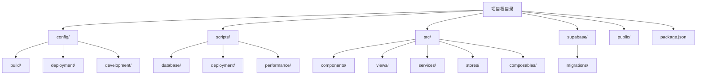
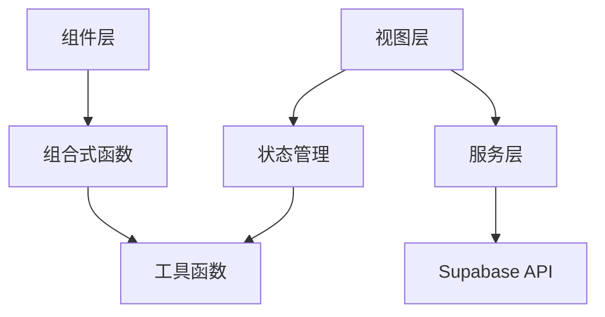

# 目录结构详解

<cite>
**本文档引用的文件**
- [package.json](file://package.json)
- [postcss.config.mjs](file://config/build/postcss.config.mjs)
- [tailwind.config.ts](file://config/build/tailwind.config.ts)
- [Dockerfile](file://config/deployment/Dockerfile)
- [docker-compose.yml](file://config/deployment/docker-compose.yml)
- [nginx.conf](file://config/deployment/nginx.conf)
- [claude_desktop_config.json](file://config/development/claude_desktop_config.json)
- [components.json](file://config/development/components.json)
- [check-wee-table.js](file://scripts/database/check-wee-table.js)
- [create-rls-policies-final.sql](file://scripts/database/create-rls-policies-final.sql)
- [supabase/migrations](file://supabase/migrations)
- [src/components](file://src/components)
- [src/views](file://src/views)
- [src/services](file://src/services)
- [src/stores](file://src/stores)
- [src/composables](file://src/composables)
</cite>

## 目录结构

本项目采用模块化分层架构，目录结构清晰，职责分明。整体结构分为核心源码、配置管理、脚本工具和数据库迁移四大模块，便于团队协作与维护。



**Diagram sources**
- [package.json](file://package.json#L1-L93)
- [config](file://config#L1-L90)
- [scripts](file://scripts#L1-L205)
- [src](file://src#L1-L89)
- [supabase](file://supabase#L1-L236)

## 根目录分析

根目录是项目的入口与配置中心，包含工程配置、依赖管理和构建脚本。

### package.json 脚本命令解析

`package.json` 文件定义了完整的开发、构建与部署生命周期命令，涵盖本地开发、数据库管理、部署诊断和健康检查等场景。

- **开发相关命令**：
  - `dev`: 启动 Vite 开发服务器
  - `lint`: 执行代码规范检查并自动修复
  - `type-check`: 类型检查确保 TypeScript 安全性

- **构建与部署命令**：
  - `build`: 使用 Vite 构建生产版本
  - `pre-deploy`: 部署前环境检查
  - `build:optimize`: 构建优化脚本
  - `deploy`: 使用 gh-pages 发布到 GitHub Pages

- **Supabase 数据库管理命令**：
  - `supabase:start`: 启动本地 Supabase 实例
  - `supabase:push`: 将本地数据库模式推送到远程
  - `supabase:pull`: 从远程拉取数据库模式
  - `supabase:gen-types`: 自动生成数据库类型定义至 `src/types/database.ts`
  - `supabase:setup`: 执行完整的数据库初始化设置（调用 shell 脚本）

- **部署与诊断命令**：
  - `deployment:status`: 检查部署状态
  - `secrets:check`: 验证 GitHub Secrets 配置
  - `test:deployment`: 测试部署工作流
  - `monitor:health`: 部署健康监控

这些脚本通过组合调用 Node.js 脚本和系统命令，实现了自动化运维能力。

**Section sources**
- [package.json](file://package.json#L1-L93)

### 依赖管理与工程配置

项目依赖分为生产依赖与开发依赖，采用现代前端技术栈：

- **核心框架**：Vue 3 + Vue Router + Pinia（状态管理）
- **UI 组件库**：@heroicons/vue 和 lucide-vue-next 提供图标支持
- **Supabase 集成**：@supabase/supabase-js 实现后端即服务（BaaS）功能
- **类型系统**：TypeScript + vue-tsc 提供强类型保障
- **构建工具**：Vite 提供高速开发体验
- **测试框架**：Vitest 支持单元与集成测试

工程配置文件包括：
- `tsconfig.json`：TypeScript 编译配置
- `vite.config.ts`：Vite 构建配置
- `.npmrc`：NPM 包管理配置

## config/ 目录配置说明

`config/` 目录集中管理各类构建、部署和开发配置，实现环境分离与配置复用。

### 构建配置（build/）

#### PostCSS 配置
`postcss.config.mjs` 文件配置 PostCSS 插件，启用 Tailwind CSS 处理样式。

```js
plugins: {
  tailwindcss: {}
}
```

该配置使 Tailwind 的实用类能在构建过程中被正确解析和应用。

**Section sources**
- [postcss.config.mjs](file://config/build/postcss.config.mjs#L1-L8)

#### Tailwind CSS 配置
`tailwind.config.ts` 定义了设计系统变量，包括颜色、圆角、动画等，采用 CSS 变量实现主题切换。

- `content` 字段指定扫描路径，确保动态类名被保留
- `theme.extend.colors` 定义了基于 CSS 变量的调色板，支持暗色模式
- 动画部分定义了手风琴展开/收起效果，用于 UI 交互

此配置实现了高度可定制的视觉设计体系。

**Section sources**
- [tailwind.config.ts](file://config/build/tailwind.config.ts#L1-L89)

### 部署配置（deployment/）

#### Docker 配置
`Dockerfile` 采用多阶段构建策略：
1. 第一阶段使用 Node.js 镜像构建前端资源
2. 第二阶段使用 Nginx 镜像部署静态文件

这种设计减小了最终镜像体积，提升了安全性与启动速度。

**Section sources**
- [Dockerfile](file://config/deployment/Dockerfile#L1-L13)

#### Docker Compose 配置
`docker-compose.yml` 定义了服务编排：
- 服务名为 `web`
- 映射端口 80
- 设置生产环境变量
- 自动重启机制

便于本地模拟生产环境运行。

**Section sources**
- [docker-compose.yml](file://config/deployment/docker-compose.yml#L1-L15)

#### Nginx 配置
`nginx.conf` 提供完整的 Web 服务器配置：
- HTTP 到 HTTPS 重定向
- SSL 安全设置（TLS 1.2/1.3）
- HSTS 强制安全连接
- 静态资源缓存策略（JS/CSS/图片缓存1年）
- HTML 文件禁用缓存
- SPA 路由支持（`try_files`）
- 安全头设置（CSP、XSS、点击劫持防护）

该配置满足现代 Web 安全与性能最佳实践。

**Section sources**
- [nginx.conf](file://config/deployment/nginx.conf#L1-L85)

### 开发配置（development/）

#### Claude Desktop 配置
`claude_desktop_config.json` 配置了 MCP（Model Context Protocol）服务器，用于 AI 辅助开发。

**Section sources**
- [claude_desktop_config.json](file://config/development/claude_desktop_config.json#L1-L8)

#### 组件库配置
`components.json` 记录了 UI 组件库的配置信息：
- 使用 shadcn/ui 模板
- 启用 TypeScript 和 RSC 支持
- 配置别名（如 `@/components`）
- 图标库使用 Lucide

为组件生成和引用提供标准化配置。

**Section sources**
- [components.json](file://config/development/components.json#L1-L20)

## scripts/ 目录脚本说明

`scripts/` 目录包含各类自动化脚本，提升开发与运维效率。

### 数据库脚本（database/）

#### 检查 wee 表脚本
`check-wee-table.js` 用于诊断并清理废弃的 `wee` 表：
- 检查表是否存在
- 查询表结构与数据样本
- 分析外键依赖关系
- 提供删除建议

该脚本通过 Supabase 客户端连接数据库，执行元数据查询，帮助开发者识别遗留数据结构。

**Section sources**
- [check-wee-table.js](file://scripts/database/check-wee-table.js#L1-L204)

#### RLS 策略脚本
`create-rls-policies-final.sql` 定义了行级安全（RLS）策略：
- 为 `user_feedback`、`faqs`、`product_submissions` 等表设置访问控制
- 普通用户仅能访问自己的数据
- 管理员可管理所有数据
- 公共内容（如 FAQ）对所有人可见
- 最后验证所有策略是否正确应用

这些策略通过 PostgreSQL 的 `CREATE POLICY` 语句实现，确保数据安全。

**Section sources**
- [create-rls-policies-final.sql](file://scripts/database/create-rls-policies-final.sql#L1-L235)

### 部署脚本（deployment/）

该目录包含部署诊断、状态检查、密钥验证、自动部署等脚本，支持跨平台（Bash/PowerShell）执行，确保部署流程可靠。

### 性能优化脚本

`optimize-build.mjs` 用于构建性能优化，可能包含代码分割、压缩、预加载等策略。

## supabase/ 目录说明

`supabase/` 目录管理数据库迁移与配置。

### Migrations 迁移脚本

`migrations/` 目录包含按时间戳命名的 SQL 迁移文件：
- `20241224000001_initial_schema.sql`: 初始模式
- `20241224000002_rls_policies.sql`: RLS 策略
- `20241224000003_storage_setup.sql`: 存储桶设置
- `20241224000004_seed_data.sql`: 种子数据
- 后续为修复和合并脚本

命名规则 `YYYYMMDDHHMMSS_描述.sql` 确保执行顺序，Supabase CLI 按字典序执行迁移，实现数据库版本控制。

**Section sources**
- [supabase/migrations](file://supabase/migrations)

## src/ 目录模块解析

`src/` 是核心源码目录，采用分层架构设计。

### 组件（components/）

包含可复用 UI 组件，按功能分组：
- `admin/`: 管理后台组件
- `common/`: 通用组件（懒加载）
- `error/`: 错误处理
- `feedback/`: 用户反馈
- `notifications/`: 通知系统
- `search/`: 搜索功能
- `theme/`: 主题切换
- `ui/`: 基础 UI 组件

组件通过 Props 接收数据，事件驱动交互，遵循单一职责原则。

**Section sources**
- [src/components](file://src/components)

### 视图（views/）

代表应用的不同页面视图，如 `HomeView.vue`、`LoginView.vue`、`AdminView.vue` 等。视图层负责：
- 路由绑定
- 页面布局
- 调用服务层获取数据
- 绑定状态管理

视图依赖 `stores` 和 `services`，不直接操作数据。

**Section sources**
- [src/views](file://src/views)

### 服务（services/）

`services/` 目录封装业务逻辑与 API 调用，如 `authService.ts`、`productsService.ts`、`reviewService.ts` 等。职责包括：
- 调用 Supabase API
- 数据转换
- 错误处理
- 缓存管理

服务层为上层提供统一接口，解耦业务逻辑与 UI。

**Section sources**
- [src/services](file://src/services)

### 状态管理（stores/）

使用 Pinia 实现状态管理，包含：
- `auth.ts`: 认证状态
- `products.ts`: 产品数据
- `tools.ts`: 工具列表
- `categories.ts`: 分类信息

状态 store 集中管理应用状态，支持响应式更新，被 `views` 和 `components` 共享。

**Section sources**
- [src/stores](file://src/stores)

### 组合式函数（composables/）

`composables/` 提供可复用的逻辑单元：
- `useRealtime.ts`: 实时数据同步
- `useLazyLoading.ts`: 懒加载
- `usePerformance.ts`: 性能监控
- `useAdvancedSearch.ts`: 高级搜索

遵循 Vue 3 Composition API 设计模式，提升逻辑复用性。

**Section sources**
- [src/composables](file://src/composables)

### 模块依赖关系

项目遵循清晰的依赖层级：
```
views → stores/services → composables/utils
```
- `views` 依赖 `stores` 和 `services` 获取数据
- `components` 依赖 `composables` 复用逻辑
- `services` 调用外部 API 并处理响应
- 所有层均可使用 `utils` 工具函数

这种分层设计确保了高内聚、低耦合，便于测试与维护。



**Diagram sources**
- [src/views](file://src/views)
- [src/stores](file://src/stores)
- [src/services](file://src/services)
- [src/composables](file://src/composables)
- [src/utils](file://src/utils)