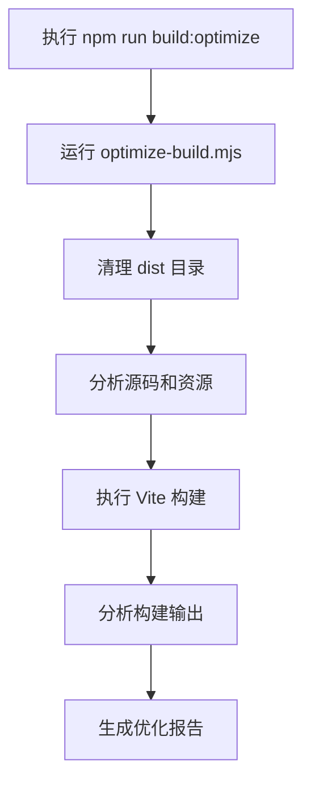
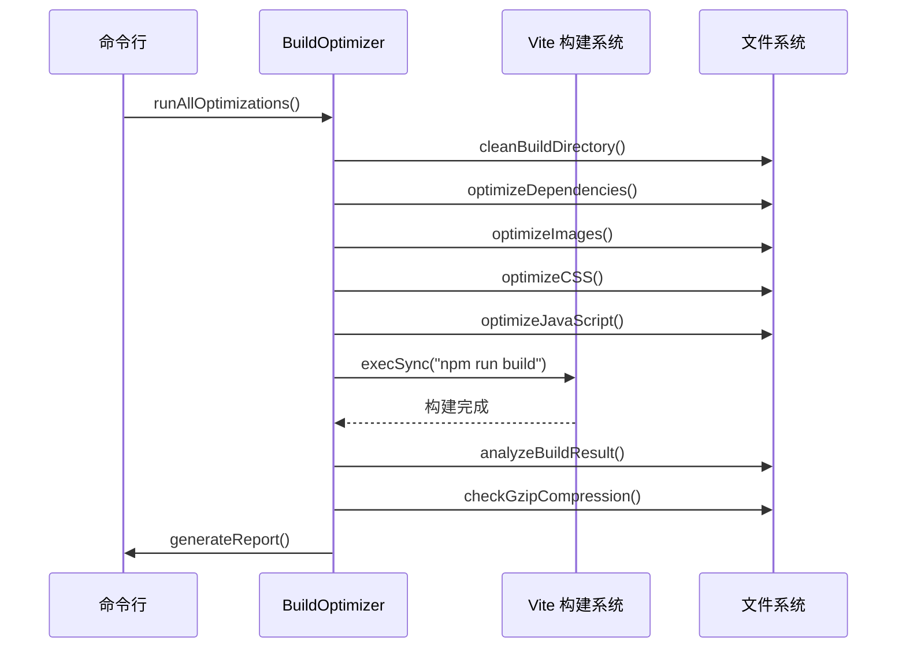
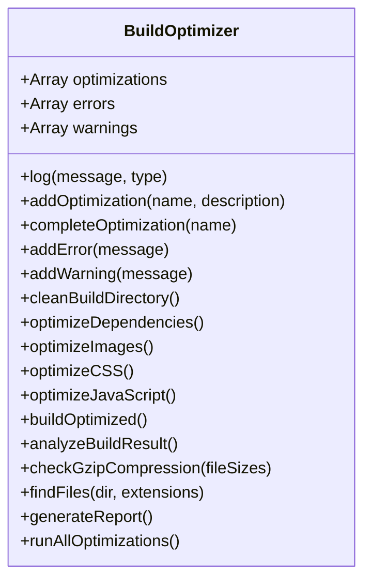
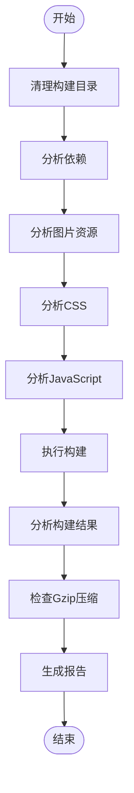
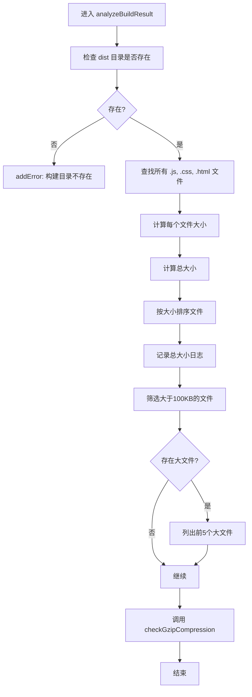
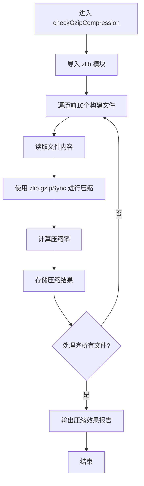
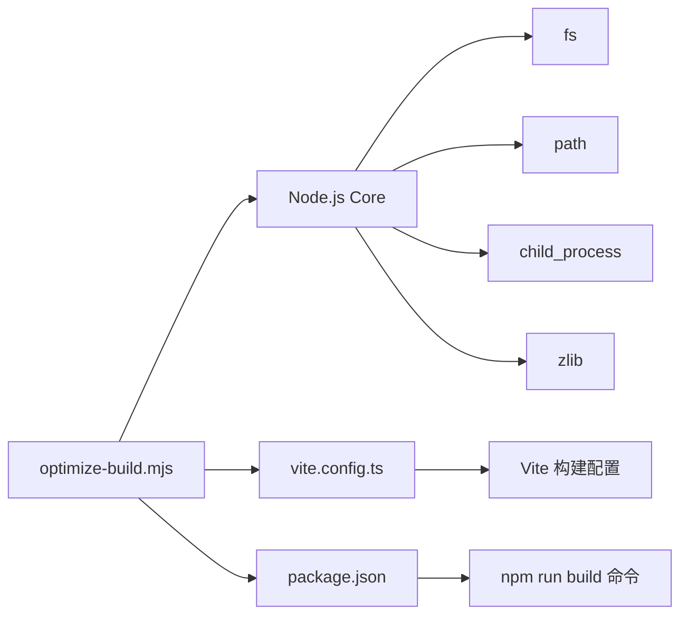

# 性能脚本

<cite>
**本文档中引用的文件**  
- [optimize-build.mjs](file://scripts/performance/optimize-build.mjs)
- [vite.config.ts](file://vite.config.ts)
- [package.json](file://package.json)
</cite>

## 目录
1. [简介](#简介)
2. [项目结构](#项目结构)
3. [核心组件](#核心组件)
4. [架构概述](#架构概述)
5. [详细组件分析](#详细组件分析)
6. [依赖分析](#依赖分析)
7. [性能考虑](#性能考虑)
8. [故障排除指南](#故障排除指南)
9. [结论](#结论)

## 简介
本文件详细说明了 `optimize-build.mjs` 脚本的实现原理与作用。该脚本是项目构建流程中的关键性能优化工具，旨在通过自动化分析和优化手段减少打包体积、提升加载速度。文档将解析脚本如何分析 Vite 构建输出，识别体积过大的依赖包；阐述其自动应用 Tree Shaking、代码分割和压缩配置的机制；说明其与 `vite.config.ts` 中构建配置的协同工作方式；并提供构建性能基准测试方法和优化效果验证流程。

## 项目结构
`optimize-build.mjs` 脚本位于 `scripts/performance/` 目录下，是项目自动化构建流程的一部分。该脚本通过命令 `npm run build:optimize` 调用，集成在项目的整体构建策略中。其主要功能是作为构建前的预处理和构建后的分析工具，确保最终的生产构建包达到最优性能。

**Diagram sources**
- [optimize-build.mjs](file://scripts/performance/optimize-build.mjs#L0-L436)
- [package.json](file://package.json#L41)

## 核心组件
`optimize-build.mjs` 的核心是一个名为 `BuildOptimizer` 的类。该类封装了所有优化逻辑，通过一系列方法实现对构建过程的全面控制和分析。其主要职责包括清理构建环境、分析源码和资源、触发构建、分析构建结果并生成最终报告。

**Section sources**
- [optimize-build.mjs](file://scripts/performance/optimize-build.mjs#L12-L436)

## 架构概述
`optimize-build.mjs` 脚本采用顺序执行的架构模式，将整个优化流程分解为多个独立的步骤。每个步骤都对应 `BuildOptimizer` 类中的一个方法，这些方法按特定顺序调用，形成一个完整的优化流水线。

**Diagram sources**
- [optimize-build.mjs](file://scripts/performance/optimize-build.mjs#L409-L435)
- [optimize-build.mjs](file://scripts/performance/optimize-build.mjs#L230-L280)

## 详细组件分析

### 构建优化器分析
`BuildOptimizer` 类是整个脚本的核心，它通过一系列方法实现了对构建过程的全面监控和优化建议。

#### 类结构与方法

**Diagram sources**
- [optimize-build.mjs](file://scripts/performance/optimize-build.mjs#L12-L436)

#### 优化流程分析
脚本的优化流程是一个线性的、多阶段的过程。它首先进行环境清理和源码分析，然后触发构建，最后对构建产物进行深度分析。

**Diagram sources**
- [optimize-build.mjs](file://scripts/performance/optimize-build.mjs#L409-L435)

### 构建结果分析机制
`analyzeBuildResult` 方法是脚本的核心分析功能，负责在构建完成后对输出文件进行扫描和评估。

**Diagram sources**
- [optimize-build.mjs](file://scripts/performance/optimize-build.mjs#L230-L280)

### Gzip 压缩效果分析
`checkGzipCompression` 方法通过 Node.js 内置的 `zlib` 模块，对构建产物进行实际的 Gzip 压缩测试，以评估压缩效果。

**Diagram sources**
- [optimize-build.mjs](file://scripts/performance/optimize-build.mjs#L278-L320)

## 依赖分析
`optimize-build.mjs` 脚本本身依赖于 Node.js 的核心模块，如 `fs`、`path`、`child_process` 和 `zlib`。它与 `vite.config.ts` 文件紧密协作，通过设置 `VITE_BUILD_OPTIMIZE=true` 环境变量来影响 Vite 的构建行为。同时，它依赖于 `package.json` 中定义的 `build` 脚本命令来执行实际的构建过程。

**Diagram sources**
- [optimize-build.mjs](file://scripts/performance/optimize-build.mjs#L1-L10)
- [vite.config.ts](file://vite.config.ts#L1-L102)
- [package.json](file://package.json#L41)

## 性能考虑
`optimize-build.mjs` 脚本通过多种方式提升构建性能和最终应用的性能。它通过分析源码中的大文件和资源，提前发现潜在的性能瓶颈。在构建后，它通过分析文件大小和 Gzip 压缩率，量化优化效果。脚本本身的设计也考虑了性能，例如在分析 Gzip 压缩时只检查前10个文件，避免了对所有文件进行耗时的压缩操作。

## 故障排除指南
当 `optimize-build.mjs` 脚本执行失败时，开发者应首先检查控制台输出的错误信息。常见的问题包括 `dist` 目录权限问题、`npm run build` 命令执行失败、或 `zlib` 模块导入失败。脚本会将所有错误和警告记录在 `errors` 和 `warnings` 数组中，并在最终报告中汇总显示，便于开发者快速定位问题。

**Section sources**
- [optimize-build.mjs](file://scripts/performance/optimize-build.mjs#L366-L413)

## 结论
`optimize-build.mjs` 是一个功能全面的构建优化脚本，它通过自动化的方式对项目的构建过程进行监控和分析。虽然当前版本主要侧重于分析和报告，但其架构设计为未来集成更主动的优化措施（如自动代码分割、依赖优化等）提供了良好的基础。结合 `vite.config.ts` 中的配置，该脚本能够有效帮助开发者识别性能瓶颈，验证优化效果，是项目性能保障流程中的重要一环。