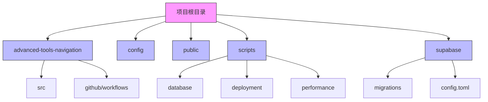
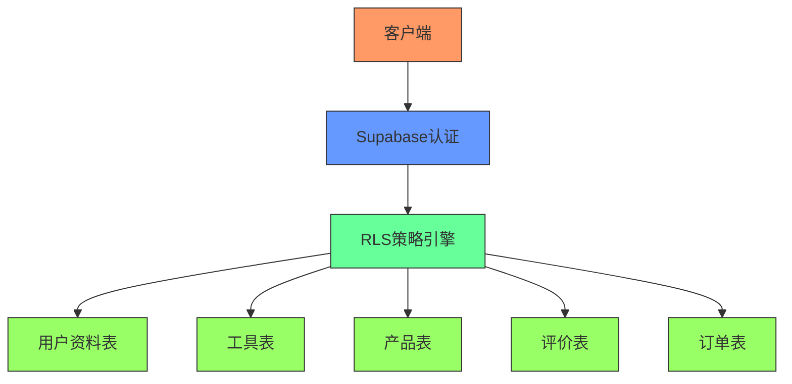
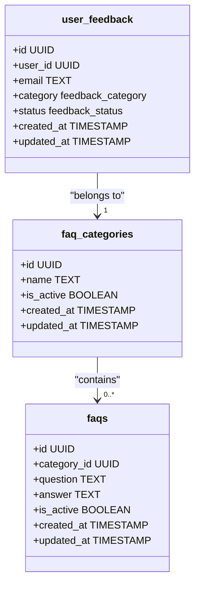
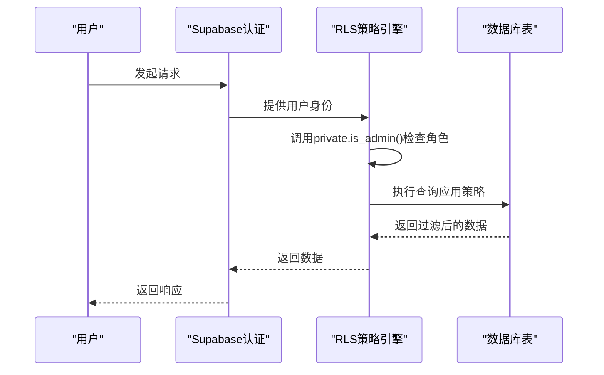
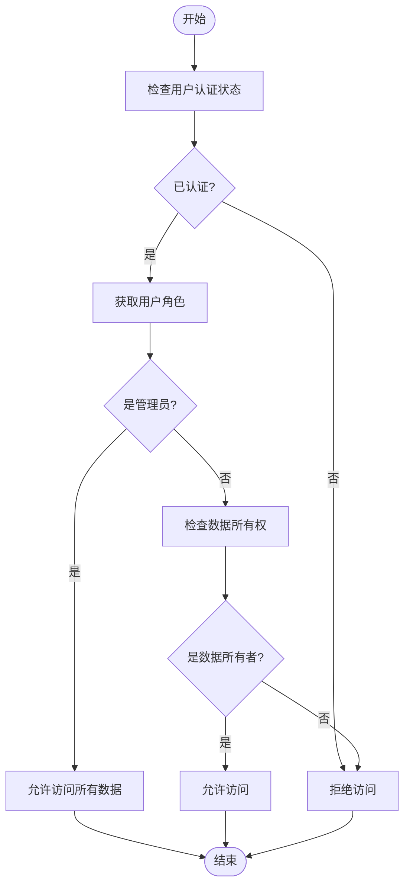
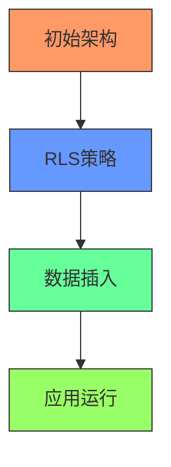

# RLS安全策略脚本

<cite>
**本文档引用的文件**  
- [create-rls-policies-final.sql](file://scripts/database/create-rls-policies-final.sql)
- [create-rls-policies-fixed.sql](file://scripts/database/create-rls-policies-fixed.sql)
- [create-rls-policies-optimized.sql](file://scripts/database/create-rls-policies-optimized.sql)
- [20241224000002_rls_policies.sql](file://supabase/migrations/20241224000002_rls_policies.sql)
- [safe-create-tables.sql](file://scripts/database/safe-create-tables.sql)
- [supabase_complete_deploy.sql](file://scripts/database/supabase_complete_deploy.sql)
- [supabase_deploy_fixed.sql](file://scripts/database/supabase_deploy_fixed.sql)
- [20241224000001_initial_schema.sql](file://supabase/migrations/20241224000001_initial_schema.sql)
- [insert-initial-data.sql](file://scripts/database/insert-initial-data.sql)
</cite>

## 目录
1. [引言](#引言)
2. [项目结构](#项目结构)
3. [核心组件](#核心组件)
4. [架构概述](#架构概述)
5. [详细组件分析](#详细组件分析)
6. [依赖分析](#依赖分析)
7. [性能考虑](#性能考虑)
8. [故障排除指南](#故障排除指南)
9. [结论](#结论)
10. [附录](#附录)

## 引言
本文档全面解析行级安全（RLS）策略配置脚本的设计与实现。详细对比`create-rls-policies-final.sql`、`create-rls-policies-fixed.sql`和`create-rls-policies-optimized.sql`三者在权限规则、策略条件和性能优化上的差异；解释每条策略如何与Supabase认证系统集成，实现基于用户角色（如admin、user）的数据访问控制；说明这些脚本在启用RLS后对工具、产品、评价等核心表的保护机制；提供在开发环境中快速应用RLS策略的流程，并强调在生产环境中应通过正式迁移文件管理RLS变更以确保可追溯性与安全性。

## 项目结构
本项目采用模块化结构，主要分为前端应用、配置文件、公共资源、脚本集合和Supabase数据库管理五个部分。脚本目录下的数据库子目录包含了多个SQL脚本，用于数据库初始化、RLS策略配置和数据插入。Supabase迁移目录包含了数据库架构演进的正式迁移文件。

**图示来源**
- [项目结构](file://README.md#L1-L50)

## 核心组件
行级安全（RLS）策略是本项目数据安全的核心组件。通过三个主要的SQL脚本文件——`create-rls-policies-final.sql`、`create-rls-policies-fixed.sql`和`create-rls-policies-optimized.sql`——实现了对数据库表的细粒度访问控制。这些策略与Supabase认证系统深度集成，确保只有授权用户才能访问特定数据。

**本节来源**
- [create-rls-policies-final.sql](file://scripts/database/create-rls-policies-final.sql#L1-L235)
- [create-rls-policies-fixed.sql](file://scripts/database/create-rls-policies-fixed.sql#L1-L691)
- [create-rls-policies-optimized.sql](file://scripts/database/create-rls-policies-optimized.sql#L1-L513)

## 架构概述
系统的安全架构基于Supabase的行级安全（RLS）功能，通过在数据库层面实施访问控制策略，确保数据安全。架构分为三个层次：认证层、策略层和数据层。认证层处理用户身份验证，策略层定义基于角色的访问规则，数据层存储实际数据并执行安全策略。

**图示来源**
- [create-rls-policies-fixed.sql](file://scripts/database/create-rls-policies-fixed.sql#L1-L691)
- [20241224000002_rls_policies.sql](file://supabase/migrations/20241224000002_rls_policies.sql#L1-L295)

## 详细组件分析
### RLS策略脚本分析
#### create-rls-policies-final.sql 分析
该脚本为最终版本的RLS策略，专注于特定功能表的安全策略配置。它为用户反馈、FAQ、产品提交、网站内容等表创建了精细的访问控制策略。策略设计考虑了不同用户角色的权限需求，如普通用户只能查看和更新自己的反馈，而管理员可以管理所有反馈。

**图示来源**
- [create-rls-policies-final.sql](file://scripts/database/create-rls-policies-final.sql#L1-L235)
- [safe-create-tables.sql](file://scripts/database/safe-create-tables.sql#L1-L194)

#### create-rls-policies-fixed.sql 分析
该脚本是修正版本的RLS策略，基于Context7 Supabase最佳实践。它引入了私有模式中的安全定义函数（如`private.get_user_role()`、`private.is_admin()`）来提高性能并避免RLS递归检查问题。脚本为所有核心表（用户资料、分类、工具、产品等）创建了全面的策略，并添加了必要的数据库索引以优化查询性能。

**图示来源**
- [create-rls-policies-fixed.sql](file://scripts/database/create-rls-policies-fixed.sql#L1-L691)
- [supabase_complete_deploy.sql](file://scripts/database/supabase_complete_deploy.sql#L1-L370)

#### create-rls-policies-optimized.sql 分析
该脚本是优化版本的RLS策略，同样基于Context7 Supabase最佳实践。与fixed版本相比，它省略了部分删除策略的代码，更加简洁。它为所有核心表创建了高性能的RLS策略，包括用户资料、分类、工具、产品、订单、支付等，并通过安全定义函数确保策略执行的效率和安全性。

**图示来源**
- [create-rls-policies-optimized.sql](file://scripts/database/create-rls-policies-optimized.sql#L1-L513)
- [supabase_deploy_fixed.sql](file://scripts/database/supabase_deploy_fixed.sql#L1-L400)

### 核心表保护机制
#### 工具表保护
工具表（tools）的RLS策略确保所有人可以查看活跃工具，而只有管理员可以管理所有工具。这种设计平衡了数据的可访问性和安全性，允许普通用户浏览工具目录，同时防止未经授权的修改。

**本节来源**
- [create-rls-policies-fixed.sql](file://scripts/database/create-rls-policies-fixed.sql#L200-L220)
- [20241224000002_rls_policies.sql](file://supabase/migrations/20241224000002_rls_policies.sql#L50-L60)

#### 产品表保护
产品表（products）的RLS策略与工具表类似，所有人可以查看活跃产品，管理员可以管理所有产品。此外，用户可以查看自己创建的产品，这为内容创作者提供了便利。

**本节来源**
- [create-rls-policies-fixed.sql](file://scripts/database/create-rls-policies-fixed.sql#L221-L241)
- [20241224000002_rls_policies.sql](file://supabase/migrations/20241224000002_rls_policies.sql#L61-L71)

#### 评价表保护
产品评论表（product_reviews）的RLS策略更为复杂。所有人可以查看已验证的评论，用户可以创建、更新和删除自己的评论，而管理员可以管理所有评论。这种分层权限设计鼓励用户参与，同时确保评论内容的质量和安全性。

**本节来源**
- [create-rls-policies-fixed.sql](file://scripts/database/create-rls-policies-fixed.sql#L450-L480)
- [20241224000002_rls_policies.sql](file://supabase/migrations/20241224000002_rls_policies.sql#L150-L170)

## 依赖分析
RLS策略脚本依赖于Supabase的认证系统和数据库架构。`create-rls-policies-fixed.sql`和`create-rls-policies-optimized.sql`依赖于`20241224000001_initial_schema.sql`中定义的表结构和枚举类型。这些脚本必须在表创建后执行，以确保RLS策略能够正确应用。

**图示来源**
- [20241224000001_initial_schema.sql](file://supabase/migrations/20241224000001_initial_schema.sql#L1-L285)
- [create-rls-policies-fixed.sql](file://scripts/database/create-rls-policies-fixed.sql#L1-L691)
- [insert-initial-data.sql](file://scripts/database/insert-initial-data.sql#L1-L139)

## 性能考虑
RLS策略的性能优化主要体现在两个方面：一是通过创建私有模式中的安全定义函数（如`private.is_admin()`）来避免RLS递归检查，提高策略执行效率；二是为RLS策略中常用的列创建索引，如`idx_user_profiles_role`、`idx_orders_user_id_status`等，以加速查询性能。

**本节来源**
- [create-rls-policies-fixed.sql](file://scripts/database/create-rls-policies-fixed.sql#L1-L691)
- [supabase_deploy_fixed.sql](file://scripts/database/supabase_deploy_fixed.sql#L1-L400)

## 故障排除指南
在应用RLS策略时，可能会遇到一些常见问题。例如，如果RLS策略未正确启用，所有数据访问将被拒绝。可以通过查询`pg_tables`视图来验证RLS状态。另外，如果策略条件过于严格，可能会导致合法用户无法访问数据，需要仔细检查策略的`USING`和`WITH CHECK`条件。

**本节来源**
- [create-rls-policies-final.sql](file://scripts/database/create-rls-policies-final.sql#L220-L235)
- [20241224000002_rls_policies.sql](file://supabase/migrations/20241224000002_rls_policies.sql#L1-L295)

## 结论
本文档全面分析了项目中的RLS策略配置脚本，详细对比了三个主要脚本的差异，解释了它们如何与Supabase认证系统集成，以及如何保护核心数据表。建议在开发环境中使用`create-rls-policies-optimized.sql`快速应用RLS策略，而在生产环境中应通过正式的迁移文件管理RLS变更，以确保变更的可追溯性和安全性。

## 附录
### RLS策略对比表
| 特性 | create-rls-policies-final.sql | create-rls-policies-fixed.sql | create-rls-policies-optimized.sql |
|------|-------------------------------|-------------------------------|-----------------------------------|
| **目标表** | 特定功能表（反馈、FAQ等） | 所有核心表 | 所有核心表 |
| **安全函数** | 无 | 有（private模式） | 有（private模式） |
| **性能优化** | 基础 | 高（索引+函数） | 高（索引+函数） |
| **错误修正** | 无 | 有（枚举值） | 无 |
| **适用环境** | 功能特定 | 生产/开发 | 开发 |

**本节来源**
- [create-rls-policies-final.sql](file://scripts/database/create-rls-policies-final.sql#L1-L235)
- [create-rls-policies-fixed.sql](file://scripts/database/create-rls-policies-fixed.sql#L1-L691)
- [create-rls-policies-optimized.sql](file://scripts/database/create-rls-policies-optimized.sql#L1-L513)