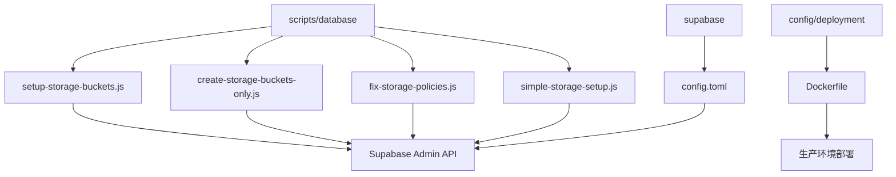
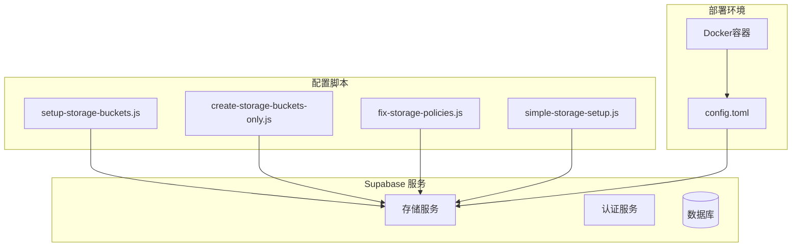
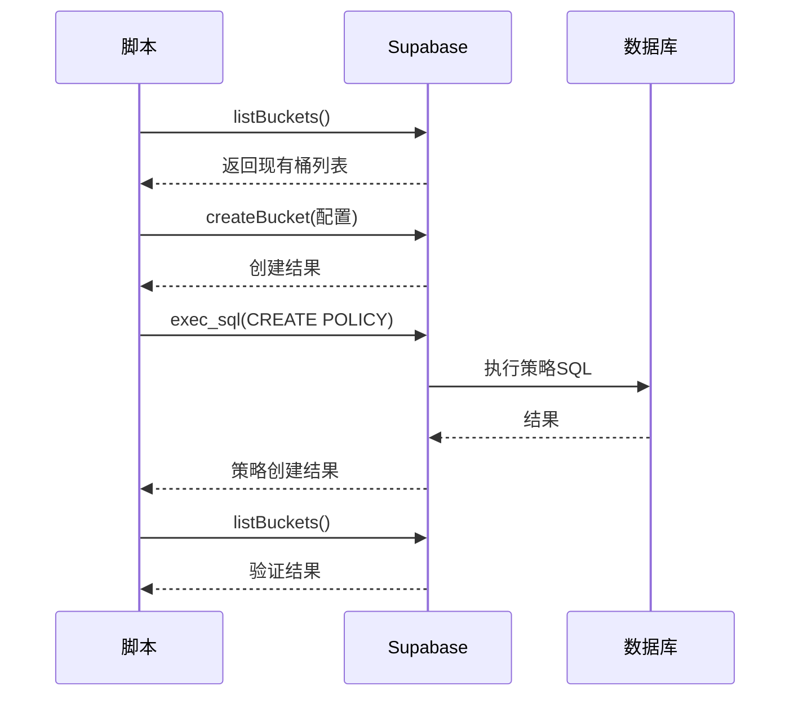
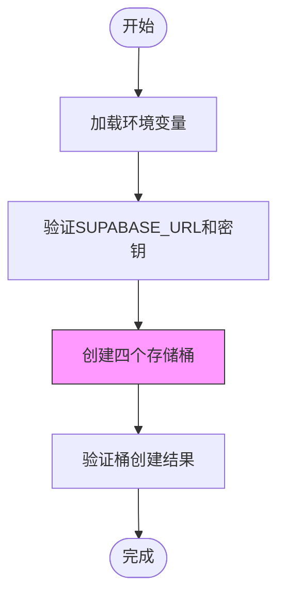
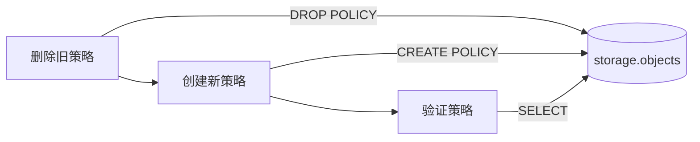
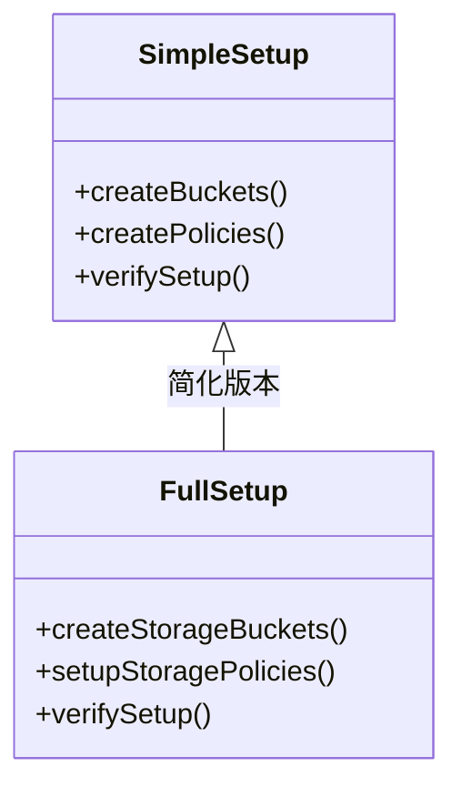

# 存储配置脚本

<cite>
**本文档中引用的文件**  
- [setup-storage-buckets.js](file://scripts/database/setup-storage-buckets.js)
- [create-storage-buckets-only.js](file://scripts/database/create-storage-buckets-only.js)
- [fix-storage-policies.js](file://scripts/database/fix-storage-policies.js)
- [simple-storage-setup.js](file://scripts/database/simple-storage-setup.js)
- [Dockerfile](file://config/deployment/Dockerfile)
- [config.toml](file://supabase/config.toml)
</cite>

## 目录
1. [简介](#简介)
2. [项目结构](#项目结构)
3. [核心组件](#核心组件)
4. [架构概述](#架构概述)
5. [详细组件分析](#详细组件分析)
6. [依赖分析](#依赖分析)
7. [性能考虑](#性能考虑)
8. [故障排除指南](#故障排除指南)
9. [结论](#结论)

## 简介
本文档深入解析 Supabase 存储桶配置脚本的实现逻辑与使用场景。重点分析 `setup-storage-buckets.js` 如何通过 Supabase Admin API 创建存储桶并设置精细化的访问策略，探讨 `create-storage-buckets-only.js` 的轻量级设计，说明 `fix-storage-policies.js` 如何修复策略冲突问题，对比 `simple-storage-setup.js` 的简化流程，并结合 `Dockerfile` 和 `config.toml` 阐述其在自动化部署中的协同机制与最佳实践。

## 项目结构
项目包含多个核心目录：`scripts/database` 存放存储桶管理脚本，`supabase/` 包含数据库配置，`config/deployment/` 提供容器化部署支持。这些脚本共同构成 Supabase 存储系统的初始化与维护体系。



**图示来源**  
- [setup-storage-buckets.js](file://scripts/database/setup-storage-buckets.js)
- [create-storage-buckets-only.js](file://scripts/database/create-storage-buckets-only.js)
- [fix-storage-policies.js](file://scripts/database/fix-storage-policies.js)
- [simple-storage-setup.js](file://scripts/database/simple-storage-setup.js)
- [config.toml](file://supabase/config.toml)
- [Dockerfile](file://config/deployment/Dockerfile)

**本节来源**  
- [scripts/database/setup-storage-buckets.js](file://scripts/database/setup-storage-buckets.js)
- [supabase/config.toml](file://supabase/config.toml)

## 核心组件
本项目的核心是四个存储管理脚本：`setup-storage-buckets.js` 提供完整配置，`create-storage-buckets-only.js` 用于快速初始化，`fix-storage-policies.js` 修复策略冲突，`simple-storage-setup.js` 适用于开发环境。这些脚本均基于 Supabase Admin Client 实现对存储系统的精细控制。

**本节来源**  
- [setup-storage-buckets.js](file://scripts/database/setup-storage-buckets.js#L1-L292)
- [create-storage-buckets-only.js](file://scripts/database/create-storage-buckets-only.js#L1-L180)
- [fix-storage-policies.js](file://scripts/database/fix-storage-policies.js#L1-L335)
- [simple-storage-setup.js](file://scripts/database/simple-storage-setup.js#L1-L150)

## 架构概述
整个存储配置系统采用分层架构：底层为 Supabase 存储服务，中间为策略控制层，上层为自动化脚本。脚本通过环境变量连接 Supabase 实例，利用 Admin Key 绕过 RLS 策略直接操作存储元数据和策略定义。



**图示来源**  
- [setup-storage-buckets.js](file://scripts/database/setup-storage-buckets.js)
- [config.toml](file://supabase/config.toml)
- [Dockerfile](file://config/deployment/Dockerfile)

## 详细组件分析

### setup-storage-buckets.js 分析
该脚本实现完整的存储桶创建与策略配置流程。首先定义包含头像、产品图片、工具图标和用户上传四个存储桶的配置对象，每个桶设置不同的文件大小限制和 MIME 类型白名单。然后依次创建存储桶，再通过 `exec_sql` RPC 调用创建精细化的 RLS 策略，最后验证配置结果。



**图示来源**  
- [setup-storage-buckets.js](file://scripts/database/setup-storage-buckets.js#L50-L250)

**本节来源**  
- [setup-storage-buckets.js](file://scripts/database/setup-storage-buckets.js#L1-L292)

### create-storage-buckets-only.js 分析
此脚本专注于存储桶结构的快速初始化，适用于系统首次部署或环境重建场景。与完整脚本相比，它省略了策略配置环节，仅执行存储桶创建和基础验证，从而实现轻量化和高可靠性。这种设计分离了基础设施创建与安全策略配置，符合基础设施即代码的最佳实践。



**图示来源**  
- [create-storage-buckets-only.js](file://scripts/database/create-storage-buckets-only.js#L50-L150)

**本节来源**  
- [create-storage-buckets-only.js](file://scripts/database/create-storage-buckets-only.js#L1-L180)

### fix-storage-policies.js 分析
该脚本专为解决策略冲突而设计。当因 schema 变更或字段重命名导致原有策略失效时，此脚本先删除可能存在的错误策略，再创建基于当前 `user_profiles` 表结构的正确策略。它特别处理了管理员对产品图片、工具图标和上传文件的管理权限，确保策略中的 `role` 字段与实际数据库结构一致。



**图示来源**  
- [fix-storage-policies.js](file://scripts/database/fix-storage-policies.js#L30-L300)

**本节来源**  
- [fix-storage-policies.js](file://scripts/database/fix-storage-policies.js#L1-L335)

### simple-storage-setup.js 分析
这是一个简化版配置脚本，适用于开发和测试环境。它合并了桶创建和策略设置逻辑，使用更紧凑的代码结构，省略了详细的 MIME 类型限制和文件大小配置。这种设计牺牲了部分安全性与精细控制，换取了部署速度和代码简洁性，非常适合快速迭代的开发场景。



**图示来源**  
- [simple-storage-setup.js](file://scripts/database/simple-storage-setup.js#L20-L130)
- [setup-storage-buckets.js](file://scripts/database/setup-storage-buckets.js#L50-L250)

**本节来源**  
- [simple-storage-setup.js](file://scripts/database/simple-storage-setup.js#L1-L150)

## 依赖分析
这些脚本共同依赖 Supabase JavaScript 客户端库和环境变量配置。`config.toml` 文件定义了 Supabase 服务的全局参数，如存储大小限制和身份验证设置，而 `Dockerfile` 则提供了容器化运行环境，确保脚本在一致的 Node.js 环境中执行。

```mermaid
dependency-graph
"dotenv" --> "setup-storage-buckets.js"
"dotenv" --> "create-storage-buckets-only.js"
"dotenv" --> "fix-storage-policies.js"
"dotenv" --> "simple-storage-setup.js"
"@supabase/supabase-js" --> "所有脚本"
".env.local" --> "所有脚本"
"config.toml" --> "Supabase服务"
"Dockerfile" --> "运行环境"
```

**图示来源**  
- [setup-storage-buckets.js](file://scripts/database/setup-storage-buckets.js#L4-L10)
- [config.toml](file://supabase/config.toml)
- [Dockerfile](file://config/deployment/Dockerfile)

**本节来源**  
- [setup-storage-buckets.js](file://scripts/database/setup-storage-buckets.js#L1-L292)
- [config.toml](file://supabase/config.toml)
- [Dockerfile](file://config/deployment/Dockerfile)

## 性能考虑
脚本采用串行执行模式确保操作顺序性，但在生产环境中可考虑并行化桶创建以提升效率。所有脚本均包含存在性检查，避免重复操作。策略创建使用 `IF EXISTS` 和错误捕获机制，提高容错能力。建议在自动化部署流水线中结合健康检查，确保 Supabase 服务就绪后再执行脚本。

## 故障排除指南
常见问题包括环境变量缺失、服务密钥权限不足、网络连接超时等。脚本内置了详细的错误日志输出，可通过检查控制台信息快速定位问题。对于策略冲突，应优先运行 `fix-storage-policies.js`；对于桶创建失败，需确认 `config.toml` 中的 `storage.file_size_limit` 设置是否合理。

**本节来源**  
- [setup-storage-buckets.js](file://scripts/database/setup-storage-buckets.js#L15-L30)
- [fix-storage-policies.js](file://scripts/database/fix-storage-policies.js#L15-L30)

## 结论
这组存储配置脚本构成了一个完整的 Supabase 存储管理系统，从完整配置到轻量初始化，再到问题修复和快速搭建，覆盖了全生命周期的管理需求。结合 `config.toml` 的服务配置和 `Dockerfile` 的部署支持，形成了可复用、可维护的自动化解决方案，为应用的稳定运行提供了坚实基础。