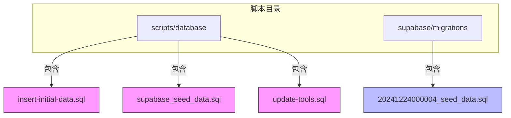
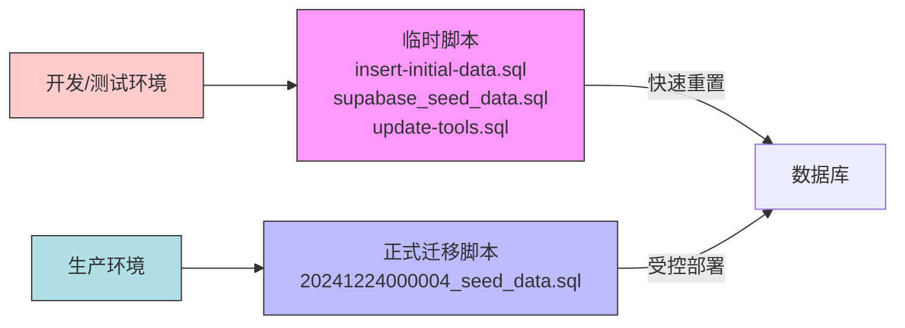
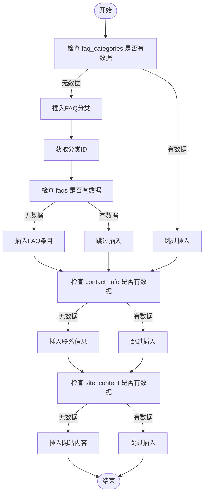
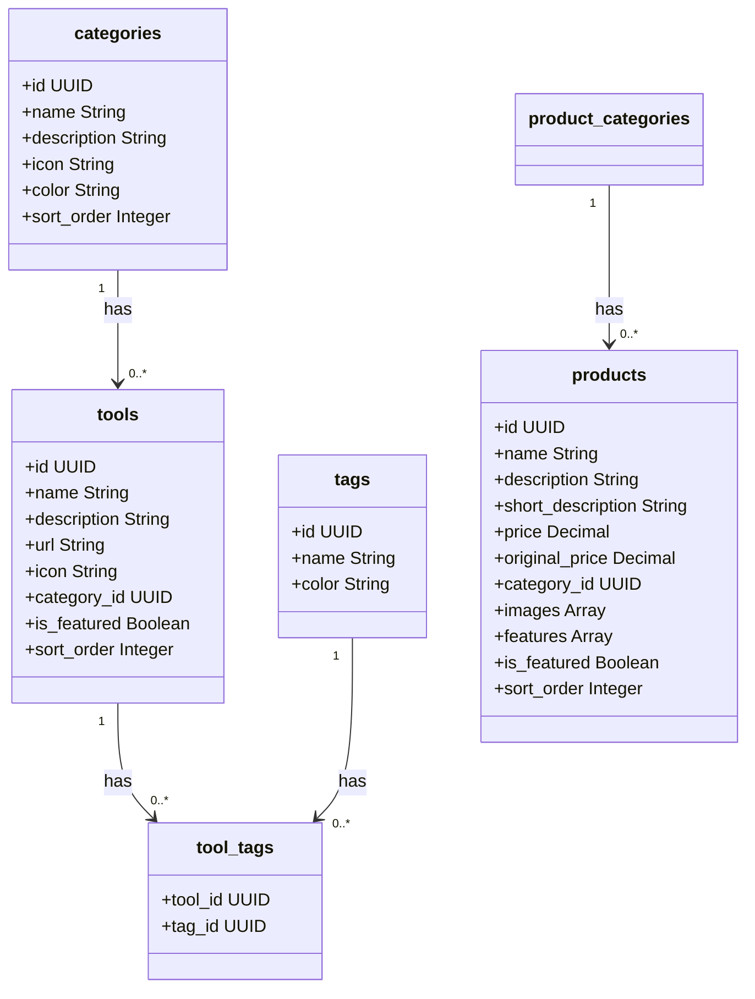
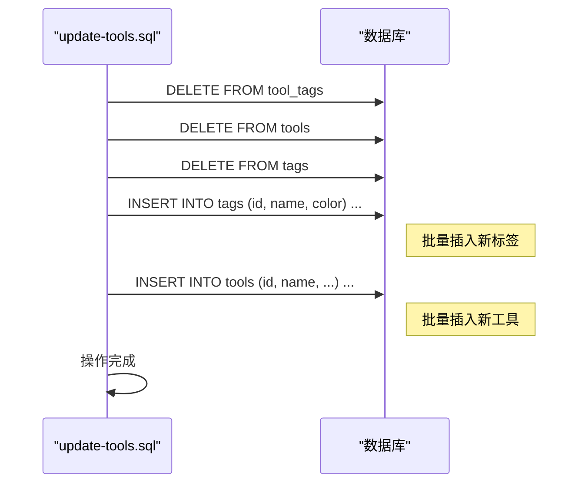
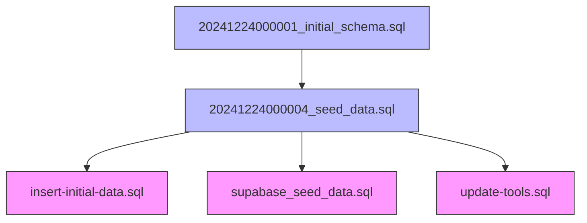

# 数据初始化脚本

<cite>
**本文档引用的文件**  
- [insert-initial-data.sql](file://scripts/database/insert-initial-data.sql)
- [supabase_seed_data.sql](file://scripts/database/supabase_seed_data.sql)
- [update-tools.sql](file://scripts/database/update-tools.sql)
- [20241224000004_seed_data.sql](file://supabase/migrations/20241224000004_seed_data.sql)
</cite>

## 目录
1. [引言](#引言)
2. [项目结构](#项目结构)
3. [核心组件](#核心组件)
4. [架构概述](#架构概述)
5. [详细组件分析](#详细组件分析)
6. [依赖分析](#依赖分析)
7. [性能考虑](#性能考虑)
8. [故障排除指南](#故障排除指南)
9. [结论](#结论)

## 引言
本文档系统化解析数据库数据填充与更新脚本的工作机制，重点分析 `insert-initial-data.sql`、`supabase_seed_data.sql` 和 `update-tools.sql` 脚本在插入分类、工具、产品等初始数据时的数据结构与执行逻辑。同时，阐述这些脚本在开发环境重置、测试数据准备和演示环境部署中的典型应用场景，并结合正式迁移脚本 `20241224000004_seed_data.sql`，说明临时填充脚本与正式种子数据的差异及生产环境防护策略。

## 项目结构
项目包含多个核心目录，其中与数据初始化相关的脚本主要位于 `scripts/database/` 和 `supabase/migrations/` 目录下。`scripts/database/` 存放用于开发和部署的临时或辅助性 SQL 脚本，而 `supabase/migrations/` 则存放经过版本控制的正式数据库迁移脚本。

**Diagram sources**
- [insert-initial-data.sql](file://scripts/database/insert-initial-data.sql)
- [supabase_seed_data.sql](file://scripts/database/supabase_seed_data.sql)
- [update-tools.sql](file://scripts/database/update-tools.sql)
- [20241224000004_seed_data.sql](file://supabase/migrations/20241224000004_seed_data.sql)

**Section sources**
- [scripts/database](file://scripts/database)
- [supabase/migrations](file://supabase/migrations)

## 核心组件
核心数据初始化组件包括四个关键 SQL 脚本：`insert-initial-data.sql` 用于插入基础配置数据（如FAQ、联系信息），`supabase_seed_data.sql` 和 `update-tools.sql` 用于填充工具和产品等业务数据，而 `20241224000004_seed_data.sql` 作为正式迁移的一部分，定义了生产环境的种子数据。

**Section sources**
- [insert-initial-data.sql](file://scripts/database/insert-initial-data.sql#L1-L140)
- [supabase_seed_data.sql](file://scripts/database/supabase_seed_data.sql#L1-L163)
- [update-tools.sql](file://scripts/database/update-tools.sql#L1-L108)
- [20241224000004_seed_data.sql](file://supabase/migrations/20241224000004_seed_data.sql#L1-L106)

## 架构概述
数据初始化流程分为两个层级：**临时/开发级** 和 **正式/生产级**。临时脚本（位于 `scripts/database`）用于快速重置和填充开发环境，强调灵活性和速度；正式迁移脚本（位于 `supabase/migrations`）则通过版本化控制，确保生产环境数据的一致性和可追溯性。

**Diagram sources**
- [insert-initial-data.sql](file://scripts/database/insert-initial-data.sql)
- [supabase_seed_data.sql](file://scripts/database/supabase_seed_data.sql)
- [update-tools.sql](file://scripts/database/update-tools.sql)
- [20241224000004_seed_data.sql](file://supabase/migrations/20241224000004_seed_data.sql)

## 详细组件分析

### insert-initial-data.sql 分析
该脚本负责插入非业务核心的静态配置数据，采用分步事务块（DO $$ ... $$）确保原子性。其执行遵循严格的依赖顺序：先插入 `faq_categories`，再根据分类ID插入 `faqs`，最后填充 `contact_info` 和 `site_content`。脚本通过 `IF NOT EXISTS` 检查避免重复插入，保证幂等性。

**Diagram sources**
- [insert-initial-data.sql](file://scripts/database/insert-initial-data.sql#L1-L140)

**Section sources**
- [insert-initial-data.sql](file://scripts/database/insert-initial-data.sql#L1-L140)

### supabase_seed_data.sql 分析
该脚本用于填充核心业务数据，如分类、工具、产品和标签。它使用 `INSERT INTO ... ON CONFLICT (id) DO NOTHING` 语法，基于预定义的UUID进行插入，有效防止重复数据。此脚本不检查现有数据，设计为在空数据库或需要完全重置时使用，常用于演示环境的快速部署。

**Diagram sources**
- [supabase_seed_data.sql](file://scripts/database/supabase_seed_data.sql#L1-L163)

**Section sources**
- [supabase_seed_data.sql](file://scripts/database/supabase_seed_data.sql#L1-L163)

### update-tools.sql 分析
该脚本实现了一种“安全批量更新”模式。其核心机制是**先删除后插入**（DELETE-INSERT）。首先，它清空 `tool_tags`、`tools` 和 `tags` 表，打破外键依赖。然后，重新插入全新的标签和工具数据。这种模式确保了数据的完全刷新，避免了复杂的更新逻辑。其“安全”性体现在使用 `ON CONFLICT DO NOTHING` 防止主键冲突，并且整个操作通常在外部事务中执行，若中途失败可回滚。

**Diagram sources**
- [update-tools.sql](file://scripts/database/update-tools.sql#L1-L108)

**Section sources**
- [update-tools.sql](file://scripts/database/update-tools.sql#L1-L108)

### 正式迁移种子数据分析
`20241224000004_seed_data.sql` 是 Supabase 迁移系统的一部分，代表了经过审核和版本控制的正式种子数据。与 `supabase_seed_data.sql` 相比，其内容更精简，数据更具代表性。关键区别在于，它不仅插入数据，还包含了**模拟数据**，如 `UPDATE tools SET click_count = ...` 和 `UPDATE products SET average_rating = ...`，用于初始化业务指标。

**Section sources**
- [20241224000004_seed_data.sql](file://supabase/migrations/20241224000004_seed_data.sql#L1-L106)

## 依赖分析
各脚本之间存在明确的依赖关系。`insert-initial-data.sql` 依赖于已存在的 `faq_categories`、`faqs` 等表结构。`supabase_seed_data.sql` 和 `update-tools.sql` 依赖于 `categories` 表的ID。正式迁移脚本 `20241224000004_seed_data.sql` 依赖于其前序迁移脚本创建的表结构。所有脚本都依赖于 Supabase 的 `storage` 服务，但策略配置被注释，需手动或通过API完成。

**Diagram sources**
- [20241224000001_initial_schema.sql](file://supabase/migrations/20241224000001_initial_schema.sql)
- [20241224000004_seed_data.sql](file://supabase/migrations/20241224000004_seed_data.sql)
- [insert-initial-data.sql](file://scripts/database/insert-initial-data.sql)
- [supabase_seed_data.sql](file://scripts/database/supabase_seed_data.sql)
- [update-tools.sql](file://scripts/database/update-tools.sql)

**Section sources**
- [supabase/migrations](file://supabase/migrations)
- [scripts/database](file://scripts/database)

## 性能考虑
`insert-initial-data.sql` 使用多个独立的 `DO` 块，可能产生多次事务开销。对于大量数据的插入，`supabase_seed_data.sql` 和 `update-tools.sql` 采用单条 `INSERT` 语句插入多行，这是高效的。`update-tools.sql` 的全表删除操作在数据量大时会非常耗时且不安全，仅适用于开发环境。正式迁移脚本中的 `UPDATE` 语句直接指定ID，性能良好。

## 故障排除指南
- **问题：** `insert-initial-data.sql` 报错“relation does not exist”。
  **解决：** 确保先执行了创建表结构的脚本（如 `safe-create-tables.sql`）。
- **问题：** `update-tools.sql` 执行后数据未更新。
  **解决：** 检查是否有外键约束阻止了 `DELETE` 操作，或确认脚本是否在事务中被回滚。
- **问题：** `supabase_seed_data.sql` 插入了重复数据。
  **解决：** 该脚本设计为幂等，但若ID变更可能导致重复。确保使用脚本中预定义的UUID。
- **风险：** 在生产环境误用 `update-tools.sql` 会导致**所有工具数据丢失**。
  **防护：** 严格限制该脚本的访问权限，绝不将其纳入生产部署流程。使用 `.env` 文件或环境变量来区分环境，并在脚本中加入生产环境检查。

**Section sources**
- [insert-initial-data.sql](file://scripts/database/insert-initial-data.sql#L1-L140)
- [supabase_seed_data.sql](file://scripts/database/supabase_seed_data.sql#L1-L163)
- [update-tools.sql](file://scripts/database/update-tools.sql#L1-L108)

## 结论
`insert-initial-data.sql`、`supabase_seed_data.sql` 和 `update-tools.sql` 是强大的开发辅助工具，适用于快速搭建和重置开发、测试及演示环境。它们通过幂等性检查和全量替换策略简化了数据管理。然而，`update-tools.sql` 的破坏性操作使其在生产环境中极度危险。正式的种子数据应通过 Supabase 的迁移系统（如 `20241224000004_seed_data.sql`）进行管理，以确保数据变更的可追溯性和安全性。最佳实践是将临时脚本与正式迁移严格分离，并建立明确的防护策略以防止生产环境误操作。