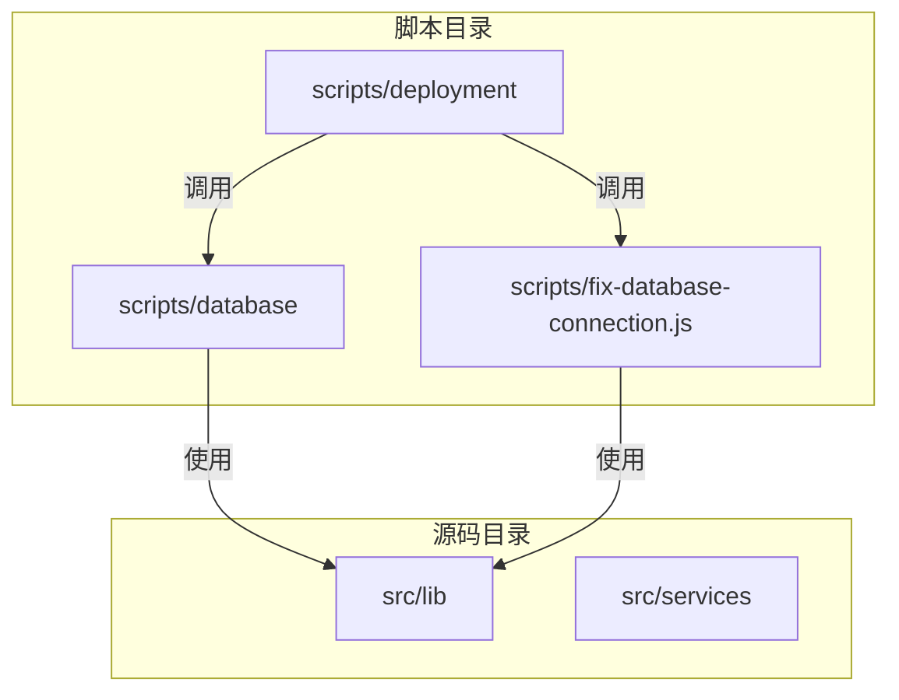
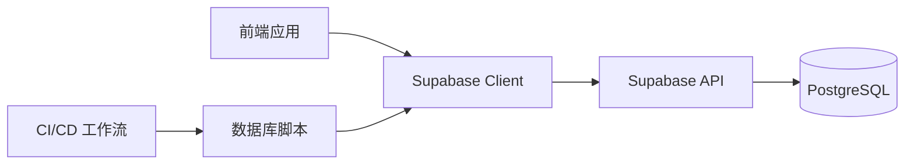
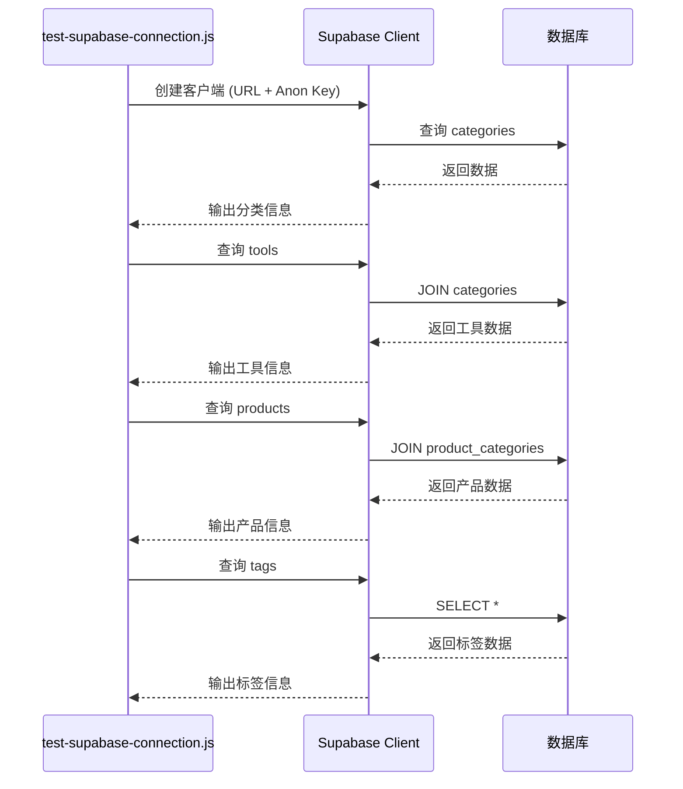
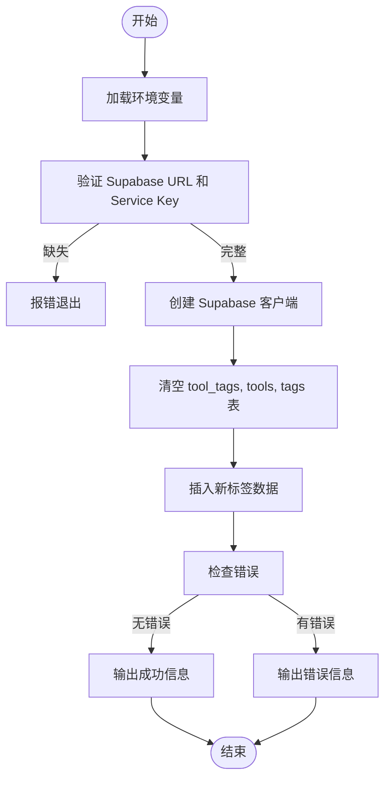
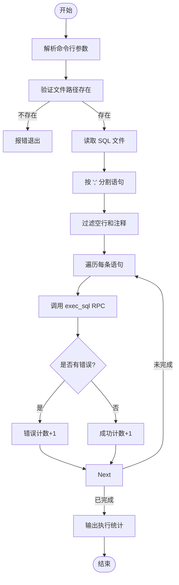
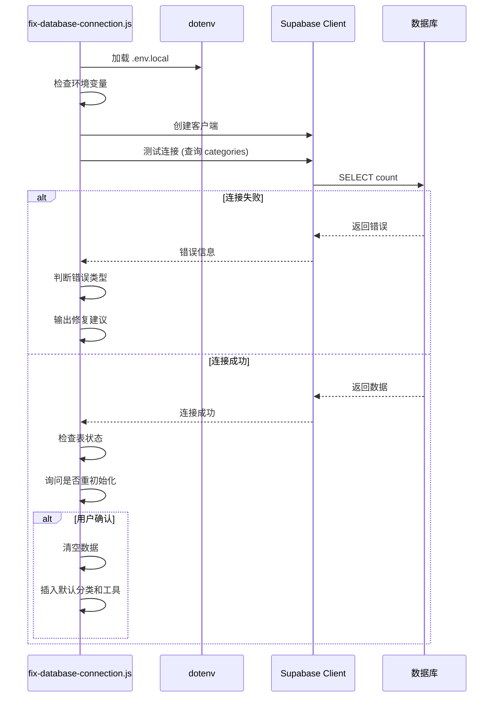
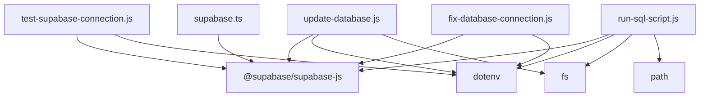

# 数据库维护工具

<cite>
**本文档引用文件**  
- [test-supabase-connection.js](file://scripts/database/test-supabase-connection.js)
- [update-database.js](file://scripts/database/update-database.js)
- [run-sql-script.js](file://scripts/database/run-sql-script.js)
- [fix-database-connection.js](file://scripts/fix-database-connection.js)
- [supabase.ts](file://src/lib/supabase.ts)
- [supabaseClient.ts](file://src/lib/supabaseClient.ts)
</cite>

## 目录
1. [引言](#引言)  
2. [项目结构](#项目结构)  
3. [核心组件](#核心组件)  
4. [架构概览](#架构概览)  
5. [详细组件分析](#详细组件分析)  
6. [依赖分析](#依赖分析)  
7. [性能考虑](#性能考虑)  
8. [故障排查指南](#故障排查指南)  
9. [结论](#结论)

## 引言
本文档全面解析数据库维护与诊断工具脚本的技术实现。重点说明 `test-supabase-connection.js` 如何验证 Supabase 服务连通性与认证配置正确性；分析 `update-database.js` 在执行模式变更时的安全检查流程，如备份确认与环境校验；阐述 `run-sql-script.js` 作为通用 SQL 执行器的设计模式；结合 `fix-database-connection.js` 说明常见连接问题的自动修复机制；并提供这些工具在 CI/CD 流水线、部署前检查和故障排查中的集成方法，强调其在生产环境使用的权限控制与审计要求。

## 项目结构
项目包含多个脚本目录，其中 `scripts/database` 存放数据库维护相关脚本，`scripts` 根目录包含连接修复工具，`src/lib` 包含 Supabase 客户端配置。整体结构清晰，按功能划分模块，便于维护和扩展。

**图示来源**  
- [test-supabase-connection.js](file://scripts/database/test-supabase-connection.js)
- [fix-database-connection.js](file://scripts/fix-database-connection.js)
- [supabase.ts](file://src/lib/supabase.ts)

**本节来源**  
- [scripts/database/test-supabase-connection.js](file://scripts/database/test-supabase-connection.js)
- [scripts/fix-database-connection.js](file://scripts/fix-database-connection.js)

## 核心组件

### 连接测试工具
`test-supabase-connection.js` 用于验证 Supabase 数据库连接状态，通过查询多个核心表（如 categories、tools、products、tags）来确认服务可用性和数据完整性。

**本节来源**  
- [test-supabase-connection.js](file://scripts/database/test-supabase-connection.js)

### 数据库更新工具
`update-database.js` 实现数据重置与初始化功能，使用 service role key 进行高权限操作，包括清空旧数据、插入新标签等，适用于开发环境数据初始化。

**本节来源**  
- [update-database.js](file://scripts/database/update-database.js)

### SQL 脚本执行器
`run-sql-script.js` 是一个通用 SQL 执行工具，支持从文件读取并逐条执行 SQL 语句，适用于迁移脚本或批量操作。

**本节来源**  
- [run-sql-script.js](file://scripts/database/run-sql-script.js)

### 连接修复工具
`fix-database-connection.js` 提供诊断与修复功能，检查环境变量配置、测试连接、验证表状态，并可选择性地重新初始化数据。

**本节来源**  
- [fix-database-connection.js](file://scripts/fix-database-connection.js)

## 架构概览
系统采用模块化设计，前端通过 Supabase 客户端与数据库交互，脚本工具独立运行，用于部署、诊断和维护。所有数据库操作均通过 Supabase 提供的 REST API 完成，确保安全性与一致性。

**图示来源**  
- [supabase.ts](file://src/lib/supabase.ts)
- [test-supabase-connection.js](file://scripts/database/test-supabase-connection.js)
- [run-sql-script.js](file://scripts/database/run-sql-script.js)

## 详细组件分析

### test-supabase-connection.js 分析
该脚本验证 Supabase 服务的连通性与认证配置正确性。通过加载环境变量创建客户端实例，依次测试分类、工具、产品和标签表的读取能力，输出详细结果。

**图示来源**  
- [test-supabase-connection.js](file://scripts/database/test-supabase-connection.js)

**本节来源**  
- [test-supabase-connection.js](file://scripts/database/test-supabase-connection.js)

### update-database.js 分析
该脚本执行数据库模式变更前的安全检查流程。首先验证 `VITE_SUPABASE_URL` 和 `SUPABASE_SERVICE_ROLE_KEY` 环境变量，使用高权限密钥连接数据库，清空指定表后插入预设标签数据。

**图示来源**  
- [update-database.js](file://scripts/database/update-database.js)

**本节来源**  
- [update-database.js](file://scripts/database/update-database.js)

### run-sql-script.js 分析
作为通用 SQL 执行器，该脚本接收命令行参数指定 SQL 文件路径，读取内容后按分号分割为多条语句，通过 Supabase RPC 调用 `exec_sql` 函数逐条执行，并统计成功与失败数量。

**图示来源**  
- [run-sql-script.js](file://scripts/database/run-sql-script.js)

**本节来源**  
- [run-sql-script.js](file://scripts/database/run-sql-script.js)

### fix-database-connection.js 分析
该脚本实现常见连接问题的自动修复机制。检查 `.env.local` 中的 `VITE_SUPABASE_URL` 和 `VITE_SUPABASE_ANON_KEY`，测试基础连接，识别特定错误（如 Legacy API keys disabled），并提供修复建议。支持 `--reinit` 参数重新初始化数据。

**图示来源**  
- [fix-database-connection.js](file://scripts/fix-database-connection.js)

**本节来源**  
- [fix-database-connection.js](file://scripts/fix-database-connection.js)

## 依赖分析
各脚本依赖 `@supabase/supabase-js` 进行数据库操作，使用 `dotenv` 加载环境变量。`run-sql-script.js` 额外依赖 `fs` 和 `path` 模块处理文件读取。前端代码通过 `src/lib/supabase.ts` 统一导出客户端实例。

**图示来源**  
- [package.json](file://package.json)
- [test-supabase-connection.js](file://scripts/database/test-supabase-connection.js)

**本节来源**  
- [test-supabase-connection.js](file://scripts/database/test-supabase-connection.js)
- [update-database.js](file://scripts/database/update-database.js)
- [run-sql-script.js](file://scripts/database/run-sql-script.js)
- [fix-database-connection.js](file://scripts/fix-database-connection.js)

## 性能考虑
- 所有脚本均采用异步非阻塞 I/O，避免阻塞主线程。
- `run-sql-script.js` 对大文件进行分批执行，防止内存溢出。
- 连接测试脚本限制查询数量（`.limit(1)`），减少网络开销。
- 建议在生产环境中限制 `update-database.js` 和 `run-sql-script.js` 的执行权限，避免误操作。

## 故障排查指南
当数据库连接异常时，应按以下顺序排查：

1. **检查环境变量**：确认 `.env.local` 中 `VITE_SUPABASE_URL` 和 `VITE_SUPABASE_ANON_KEY` 正确设置。
2. **运行连接测试**：执行 `node scripts/database/test-supabase-connection.js` 验证连通性。
3. **诊断连接问题**：使用 `node scripts/fix-database-connection.js` 获取详细错误信息。
4. **检查 Supabase 控制台**：确认项目状态为 "Active"，API 密钥未过期。
5. **查看日志**：检查 Supabase Dashboard 中的错误日志。

**本节来源**  
- [test-supabase-connection.js](file://scripts/database/test-supabase-connection.js)
- [fix-database-connection.js](file://scripts/fix-database-connection.js)
- [verify-deployment.js](file://scripts/deployment/verify-deployment.js)

## 结论
本文档详细解析了数据库维护与诊断工具的技术实现。这些脚本在 CI/CD 流水线中可用于部署前检查，在故障排查中提供自动化诊断能力。生产环境中应严格控制 `SUPABASE_SERVICE_ROLE_KEY` 的访问权限，所有变更操作应记录审计日志。建议结合 GitHub Actions 实现自动化验证，提升系统稳定性与可维护性。