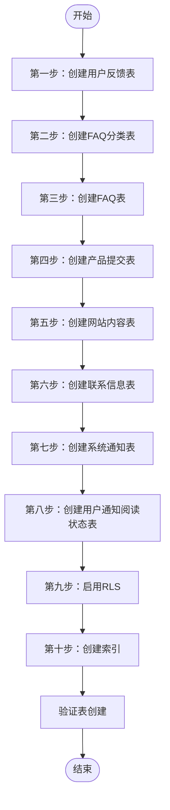
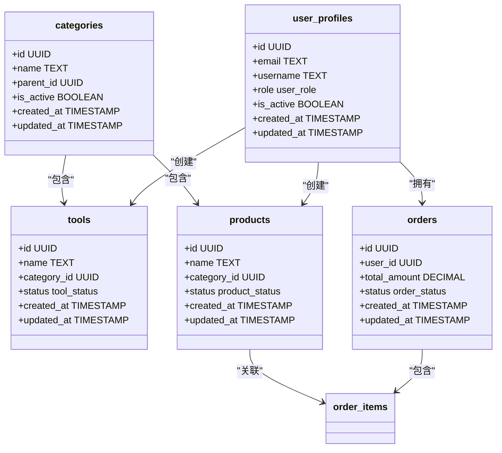
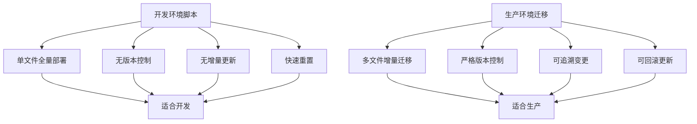
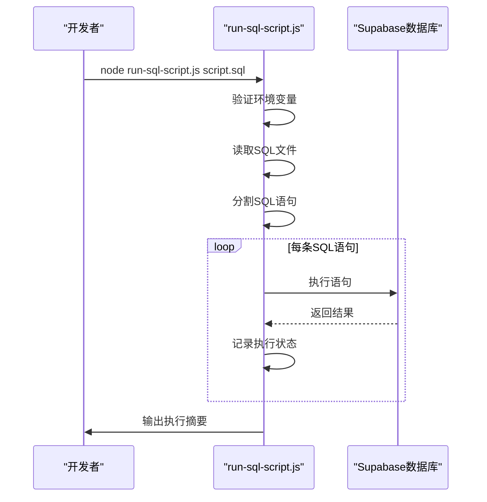

# 模式与迁移脚本

<cite>
**本文档引用的文件**  
- [safe-create-tables.sql](file://scripts/database/safe-create-tables.sql)
- [supabase_complete_deploy.sql](file://scripts/database/supabase_complete_deploy.sql)
- [supabase_deploy_fixed.sql](file://scripts/database/supabase_deploy_fixed.sql)
- [run-sql-script.js](file://scripts/database/run-sql-script.js)
- [20241224000001_initial_schema.sql](file://supabase/migrations/20241224000001_initial_schema.sql)
- [20241224000002_rls_policies.sql](file://supabase/migrations/20241224000002_rls_policies.sql)
- [20241224000003_storage_setup.sql](file://supabase/migrations/20241224000003_storage_setup.sql)
- [20241224000004_seed_data.sql](file://supabase/migrations/20241224000004_seed_data.sql)
- [20241227000001_user_feedback.sql](file://supabase/migrations/20241227000001_user_feedback.sql)
</cite>

## 目录
1. [简介](#简介)
2. [核心表结构安全创建机制](#核心表结构安全创建机制)
3. [完整部署脚本分析](#完整部署脚本分析)
4. [正式迁移文件对比](#正式迁移文件对比)
5. [本地开发环境最佳实践](#本地开发环境最佳实践)
6. [SQL脚本自动化执行](#sql脚本自动化执行)
7. [结论](#结论)

## 简介
本文档深入解析数据库模式初始化与迁移脚本的实现机制，重点分析`safe-create-tables.sql`如何安全地创建核心表结构，避免重复创建和外键冲突；详细说明`supabase_complete_deploy.sql`与`supabase_deploy_fixed.sql`在完整部署流程中的作用及其与Supabase迁移系统的协同方式；对比这些脚本与`supabase/migrations`目录中正式迁移文件的差异，阐明其适用于快速开发环境而非生产环境的技术原因；提供在本地开发、测试环境中使用这些脚本进行数据库重建的最佳实践；并结合`run-sql-script.js`说明如何自动化执行这些SQL脚本，确保事务完整性与错误回滚机制。

## 核心表结构安全创建机制

`safe-create-tables.sql`脚本采用分步执行策略，通过精心设计的创建顺序避免外键约束冲突。脚本首先创建不依赖其他表的基础表，然后逐步创建具有外键关系的表。该脚本特别关注用户反馈、FAQ、产品提交等核心功能模块的表结构创建。

脚本通过`CREATE TABLE IF NOT EXISTS`语句确保幂等性，防止重复创建表时出现错误。在创建所有表之后，脚本才统一启用行级安全（RLS）策略，避免在表创建过程中因RLS策略导致的权限问题。最后，脚本为关键字段创建索引以优化查询性能，并通过验证查询确认所有表均已成功创建。

**脚本来源**  
- [safe-create-tables.sql](file://scripts/database/safe-create-tables.sql#L1-L194)

## 完整部署脚本分析

`supabase_complete_deploy.sql`和`supabase_deploy_fixed.sql`是用于完整数据库部署的SQL脚本，包含应用所需的所有数据库对象创建语句。这两个脚本的主要功能包括创建枚举类型、定义核心表结构、设置索引、创建更新时间戳触发器以及配置行级安全（RLS）策略。

`supabase_deploy_fixed.sql`是`supabase_complete_deploy.sql`的修复版本，主要区别在于前者在创建触发器前会先删除可能存在的旧触发器，使用`DROP TRIGGER IF EXISTS`语句确保触发器的正确创建。此外，`supabase_deploy_fixed.sql`还显式删除了可能存在的旧RLS策略，避免策略冲突。

这些脚本的设计目的是在开发环境中快速重建整个数据库结构，适用于需要频繁重置数据库状态的开发场景。它们包含了用户资料、分类、工具、产品、订单、支付等完整的业务数据模型。

**脚本来源**  
- [supabase_complete_deploy.sql](file://scripts/database/supabase_complete_deploy.sql#L1-L370)
- [supabase_deploy_fixed.sql](file://scripts/database/supabase_deploy_fixed.sql#L1-L400)

## 正式迁移文件对比

与`supabase/migrations`目录中的正式迁移文件相比，开发用SQL脚本存在显著差异。正式迁移文件遵循严格的版本控制和增量更新原则，每个迁移文件只包含特定时间点的模式变更，确保在生产环境中能够安全、可追溯地进行数据库升级。

`20241224000001_initial_schema.sql`作为初始迁移文件，虽然创建了类似的表结构，但其设计更加严谨：使用`DO $$ BEGIN ... END $$`块确保枚举类型创建的幂等性；在`favorites`表中增加了`product_id`字段和约束，支持产品收藏功能；在`products`表中添加了`average_rating`和`total_reviews`字段用于评分统计。

`20241224000002_rls_policies.sql`将RLS策略分离到独立的迁移文件中，符合关注点分离的原则。`20241224000003_storage_setup.sql`专门处理存储桶和存储策略的配置。`20241224000004_seed_data.sql`负责种子数据的插入。这种分文件、分阶段的迁移策略确保了生产环境数据库变更的可管理性和可回滚性。

相比之下，开发脚本将所有操作集中在一个文件中，虽然便于快速部署，但缺乏版本控制和增量更新的能力，不适合生产环境使用。

**脚本来源**  
- [20241224000001_initial_schema.sql](file://supabase/migrations/20241224000001_initial_schema.sql#L1-L285)
- [20241224000002_rls_policies.sql](file://supabase/migrations/20241224000002_rls_policies.sql#L1-L295)
- [20241224000003_storage_setup.sql](file://supabase/migrations/20241224000003_storage_setup.sql#L1-L128)
- [20241224000004_seed_data.sql](file://supabase/migrations/20241224000004_seed_data.sql#L1-L105)

## 本地开发环境最佳实践

在本地开发和测试环境中，推荐使用`safe-create-tables.sql`脚本进行数据库重建，因为它专注于核心表结构的创建，执行速度快且风险较低。对于需要完整数据库结构的场景，可以使用`supabase_deploy_fixed.sql`脚本。

最佳实践包括：首先确保数据库连接配置正确，然后按顺序执行脚本：先运行结构创建脚本，再运行种子数据脚本。建议在执行前备份重要数据，尽管在开发环境中通常可以接受数据丢失。

对于需要频繁重置数据库的开发工作流，可以创建自动化脚本组合多个操作。例如，先删除并重新创建模式，然后执行结构创建脚本，最后插入测试数据。这种工作流可以快速将数据库恢复到已知的初始状态，提高开发效率。

**脚本来源**  
- [safe-create-tables.sql](file://scripts/database/safe-create-tables.sql#L1-L194)
- [supabase_deploy_fixed.sql](file://scripts/database/supabase_deploy_fixed.sql#L1-L400)

## SQL脚本自动化执行

`run-sql-script.js`脚本提供了自动化执行SQL脚本的能力，通过Supabase客户端库连接数据库并逐条执行SQL语句。该脚本首先验证必要的环境变量，然后读取指定的SQL文件，将其分割为独立的语句并依次执行。

脚本实现了详细的执行状态跟踪，记录每条语句的执行结果，包括成功和失败的语句数量。对于失败的语句，脚本会输出详细的错误信息，便于调试。执行过程包含进度指示，让用户了解当前执行状态。

值得注意的是，该脚本目前没有实现事务性执行，每条SQL语句独立执行。这意味着如果后续语句失败，先前成功的语句不会自动回滚。在生产环境中使用时，建议修改脚本以支持事务控制，或者确保SQL脚本本身具有幂等性。

**脚本来源**  
- [run-sql-script.js](file://scripts/database/run-sql-script.js#L1-L101)

## 结论
开发环境中的数据库脚本`safe-create-tables.sql`、`supabase_complete_deploy.sql`和`supabase_deploy_fixed.sql`提供了快速、便捷的数据库初始化和重建能力，特别适合本地开发和测试场景。这些脚本通过分步执行、幂等性设计和错误处理机制确保了部署的可靠性。

然而，这些脚本的设计理念与生产环境的迁移策略有本质区别：开发脚本追求快速部署和便利性，而生产迁移强调可追溯性、可回滚性和增量更新。因此，这些脚本不应直接用于生产环境。

`run-sql-script.js`为SQL脚本的自动化执行提供了基础框架，但需要进一步完善事务控制和错误回滚机制以满足生产要求。建议在开发中继续使用这些脚本提高效率，同时遵循Supabase官方的迁移实践管理生产环境的数据库变更。