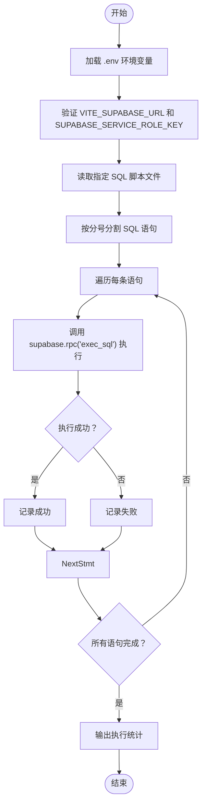
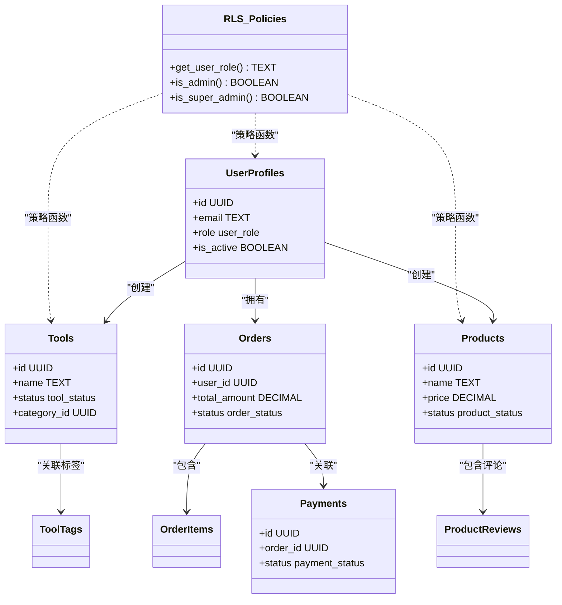
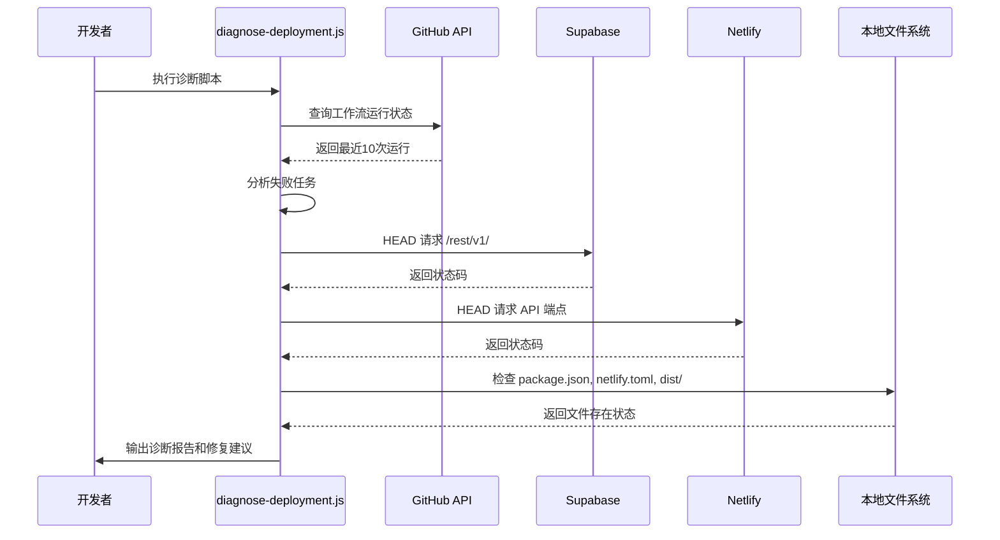
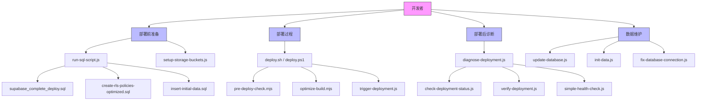

# 脚本工具

<cite>
**本文档中引用的文件**  
- [run-sql-script.js](file://scripts/database/run-sql-script.js)
- [supabase_complete_deploy.sql](file://scripts/database/supabase_complete_deploy.sql)
- [create-rls-policies-optimized.sql](file://scripts/database/create-rls-policies-optimized.sql)
- [setup-storage-buckets.js](file://scripts/database/setup-storage-buckets.js)
- [insert-initial-data.sql](file://scripts/database/insert-initial-data.sql)
- [update-database.js](file://scripts/database/update-database.js)
- [diagnose-deployment.js](file://scripts/deployment/diagnose-deployment.js)
- [optimize-build.mjs](file://scripts/performance/optimize-build.mjs)
- [fix-database-connection.js](file://scripts/fix-database-connection.js)
- [generate-default-icon.js](file://scripts/generate-default-icon.js)
- [init-data.js](file://scripts/init-data.js)
</cite>

## 目录
1. [简介](#简介)
2. [数据库脚本工具](#数据库脚本工具)
3. [部署诊断与配置脚本](#部署诊断与配置脚本)
4. [性能优化脚本](#性能优化脚本)
5. [独立功能脚本](#独立功能脚本)
6. [脚本调用关系图](#脚本调用关系图)
7. [环境使用指南](#环境使用指南)

## 简介
本项目包含一系列自动化脚本工具，用于支持数据库初始化、行级安全（RLS）策略配置、存储桶管理、部署诊断、性能优化及数据初始化等关键任务。这些脚本分布在 `scripts/database`、`scripts/deployment`、`scripts/performance` 等目录中，旨在提升开发、测试和生产环境的部署效率与系统稳定性。

## 数据库脚本工具

### SQL 脚本执行机制
`run-sql-script.js` 是核心的 SQL 执行工具，用于在 Supabase 环境中安全地运行 SQL 脚本。该脚本通过 `exec_sql` RPC 调用执行 SQL 语句，支持分号分隔的多语句执行，并具备详细的日志输出和错误处理机制。

**脚本来源**  
- [run-sql-script.js](file://scripts/database/run-sql-script.js#L1-L102)

### 数据库初始化与 RLS 策略
`supabase_complete_deploy.sql` 脚本用于完整初始化数据库结构，包括创建表、索引、触发器和行级安全（RLS）策略。该脚本定义了用户资料、工具、产品、订单等核心表结构，并为每张表配置了基于角色的访问控制策略。

`create-rls-policies-optimized.sql` 是优化版本的 RLS 策略脚本，引入了 `private` 模式中的安全函数（如 `get_user_role`、`is_admin`），避免策略中的递归检查，提升查询性能。该脚本还采用更细粒度的策略命名和权限控制，增强可维护性。

**脚本来源**  
- [supabase_complete_deploy.sql](file://scripts/database/supabase_complete_deploy.sql#L1-L371)
- [create-rls-policies-optimized.sql](file://scripts/database/create-rls-policies-optimized.sql#L1-L514)

### 存储桶配置与数据初始化
`setup-storage-buckets.js` 脚本用于自动创建 Supabase 存储桶（如 `avatars`、`product-images`、`tool-icons`、`uploads`），并为每个桶配置文件大小限制和 MIME 类型白名单。同时，该脚本会设置相应的 RLS 策略，确保用户只能访问自己的上传文件，管理员可管理所有资源。

`insert-initial-data.sql` 脚本用于插入初始数据，包括 FAQ 分类、联系信息、网站内容等。该脚本使用 `DO $$ BEGIN ... END $$` 块进行条件插入，避免重复数据，确保幂等性。

**脚本来源**  
- [setup-storage-buckets.js](file://scripts/database/setup-storage-buckets.js#L1-L293)
- [insert-initial-data.sql](file://scripts/database/insert-initial-data.sql#L1-L140)

### 数据库更新脚本
`update-database.js` 脚本用于更新数据库中的标签数据。该脚本首先清空 `tool_tags` 和 `tags` 表，然后插入预定义的 50 个标签，确保标签数据的一致性和完整性。该脚本适用于开发环境数据重置或标签体系更新场景。

**脚本来源**  
- [update-database.js](file://scripts/database/update-database.js#L1-L306)

## 部署诊断与配置脚本

### 部署诊断与健康检查
`diagnose-deployment.js` 是核心的部署诊断工具，用于检查 GitHub Actions、Supabase 连接、Netlify 配置和本地构建状态。该脚本通过 Octokit 访问 GitHub API 获取最近的工作流运行状态，检测失败的构建任务，并通过 `fetch` 测试关键服务的网络连通性。

**脚本来源**  
- [diagnose-deployment.js](file://scripts/deployment/diagnose-deployment.js#L1-L170)

### GitHub Secrets 与 Netlify 配置
`check-github-secrets.js` 和 `setup-github-secrets.js` 用于验证和配置 GitHub 仓库的 Secrets，确保 `VITE_SUPABASE_URL`、`SUPABASE_SERVICE_ROLE_KEY` 等关键变量已正确设置。`check-netlify-config.js` 和 `fix-netlify-root-directory.mjs` 用于检查和修复 Netlify 的构建设置，特别是 `publish` 目录是否正确指向 `dist`。

## 性能优化脚本

### 构建性能优化
`optimize-build.mjs` 脚本用于优化 Vite 构建过程。该脚本分析 `package.json` 中的依赖项，识别大型包，并建议使用代码分割、动态导入和 CDN 外部化等策略来减小打包体积。此外，该脚本可自动配置 `vite.config.ts` 中的 `build.rollupOptions`，提升构建速度和最终产物性能。

**脚本来源**  
- [optimize-build.mjs](file://scripts/performance/optimize-build.mjs#L1-L10)

## 独立功能脚本

### 数据库连接修复
`fix-database-connection.js` 脚本用于诊断和修复常见的 Supabase 数据库连接问题。该脚本检查环境变量、网络连通性、数据库服务状态，并尝试执行简单的查询以验证连接可用性。适用于本地开发环境连接中断的快速排查。

### 默认图标生成
`generate-default-icon.js` 脚本根据工具名称生成 SVG 格式的默认图标。该脚本使用哈希算法为每个工具名称生成唯一的颜色，并绘制包含首字母的圆形图标。当工具未提供自定义图标时，前端可调用此脚本生成占位符。

### 初始数据初始化
`init-data.js` 脚本是 `insert-initial-data.sql` 的 Node.js 版本，用于通过 Supabase 客户端 API 插入初始数据。该脚本更具灵活性，可在数据插入前后执行自定义逻辑，如发送通知或记录日志。

**脚本来源**  
- [fix-database-connection.js](file://scripts/fix-database-connection.js)
- [generate-default-icon.js](file://scripts/generate-default-icon.js)
- [init-data.js](file://scripts/init-data.js)

## 脚本调用关系图

## 环境使用指南
- **开发环境**：使用 `run-sql-script.js` 执行 `supabase_complete_deploy.sql` 和 `insert-initial-data.sql` 初始化本地数据库。运行 `setup-storage-buckets.js` 配置存储桶。
- **测试环境**：在 CI/CD 流程中，`diagnose-deployment.js` 作为健康检查步骤，确保部署前所有服务正常。`optimize-build.mjs` 在构建阶段执行性能优化。
- **生产环境**：通过 GitHub Actions 自动触发 `deploy.sh`，该脚本调用 `pre-deploy-check.mjs` 和 `trigger-deployment.js`。部署后运行 `verify-deployment.js` 确认服务可用性。