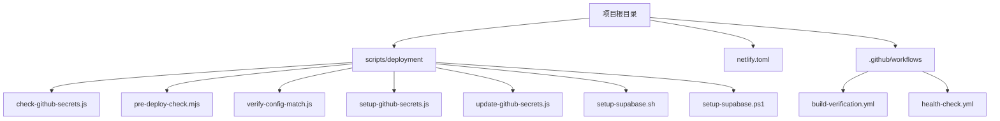
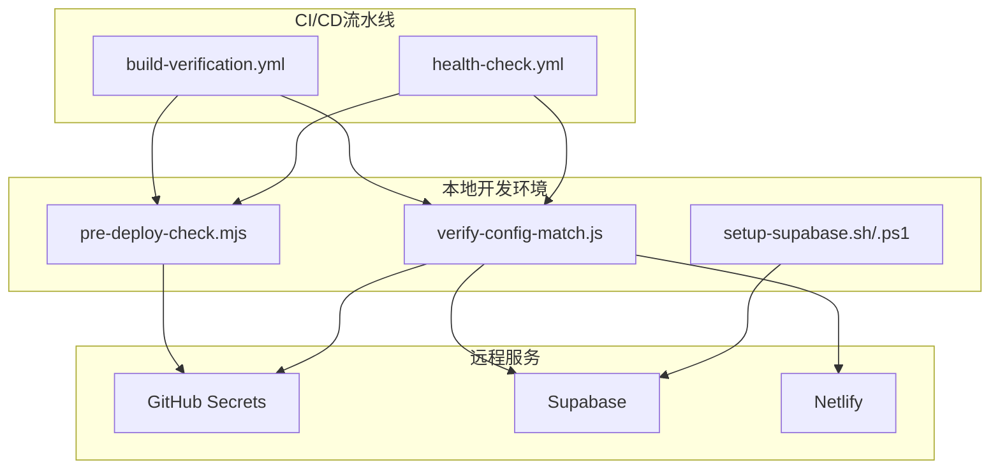
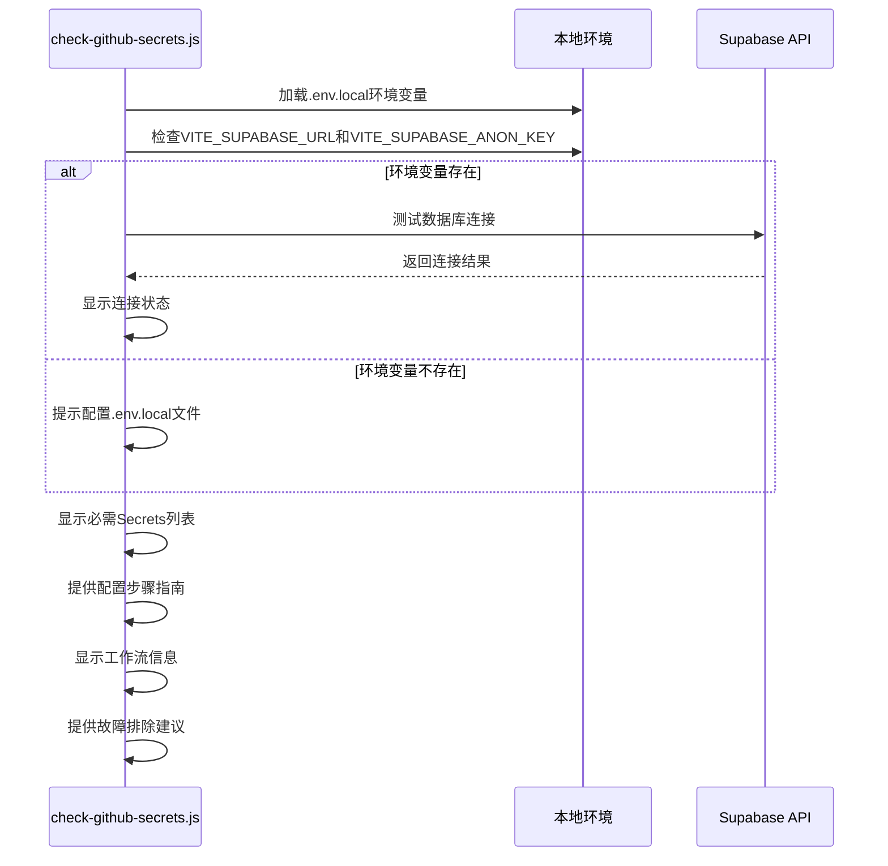
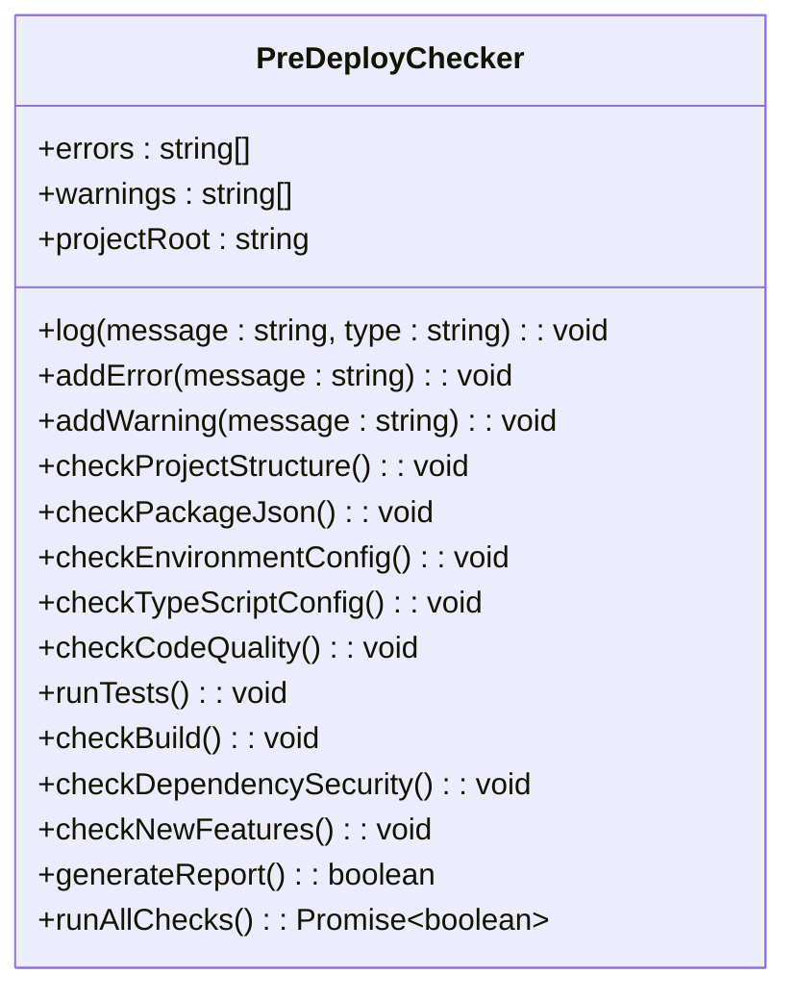
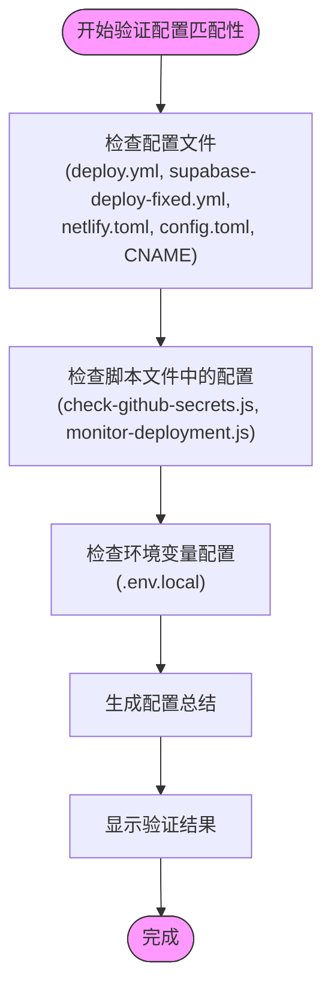
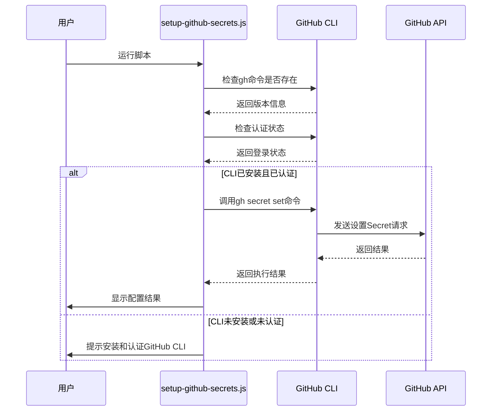
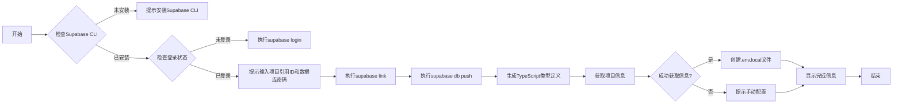

# 部署准备脚本

<cite>
**本文档中引用的文件**
- [check-github-secrets.js](file://scripts/deployment/check-github-secrets.js)
- [pre-deploy-check.mjs](file://scripts/deployment/pre-deploy-check.mjs)
- [verify-config-match.js](file://scripts/deployment/verify-config-match.js)
- [setup-github-secrets.js](file://scripts/deployment/setup-github-secrets.js)
- [update-github-secrets.js](file://scripts/deployment/update-github-secrets.js)
- [setup-supabase.sh](file://scripts/deployment/setup-supabase.sh)
- [setup-supabase.ps1](file://scripts/deployment/setup-supabase.ps1)
- [netlify.toml](file://netlify.toml)
- [github/workflows/build-verification.yml](file://github/workflows/build-verification.yml)
- [github/workflows/health-check.yml](file://github/workflows/health-check.yml)
</cite>

## 目录
1. [简介](#简介)
2. [项目结构](#项目结构)
3. [核心组件](#核心组件)
4. [架构概述](#架构概述)
5. [详细组件分析](#详细组件分析)
6. [依赖分析](#依赖分析)
7. [性能考虑](#性能考虑)
8. [故障排除指南](#故障排除指南)
9. [结论](#结论)

## 简介
本项目包含一系列部署前准备脚本，用于确保应用在部署到Netlify和Supabase平台前的配置完整性。这些脚本涵盖了GitHub Secrets验证、环境依赖检查、配置一致性比对、自动化配置设置以及CI/CD流水线集成等多个方面，形成了一套完整的部署前验证与准备机制。

## 项目结构
项目结构清晰地划分了源代码、配置文件、公共资源和脚本目录。核心部署准备脚本位于`scripts/deployment`目录下，与`netlify.toml`和GitHub Actions工作流文件共同构成了自动化部署的基础。



**图示来源**
- [scripts/deployment](file://scripts/deployment)
- [.github/workflows](file://github/workflows)

**本节来源**
- [scripts/deployment](file://scripts/deployment)
- [.github/workflows](file://github/workflows)

## 核心组件
部署准备脚本体系由多个核心组件构成，每个组件负责特定的验证或配置任务。这些组件协同工作，确保部署过程的可靠性和一致性。

**本节来源**
- [check-github-secrets.js](file://scripts/deployment/check-github-secrets.js)
- [pre-deploy-check.mjs](file://scripts/deployment/pre-deploy-check.mjs)
- [verify-config-match.js](file://scripts/deployment/verify-config-match.js)

## 架构概述
部署准备脚本架构采用分层设计，从基础环境检查到高级配置验证，形成了一套完整的质量保障体系。脚本通过命令行接口与外部服务（GitHub、Supabase、Netlify）交互，实现自动化配置和验证。



**图示来源**
- [pre-deploy-check.mjs](file://scripts/deployment/pre-deploy-check.mjs)
- [verify-config-match.js](file://scripts/deployment/verify-config-match.js)
- [setup-supabase.sh](file://scripts/deployment/setup-supabase.sh)
- [github/workflows/build-verification.yml](file://github/workflows/build-verification.yml)
- [github/workflows/health-check.yml](file://github/workflows/health-check.yml)

## 详细组件分析

### GitHub Secrets 验证机制
`check-github-secrets.js`脚本负责验证GitHub Secrets的完整性与正确性。该脚本首先定义了必需的Secrets列表，包括Supabase访问令牌、项目引用ID、API URL和匿名密钥，并提供详细的获取方式说明。



**图示来源**
- [check-github-secrets.js](file://scripts/deployment/check-github-secrets.js#L0-L170)

**本节来源**
- [check-github-secrets.js](file://scripts/deployment/check-github-secrets.js#L0-L170)

### 部署前综合检查流程
`pre-deploy-check.mjs`脚本在部署前对环境依赖、配置文件和网络连接进行全面检查。该脚本采用面向对象的设计，通过一系列检查方法确保项目准备就绪。



**图示来源**
- [pre-deploy-check.mjs](file://scripts/deployment/pre-deploy-check.mjs#L0-L370)

**本节来源**
- [pre-deploy-check.mjs](file://scripts/deployment/pre-deploy-check.mjs#L0-L370)

### 配置一致性比对机制
`verify-config-match.js`脚本通过比对本地配置与远程部署平台的设置一致性来确保部署配置的正确性。该脚本检查多个配置文件中的关键值是否匹配预期的部署配置。



**图示来源**
- [verify-config-match.js](file://scripts/deployment/verify-config-match.js#L0-L255)

**本节来源**
- [verify-config-match.js](file://scripts/deployment/verify-config-match.js#L0-L255)

### GitHub Secrets 自动化配置
`setup-github-secrets.js`和`update-github-secrets.js`脚本实现了GitHub Secrets的自动化配置和更新功能。前者使用GitHub CLI直接设置Secrets，后者使用Octokit REST API进行更精细的控制。



**图示来源**
- [setup-github-secrets.js](file://scripts/deployment/setup-github-secrets.js#L0-L127)
- [update-github-secrets.js](file://scripts/deployment/update-github-secrets.js#L0-L189)

**本节来源**
- [setup-github-secrets.js](file://scripts/deployment/setup-github-secrets.js#L0-L127)
- [update-github-secrets.js](file://scripts/deployment/update-github-secrets.js#L0-L189)

### Supabase 项目自动化初始化
`setup-supabase.sh`和`setup-supabase.ps1`脚本根据环境变量自动初始化Supabase项目配置。这两个脚本分别针对Unix和Windows系统提供了跨平台支持。



**图示来源**
- [setup-supabase.sh](file://scripts/deployment/setup-supabase.sh#L0-L126)
- [setup-supabase.ps1](file://scripts/deployment/setup-supabase.ps1#L0-L138)

**本节来源**
- [setup-supabase.sh](file://scripts/deployment/setup-supabase.sh#L0-L126)
- [setup-supabase.ps1](file://scripts/deployment/setup-supabase.ps1#L0-L138)

## 依赖分析
部署准备脚本体系依赖于多个外部工具和服务，包括GitHub CLI、Supabase CLI、Node.js运行时环境以及相关的npm包。这些依赖关系确保了脚本能够与外部服务进行有效交互。

```mermaid
graph LR
A[部署准备脚本] --> B[GitHub CLI]
A --> C[Supabase CLI]
A --> D[Node.js]
A --> E[npm]
A --> F[@supabase/supabase-js]
A --> G[@octokit/rest]
A --> H[dotenv]
B --> I[GitHub API]
C --> J[Supabase服务]
D --> K[操作系统]
E --> L[包管理]
```

**图示来源**
- [package.json](file://package.json)
- [scripts/deployment](file://scripts/deployment)

**本节来源**
- [package.json](file://package.json)
- [scripts/deployment](file://scripts/deployment)

## 性能考虑
部署准备脚本的设计考虑了执行效率和资源使用。脚本采用同步执行模式，确保检查步骤按预定顺序完成。对于耗时操作如数据库连接测试和构建检查，脚本设置了适当的超时机制。

## 故障排除指南
当部署准备脚本执行失败时，可根据以下常见问题进行排查：

1. **GitHub Secrets配置问题**：确认所有必需的Secrets都已正确配置，特别是`SUPABASE_ACCESS_TOKEN`需要手动设置。
2. **环境变量不匹配**：使用`verify-config-match.js`脚本检查本地配置与远程设置的一致性。
3. **CLI工具未安装**：确保GitHub CLI和Supabase CLI已正确安装并可从命令行访问。
4. **网络连接问题**：检查与Supabase和GitHub服务的网络连接是否正常。
5. **权限不足**：确认GitHub账户具有足够的权限来读取和修改仓库Secrets。

**本节来源**
- [check-github-secrets.js](file://scripts/deployment/check-github-secrets.js#L140-L169)
- [pre-deploy-check.mjs](file://scripts/deployment/pre-deploy-check.mjs)
- [verify-config-match.js](file://scripts/deployment/verify-config-match.js)

## 结论
部署准备脚本体系为项目提供了全面的部署前验证和自动化配置能力。通过`check-github-secrets.js`、`pre-deploy-check.mjs`、`verify-config-match.js`等脚本的协同工作，确保了部署过程的可靠性和一致性。结合`netlify.toml`和GitHub Actions工作流，形成了完整的CI/CD流水线，大大提高了部署效率和质量。