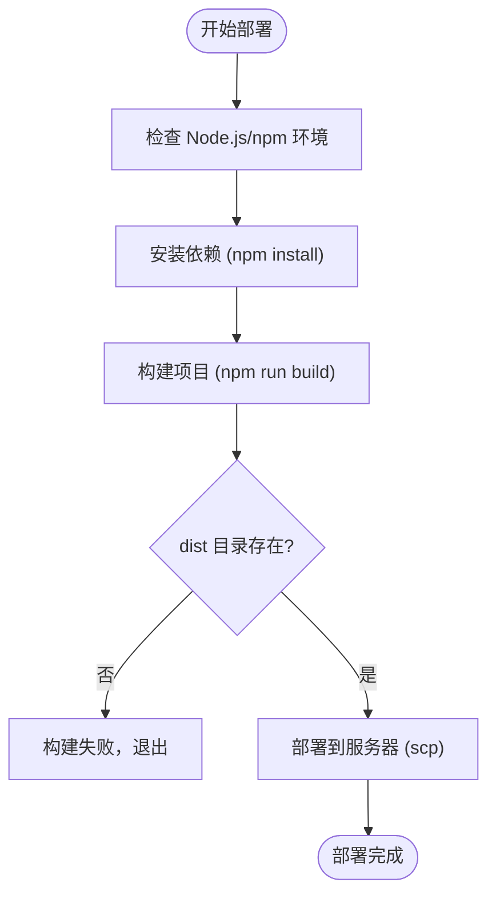

# 部署执行脚本

<cite>
**本文档中引用的文件**  
- [deploy.sh](file://scripts/deployment/deploy.sh)
- [deploy.ps1](file://scripts/deployment/deploy.ps1)
- [trigger-deployment.js](file://scripts/deployment/trigger-deployment.js)
- [monitor-deployment.js](file://scripts/deployment/monitor-deployment.js)
- [list-sites.js](file://scripts/deployment/list-sites.js)
- [simple-health-check.js](file://scripts/deployment/simple-health-check.js)
- [build-verification.yml](file://advanced-tools-navigation/github/workflows/build-verification.yml)
- [health-check.yml](file://advanced-tools-navigation/github/workflows/health-check.yml)
</cite>

## 目录
1. [简介](#简介)
2. [跨平台部署脚本](#跨平台部署脚本)
3. [部署触发机制](#部署触发机制)
4. [部署状态监控](#部署状态监控)
5. [站点列表获取](#站点列表获取)
6. [部署后健康检查](#部署后健康检查)
7. [CI/CD 流水线集成](#cicd-流水线集成)
8. [故障排查指南](#故障排查指南)
9. [总结](#总结)

## 简介
本项目包含一系列用于自动化部署和监控的脚本，覆盖从本地构建、远程部署、状态监控到健康验证的完整流程。这些脚本支持跨平台运行，并与 GitHub Actions、Netlify 和 Supabase 等云服务深度集成，确保部署过程的可靠性与可观测性。

## 跨平台部署脚本

该部分包含 `deploy.sh`（Linux/macOS）和 `deploy.ps1`（Windows）两个脚本，分别用于在不同操作系统上执行本地部署流程。

### 功能概述
- 检查 Node.js 和 npm 环境是否就绪
- 安装项目依赖
- 执行构建命令生成 `dist` 目录
- 验证构建结果
- 通过 `scp` 将构建产物部署至远程服务器

### 脚本执行流程


**Diagram sources**  
- [deploy.sh](file://scripts/deployment/deploy.sh#L1-L60)
- [deploy.ps1](file://scripts/deployment/deploy.ps1#L1-L38)

**Section sources**
- [deploy.sh](file://scripts/deployment/deploy.sh#L1-L60)
- [deploy.ps1](file://scripts/deployment/deploy.ps1#L1-L38)

## 部署触发机制

`trigger-deployment.js` 脚本用于通过 GitHub API 手动触发 GitHub Actions 工作流，实现远程部署任务的启动。

### 核心功能
- 加载 `.env.local` 中的 `GITHUB_TOKEN`
- 使用 Octokit 客户端连接 GitHub API
- 查询仓库中的部署相关工作流（如包含 "Deploy" 或 "Supabase" 名称）
- 自动选择 Supabase 部署工作流并触发 `workflow_dispatch` 事件
- 输出部署监控链接和实时状态

### 触发逻辑流程


**Diagram sources**  
- [trigger-deployment.js](file://scripts/deployment/trigger-deployment.js#L1-L181)

**Section sources**
- [trigger-deployment.js](file://scripts/deployment/trigger-deployment.js#L1-L181)

## 部署状态监控

`monitor-deployment.js` 脚本实现对部署后系统的持续健康检查与告警机制。

### 监控维度
1. **网站可访问性**：通过 `HEAD` 请求检测主站响应
2. **GitHub Actions 状态**：查询最新工作流运行结果
3. **Supabase 数据库连接**：验证数据库查询能力

### 告警策略
- 每 5 分钟执行一次检查
- 关键服务连续失败 3 次触发告警
- 支持单次检查模式（默认）和持续监控模式（`--monitor` 参数）

### 状态反馈机制


**Diagram sources**  
- [monitor-deployment.js](file://scripts/deployment/monitor-deployment.js#L1-L355)

**Section sources**
- [monitor-deployment.js](file://scripts/deployment/monitor-deployment.js#L1-L355)

## 站点列表获取

`list-sites.js` 脚本用于通过 Netlify API 获取用户账户下的所有站点信息，辅助识别目标部署环境。

### 功能说明
- 接收 Netlify 个人访问令牌作为参数
- 调用 `api.netlify.com/v1/sites` 获取站点列表
- 格式化输出站点名称、ID、自定义域名和 URL
- 特别标注可能的目标站点（名称或 ID 包含 "spiffy" 或 "torrone"）

### 使用方式
```bash
node list-sites.js <ACCESS_TOKEN>
```

**Section sources**
- [list-sites.js](file://scripts/deployment/list-sites.js#L1-L157)

## 部署后健康检查

`simple-health-check.js` 提供轻量级的部署后验证功能，适用于快速确认服务可用性。

### 检查项
- **网站可访问性**：尝试访问 `https://ramusi.cn`
- **GitHub Actions 状态**：提示用户手动查看工作流页面
- **Netlify 部署状态**：提供 Netlify 控制台链接

### 输出特点
- 图标化状态显示（✅/❌）
- 包含关键链接汇总
- 最终给出整体评估结论

**Section sources**
- [simple-health-check.js](file://scripts/deployment/simple-health-check.js#L1-L114)

## CI/CD 流水线集成

项目通过 GitHub Actions 实现自动化构建与健康检查，主要包含两个工作流文件。

### 构建验证流水线（build-verification.yml）
- **触发条件**：`main` 分支的 `push` 或 `pull_request`
- **执行步骤**：
  1. 检出代码
  2. 设置 Node.js 环境
  3. 缓存 `node_modules`
  4. 安装依赖
  5. 执行构建（注入 Supabase 环境变量）
  6. 验证 `dist/index.html` 存在
  7. 向 Netlify 发送部署通知


**Diagram sources**  
- [build-verification.yml](file://advanced-tools-navigation/github/workflows/build-verification.yml#L1-L87)

### 健康检查流水线（health-check.yml）
- **触发条件**：
  - `main` 分支推送
  - 每 6 小时定时运行
  - 手动触发（`workflow_dispatch`）
- **检查内容**：
  - HTTP 状态码是否为 200
  - 页面内容是否包含 "Ramusi"
- **超时设置**：总超时 10 分钟，每个步骤 3 分钟

**Section sources**
- [build-verification.yml](file://advanced-tools-navigation/github/workflows/build-verification.yml#L1-L87)
- [health-check.yml](file://advanced-tools-navigation/github/workflows/health-check.yml#L1-L48)

## 故障排查指南

### 部署触发失败
- **GITHUB_TOKEN 无效**：确认令牌具有 `repo` 和 `workflow` 权限
- **工作流不支持手动触发**：检查 `.yml` 文件是否包含 `workflow_dispatch` 事件
- **网络连接问题**：确保可以访问 GitHub API

### 监控中断
- **环境变量缺失**：确认 `.env.local` 中配置了 `VITE_SUPABASE_URL` 和 `VITE_SUPABASE_ANON_KEY`
- **API 限流**：Netlify/GitHub API 可能存在调用频率限制
- **脚本权限不足**：Windows 上需以管理员身份运行 PowerShell

### 构建失败
- **依赖安装失败**：清理 npm 缓存后重试
- **环境变量未注入**：确认 GitHub Secrets 配置正确
- **磁盘空间不足**：检查构建机存储情况

**Section sources**
- [trigger-deployment.js](file://scripts/deployment/trigger-deployment.js#L1-L181)
- [monitor-deployment.js](file://scripts/deployment/monitor-deployment.js#L1-L355)
- [build-verification.yml](file://advanced-tools-navigation/github/workflows/build-verification.yml#L1-L87)

## 总结
本项目的部署脚本体系实现了从本地到云端的全链路自动化。通过 `deploy.sh`/`.ps1` 支持跨平台本地部署，`trigger-deployment.js` 实现远程触发，`monitor-deployment.js` 提供持续监控，结合 GitHub Actions 的自动化流水线，形成了完整的 DevOps 闭环。各脚本职责清晰、可组合性强，为项目的稳定运行提供了有力保障。