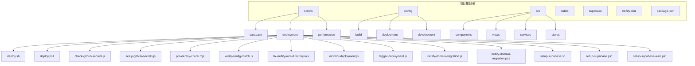
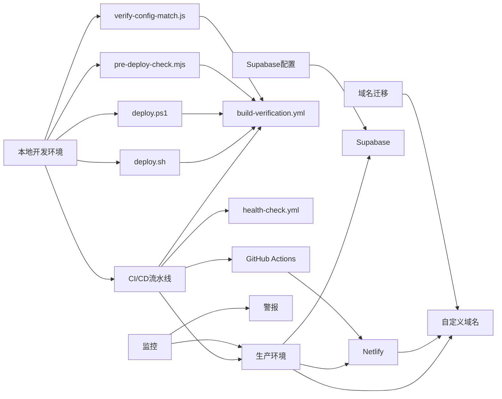
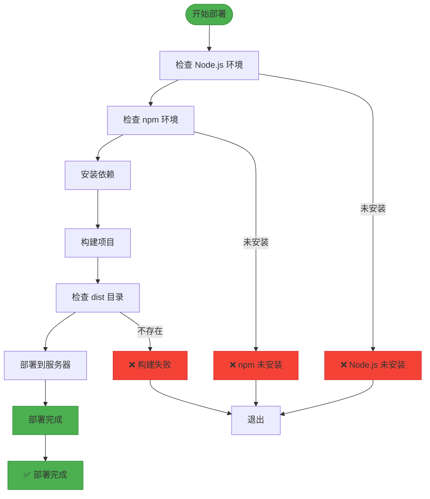
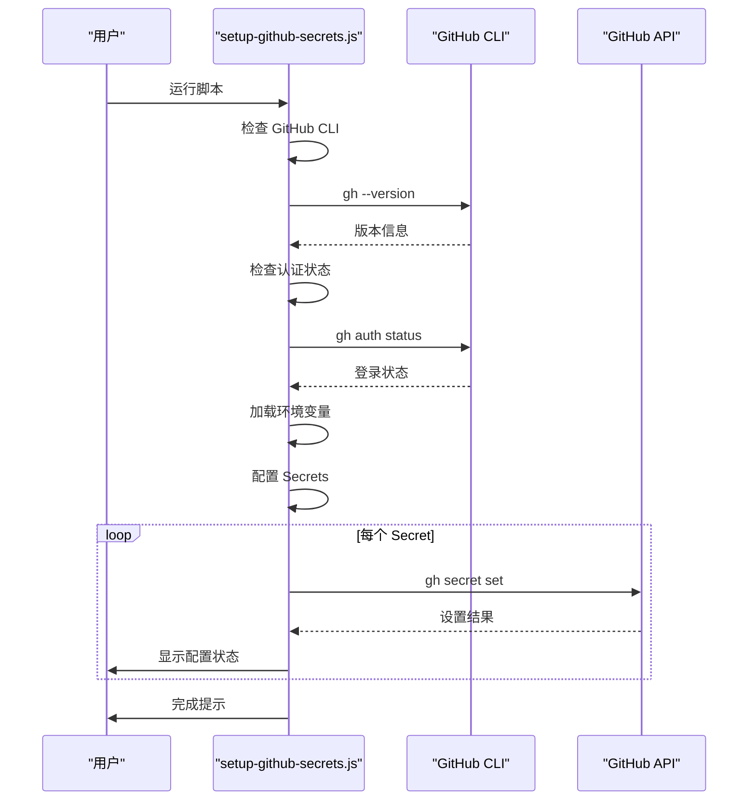
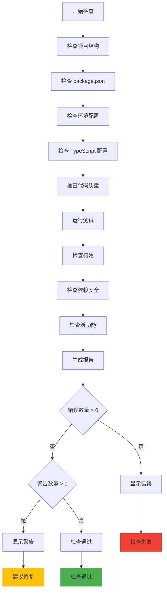
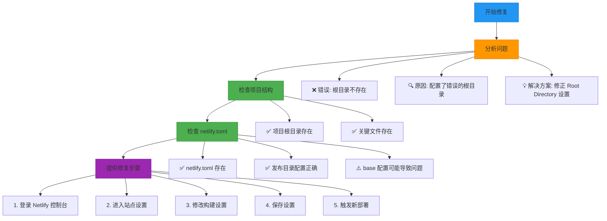
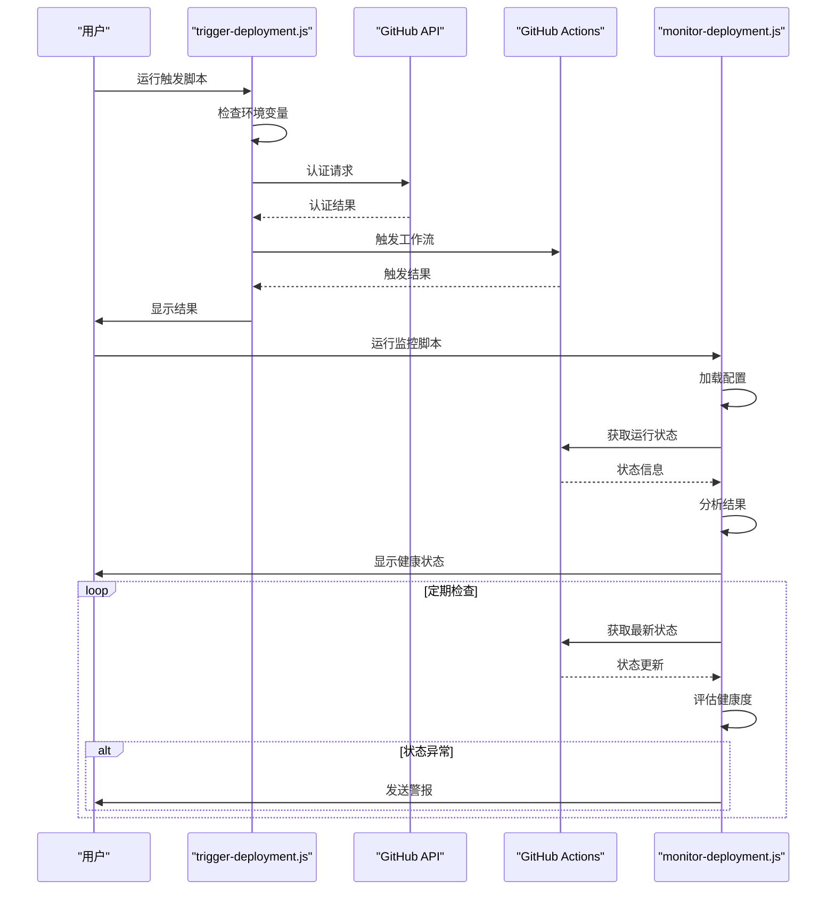
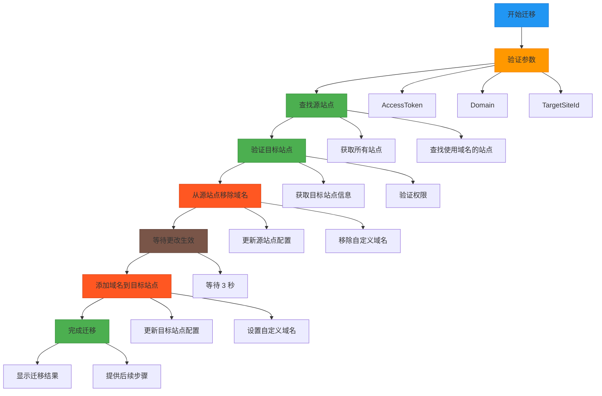
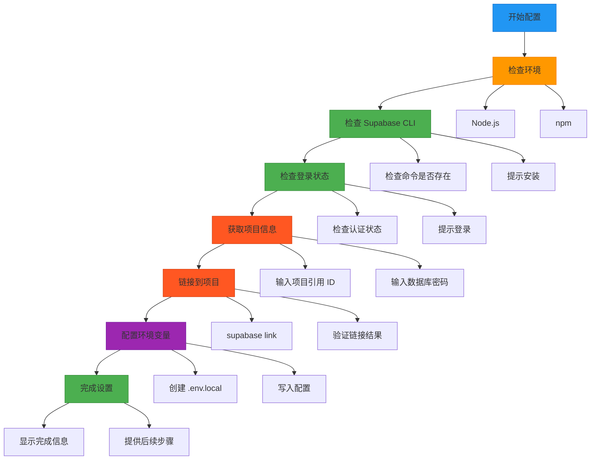
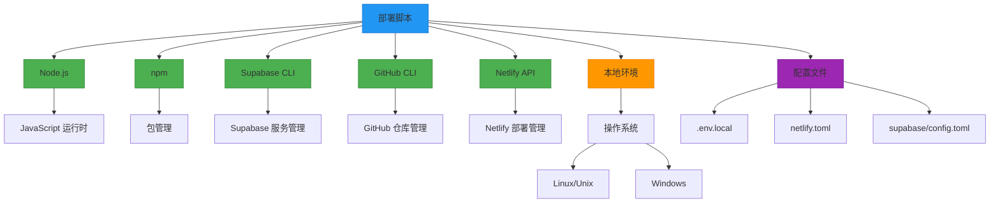

# 部署脚本

<cite>
**本文档中引用的文件**
- [deploy.sh](file://scripts/deployment/deploy.sh)
- [deploy.ps1](file://scripts/deployment/deploy.ps1)
- [check-github-secrets.js](file://scripts/deployment/check-github-secrets.js)
- [setup-github-secrets.js](file://scripts/deployment/setup-github-secrets.js)
- [pre-deploy-check.mjs](file://scripts/deployment/pre-deploy-check.mjs)
- [verify-config-match.js](file://scripts/deployment/verify-config-match.js)
- [fix-netlify-root-directory.mjs](file://scripts/deployment/fix-netlify-root-directory.mjs)
- [monitor-deployment.js](file://scripts/deployment/monitor-deployment.js)
- [trigger-deployment.js](file://scripts/deployment/trigger-deployment.js)
- [netlify-domain-migration.js](file://scripts/deployment/netlify-domain-migration.js)
- [netlify-domain-migration.ps1](file://scripts/deployment/netlify-domain-migration.ps1)
- [setup-supabase.sh](file://scripts/deployment/setup-supabase.sh)
- [setup-supabase.ps1](file://scripts/deployment/setup-supabase.ps1)
- [setup-supabase-auto.ps1](file://scripts/deployment/setup-supabase-auto.ps1)
- [github/workflows/build-verification.yml](file://github/workflows/build-verification.yml)
- [github/workflows/health-check.yml](file://github/workflows/health-check.yml)
- [netlify.toml](file://netlify.toml)
</cite>

## 目录
1. [简介](#简介)
2. [项目结构](#项目结构)
3. [核心组件](#核心组件)
4. [架构概述](#架构概述)
5. [详细组件分析](#详细组件分析)
6. [依赖分析](#依赖分析)
7. [性能考虑](#性能考虑)
8. [故障排除指南](#故障排除指南)
9. [结论](#结论)

## 简介
本文件全面解析了高级工具导航项目的部署自动化脚本集。文档详细说明了跨平台部署脚本的工作机制，包括在不同操作系统下的执行流程；深入分析了GitHub Secrets的验证与配置过程；阐述了部署前环境校验逻辑；解释了Netlify部署路径问题的修复方法；说明了与CI/CD流水线的集成方式；描述了域名迁移脚本的应用场景；介绍了Supabase环境的自动化配置流程。结合CI/CD工作流和Netlify配置文件，文档阐明了这些脚本在持续集成与持续部署流程中的调用时机与错误处理策略，并提供了完整的部署故障排查手册。

## 项目结构
项目采用模块化结构设计，主要分为源代码、配置、公共资源和脚本四大目录。源代码位于`src`目录，包含Vue组件、服务、存储和视图等前端实现。`config`目录存放不同环境的配置文件，包括构建、部署和开发配置。`public`目录包含静态资源文件。`scripts`目录是本项目的核心，包含了数据库、部署和性能优化等多个子目录的自动化脚本。

**图示来源**
- [deploy.sh](file://scripts/deployment/deploy.sh)
- [deploy.ps1](file://scripts/deployment/deploy.ps1)
- [check-github-secrets.js](file://scripts/deployment/check-github-secrets.js)
- [setup-github-secrets.js](file://scripts/deployment/setup-github-secrets.js)
- [pre-deploy-check.mjs](file://scripts/deployment/pre-deploy-check.mjs)
- [verify-config-match.js](file://scripts/deployment/verify-config-match.js)
- [fix-netlify-root-directory.mjs](file://scripts/deployment/fix-netlify-root-directory.mjs)
- [monitor-deployment.js](file://scripts/deployment/monitor-deployment.js)
- [trigger-deployment.js](file://scripts/deployment/trigger-deployment.js)
- [netlify-domain-migration.js](file://scripts/deployment/netlify-domain-migration.js)
- [netlify-domain-migration.ps1](file://scripts/deployment/netlify-domain-migration.ps1)
- [setup-supabase.sh](file://scripts/deployment/setup-supabase.sh)
- [setup-supabase.ps1](file://scripts/deployment/setup-supabase.ps1)
- [setup-supabase-auto.ps1](file://scripts/deployment/setup-supabase-auto.ps1)

**章节来源**
- [scripts](file://scripts)
- [config](file://config)
- [src](file://src)
- [public](file://public)

## 核心组件
部署脚本集的核心组件包括跨平台部署脚本、GitHub Secrets管理工具、部署前检查工具、Netlify配置修复工具、CI/CD集成工具、域名迁移工具和Supabase自动化配置工具。这些组件共同构成了一个完整的自动化部署生态系统，确保了从开发到生产环境的平滑过渡。

**章节来源**
- [scripts/deployment](file://scripts/deployment)
- [github/workflows](file://github/workflows)
- [netlify.toml](file://netlify.toml)

## 架构概述
部署架构采用分层设计，包括本地开发环境、CI/CD流水线和生产环境三个主要层次。本地脚本负责环境准备和预部署检查，GitHub Actions工作流处理持续集成和自动化测试，Netlify负责静态站点的构建和部署。整个流程通过环境变量和密钥管理确保安全性，通过自动化脚本提高部署效率和可靠性。

**图示来源**
- [github/workflows/build-verification.yml](file://github/workflows/build-verification.yml)
- [github/workflows/health-check.yml](file://github/workflows/health-check.yml)
- [netlify.toml](file://netlify.toml)
- [scripts/deployment/deploy.sh](file://scripts/deployment/deploy.sh)
- [scripts/deployment/deploy.ps1](file://scripts/deployment/deploy.ps1)
- [scripts/deployment/pre-deploy-check.mjs](file://scripts/deployment/pre-deploy-check.mjs)
- [scripts/deployment/verify-config-match.js](file://scripts/deployment/verify-config-match.js)

## 详细组件分析

### 跨平台部署脚本分析
跨平台部署脚本包括`deploy.sh`和`deploy.ps1`，分别用于Linux/Unix和Windows系统。这些脚本实现了统一的部署流程，包括环境检查、依赖安装、项目构建和服务器部署等步骤。

#### 部署脚本流程图

**图示来源**
- [scripts/deployment/deploy.sh](file://scripts/deployment/deploy.sh)
- [scripts/deployment/deploy.ps1](file://scripts/deployment/deploy.ps1)

**章节来源**
- [scripts/deployment/deploy.sh](file://scripts/deployment/deploy.sh#L1-L60)
- [scripts/deployment/deploy.ps1](file://scripts/deployment/deploy.ps1#L1-L37)

### GitHub Secrets管理分析
GitHub Secrets管理工具包括`check-github-secrets.js`和`setup-github-secrets.js`，用于验证和配置GitHub Actions所需的密钥。这些工具确保了敏感信息的安全存储和正确配置。

#### GitHub Secrets配置流程

**图示来源**
- [scripts/deployment/setup-github-secrets.js](file://scripts/deployment/setup-github-secrets.js)
- [scripts/deployment/check-github-secrets.js](file://scripts/deployment/check-github-secrets.js)

**章节来源**
- [scripts/deployment/setup-github-secrets.js](file://scripts/deployment/setup-github-secrets.js#L1-L49)
- [scripts/deployment/check-github-secrets.js](file://scripts/deployment/check-github-secrets.js#L1-L169)

### 部署前检查分析
部署前检查工具包括`pre-deploy-check.mjs`和`verify-config-match.js`，用于在部署前验证项目配置、依赖、测试等是否准备就绪。

#### 部署前检查流程

**图示来源**
- [scripts/deployment/pre-deploy-check.mjs](file://scripts/deployment/pre-deploy-check.mjs)
- [scripts/deployment/verify-config-match.js](file://scripts/deployment/verify-config-match.js)

**章节来源**
- [scripts/deployment/pre-deploy-check.mjs](file://scripts/deployment/pre-deploy-check.mjs#L1-L61)
- [scripts/deployment/verify-config-match.js](file://scripts/deployment/verify-config-match.js#L1-L152)

### Netlify配置修复分析
`fix-netlify-root-directory.mjs`脚本用于修复Netlify部署路径问题，特别是当Netlify站点设置中配置了错误的根目录时。

#### Netlify配置修复流程

**图示来源**
- [scripts/deployment/fix-netlify-root-directory.mjs](file://scripts/deployment/fix-netlify-root-directory.mjs)

**章节来源**
- [scripts/deployment/fix-netlify-root-directory.mjs](file://scripts/deployment/fix-netlify-root-directory.mjs#L1-L85)

### CI/CD集成分析
CI/CD集成工具包括`monitor-deployment.js`和`trigger-deployment.js`，用于与GitHub Actions流水线集成，实现部署的监控和触发。

#### CI/CD集成流程

**图示来源**
- [scripts/deployment/trigger-deployment.js](file://scripts/deployment/trigger-deployment.js)
- [scripts/deployment/monitor-deployment.js](file://scripts/deployment/monitor-deployment.js)

**章节来源**
- [scripts/deployment/trigger-deployment.js](file://scripts/deployment/trigger-deployment.js#L1-L180)
- [scripts/deployment/monitor-deployment.js](file://scripts/deployment/monitor-deployment.js#L1-L341)

### 域名迁移分析
`netlify-domain-migration`系列脚本用于在Netlify站点之间迁移自定义域名，支持JavaScript和PowerShell两种实现。

#### 域名迁移流程

**图示来源**
- [scripts/deployment/netlify-domain-migration.js](file://scripts/deployment/netlify-domain-migration.js)
- [scripts/deployment/netlify-domain-migration.ps1](file://scripts/deployment/netlify-domain-migration.ps1)

**章节来源**
- [scripts/deployment/netlify-domain-migration.js](file://scripts/deployment/netlify-domain-migration.js#L1-L274)
- [scripts/deployment/netlify-domain-migration.ps1](file://scripts/deployment/netlify-domain-migration.ps1#L1-L214)

### Supabase配置分析
Supabase配置工具包括`setup-supabase`系列脚本，用于自动化配置Supabase环境，支持跨平台操作。

#### Supabase配置流程

**图示来源**
- [scripts/deployment/setup-supabase.sh](file://scripts/deployment/setup-supabase.sh)
- [scripts/deployment/setup-supabase.ps1](file://scripts/deployment/setup-supabase.ps1)
- [scripts/deployment/setup-supabase-auto.ps1](file://scripts/deployment/setup-supabase-auto.ps1)

**章节来源**
- [scripts/deployment/setup-supabase.sh](file://scripts/deployment/setup-supabase.sh#L1-L59)
- [scripts/deployment/setup-supabase.ps1](file://scripts/deployment/setup-supabase.ps1#L1-L44)
- [scripts/deployment/setup-supabase-auto.ps1](file://scripts/deployment/setup-supabase-auto.ps1#L1-L49)

## 依赖分析
部署脚本集依赖于多个外部工具和API，包括Node.js、npm、Supabase CLI、GitHub CLI和Netlify API。这些依赖关系确保了脚本能够与相应的服务进行交互，实现自动化部署和管理功能。

**图示来源**
- [package.json](file://package.json)
- [go.mod](file://go.mod)

