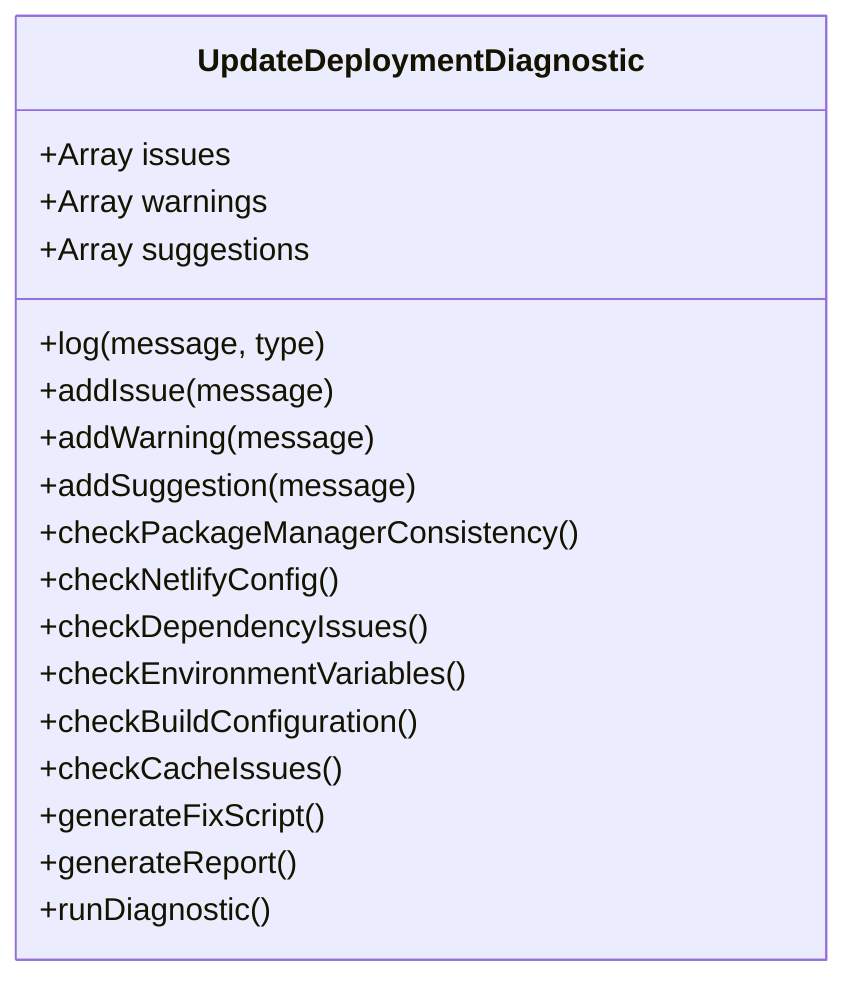
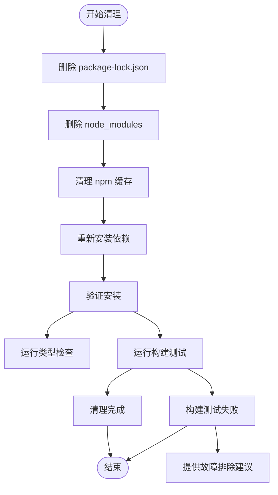
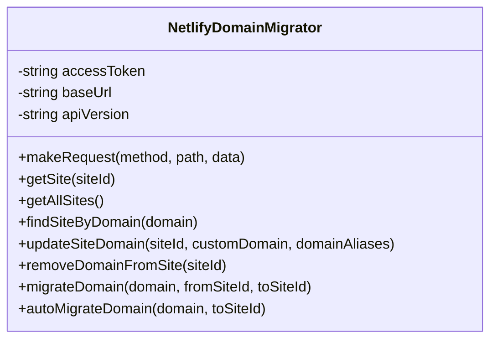
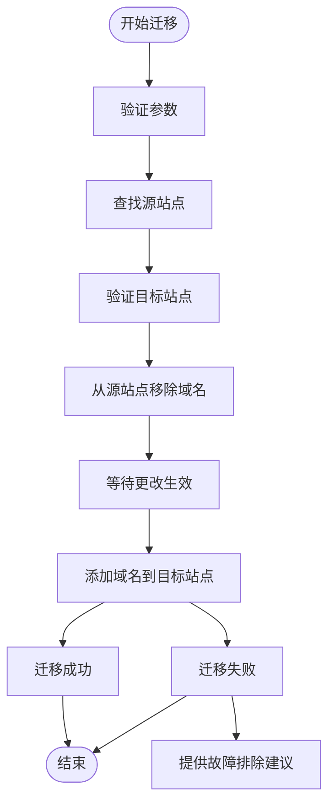

# 部署诊断与修复脚本

<cite>
**本文档中引用的文件**  
- [diagnose-deployment.js](file://scripts/deployment/diagnose-deployment.js)
- [diagnose-update-issues.js](file://scripts/deployment/diagnose-update-issues.js)
- [fix-netlify-root-directory.mjs](file://scripts/deployment/fix-netlify-root-directory.mjs)
- [clean-dependencies.js](file://scripts/deployment/clean-dependencies.js)
- [quick-fix-deployment.js](file://scripts/deployment/quick-fix-deployment.js)
- [netlify-domain-migration.js](file://scripts/deployment/netlify-domain-migration.js)
- [netlify-domain-migration.ps1](file://scripts/deployment/netlify-domain-migration.ps1)
- [netlify.toml](file://netlify.toml)
- [check-netlify-config.js](file://scripts/deployment/check-netlify-config.js)
- [check-deployment-status.js](file://scripts/deployment/check-deployment-status.js)
</cite>

## 目录
1. [简介](#简介)
2. [部署诊断脚本分析](#部署诊断脚本分析)
3. [更新发布问题诊断机制](#更新发布问题诊断机制)
4. [Netlify根目录配置修复](#netlify根目录配置修复)
5. [依赖清理策略](#依赖清理策略)
6. [快速修复流程](#快速修复流程)
7. [域名迁移脚本详解](#域名迁移脚本详解)
8. [CI/CD集成与调用策略](#cicd集成与调用策略)
9. [诊断日志分析指南](#诊断日志分析指南)
10. [结论](#结论)

## 简介
本文件深入解析部署问题诊断与自动化修复脚本系统，涵盖从问题定位、诊断分析到自动修复的完整流程。重点阐述`diagnose-deployment.js`和`diagnose-update-issues.js`如何收集部署日志、环境信息和错误堆栈以定位问题根源；说明`fix-netlify-root-directory.mjs`如何检测并修正Netlify部署根目录配置错误；分析`clean-dependencies.js`在依赖冲突或缓存污染时的清理策略；解释`quick-fix-deployment.js`如何执行一系列预设修复操作以恢复部署能力；描述`netlify-domain-migration`系列脚本（.js/.ps1）在域名迁移场景下的配置更新与重定向设置。结合实际部署故障案例，说明这些脚本的调用时机、修复效果验证方法及与CI/CD系统的集成策略，并提供诊断日志分析指南。

## 部署诊断脚本分析

`diagnose-deployment.js` 是一个全面的部署诊断工具，基于 Context7 最佳实践构建，用于系统性地检查部署环境的健康状态。

该脚本通过以下五个维度进行诊断：
1. **GitHub Actions 状态检查**：查询最近的工作流运行记录，识别失败的构建任务
2. **网络连接诊断**：测试关键端点（GitHub API、Netlify API、自定义域名）的可达性
3. **Supabase 连接验证**：检查 Supabase 数据库连接是否正常
4. **文件系统状态检查**：验证关键文件（package.json、netlify.toml、dist/index.html）是否存在
5. **故障排除建议生成**：提供详细的网络、Netlify 配置、构建流程和 Supabase 集成的排查步骤

脚本采用模块化设计，每个诊断模块独立执行并输出结果，最后汇总成完整的诊断报告。其设计遵循"先检查，后建议"的原则，确保用户能够按步骤解决问题。

**中文(中文)**
- [diagnose-deployment.js](file://scripts/deployment/diagnose-deployment.js#L1-L170)

## 更新发布问题诊断机制

`diagnose-update-issues.js` 专门用于诊断初次发布成功但更新发布失败的问题，采用面向对象的设计模式，通过 `UpdateDeploymentDiagnostic` 类封装所有诊断逻辑。

该脚本执行以下关键检查：
- **包管理器一致性检查**：检测 package-lock.json、yarn.lock、pnpm-lock.yaml 是否存在冲突
- **Netlify 配置检查**：验证 netlify.toml 中的构建命令与项目实际使用的包管理器是否匹配
- **依赖问题检查**：识别平台特定依赖和 Rollup 相关的潜在问题
- **环境变量配置检查**：确认必要的环境变量（VITE_SUPABASE_URL、VITE_SUPABASE_ANON_KEY）是否配置
- **构建配置检查**：验证 Vite 和 TypeScript 配置是否符合最佳实践
- **缓存问题检查**：评估 node_modules 和 dist 目录的状态

脚本的亮点在于能够自动生成修复脚本 `fix-update-deployment.sh`，包含清理依赖、统一包管理器、重新安装依赖、验证构建等完整修复流程。诊断结果以结构化报告形式输出，明确区分问题、警告和建议，并提供快速修复步骤。

**图源**  
- [diagnose-update-issues.js](file://scripts/deployment/diagnose-update-issues.js#L1-L377)

**中文(中文)**
- [diagnose-update-issues.js](file://scripts/deployment/diagnose-update-issues.js#L1-L377)

## Netlify根目录配置修复

`fix-netlify-root-directory.mjs` 专门解决 Netlify 部署中常见的根目录配置错误问题。当出现 "The specified Root Directory 'jiayuwee' does not exist" 错误时，此脚本提供完整的修复指导。

脚本执行以下操作：
1. **问题分析**：明确指出错误原因和解决方案
2. **项目结构检查**：验证关键文件（package.json、netlify.toml、vite.config.ts）是否存在
3. **netlify.toml 配置检查**：确认发布目录和构建命令配置正确
4. **提供详细修复步骤**：指导用户在 Netlify 控制台中修改 Base directory、Build command 和 Publish directory 设置
5. **环境变量检查**：提醒用户确保 VITE_SUPABASE_URL 和 VITE_SUPABASE_ANON_KEY 已设置
6. **提供快速链接**：包含 Netlify 站点设置、环境变量、GitHub 仓库和部署日志的直接访问链接

该脚本本质上是一个交互式指南，通过详细的文本输出引导用户完成修复过程，特别适合新手开发者快速解决问题。

**中文(中文)**
- [fix-netlify-root-directory.mjs](file://scripts/deployment/fix-netlify-root-directory.mjs#L1-L122)

## 依赖清理策略

`clean-dependencies.js` 实现了一套完整的依赖清理和重新安装策略，用于解决依赖冲突或缓存污染问题。

脚本执行以下清理流程：
1. **删除 package-lock.json**：清除旧的依赖锁定信息
2. **删除 node_modules**：彻底清理安装的依赖包
3. **清理 npm 缓存**：使用 `npm cache clean --force` 清除全局缓存
4. **重新安装依赖**：使用 `npm install` 重新安装所有依赖，并设置环境变量避免平台特定依赖问题
5. **验证安装**：运行类型检查和构建测试，确保新安装的依赖工作正常

脚本的关键优势在于其健壮的错误处理机制，当清理过程中出现错误时，会提供详细的故障排除建议，包括检查磁盘空间、网络连接、Node.js 版本兼容性等。清理完成后，脚本会输出完成的操作清单和下一步行动建议。

**图源**  
- [clean-dependencies.js](file://scripts/deployment/clean-dependencies.js#L1-L89)

**中文(中文)**
- [clean-dependencies.js](file://scripts/deployment/clean-dependencies.js#L1-L89)

## 快速修复流程

`quick-fix-deployment.js` 提供了一套标准化的快速修复流程，基于 Context7 最佳实践，用于解决常见的部署问题。

脚本包含以下核心内容：
- **当前状态检查**：明确指出 GitHub Actions 构建成功但网站无法访问的问题
- **立即行动步骤**：提供四步诊断流程，包括检查 Netlify 站点状态、验证域名配置、检查构建配置和测试本地构建
- **常见问题解决方案**：针对域名配置、SSL 证书、构建失败等常见问题提供具体解决方案
- **验证步骤**：列出部署修复后的验证清单
- **应急备用方案**：当问题无法立即解决时，建议使用 Netlify 默认域名或其他部署平台

该脚本的设计理念是"快速响应、逐步排查"，通过结构化的输出引导用户按步骤解决问题，特别适合在生产环境出现紧急故障时快速恢复服务。

**中文(中文)**
- [quick-fix-deployment.js](file://scripts/deployment/quick-fix-deployment.js#L1-L90)

## 域名迁移脚本详解

`netlify-domain-migration.js` 和 `netlify-domain-migration.ps1` 是一组跨平台的域名迁移工具，用于在 Netlify 站点之间迁移自定义域名。

### JavaScript 版本分析

JavaScript 版本采用面向对象设计，通过 `NetlifyDomainMigrator` 类封装所有功能：

**图源**  
- [netlify-domain-migration.js](file://scripts/deployment/netlify-domain-migration.js#L1-L276)

### PowerShell 版本分析

PowerShell 版本提供了相同的功能，但更适合 Windows 环境和系统管理员使用：

**图源**  
- [netlify-domain-migration.ps1](file://scripts/deployment/netlify-domain-migration.ps1#L1-L216)

### 共同特性

两个版本都实现了以下核心功能：
- **API 封装**：封装 Netlify API 调用，处理认证和错误
- **站点查找**：根据域名自动查找当前使用的站点
- **迁移流程**：先从源站点移除域名，再添加到目标站点
- **错误处理**：提供详细的错误信息和故障排除建议
- **进度反馈**：实时输出迁移进度和结果

脚本通过命令行参数接收访问令牌、域名和目标站点 ID，执行自动化的域名迁移流程，大大简化了手动操作的复杂性。

**中文(中文)**
- [netlify-domain-migration.js](file://scripts/deployment/netlify-domain-migration.js#L1-L276)
- [netlify-domain-migration.ps1](file://scripts/deployment/netlify-domain-migration.ps1#L1-L216)

## CI/CD集成与调用策略

这些诊断与修复脚本可以深度集成到 CI/CD 系统中，形成自动化的部署保障机制。

### 调用时机

| 脚本 | 触发时机 |
|------|----------|
| `diagnose-deployment.js` | 部署前预检、部署失败后自动诊断 |
| `diagnose-update-issues.js` | 更新发布失败时自动运行 |
| `clean-dependencies.js` | 依赖相关错误时手动或自动触发 |
| `quick-fix-deployment.js` | 生产环境紧急故障时快速响应 |
| `netlify-domain-migration.*` | 域名变更或站点迁移时 |

### 集成策略

1. **GitHub Actions 集成**：在工作流中添加诊断步骤，失败时自动运行相应脚本
2. **预部署检查**：在部署前运行 `diagnose-deployment.js` 和 `check-netlify-config.js`
3. **失败后自动诊断**：部署失败时触发 `diagnose-update-issues.js` 生成诊断报告
4. **定时健康检查**：通过 `health-check.yml` 定期运行诊断脚本
5. **手动修复入口**：在项目文档中提供清晰的脚本调用指南

### 实际案例

当出现"更新发布失败"问题时，CI/CD 系统可以：
1. 自动运行 `diagnose-update-issues.js` 诊断问题
2. 根据诊断结果生成 `fix-update-deployment.sh` 修复脚本
3. 通知开发者查看诊断报告
4. 开发者确认后，可选择自动执行修复脚本
5. 重新触发部署流程

这种集成策略大大提高了问题诊断和修复的效率，减少了人工干预的需求。

**中文(中文)**
- [check-netlify-config.js](file://scripts/deployment/check-netlify-config.js#L1-L112)
- [check-deployment-status.js](file://scripts/deployment/check-deployment-status.js#L1-L192)

## 诊断日志分析指南

有效的诊断日志分析是快速定位和解决问题的关键。以下是针对本系统脚本的分析指南：

### 日志结构

所有脚本都采用统一的日志格式：
- **时间戳**：每条日志包含时间信息
- **图标标识**：使用表情符号区分信息类型（✅成功、❌错误、⚠️警告、🔧建议）
- **分类输出**：将问题、警告、建议分开显示
- **结构化报告**：最终生成包含问题、警告、建议和修复步骤的完整报告

### 分析方法

1. **从错误开始**：首先关注 `❌` 标识的错误信息
2. **检查警告**：然后查看 `⚠️` 标识的潜在问题
3. **执行建议**：按照 `🔧` 标识的建议逐步修复
4. **验证结果**：修复后重新运行诊断脚本验证效果

### 常见模式

| 日志模式 | 含义 | 解决方案 |
|---------|------|----------|
| "同时存在 package-lock.json 和 yarn.lock" | 包管理器冲突 | 统一使用一种包管理器 |
| "netlify.toml 使用 npm ci 但项目有 yarn.lock" | 构建配置不一致 | 统一构建命令 |
| "node_modules 已超过 24 小时未更新" | 缓存老化 | 清理并重新安装依赖 |
| "缺少 VITE_SUPABASE_URL" | 环境变量缺失 | 在 Netlify 控制台设置环境变量 |

### 高级技巧

- **对比分析**：比较成功和失败部署的诊断日志差异
- **趋势分析**：定期运行诊断脚本，观察问题发展趋势
- **自动化分析**：编写脚本自动解析诊断日志，提取关键问题
- **知识库构建**：将常见问题和解决方案整理成知识库

通过系统化的日志分析，可以快速定位问题根源，避免重复排查，提高运维效率。

**中文(中文)**
- [diagnose-deployment.js](file://scripts/deployment/diagnose-deployment.js#L1-L170)
- [diagnose-update-issues.js](file://scripts/deployment/diagnose-update-issues.js#L1-L377)

## 结论

本套部署诊断与修复脚本系统提供了一个完整的解决方案，涵盖了从问题诊断到自动修复的全流程。通过 `diagnose-deployment.js` 和 `diagnose-update-issues.js` 的深度分析能力，`fix-netlify-root-directory.mjs` 的精准修复功能，`clean-dependencies.js` 的彻底清理策略，`quick-fix-deployment.js` 的快速响应机制，以及 `netlify-domain-migration` 系列脚本的跨平台迁移能力，形成了一个强大的部署保障体系。

这些脚本不仅能够帮助开发者快速定位和解决部署问题，还可以通过与 CI/CD 系统的深度集成，实现自动化的问题诊断和修复，大大提高了部署的可靠性和效率。结合系统的诊断日志分析指南，团队可以建立标准化的问题处理流程，积累运维知识，持续优化部署实践。

未来可以进一步扩展这些脚本的功能，如增加更多自动化修复场景、支持更多部署平台、集成监控告警系统等，构建更加智能和全面的部署运维体系。