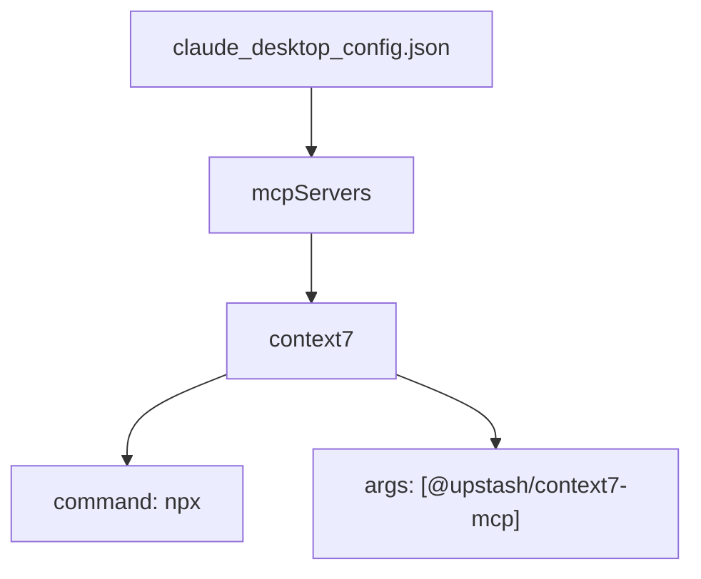
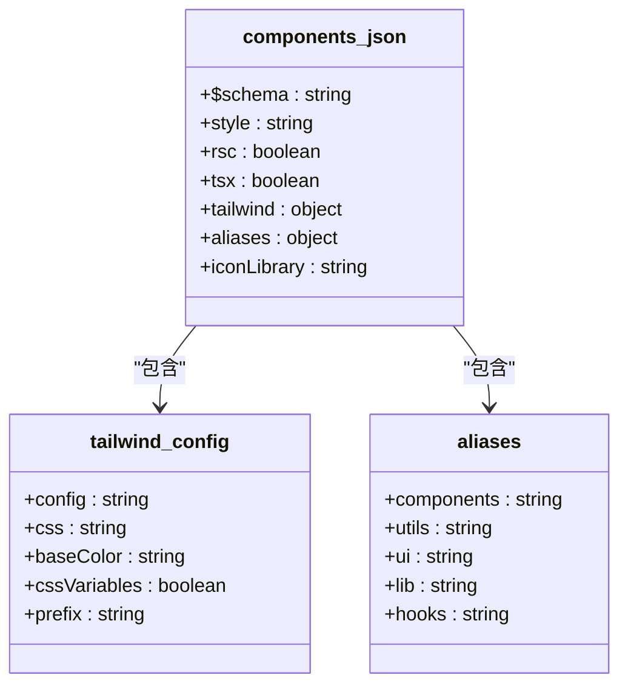

# 开发配置

<cite>
**本文档中引用的文件**  
- [claude_desktop_config.json](file://config/development/claude_desktop_config.json)
- [components.json](file://config/development/components.json)
</cite>

## 目录
1. [介绍](#介绍)
2. [开发配置文件概述](#开发配置文件概述)
3. [claude_desktop_config.json 详解](#claude_desktop_configjson-详解)
4. [components.json 详解](#componentsjson-详解)
5. [配置加载机制与功能支持](#配置加载机制与功能支持)
6. [开发效率提升机制](#开发效率提升机制)
7. [配置扩展与自定义指南](#配置扩展与自定义指南)
8. [结论](#结论)

## 介绍
本项目为一个功能丰富的工具导航平台，支持本地开发与云端部署。在开发过程中，通过一系列辅助配置文件来提升开发效率、统一开发环境并支持组件化开发。本文档将全面介绍位于 `config/development/` 目录下的两个核心开发辅助配置文件：`claude_desktop_config.json` 和 `components.json`，详细解析其结构、用途及在本地开发环境中的作用机制。

## 开发配置文件概述
项目中的开发配置文件集中存放于 `config/development/` 目录下，旨在为开发者提供一致的本地开发体验。这些配置文件不参与生产构建，仅用于开发阶段的工具集成、组件管理与环境定制。其中，`claude_desktop_config.json` 用于定义本地 MCP（Model Context Protocol）服务的启动方式，支持与 AI 辅助开发工具的集成；而 `components.json` 则是 UI 组件库的配置文件，用于管理组件样式、别名路径和构建选项，提升前端开发效率。

**Section sources**
- [claude_desktop_config.json](file://config/development/claude_desktop_config.json#L1-L8)
- [components.json](file://config/development/components.json#L1-L20)

## claude_desktop_config.json 详解
`claude_desktop_config.json` 是用于本地 AI 开发辅助环境的配置文件，主要定义了 MCP 服务的启动命令与参数，支持与 Claude 等 AI 工具的集成。

该文件的核心结构如下：
- **mcpServers**: 定义可用的 MCP 服务实例。
  - **context7**: 一个具体的 MCP 服务配置。
    - **command**: 启动命令，此处为 `npx`，用于执行 npm 包。
    - **args**: 命令参数数组，指定要运行的包 `@upstash/context7-mcp`。

此配置允许开发者在本地启动一个上下文感知的 AI 服务，用于代码补全、文档生成或调试建议，提升开发智能化水平。

**Diagram sources**
- [claude_desktop_config.json](file://config/development/claude_desktop_config.json#L1-L8)

**Section sources**
- [claude_desktop_config.json](file://config/development/claude_desktop_config.json#L1-L8)

## components.json 详解
`components.json` 是前端 UI 组件系统的配置文件，遵循 shadcn/ui 的配置规范，用于管理组件库的样式、路径别名和构建行为。

其主要字段含义如下：
- **$schema**: 指定 JSON Schema 地址，用于编辑器中的智能提示与验证。
- **style**: 组件样式风格，当前为 `default`。
- **rsc**: 是否支持 React Server Components，此处为 `true`。
- **tsx**: 是否启用 TSX 支持，此处为 `true`。
- **tailwind**: Tailwind CSS 相关配置。
  - **config**: Tailwind 配置文件路径。
  - **css**: 全局 CSS 文件路径。
  - **baseColor**: 基础颜色主题。
  - **cssVariables**: 是否使用 CSS 变量。
  - **prefix**: 类名前缀。
- **aliases**: 路径别名映射，简化模块导入。
  - **components**: 映射到 `@/components`
  - **utils**: 映射到 `@/lib/utils`
  - **ui**: 映射到 `@/components/ui`
  - **lib**: 映射到 `@/lib`
  - **hooks**: 映射到 `@/hooks`
- **iconLibrary**: 图标库选择，当前为 `lucide`。

该配置支持自动组件发现、路径别名解析和样式统一管理，极大提升了组件复用性与开发效率。

**Diagram sources**
- [components.json](file://config/development/components.json#L1-L20)

**Section sources**
- [components.json](file://config/development/components.json#L1-L20)

## 配置加载机制与功能支持
这两个配置文件在开发环境中通过不同的机制被加载和使用：

- `claude_desktop_config.json` 通常由开发桌面环境或 IDE 插件读取，用于启动 AI 辅助服务。例如，在启动开发服务器时，可通过脚本读取该配置并自动运行 `npx @upstash/context7-mcp`，为开发者提供上下文感知的智能建议。

- `components.json` 被构建工具（如 Vite）或组件管理 CLI 读取，用于生成组件模板、解析路径别名和配置样式系统。例如，在使用 `npx shadcn-ui@latest add button` 命令时，工具会读取该文件以确定组件的存放路径、样式配置和别名设置。

这些配置的注入方式通常通过启动脚本或开发服务器的插件机制实现，确保开发环境的一致性与可复现性。

## 开发效率提升机制
通过合理使用这些开发配置，项目实现了以下效率提升：
- **自动组件发现与注册**：基于 `components.json` 的配置，开发工具可自动识别和注册新组件，减少手动配置。
- **路径别名支持**：通过 `aliases` 配置，开发者可使用简洁的导入路径，如 `import { Button } from "@/ui/button"`，提升代码可读性。
- **调试与 AI 集成**：`claude_desktop_config.json` 支持本地 AI 服务的快速启动，提供实时代码建议与错误诊断。
- **开发服务器行为定制**：结合 Vite 配置，可根据这些 JSON 文件动态调整开发服务器的行为，如启用热重载、代理 API 请求等。

## 配置扩展与自定义指南
开发者可根据项目需求对这些配置进行扩展：
- 在 `components.json` 中添加新的组件类别或修改样式前缀，以适配设计系统变更。
- 在 `claude_desktop_config.json` 中添加新的 MCP 服务实例，支持多模型上下文切换。
- 结合 `.env` 文件，实现配置的环境变量注入，支持多开发环境切换。

建议在修改配置后，通过 `npm run dev` 验证开发环境是否正常启动，并检查组件加载与 AI 服务连接状态。

## 结论
`claude_desktop_config.json` 和 `components.json` 作为本项目的核心开发辅助配置文件，分别在 AI 集成与组件管理方面发挥着重要作用。它们不仅提升了开发效率，还增强了开发环境的一致性与可维护性。通过深入理解其结构与加载机制，开发者可以更好地定制和扩展本地开发体验，从而加速项目迭代。