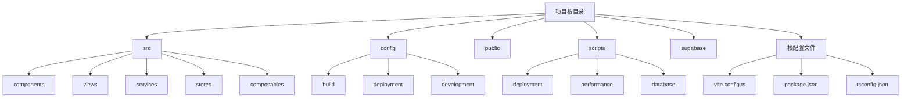
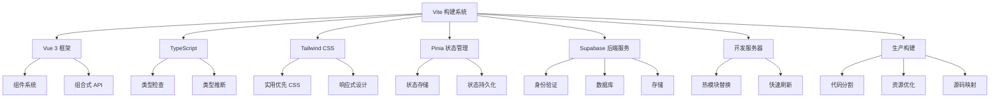
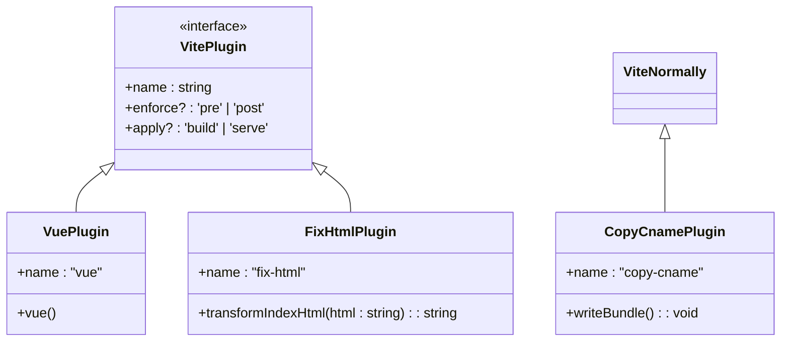
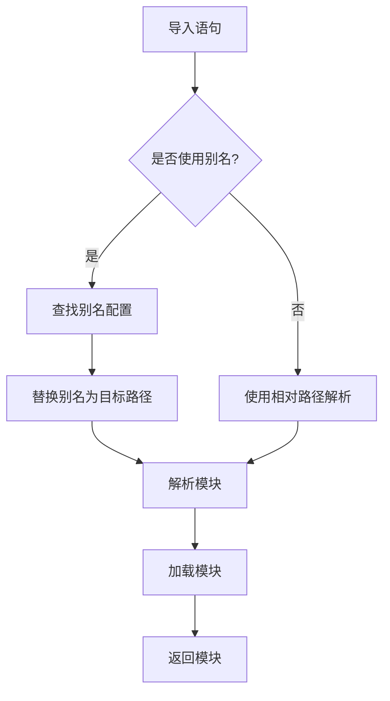
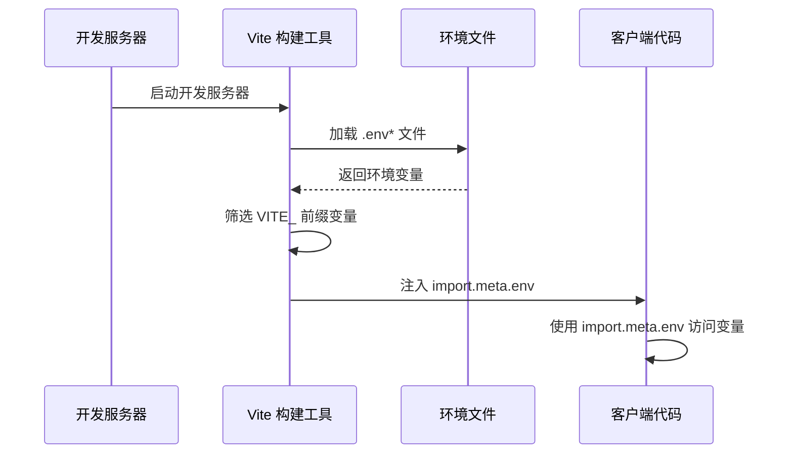
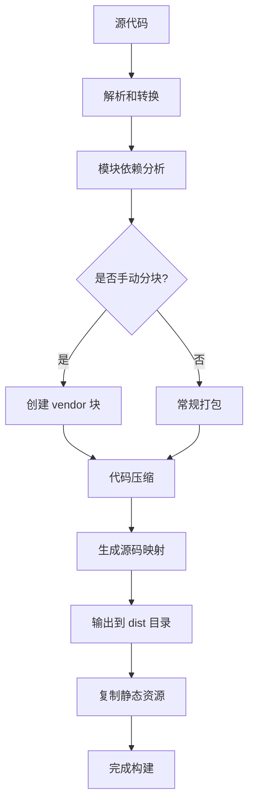
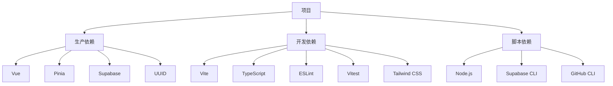

# Vite 配置

<cite>
**本文档引用的文件**   
- [vite.config.ts](file://vite.config.ts)
- [package.json](file://package.json)
- [package-lock.json](file://package-lock.json)
- [scripts/performance/optimize-build.mjs](file://scripts/performance/optimize-build.mjs)
- [scripts/deployment/diagnose-update-issues.js](file://scripts/deployment/diagnose-update-issues.js)
- [scripts/deployment/pre-deploy-check.mjs](file://scripts/deployment/pre-deploy-check.mjs)
- [tsconfig.json](file://tsconfig.json)
</cite>

## 目录
1. [简介](#简介)
2. [项目结构](#项目结构)
3. [核心组件](#核心组件)
4. [架构概述](#架构概述)
5. [详细组件分析](#详细组件分析)
6. [依赖分析](#依赖分析)
7. [性能考虑](#性能考虑)
8. [故障排除指南](#故障排除指南)
9. [结论](#结论)
10. [附录](#附录)（如有必要）

## 简介
本文档深入解析 `vite.config.ts` 的配置结构与功能实现，涵盖 Vite 插件系统集成、模块解析别名配置、环境变量加载机制、开发服务器中间件配置以及构建输出参数等关键方面。结合项目实际配置，详细阐述各项配置的作用机制，并提供常见问题解决方案和性能优化建议。

## 项目结构
项目采用典型的现代前端项目结构，主要分为以下几个部分：
- `src/`：源代码目录，包含组件、视图、服务、工具类等
- `config/`：配置文件目录，包含构建、部署、开发等各类配置
- `public/`：静态资源目录，包含 HTML 文件、图标、清单文件等
- `scripts/`：脚本目录，包含部署、性能优化、数据库操作等各类脚本
- `supabase/`：Supabase 相关配置和迁移文件
- 根目录包含各种配置文件如 `vite.config.ts`、`package.json`、`tsconfig.json` 等

**图示来源**
- [vite.config.ts](file://vite.config.ts)
- [package.json](file://package.json)

**本节来源**
- [vite.config.ts](file://vite.config.ts)
- [package.json](file://package.json)

## 核心组件
`vite.config.ts` 是项目的核心配置文件，定义了 Vite 构建工具的各个方面。它通过 `defineConfig` 函数导出配置对象，包含插件配置、解析别名、构建选项和服务器配置等关键部分。配置中集成了 Vue 插件，实现了自定义插件用于复制 CNAME 文件和修复 HTML，同时配置了模块解析别名以优化导入路径。

**本节来源**
- [vite.config.ts](file://vite.config.ts#L1-L101)

## 架构概述
项目采用 Vite 作为构建工具，Vue 3 作为前端框架，Pinia 作为状态管理，Supabase 作为后端服务。Vite 配置文件定义了开发和生产环境的构建流程，通过插件系统扩展功能，利用 TypeScript 提供类型安全，使用 Tailwind CSS 进行样式设计。整体架构支持热模块替换（HMR），提供快速的开发体验，并通过优化的构建配置生成高效的生产代码。

**图示来源**
- [vite.config.ts](file://vite.config.ts#L1-L101)
- [package.json](file://package.json#L1-L94)

## 详细组件分析
### Vite 插件系统集成分析
Vite 插件系统通过 `plugins` 数组配置，项目中集成了官方 Vue 插件和两个自定义插件。Vue 插件 `@vitejs/plugin-vue` 用于支持 Vue 单文件组件的解析和编译。自定义插件 `copy-cname` 在构建完成后将 `public/CNAME` 文件复制到 `dist/CNAME`，用于 GitHub Pages 自定义域名配置。另一个自定义插件 `fix-html` 修改 HTML 输出，在应用加载时显示加载状态，并添加错误处理脚本，提升用户体验。

#### 插件配置类图

**图示来源**
- [vite.config.ts](file://vite.config.ts#L5-L36)

**本节来源**
- [vite.config.ts](file://vite.config.ts#L5-L36)

### 模块解析别名配置分析
`resolve.alias` 配置通过路径别名优化模块导入路径，提高代码可读性和维护性。项目配置了四个别名：`@` 指向 `src` 目录，`@config` 指向 `config` 目录，`@scripts` 指向 `scripts` 目录，`@docs` 指向 `docs` 目录。这种配置使得导入语句更加简洁，避免了复杂的相对路径，如 `import Component from '@/components/Component.vue'` 而不是 `import Component from '../../../src/components/Component.vue'`。

#### 模块解析流程图

**图示来源**
- [vite.config.ts](file://vite.config.ts#L37-L45)

**本节来源**
- [vite.config.ts](file://vite.config.ts#L37-L45)

### 环境变量加载机制分析
项目通过 `import.meta.env` 访问环境变量，Vite 自动加载 `.env`、`.env.local`、`.env.production` 等文件中的变量。环境变量必须以 `VITE_` 开头才能在客户端代码中访问。项目中的 `VITE_SUPABASE_URL` 和 `VITE_SUPABASE_ANON_KEY` 等变量用于配置 Supabase 连接。不同构建环境（开发、生产）会加载不同的环境文件，实现配置分离。构建时，环境变量会被静态替换，不会暴露未标记为 `VITE_` 前缀的敏感信息。

#### 环境变量加载序列图

**图示来源**
- [vite.config.ts](file://vite.config.ts)
- [scripts/deployment/pre-deploy-check.mjs](file://scripts/deployment/pre-deploy-check.mjs#L144-L195)

**本节来源**
- [scripts/deployment/pre-deploy-check.mjs](file://scripts/deployment/pre-deploy-check.mjs#L144-L195)
- [scripts/deployment/diagnose-update-issues.js](file://scripts/deployment/diagnose-update-issues.js#L171-L218)

### 开发服务器配置分析
开发服务器通过 `server` 对象配置，项目中设置了 `host: "0.0.0.0"` 允许外部网络访问，`port: 5173` 指定端口号，`open: true` 在启动时自动打开浏览器。这些配置提高了开发便利性，特别是在团队协作或移动设备测试时。服务器配置还隐含支持 HTTPS、代理、CORS 等功能，可通过额外配置启用。

**本节来源**
- [vite.config.ts](file://vite.config.ts#L94-L99)

### 构建输出配置分析
构建输出通过 `build` 对象配置，定义了生产环境的构建行为。`outDir: "dist"` 指定输出目录，`assetsDir: "assets"` 指定静态资源子目录，`sourcemap: true` 生成源码映射文件便于调试。使用 `terser` 进行压缩，并配置了 `keep_fnames` 和 `keep_classnames` 选项以保留函数和类名，有利于错误追踪。`rollupOptions` 中的 `manualChunks` 配置将 Vue 和 Pinia 打包到单独的 `vendor` 块中，实现代码分割，优化加载性能。

#### 构建流程图

**图示来源**
- [vite.config.ts](file://vite.config.ts#L73-L92)

**本节来源**
- [vite.config.ts](file://vite.config.ts#L73-L92)

## 依赖分析
项目依赖关系复杂但组织良好，通过 `package.json` 管理。核心依赖包括 Vue 3、Pinia、Supabase JS 客户端等。开发依赖包括 Vite、TypeScript、ESLint、Vitest 等。`package-lock.json` 文件确保了依赖版本的一致性。项目还通过脚本管理复杂的依赖关系，如 `pre-deploy-check.mjs` 检查必需的依赖，`optimize-build.mjs` 优化构建过程。依赖分析显示项目遵循现代前端最佳实践，使用模块化设计，避免了不必要的依赖。

**图示来源**
- [package.json](file://package.json#L1-L94)
- [package-lock.json](file://package-lock.json)

**本节来源**
- [package.json](file://package.json#L1-L94)
- [package-lock.json](file://package-lock.json)

## 性能考虑
项目在性能方面做了多项优化。构建配置中启用了代码分割，将框架代码分离到 `vendor` 块，利用浏览器缓存。源码映射的生成有助于生产环境的错误调试。通过 `terser` 压缩代码，减小文件体积。项目还提供了 `build:optimize` 脚本，可执行进一步的性能优化。建议启用 Gzip 压缩、资源预加载等额外优化措施，进一步提升加载性能。`useLazyLoading` 组合式函数实现了数据和资源的预加载，优化用户体验。

**本节来源**
- [vite.config.ts](file://vite.config.ts#L73-L92)
- [scripts/performance/optimize-build.mjs](file://scripts/performance/optimize-build.mjs)
- [src/composables/useLazyLoading.ts](file://src/composables/useLazyLoading.ts#L201-L255)

## 故障排除指南
### HMR 失效问题
HMR（热模块替换）失效可能由多种原因引起。检查 `server.host` 配置是否正确，确保开发服务器正常运行。确认文件监听是否被防火墙或杀毒软件阻止。尝试清理 `.vite` 缓存目录。检查是否有语法错误导致 Vite 无法正确解析模块。

### 构建缓存问题
构建缓存问题可能导致旧代码被使用。使用 `diagnose-update-issues.js` 脚本检查缓存状态。建议在部署前执行 `npm run clean` 清理 `node_modules` 和 `dist` 目录。检查 `node_modules` 目录的修改时间，如果过久未更新，应重新安装依赖。

### 第三方库解析错误
第三方库解析错误通常由版本冲突或类型定义缺失引起。检查 `package-lock.json` 确保依赖版本一致。为缺少类型的库安装相应的 `@types` 包。在 `tsconfig.json` 中配置路径映射，解决模块解析问题。

### 环境变量配置问题
环境变量配置问题可能导致连接失败。使用 `pre-deploy-check.mjs` 脚本验证必需的环境变量是否存在。检查 `.env` 文件格式是否正确，变量是否以 `VITE_` 开头。确认部署平台（如 Netlify）的环境变量配置与本地一致。

**本节来源**
- [scripts/deployment/diagnose-update-issues.js](file://scripts/deployment/diagnose-update-issues.js#L212-L265)
- [scripts/deployment/pre-deploy-check.mjs](file://scripts/deployment/pre-deploy-check.mjs)
- [scripts/deployment/check-netlify-config.js](file://scripts/deployment/check-netlify-config.js)

## 结论
`vite.config.ts` 配置文件充分体现了现代前端项目的最佳实践。通过合理的插件集成、路径别名配置、环境变量管理和构建优化，实现了高效的开发体验和优质的生产输出。项目结构清晰，依赖管理规范，性能优化到位。建议持续关注 Vite 和相关工具的更新，及时升级依赖，保持项目技术栈的先进性。同时，完善文档和自动化脚本，提高团队协作效率。

## 附录
### 常用脚本参考
- `npm run dev`：启动开发服务器
- `npm run build`：生产环境构建
- `npm run preview`：预览生产构建
- `npm run lint`：代码格式化和检查
- `npm run type-check`：TypeScript 类型检查
- `npm run test`：运行单元测试
- `npm run build:optimize`：执行构建优化
- `npm run pre-deploy`：部署前检查

### 环境变量清单
- `VITE_SUPABASE_URL`：Supabase 项目 API URL
- `VITE_SUPABASE_ANON_KEY`：Supabase 匿名密钥
- `VITE_APP_NAME`：应用名称
- `VITE_APP_URL`：应用 URL