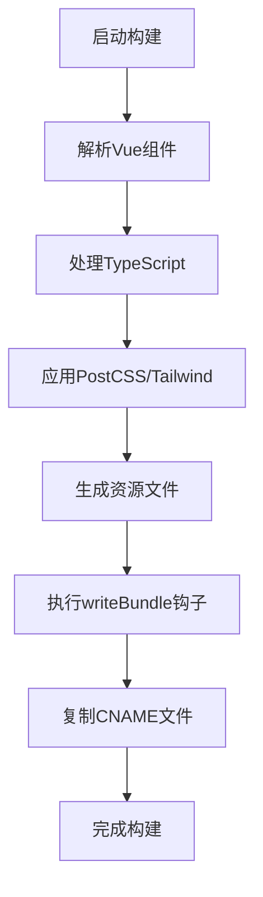
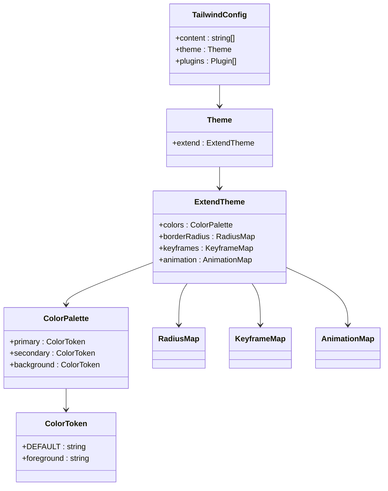

# 构建配置

<cite>
**本文档中引用的文件**  
- [vite.config.ts](file://vite.config.ts)
- [tsconfig.json](file://tsconfig.json)
- [tsconfig.app.json](file://advanced-tools-navigation/tsconfig.app.json)
- [tsconfig.node.json](file://tsconfig.node.json)
- [postcss.config.mjs](file://config/build/postcss.config.mjs)
- [tailwind.config.ts](file://config/build/tailwind.config.ts)
- [package.json](file://package.json)
</cite>

## 目录
1. [介绍](#介绍)
2. [Vite 构建配置详解](#vite-构建配置详解)
3. [TypeScript 编译配置分析](#typescript-编译配置分析)
4. [PostCSS 与 Tailwind CSS 集成机制](#postcss-与-tailwind-css-集成机制)
5. [构建命令与多环境行为](#构建命令与多环境行为)
6. [常见构建问题排查与优化](#常见构建问题排查与优化)
7. [结论](#结论)

## 介绍
本项目采用现代化前端构建体系，基于 Vite + Vue 3 + TypeScript 技术栈，结合 Tailwind CSS 实现高效开发与优化构建。构建配置体系涵盖模块解析、类型检查、CSS 处理、资源打包等多个层面，确保开发体验与生产性能的平衡。本文将深入解析核心构建配置文件的作用机制及其对项目的影响。

## Vite 构建配置详解

`vite.config.ts` 是项目的构建核心配置文件，定义了开发服务器、插件集成、路径别名、打包输出等关键行为。

### 插件系统与自定义逻辑
配置中集成了 `@vitejs/plugin-vue` 以支持 Vue 单文件组件解析。此外，通过自定义插件实现了两个关键功能：
1. **CNAME 文件复制**：在构建完成后自动将 `public/CNAME` 复制到 `dist/CNAME`，便于 GitHub Pages 自定义域名部署。
2. **HTML 增强处理**：注入加载状态提示和错误捕获脚本，提升用户体验与调试能力。



**Diagram sources**
- [vite.config.ts](file://vite.config.ts#L1-L101)

### 路径别名配置
通过 `resolve.alias` 定义了多个路径别名，提升模块导入可读性与维护性：
- `@` → `src/`
- `@config` → `config/`
- `@scripts` → `scripts/`
- `@docs` → `docs/`

这些别名在代码中广泛使用，如 `import api from '@/services/api'`，避免了深层相对路径引用。

**Section sources**
- [vite.config.ts](file://vite.config.ts#L1-L101)

### 构建输出与优化
构建配置指定了输出目录为 `dist`，资源子目录为 `assets`，并启用 sourcemap 便于调试。使用 Terser 进行压缩时保留类名和函数名，有助于错误追踪。通过 `manualChunks` 将 Vue 和 Pinia 提取为独立的 `vendor` 包，实现长效缓存。

**Section sources**
- [vite.config.ts](file://vite.config.ts#L60-L85)

### 开发服务器设置
开发服务器监听所有网络接口（`0.0.0.0`），端口为 `5173`，并在启动时自动打开浏览器页面，提升本地开发效率。

**Section sources**
- [vite.config.ts](file://vite.config.ts#L90-L95)

## TypeScript 编译配置分析

项目包含多个 `tsconfig.json` 文件，形成分层的类型检查体系。

### 根级 tsconfig.json
该文件为项目主配置，设置如下关键选项：
- **目标与模块**：编译目标为 `ESNext`，模块系统为 `ESNext`，适配现代浏览器与 Vite 的原生 ES 模块支持。
- **模块解析**：使用 `Node` 模式，支持 `paths` 别名映射。
- **路径映射**：与 Vite 配置一致，定义 `@/*` 等别名，确保编辑器与构建工具的一致性。
- **包含与排除**：包含源码、环境声明及 Vite 配置文件，排除测试文件夹。

**Section sources**
- [tsconfig.json](file://tsconfig.json#L1-L29)

### tsconfig.app.json
此配置继承自 `@vue/tsconfig/tsconfig.dom.json`，专用于应用代码，启用严格类型检查：
- 启用 `strict` 模式，开启全面类型安全。
- 启用 `noUnusedLocals` 和 `noUnusedParameters`，防止未使用变量。
- 启用 `noFallthroughCasesInSwitch`，避免 switch 语句遗漏 break。

该配置确保应用代码的高质量与可维护性。

**Section sources**
- [tsconfig.app.json](file://advanced-tools-navigation/tsconfig.app.json#L1-L16)

### tsconfig.node.json
专用于 Node.js 环境下的配置文件（如 `vite.config.ts`），设置 `composite: true` 以支持项目引用，并允许合成默认导入。

**Section sources**
- [tsconfig.node.json](file://tsconfig.node.json#L1-L11)

## PostCSS 与 Tailwind CSS 集成机制

### postcss.config.mjs
该配置文件简单地启用 `tailwindcss` 插件，由 PostCSS 在构建时调用 Tailwind 的处理流程。Vite 内置 PostCSS 支持，自动读取此配置。

**Section sources**
- [postcss.config.mjs](file://config/build/postcss.config.mjs#L1-L8)

### tailwind.config.ts
Tailwind 配置文件定义了设计系统的完整规范。

#### 内容扫描路径
```ts
content: ["./index.html", "./src/**/*.{vue,js,ts,jsx,tsx}"]
```
确保所有模板文件中的类名被正确扫描并生成对应的 CSS 规则，避免未使用的类被 PurgeCSS 删除。

#### 主题扩展
配置通过 `extend` 扩展默认主题，使用 CSS 变量实现动态主题切换：
- 颜色系统基于 `hsl(var(--color))` 模式，支持运行时主题变更。
- 圆角、动画、图表颜色等均通过变量控制，保持 UI 一致性。

#### 动画与交互
定义 `accordion-down/up` 关键帧动画，并注册为实用类 `animation-accordion-down`，用于手风琴组件的展开收起效果。



**Diagram sources**
- [tailwind.config.ts](file://config/build/tailwind.config.ts#L1-L89)

## 构建命令与多环境行为

`package.json` 中定义了完整的构建命令链：

| 命令 | 作用 | 使用场景 |
|------|------|----------|
| `dev` | 启动 Vite 开发服务器 | 本地开发 |
| `build` | 执行生产构建 | 部署前打包 |
| `preview` | 预览生产构建结果 | 构建后验证 |
| `type-check` | 类型检查 | CI/CD 或提交前验证 |
| `lint` | 代码格式化与 ESLint 修复 | 代码质量保障 |
| `analyze` | 构建产物分析 | 体积优化 |

构建行为在不同环境下保持一致，因未使用环境变量区分配置。但可通过 `--mode` 参数结合 `import.meta.env.MODE` 实现多环境配置扩展。

**Section sources**
- [package.json](file://package.json#L5-L20)

## 常见构建问题排查与优化

### 样式未生效
**可能原因**：
1. Tailwind 类名未被扫描到 → 检查 `tailwind.config.ts` 中 `content` 路径是否覆盖所有文件。
2. CSS 变量未定义 → 确保 `:root` 或组件中定义了对应的 `--primary` 等变量。

**优化建议**：
- 使用 `@apply` 提取重复样式到 CSS 类。
- 启用 `tailwindcss/nesting` 插件支持嵌套语法。

### 类型报错
**可能原因**：
1. `tsconfig.app.json` 严格模式报错 → 修正类型定义或临时禁用特定规则。
2. `.vue` 文件类型缺失 → 确保 `src/vite-env.d.ts` 正确声明。

**优化建议**：
- 使用 `// @ts-ignore` 临时忽略已知问题（不推荐长期使用）。
- 通过 `vue-tsc --noEmit` 在 CI 中进行类型检查。

### 打包体积过大
**分析方法**：
```bash
npm run analyze
```
使用 `vite-bundle-analyzer` 可视化依赖体积。

**优化方案**：
1. **代码分割**：已通过 `manualChunks` 分离 vendor 包。
2. **懒加载**：路由组件使用 `defineAsyncComponent` 或动态 `import()`。
3. **Tree Shaking**：确保使用 ES 模块语法，避免全量导入。
4. **依赖优化**：检查是否有重复依赖或可替代的轻量库。

**Section sources**
- [vite.config.ts](file://vite.config.ts#L75-L85)
- [package.json](file://package.json#L50-L52)

## 结论
本项目的构建配置体系结构清晰、职责分明，通过 Vite 实现高速开发与高效构建，TypeScript 提供强类型保障，Tailwind CSS 支持原子化设计与主题定制。各配置文件协同工作，形成了现代化前端工程化的最佳实践。建议持续关注构建产物体积，优化懒加载策略，并考虑引入环境变量实现多环境差异化构建。