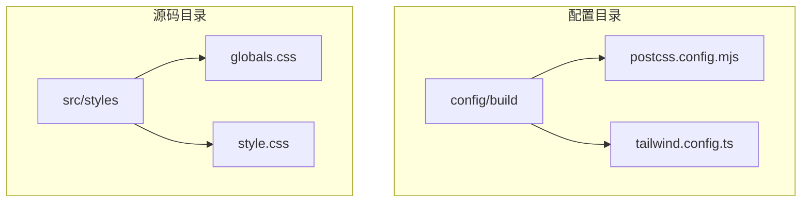

# 样式构建配置

<cite>
**本文档引用的文件**
- [postcss.config.mjs](file://config/build/postcss.config.mjs)
- [tailwind.config.ts](file://config/build/tailwind.config.ts)
- [globals.css](file://src/styles/globals.css)
- [style.css](file://src/style.css)
</cite>

## 目录
1. [项目结构](#项目结构)
2. [PostCSS插件链配置](#postcss插件链配置)
3. [Tailwind核心配置解析](#tailwind核心配置解析)
4. [全局样式文件分析](#全局样式文件分析)
5. [JIT模式与按需生成](#jit模式与按需生成)
6. [原子化CSS应用示例](#原子化css应用示例)
7. [常见问题诊断与解决](#常见问题诊断与解决)

## 项目结构

项目采用模块化结构，样式相关配置集中于`config/build`目录，全局样式文件位于`src/styles`目录。构建工具链通过PostCSS集成TailwindCSS，实现现代化的CSS开发流程。



**图示来源**
- [postcss.config.mjs](file://config/build/postcss.config.mjs)
- [tailwind.config.ts](file://config/build/tailwind.config.ts)
- [globals.css](file://src/styles/globals.css)

**本节来源**
- [config/build/postcss.config.mjs](file://config/build/postcss.config.mjs)
- [config/build/tailwind.config.ts](file://config/build/tailwind.config.ts)
- [src/styles/globals.css](file://src/styles/globals.css)

## PostCSS插件链配置

PostCSS配置文件`postcss.config.mjs`定义了构建过程中的CSS处理插件链。当前配置仅包含TailwindCSS插件，确保样式处理的高效性和专注性。

配置中未显式引入autoprefixer，因为TailwindCSS已内置自动前缀功能，避免了重复配置和潜在冲突。这种精简的插件链设计符合现代前端构建的最佳实践。

```javascript
/** @type {import('postcss-load-config').Config} */
const config = {
  plugins: {
    tailwindcss: {},
  },
};

export default config;
```

**本节来源**
- [postcss.config.mjs](file://config/build/postcss.config.mjs)

## Tailwind核心配置解析

`tailwind.config.ts`文件是TailwindCSS的核心配置，定义了设计系统的所有关键参数。配置采用TypeScript编写，提供类型安全和开发体验优化。

### 内容扫描路径

```typescript
content: ["./index.html", "./src/**/*.{vue,js,ts,jsx,tsx}"]
```

内容扫描路径配置确保Tailwind能够识别所有源文件中的类名使用情况，包括SFC（单文件组件）中的模板部分。通配符模式`**/*`覆盖了所有子目录，`.vue`扩展名的包含保证了Vue组件的类名能被正确提取。

### 主题扩展配置

主题配置通过CSS自定义属性（CSS Variables）实现动态主题切换，所有颜色值均基于`hsl(var(--variable))`格式：

- **颜色系统**：定义了background、foreground、primary、secondary等语义化颜色
- **圆角系统**：通过`borderRadius`配置统一的圆角尺寸
- **动画系统**：包含手风琴展开/收起等预设动画

这种基于CSS变量的设计模式支持运行时主题切换，无需重新构建CSS文件。

### 插件系统

当前配置未使用自定义插件，保持了配置的简洁性。插件数组为空，可根据项目需求随时扩展功能。

**本节来源**
- [tailwind.config.ts](file://config/build/tailwind.config.ts)

## 全局样式文件分析

`globals.css`作为全局样式入口，遵循Tailwind推荐的三层架构：base、components、utilities。

### Tailwind指令引入

```css
@tailwind base;
@tailwind components;
@tailwind utilities;
```

这三条指令按推荐顺序引入Tailwind的三个核心层：
1. **base层**：重置浏览器默认样式，设置基础样式
2. **components层**：存放组件级样式
3. **utilities层**：包含所有原子化工具类

### 自定义扩展

通过`@layer`指令在相应层级添加自定义样式：

```css
@layer utilities {
  .text-balance {
    text-wrap: balance;
  }
}
```

此扩展添加了文本平衡功能，增强排版效果。同时，在base层定义了完整的CSS变量系统，支持深色/浅色主题切换。

**本节来源**
- [globals.css](file://src/styles/globals.css)

## JIT模式与按需生成

项目采用Tailwind的JIT（Just-In-Time）模式，该模式在开发和构建时动态生成所需的CSS规则。与传统的全量生成相比，JIT模式具有以下优势：

- **按需生成**：仅生成实际使用的类名对应的CSS规则
- **快速构建**：显著减少构建时间，提升开发体验
- **支持任意值**：可通过方括号语法使用任意值，如`w-[250px]`
- **动态变体**：支持响应式设计、悬停状态等动态变体的即时生成

JIT模式与内容扫描配置协同工作，确保最终CSS文件的最小化和高效性。

**本节来源**
- [tailwind.config.ts](file://config/build/tailwind.config.ts)
- [globals.css](file://src/styles/globals.css)

## 原子化CSS应用示例

在Vue组件中，原子化CSS通过类名直接应用样式。例如：

```vue
<template>
  <div class="bg-background text-foreground p-4 rounded-lg">
    <h1 class="text-2xl font-bold mb-2">标题</h1>
    <p class="text-muted-foreground">这是一个示例段落。</p>
  </div>
</template>
```

这种模式将样式与结构紧密结合，提高开发效率，同时保证样式的可维护性和一致性。所有类名均来自Tailwind配置，确保设计系统的一致性。

**本节来源**
- [globals.css](file://src/styles/globals.css)

## 常见问题诊断与解决

### 样式未生效

**可能原因**：
- 类名拼写错误
- 内容扫描路径未覆盖相关文件
- CSS优先级问题

**解决方案**：
检查`tailwind.config.ts`中的content配置是否包含文件路径，确认类名拼写正确。

### 类名被清除

**可能原因**：
- PurgeCSS/Tailwind的tree-shaking误判类名为未使用
- 动态拼接的类名未被扫描到

**解决方案**：
在content配置中确保路径正确，对于动态类名，可使用`safe-list`或调整扫描模式。

### 响应式断点异常

**可能原因**：
- 自定义断点配置错误
- 媒体查询冲突

**解决方案**：
检查`theme.extend.screens`配置，确保断点值合理且无冲突。

**本节来源**
- [tailwind.config.ts](file://config/build/tailwind.config.ts)
- [globals.css](file://src/styles/globals.css)