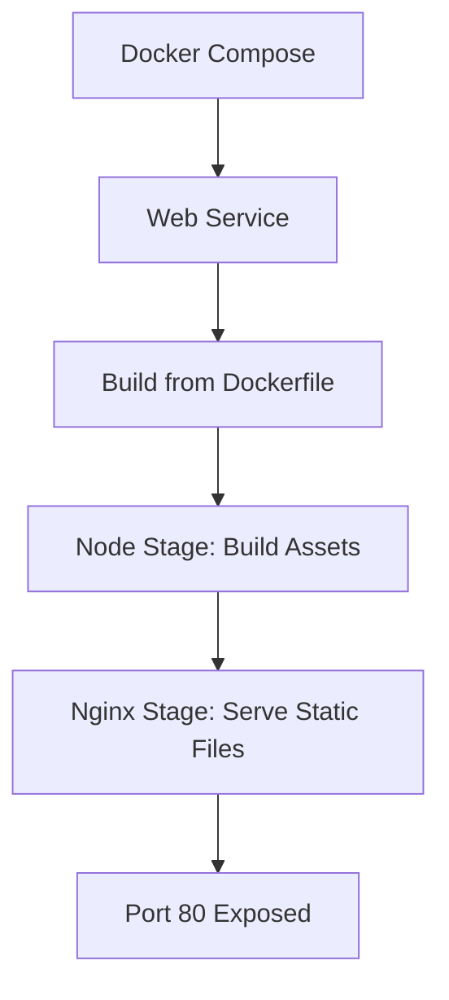
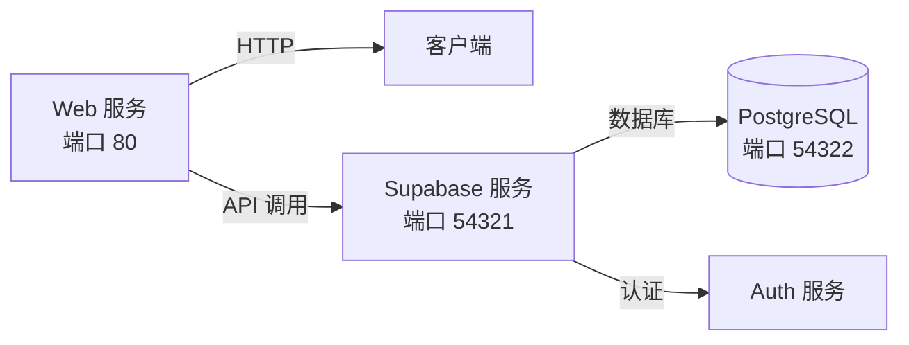

# Docker Compose编排

<cite>
**本文档引用文件**  
- [docker-compose.yml](file://config/deployment/docker-compose.yml)
- [Dockerfile](file://config/deployment/Dockerfile)
- [supabase/config.toml](file://supabase/config.toml)
- [setup-supabase.sh](file://scripts/deployment/setup-supabase.sh)
- [.env.local](file://.env.local)
</cite>

## 目录
1. [简介](#简介)
2. [项目结构](#项目结构)
3. [核心服务配置](#核心服务配置)
4. [环境变量管理机制](#环境变量管理机制)
5. [网络配置与服务通信](#网络配置与服务通信)
6. [开发与生产环境差异](#开发与生产环境差异)
7. [典型问题排查指南](#典型问题排查指南)
8. [结论](#结论)

## 简介
本文档深入解析 `docker-compose.yml` 文件中定义的服务编排逻辑，涵盖前端应用、Supabase数据库等服务的声明式配置。详细说明各服务的镜像来源、端口映射规则、卷挂载策略及启动依赖顺序。同时阐述环境变量管理机制、网络配置策略，并提供常见问题的排查方法。

## 项目结构
本项目采用模块化结构，主要包含前端源码、Supabase数据库配置、部署脚本和Docker相关配置文件。关键目录包括：
- `src/`：前端应用源码
- `supabase/`：Supabase数据库配置与迁移脚本
- `config/deployment/`：Docker部署配置（Dockerfile、docker-compose.yml）
- `scripts/deployment/`：自动化部署与配置脚本

**Section sources**
- [docker-compose.yml](file://config/deployment/docker-compose.yml)
- [Dockerfile](file://config/deployment/Dockerfile)

## 核心服务配置

### Web服务定义
`docker-compose.yml` 中定义了名为 `web` 的前端服务，其核心配置如下：
- **镜像构建方式**：基于当前目录的 Dockerfile 构建（`build: .`）
- **容器名称**：`advanced-tools-navigation`
- **端口映射**：主机80端口映射到容器80端口（`"80:80"`）
- **重启策略**：除非手动停止，否则自动重启（`restart: unless-stopped`）
- **环境变量**：设置 `NODE_ENV=production`

该服务使用多阶段构建的 Dockerfile，先使用 Node 镜像构建前端资源，再通过 Nginx 镜像提供静态文件服务。



**Diagram sources**
- [docker-compose.yml](file://config/deployment/docker-compose.yml#L3-L14)
- [Dockerfile](file://config/deployment/Dockerfile#L1-L13)

**Section sources**
- [docker-compose.yml](file://config/deployment/docker-compose.yml#L3-L14)
- [Dockerfile](file://config/deployment/Dockerfile#L1-L13)

## 环境变量管理机制

### 环境变量注入方式
当前 `docker-compose.yml` 仅通过 `environment` 字段直接注入 `NODE_ENV=production`。更完整的环境变量管理通过以下方式实现：

1. **本地开发环境**：使用 `.env.local` 文件加载环境变量
2. **Supabase集成**：通过 `supabase/config.toml` 配置认证和API参数
3. **自动化脚本**：`setup-supabase.sh` 脚本引导用户输入 Supabase 项目引用和数据库密码，并生成本地环境配置

### 关键环境变量
根据 `setup-supabase.sh` 和 `supabase/config.toml`，关键环境变量包括：
- `VITE_SUPABASE_URL`：Supabase 项目 API 地址
- `VITE_SUPABASE_ANON_KEY`：匿名访问密钥
- `SUPABASE_PROJECT_REF`：项目引用ID
- `GITHUB_CLIENT_ID` / `GOOGLE_CLIENT_ID`：第三方登录凭证

这些变量在 `supabase/config.toml` 中以 `env()` 形式引用，确保运行时从环境加载。

**Section sources**
- [docker-compose.yml](file://config/deployment/docker-compose.yml#L9-L10)
- [supabase/config.toml](file://supabase/config.toml#L25-L28)
- [setup-supabase.sh](file://scripts/deployment/setup-supabase.sh#L50-L60)

## 网络配置与服务通信

### 默认网络设置
`docker-compose.yml` 显式定义了默认网络驱动为 `bridge`：
```yaml
networks:
  default:
    driver: bridge
```

此配置创建一个自定义 bridge 网络，使所有服务在同一个内部网络中通信，提供隔离性和安全性。

### 服务间通信策略
虽然当前配置仅包含单一服务，但通过 Supabase CLI 脚本可知，完整架构包含：
- 前端应用（web）
- Supabase 数据库（PostgreSQL）
- Supabase Auth & Realtime 服务

这些服务通过 Docker 内部网络通信，前端通过 `VITE_SUPABASE_URL` 指向 Supabase 服务的 API 端点（默认54321端口）。



**Diagram sources**
- [docker-compose.yml](file://config/deployment/docker-compose.yml#L12-L14)
- [supabase/config.toml](file://supabase/config.toml#L2-L4)

**Section sources**
- [docker-compose.yml](file://config/deployment/docker-compose.yml#L12-L14)
- [supabase/config.toml](file://supabase/config.toml#L2-L4)

## 开发与生产环境差异

### 生产环境配置
- 使用 `nginx:alpine` 镜像提供静态资源服务
- 设置 `NODE_ENV=production` 优化构建输出
- 重启策略为 `unless-stopped`，确保高可用性
- 无卷挂载，所有资源内置于镜像中

### 开发环境特点
- 通常使用 `vite` 开发服务器（`npm run dev`）
- 依赖 `.env.local` 文件配置本地 Supabase 连接
- 可能启用热重载和调试工具
- 使用 `supabase start` 启动本地 Supabase 实例

通过 `setup-supabase.sh` 脚本可看出，开发环境强调交互式配置和本地调试便利性，而生产环境强调稳定性和性能。

**Section sources**
- [Dockerfile](file://config/deployment/Dockerfile#L1-L13)
- [setup-supabase.sh](file://scripts/deployment/setup-supabase.sh#L1-L125)
- [supabase/config.toml](file://supabase/config.toml#L1-L128)

## 典型问题排查指南

### 容器启动失败
**可能原因**：
- Dockerfile 构建失败（依赖下载失败）
- 端口80被占用
- 缺少必要的环境变量

**解决方案**：
1. 检查构建日志：`docker-compose build`
2. 查看容器日志：`docker logs advanced-tools-navigation`
3. 确保80端口空闲或修改映射端口

### 数据库连接超时
**可能原因**：
- Supabase 服务未启动或URL错误
- 网络策略阻止连接
- 认证密钥无效

**解决方案**：
1. 验证 `.env.local` 中的 `VITE_SUPABASE_URL` 和 `VITE_SUPABASE_ANON_KEY`
2. 使用 `test-supabase-connection.js` 脚本测试连接
3. 检查 Supabase Dashboard 项目状态

### 数据卷持久化异常
**当前配置分析**：
当前 `docker-compose.yml` 未定义任何数据卷（volumes），因此不涉及持久化问题。若未来引入数据库服务，需添加卷挂载。

**建议配置**：
```yaml
volumes:
  db_data:
    driver: local
```

### 环境变量未生效
**排查步骤**：
1. 确认 `.env.local` 文件存在且格式正确
2. 检查 `supabase/config.toml` 中的 `env()` 引用是否匹配环境变量名
3. 重启容器使环境变量生效

**Section sources**
- [docker-compose.yml](file://config/deployment/docker-compose.yml)
- [setup-supabase.sh](file://scripts/deployment/setup-supabase.sh)
- [test-supabase-connection.js](file://scripts/database/test-supabase-connection.js)
- [.env.local](file://.env.local)

## 结论
当前 `docker-compose.yml` 配置简洁，专注于前端应用的生产部署。通过与 Supabase 相关脚本和配置文件协同工作，实现了前后端分离的现代化部署架构。建议未来扩展 compose 文件以包含 Supabase 服务，实现完整的本地开发环境一键启动。