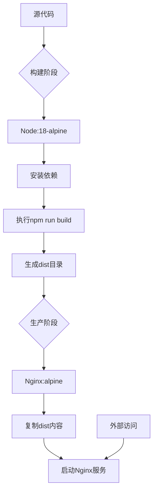
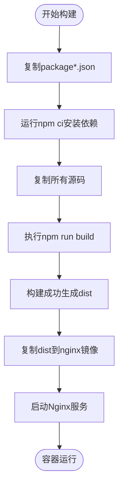
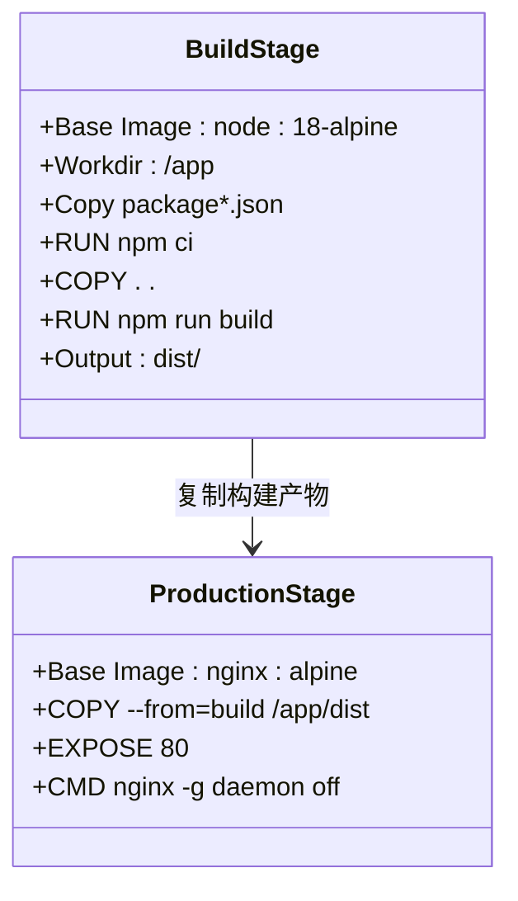

# Docker配置

<cite>
**本文档引用的文件**
- [Dockerfile](file://config/deployment/Dockerfile)
- [docker-compose.yml](file://config/deployment/docker-compose.yml)
- [package.json](file://package.json)
- [vite.config.ts](file://vite.config.ts)
- [nginx.conf](file://config/deployment/nginx.conf)
</cite>

## 目录
1. [简介](#简介)
2. [项目结构](#项目结构)
3. [核心组件](#核心组件)
4. [架构概述](#架构概述)
5. [详细组件分析](#详细组件分析)
6. [依赖分析](#依赖分析)
7. [性能考虑](#性能考虑)
8. [故障排除指南](#故障排除指南)
9. [结论](#结论)

## 简介
本文档详细解析了项目中Docker多阶段构建流程的设计与实现，重点阐述开发与生产环境的分离策略、镜像轻量化措施及安全实践。通过分析Dockerfile配置、构建流程优化和部署实践，为项目容器化提供完整的技术说明。

## 项目结构
本项目采用模块化设计，将配置文件集中于`config/deployment`目录下，包含Docker相关配置。源代码位于`src`目录，静态资源存放在`public`目录，构建输出目标为`dist`目录。这种清晰的结构有利于多阶段构建过程中资源的精准复制与隔离。

**Section sources**
- [Dockerfile](file://config/deployment/Dockerfile#L1-L13)

## 核心组件

Docker多阶段构建分为两个主要阶段：构建阶段使用`node:18-alpine`镜像进行依赖安装和静态资源构建，生产阶段采用`nginx:alpine`作为最小化运行时环境。通过`COPY --from=build`指令仅将构建产物`dist`目录复制到最终镜像，显著减小了镜像体积。

**Section sources**
- [Dockerfile](file://config/deployment/Dockerfile#L1-L13)
- [package.json](file://package.json#L1-L93)

## 架构概述



**Diagram sources**
- [Dockerfile](file://config/deployment/Dockerfile#L1-L13)

## 详细组件分析

### 多阶段构建流程分析
Dockerfile采用多阶段构建策略，第一阶段基于`node:18-alpine`镜像，设置工作目录为`/app`，先复制`package*.json`文件以利用Docker层缓存机制优化依赖安装效率。使用`npm ci`命令确保依赖安装的可重复性与一致性。



**Diagram sources**
- [Dockerfile](file://config/deployment/Dockerfile#L1-L13)
- [package.json](file://package.json#L1-L93)
- [vite.config.ts](file://vite.config.ts#L1-L101)

**Section sources**
- [Dockerfile](file://config/deployment/Dockerfile#L1-L13)

### 基础镜像选择分析
选择`node:18-alpine`作为构建基础镜像是基于其轻量化特性和版本稳定性。Alpine Linux提供了极小的基础系统，显著减小了镜像体积。Node.js 18是长期支持版本，确保了构建环境的稳定性与安全性。

**Section sources**
- [Dockerfile](file://config/deployment/Dockerfile#L2-L2)

### 依赖缓存优化分析
通过先复制`package-lock.json`再运行`npm ci`的策略，充分利用Docker构建缓存机制。当`package*.json`文件未发生变化时，Docker可直接使用缓存的依赖安装层，大幅提升重复构建效率。

**Section sources**
- [Dockerfile](file://config/deployment/Dockerfile#L4-L5)

### Vite构建流程分析
构建过程执行`npm run build`命令，该命令在`package.json`中定义为`vite build`。Vite配置文件`vite.config.ts`中指定了输出目录为`dist`，并包含代码分割、压缩等优化配置，确保生成高效的生产环境资源。

**Section sources**
- [package.json](file://package.json#L1-L93)
- [vite.config.ts](file://vite.config.ts#L1-L101)

### 最终镜像轻量化分析
生产阶段使用`nginx:alpine`作为基础镜像，仅复制构建生成的`dist`目录内容到Nginx默认HTML目录。这种方式避免了将Node.js运行时和开发依赖打包进最终镜像，实现了镜像的极致轻量化。



**Diagram sources**
- [Dockerfile](file://config/deployment/Dockerfile#L1-L13)

**Section sources**
- [Dockerfile](file://config/deployment/Dockerfile#L8-L13)

## 依赖分析

项目依赖管理通过`package-lock.json`文件锁定版本，确保构建一致性。Docker构建过程中使用`npm ci`而非`npm install`，以保证依赖安装的可重复性。生产环境仅需静态资源，无需任何Node.js依赖。

```mermaid
dependencyDiagram
package-lock.json --> npm ci
npm ci --> node_modules
node_modules --> vite build
vite build --> dist
dist --> nginx serving
```

**Diagram sources**
- [package.json](file://package.json#L1-L93)
- [Dockerfile](file://config/deployment/Dockerfile#L5-L6)

**Section sources**
- [package.json](file://package.json#L1-L93)

## 性能考虑
多阶段构建结合`.dockerignore`文件（虽未在项目中显式定义，但建议添加）可进一步提升构建效率。通过合理配置Nginx缓存策略（如`nginx.conf`中定义的静态资源一年缓存、HTML文件不缓存），显著提升前端性能。

**Section sources**
- [nginx.conf](file://config/deployment/nginx.conf#L46-L84)

## 故障排除指南
常见构建失败包括依赖下载超时和权限错误。解决方案包括：配置npm镜像源、增加超时重试机制、确保非root用户运行容器。通过`docker-compose.yml`中的环境变量注入`NODE_ENV=production`，确保应用在生产模式下运行。

**Section sources**
- [docker-compose.yml](file://config/deployment/docker-compose.yml#L1-L15)
- [package.json](file://package.json#L1-L93)

## 结论
本项目的Docker配置采用了最佳实践的多阶段构建策略，实现了开发与生产环境的完全分离。通过精心选择基础镜像、优化依赖安装流程、实施镜像轻量化措施，构建了高效、安全、轻量的容器化部署方案。建议补充`.dockerignore`文件以进一步优化构建过程。