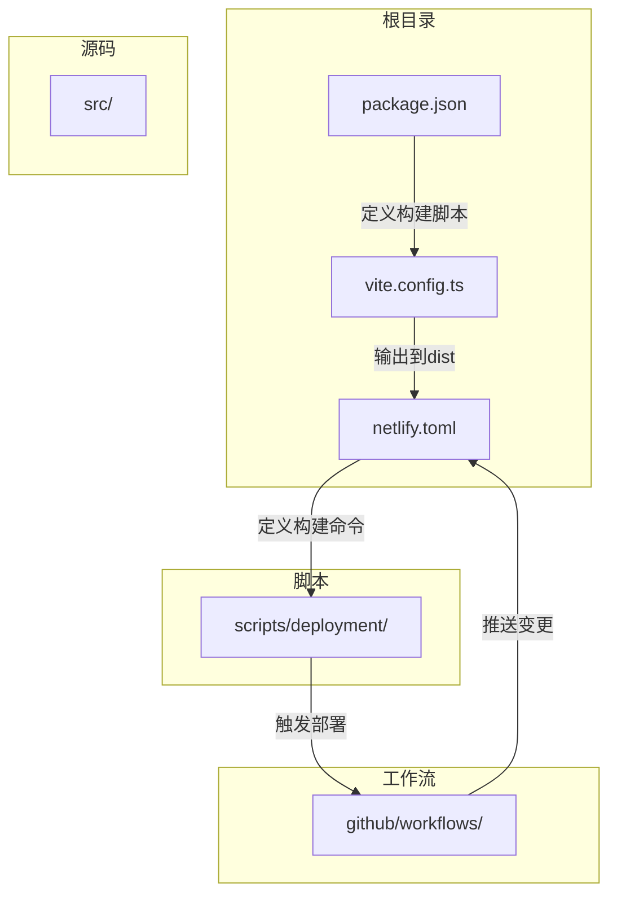
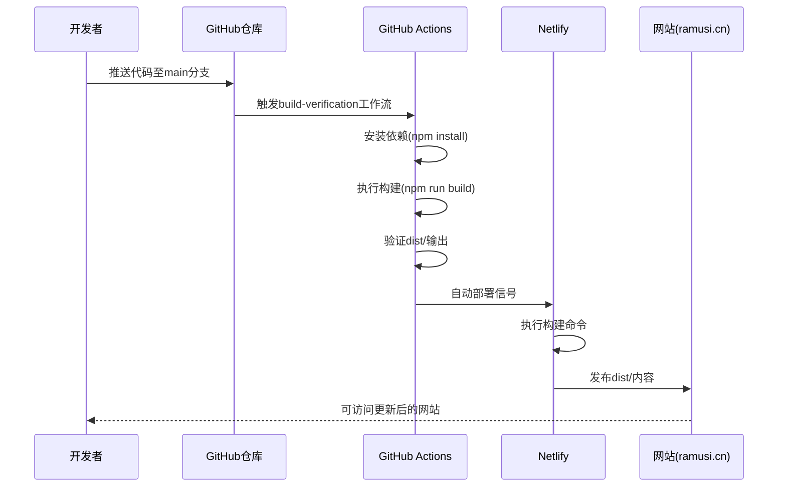
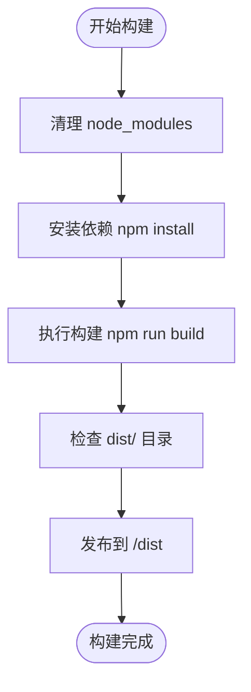
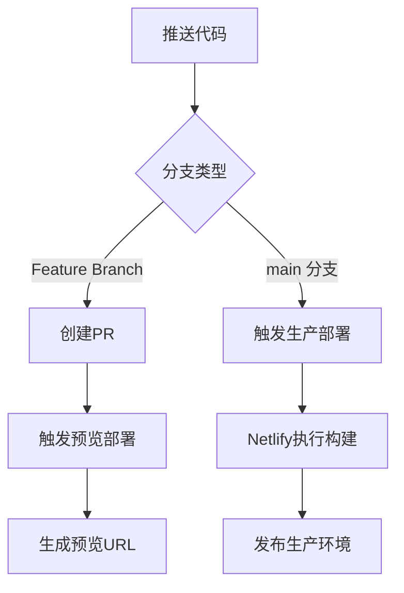
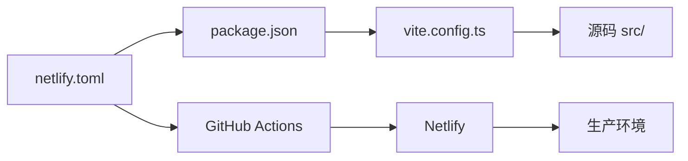

# Netlify部署配置

<cite>
**本文档中引用的文件**  
- [netlify.toml](file://netlify.toml)
- [package.json](file://package.json)
- [vite.config.ts](file://vite.config.ts)
- [build-verification.yml](file://advanced-tools-navigation/github/workflows/build-verification.yml)
- [check-netlify-config.js](file://scripts/deployment/check-netlify-config.js)
- [monitor-deployment.js](file://scripts/deployment/monitor-deployment.js)
- [trigger-deployment.js](file://scripts/deployment/trigger-deployment.js)
- [fix-netlify-root-directory.mjs](file://scripts/deployment/fix-netlify-root-directory.mjs)
</cite>

## 目录
1. [简介](#简介)
2. [项目结构](#项目结构)
3. [核心组件](#核心组件)
4. [架构概述](#架构概述)
5. [详细组件分析](#详细组件分析)
6. [依赖分析](#依赖分析)
7. [性能考虑](#性能考虑)
8. [故障排除指南](#故障排除指南)
9. [结论](#结论)

## 简介
本文档全面解析 `netlify.toml` 文件在自动化部署中的角色与配置项，涵盖构建设置、重定向规则、安全头配置、Serverless函数支持以及与GitHub Actions的集成机制。重点说明如何通过正确配置确保Vite项目顺利构建与部署，并提供部署失败时的调试方法与最佳实践。

## 项目结构
项目采用模块化结构，前端代码位于 `src` 目录，构建脚本和部署工具集中于 `scripts/deployment`，CI/CD流程由GitHub Actions管理。Netlify配置文件 `netlify.toml` 位于根目录，用于定义部署行为。

**图示来源**  
- [netlify.toml](file://netlify.toml#L1-L34)
- [vite.config.ts](file://vite.config.ts#L1-L102)
- [package.json](file://package.json#L1-L94)

## 核心组件
`netlify.toml` 是部署配置的核心，定义了构建命令、发布目录、重定向规则和环境变量。结合 `vite.config.ts` 和 `package.json` 中的构建脚本，形成完整的前端构建与部署链路。GitHub Actions 工作流文件（如 `build-verification.yml`）负责自动化触发构建与部署流程。

**节来源**  
- [netlify.toml](file://netlify.toml#L1-L34)
- [package.json](file://package.json#L1-L94)
- [vite.config.ts](file://vite.config.ts#L1-L102)

## 架构概述
系统采用前后端分离架构，前端通过Vite构建，部署于Netlify，后端服务由Supabase提供。部署流程由GitHub Actions驱动，代码推送到main分支后触发CI/CD流水线，经构建、验证后自动部署至Netlify生产环境。

**图示来源**  
- [build-verification.yml](file://advanced-tools-navigation/github/workflows/build-verification.yml#L47-L86)
- [netlify.toml](file://netlify.toml#L1-L34)

## 详细组件分析

### [build] 段配置分析
`[build]` 段定义了Netlify构建过程的核心指令。`command` 指定了构建命令，当前配置为清理node_modules后安装依赖并执行构建，确保环境干净。`publish` 指定构建产物的发布目录为 `dist`，与Vite默认输出目录一致。

**图示来源**  
- [netlify.toml](file://netlify.toml#L2-L4)
- [package.json](file://package.json#L1-L94)
- [vite.config.ts](file://vite.config.ts#L1-L102)

**节来源**  
- [netlify.toml](file://netlify.toml#L1-L10)
- [package.json](file://package.json#L1-L94)

### [[redirects]] 重定向规则分析
`[[redirects]]` 段配置了SPA应用的路由重定向和域名规范化。第一条规则将所有路径请求（`/*`）重定向到 `/index.html` 并返回200状态码，这是SPA应用支持客户端路由的关键。后续规则将HTTP和www子域的请求永久重定向（301）到HTTPS的主域名，提升SEO和安全性。

**节来源**  
- [netlify.toml](file://netlify.toml#L10-L34)

### [build.environment] 环境变量配置
`[build.environment]` 段设置了构建时的环境变量。`NODE_VERSION` 指定使用Node.js 20版本，确保构建环境一致性。`NPM_FLAGS` 优化了npm安装过程。敏感的环境变量（如Supabase URL和密钥）未在此处硬编码，而是通过Netlify控制台设置，符合安全最佳实践。

**节来源**  
- [netlify.toml](file://netlify.toml#L5-L8)
- [check-netlify-config.js](file://scripts/deployment/check-netlify-config.js#L20-L28)

### [functions] 配置分析
当前项目未使用Netlify Functions，因此 `netlify.toml` 中未包含 `[functions]` 段。若需支持Serverless函数，可添加此段并指定函数目录，Netlify将自动部署该目录下的函数。

### GitHub Actions与Netlify集成机制
GitHub Actions通过 `build-verification.yml` 工作流与Netlify集成。当代码推送到main分支时，工作流执行构建和验证。Netlify通过其Git集成自动监听仓库，一旦检测到新的提交，即触发部署流程。预览部署通常在PR创建时触发，生产部署在合并到main分支后触发。

**图示来源**  
- [build-verification.yml](file://advanced-tools-navigation/github/workflows/build-verification.yml#L47-L86)
- [monitor-deployment.js](file://scripts/deployment/monitor-deployment.js#L1-L355)

## 依赖分析
项目依赖关系清晰，`package.json` 定义了运行时和开发依赖，`netlify.toml` 依赖于这些配置来执行构建。部署脚本（如 `trigger-deployment.js`）依赖GitHub Token与API交互，形成自动化部署链路。

**图示来源**  
- [netlify.toml](file://netlify.toml#L1-L34)
- [package.json](file://package.json#L1-L94)
- [vite.config.ts](file://vite.config.ts#L1-L102)

## 性能考虑
构建命令中使用 `--no-optional` 标志减少安装时间，`NODE_VERSION` 固定版本避免构建波动。Vite配置中启用了代码分割和terser压缩，优化了最终包大小。建议定期使用 `npm run analyze` 进行构建产物分析，持续优化性能。

## 故障排除指南
部署失败常见原因包括构建超时、环境变量缺失或配置错误。可通过 `check-netlify-config.js` 脚本验证配置，使用 `monitor-deployment.js` 监控系统状态。若构建失败，检查Netlify构建日志；若页面无法访问，验证重定向规则和发布目录。

**节来源**  
- [check-netlify-config.js](file://scripts/deployment/check-netlify-config.js#L1-L111)
- [monitor-deployment.js](file://scripts/deployment/monitor-deployment.js#L1-L355)
- [fix-netlify-root-directory.mjs](file://scripts/deployment/fix-netlify-root-directory.mjs#L47-L85)

## 结论
`netlify.toml` 文件是自动化部署的核心，通过精确配置 `[build]`、`[[redirects]]` 和环境变量，可确保Vite项目稳定构建与部署。结合GitHub Actions实现CI/CD，形成高效可靠的发布流程。遵循安全最佳实践，避免硬编码敏感信息，并利用监控脚本及时发现和解决问题。