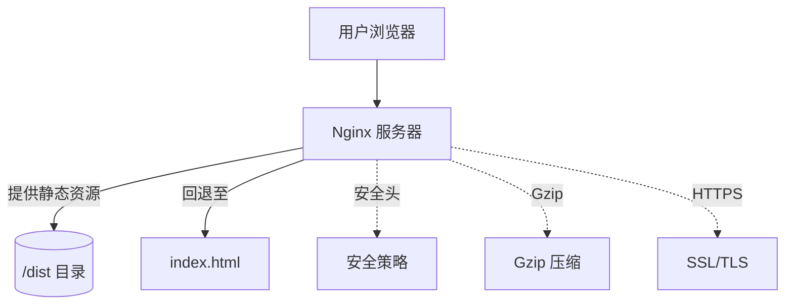
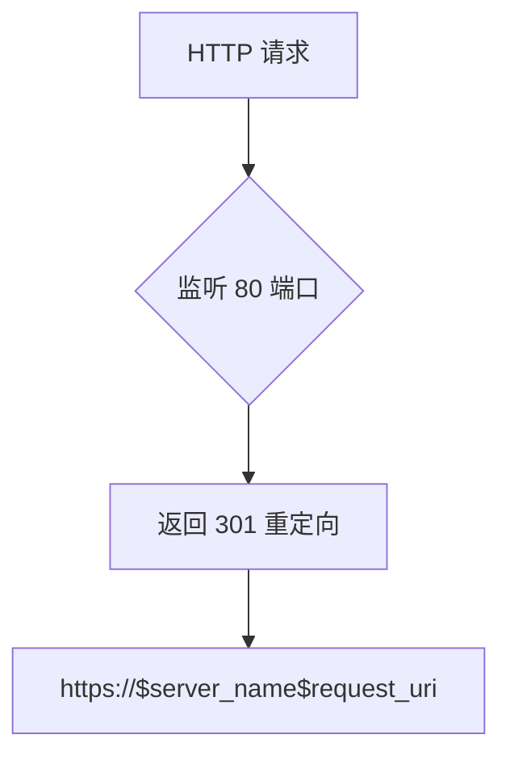
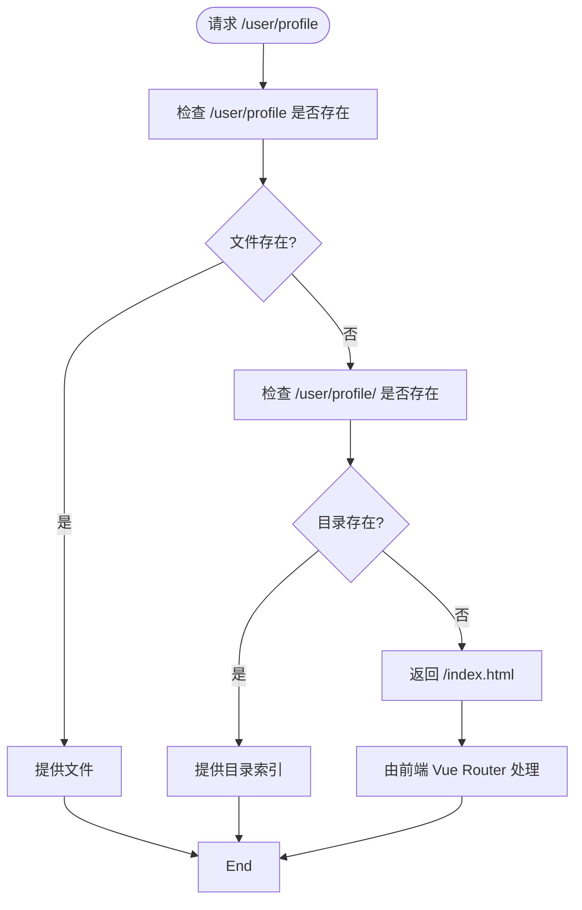
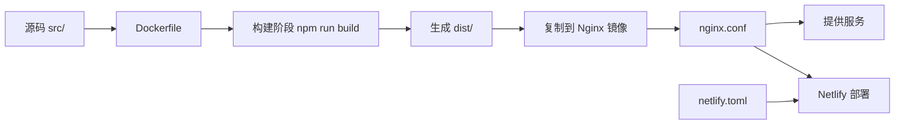

# Nginx服务配置

<cite>
**本文档引用文件**  
- [nginx.conf](file://config/deployment/nginx.conf)
- [Dockerfile](file://config/deployment/Dockerfile)
- [netlify.toml](file://netlify.toml)
</cite>

## 目录
1. [引言](#引言)
2. [项目结构](#项目结构)
3. [核心组件](#核心组件)
4. [架构概览](#架构概览)
5. [详细组件分析](#详细组件分析)
6. [依赖分析](#依赖分析)
7. [性能考量](#性能考量)
8. [故障排查指南](#故障排查指南)
9. [结论](#结论)

## 引言
本文档系统阐述了 `nginx.conf` 在生产环境中的核心作用与配置细节，结合项目部署场景，深入分析 HTTP 服务器块的监听端口、`server_name` 设置及静态资源路径配置。重点解析前端单页应用（SPA）的 history 模式支持机制、Gzip 压缩策略、MIME 类型映射、缓存控制、HTTPS 重定向与安全头设置，并提供性能调优建议与常见错误诊断流程。

## 项目结构
本项目为一个基于 Vue/Vite 的前端应用，采用模块化结构组织代码。前端源码位于 `src/` 目录，构建输出目录为 `dist`。部署配置集中于 `config/deployment/` 目录，包含 Nginx 配置文件和 Docker 镜像构建脚本。此外，项目也支持 Netlify 部署，相关配置在根目录的 `netlify.toml` 文件中定义。

**Section sources**
- [nginx.conf](file://config/deployment/nginx.conf#L1-L85)
- [Dockerfile](file://config/deployment/Dockerfile#L1-L14)
- [netlify.toml](file://netlify.toml#L1-L35)

## 核心组件
`nginx.conf` 是本项目生产环境的核心组件，负责处理所有 HTTP/HTTPS 请求。它定义了两个 `server` 块：一个用于将 HTTP 流量重定向到 HTTPS，另一个用于处理加密的 HTTPS 请求并提供静态文件服务。该配置确保了应用的安全性、性能和对 SPA 路由的正确支持。

**Section sources**
- [nginx.conf](file://config/deployment/nginx.conf#L1-L85)

## 架构概览
Nginx 在本项目中作为反向代理和静态文件服务器，位于用户与应用之间的最前端。它接收所有入站请求，强制使用 HTTPS，并高效地提供构建后的静态资源（HTML、CSS、JS 等）。对于非资源请求（如前端路由），Nginx 将其回退至 `index.html`，从而支持 SPA 的 history 模式。

**Diagram sources**
- [nginx.conf](file://config/deployment/nginx.conf#L1-L85)

## 详细组件分析

### HTTP服务器配置分析
该配置定义了两个 `server` 块，分别处理 HTTP 和 HTTPS 流量。

#### HTTP重定向配置
第一个 `server` 块监听 80 端口，将所有 HTTP 请求永久重定向（301）到 HTTPS，确保所有通信都经过加密。

**Diagram sources**
- [nginx.conf](file://config/deployment/nginx.conf#L1-L6)

#### HTTPS服务器配置
第二个 `server` 块是核心，监听 443 端口，启用 SSL 和 HTTP/2 协议，提供安全的静态文件服务。

##### SSL安全配置
配置了现代、安全的 SSL 协议（TLSv1.2 和 TLSv1.3）和加密套件（ECDHE-RSA-AES 系列），并启用了 HSTS（HTTP 严格传输安全）策略，强制浏览器在未来一段时间内只通过 HTTPS 访问站点。

**Section sources**
- [nginx.conf](file://config/deployment/nginx.conf#L10-L22)

##### 静态资源与根目录
`root` 指令将网站根目录设置为 `/var/www/ramusi.cn/dist`，这与 Dockerfile 中将构建产物复制到 `/usr/share/nginx/html` 的路径相匹配，确保 Nginx 能正确找到并提供 `index.html` 和其他静态资源。

**Section sources**
- [nginx.conf](file://config/deployment/nginx.conf#L28-L29)
- [Dockerfile](file://config/deployment/Dockerfile#L9-L10)

### 路由与缓存策略分析

#### SPA路由支持
`location /` 块中的 `try_files` 指令是支持前端单页应用 history 模式的精髓。它按顺序检查 `$uri`（请求路径）、`$uri/`（路径加斜杠）是否存在，如果都不存在，则返回 `/index.html`。这使得前端路由（如 `/user/profile`）能被正确处理，而不会返回 404。

**Diagram sources**
- [nginx.conf](file://config/deployment/nginx.conf#L70-L75)

#### 静态资源缓存
通过正则表达式 `location` 块，对常见的静态资源文件（JS、CSS、图片、字体等）设置了长达 1 年的过期时间，并添加了 `Cache-Control: public, immutable` 头，极大提升了页面加载性能，减少了服务器负载。

**Section sources**
- [nginx.conf](file://config/deployment/nginx.conf#L52-L56)

#### HTML文件缓存控制
与静态资源相反，HTML 文件被配置为不缓存（`expires -1`），并设置了 `no-cache, no-store` 等头。这是因为 `index.html` 是应用的入口，一旦更新，必须确保用户能立即获取最新版本，避免因缓存导致的版本不一致问题。

**Section sources**
- [nginx.conf](file://config/deployment/nginx.conf#L58-L62)

### 性能与安全配置分析

#### Gzip压缩
启用了 Gzip 压缩，对文本类资源（如 HTML、CSS、JS、JSON）进行压缩，有效减少了网络传输的数据量，加快了页面加载速度。配置了合理的压缩级别（6）和最小长度（1024 字节），平衡了 CPU 开销和压缩效果。

**Section sources**
- [nginx.conf](file://config/deployment/nginx.conf#L32-L45)

#### 安全头设置
配置了多项安全头，增强了应用的安全性：
- `X-Frame-Options: SAMEORIGIN`：防止点击劫持攻击。
- `X-Content-Type-Options: nosniff`：防止 MIME 类型嗅探攻击。
- `X-XSS-Protection: 1; mode=block`：启用浏览器的 XSS 过滤器。
- `Content-Security-Policy`：定义了内容安全策略，限制资源加载来源。
- `server_tokens off`：隐藏 Nginx 版本号，减少攻击面。

**Section sources**
- [nginx.conf](file://config/deployment/nginx.conf#L71-L75)
- [nginx.conf](file://config/deployment/nginx.conf#L77-L80)

## 依赖分析
本项目的 Nginx 配置与 Docker 部署方式紧密耦合。`Dockerfile` 负责构建应用镜像，将构建产物复制到 Nginx 的默认 HTML 目录。`nginx.conf` 则定义了容器内 Nginx 的行为。同时，配置中的域名和路径也与 `netlify.toml` 中的规则保持一致，确保了多平台部署的一致性。

**Diagram sources**
- [Dockerfile](file://config/deployment/Dockerfile#L1-L14)
- [nginx.conf](file://config/deployment/nginx.conf#L1-L85)
- [netlify.toml](file://netlify.toml#L1-L35)

## 性能考量
此 Nginx 配置在性能方面做了充分优化：
1. **高效的静态文件服务**：Nginx 本身擅长处理静态文件。
2. **Gzip 压缩**：显著减少传输体积。
3. **长缓存策略**：对静态资源启用长期缓存，减少重复请求。
4. **HTTP/2**：支持多路复用，提升并发性能。
5. **合理配置**：如 `gzip_comp_level` 避免了过高的 CPU 消耗。

**Section sources**
- [nginx.conf](file://config/deployment/nginx.conf#L32-L56)

## 故障排查指南
当部署后出现问题时，可按以下流程排查：

### 403 Forbidden 错误
1. **检查文件权限**：确保 Nginx 进程有权限读取 `/var/www/ramusi.cn/dist` 目录及其下的文件。
2. **检查 index.html**：确认 `dist` 目录下存在 `index.html` 文件。
3. **检查 root 路径**：确认 `nginx.conf` 中的 `root` 路径与实际文件路径一致。

### 502 Bad Gateway 错误
此错误在纯静态部署中较少见，若使用 Nginx 作为反向代理则需检查：
1. **后端服务状态**：确认后端应用（如 Node.js 服务）正在运行。
2. **代理配置**：检查 `proxy_pass` 指令是否指向正确的后端地址和端口。
3. **网络连通性**：确保 Nginx 容器/服务器能访问后端服务。

### SPA路由失效
1. **检查 try_files**：确认 `location /` 块中包含 `try_files $uri $uri/ /index.html;`。
2. **检查文件存在**：直接访问 `https://ramusi.cn/index.html` 是否正常。
3. **检查构建产物**：确认 `dist` 目录已正确生成且包含所有必要文件。

**Section sources**
- [nginx.conf](file://config/deployment/nginx.conf#L70-L75)

## 结论
`nginx.conf` 配置文件是本项目生产环境稳定、安全、高效运行的关键。它不仅实现了基本的静态文件服务，还通过 HTTPS 重定向、HSTS、安全头等措施保障了应用安全，并通过 Gzip 压缩和精细化的缓存策略优化了性能。特别是对 SPA history 模式的完美支持，使得前端应用能够提供流畅的用户体验。结合 Docker 部署，该配置实现了环境的一致性和部署的便捷性。