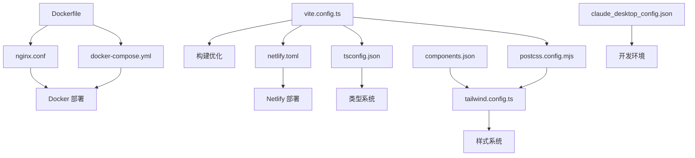

# 配置管理

<cite>
**本文档中引用的文件**  
- [postcss.config.mjs](file://config/build/postcss.config.mjs)
- [tailwind.config.ts](file://config/build/tailwind.config.ts)
- [claude_desktop_config.json](file://config/development/claude_desktop_config.json)
- [components.json](file://config/development/components.json)
- [Dockerfile](file://config/deployment/Dockerfile)
- [docker-compose.yml](file://config/deployment/docker-compose.yml)
- [nginx.conf](file://config/deployment/nginx.conf)
- [vite.config.ts](file://vite.config.ts)
- [tsconfig.json](file://tsconfig.json)
- [netlify.toml](file://netlify.toml)
</cite>

## 目录

1. [简介](#简介)
2. [构建配置](#构建配置)
3. [开发辅助配置](#开发辅助配置)
4. [部署配置](#部署配置)
5. [Vite 构建配置](#vite-构建配置)
6. [TypeScript 编译配置](#typescript-编译配置)
7. [Netlify 静态站点配置](#netlify-静态站点配置)
8. [配置文件关联关系图](#配置文件关联关系图)
9. [配置调整与扩展指南](#配置调整与扩展指南)

## 简介
本项目采用模块化配置管理策略，将构建、开发、部署等不同环境的配置文件分类存放于 `config` 目录下。通过分离关注点，提升配置可维护性与环境适应性。本文档全面解析各配置文件的作用、定制化选项及相互关系，指导开发者根据实际需求进行配置调整。

## 构建配置

### PostCSS 配置
`postcss.config.mjs` 是项目的 PostCSS 配置文件，负责在构建过程中处理 CSS 样式。该配置集成了 Tailwind CSS 作为核心插件，通过 `tailwindcss: {}` 启用 Tailwind 的样式生成能力。PostCSS 在 Vite 构建流程中自动加载此配置，对项目中的 CSS 文件进行预处理，实现现代 CSS 特性支持与样式优化。

**Section sources**
- [postcss.config.mjs](file://config/build/postcss.config.mjs#L1-L8)

### Tailwind CSS 配置
`tailwind.config.ts` 是 Tailwind CSS 的核心配置文件，定义了设计系统的基础样式规则。配置中通过 `content` 字段指定需要扫描的文件路径，确保动态生成的实用类能覆盖所有模板文件。`theme.extend.colors` 定义了基于 CSS 变量的调色板，支持主题化切换。`borderRadius`、`keyframes` 和 `animation` 扩展了圆角、动画等设计属性，实现一致的 UI 动画体验。

**Section sources**
- [tailwind.config.ts](file://config/build/tailwind.config.ts#L1-L89)

## 开发辅助配置

### Claude 桌面开发配置
`claude_desktop_config.json` 为 Claude 桌面开发环境提供 MCP（Model Context Protocol）服务器配置。配置中定义了 `context7` 服务，通过 `npx @upstash/context7-mcp` 命令启动上下文服务，支持在开发过程中与 AI 模型进行交互，提升开发效率。

**Section sources**
- [claude_desktop_config.json](file://config/development/claude_desktop_config.json#L1-L8)

### 组件库配置
`components.json` 是 shadcn/ui 组件库的配置文件，定义了项目中 UI 组件的生成规则。配置指定了使用 `tailwind.config.ts` 作为 Tailwind 配置文件，`app/globals.css` 作为基础样式文件。通过 `aliases` 定义了模块别名，如 `@/components` 指向组件目录，简化导入路径。该配置支持 TSX 语法和 CSS 变量，确保组件样式与主题系统无缝集成。

**Section sources**
- [components.json](file://config/development/components.json#L1-L20)

## 部署配置

### Docker 镜像构建配置
`Dockerfile` 定义了多阶段 Docker 镜像构建流程。第一阶段使用 `node:18-alpine` 作为构建环境，安装依赖并执行 `npm run build` 生成生产构建。第二阶段使用 `nginx:alpine` 作为运行时环境，将构建产物复制到 Nginx 的 HTML 目录，并暴露 80 端口。该配置实现了轻量化的生产镜像，优化了部署效率与安全性。

**Section sources**
- [Dockerfile](file://config/deployment/Dockerfile#L1-L13)

### Docker 服务编排配置
`docker-compose.yml` 定义了 Docker 服务的编排逻辑。配置中定义了 `web` 服务，基于当前目录的 Dockerfile 构建镜像，容器名称为 `advanced-tools-navigation`，并将主机 80 端口映射到容器 80 端口。服务设置为 `unless-stopped` 重启策略，确保服务高可用。环境变量 `NODE_ENV=production` 指定生产环境运行模式。

**Section sources**
- [docker-compose.yml](file://config/deployment/docker-compose.yml#L1-L15)

### Nginx 服务器配置
`nginx.conf` 是 Nginx Web 服务器的核心配置文件，定义了生产环境的 HTTP 服务行为。配置包含两个 `server` 块：第一个监听 80 端口，将所有 HTTP 请求重定向到 HTTPS；第二个监听 443 端口，配置 SSL 证书、安全头（HSTS、CSP、X-Frame-Options 等）和 Gzip 压缩。静态资源设置长期缓存，HTML 文件禁用缓存以支持 SPA 路由。`try_files` 指令实现单页应用的路由回退机制。

**Section sources**
- [nginx.conf](file://config/deployment/nginx.conf#L1-L85)

## Vite 构建配置

`vite.config.ts` 是 Vite 构建工具的核心配置文件，定义了开发与生产构建的详细规则。配置中通过 `resolve.alias` 定义了路径别名，如 `@` 指向 `src` 目录，提升代码可读性。`plugins` 数组中包含 Vue 插件和自定义插件：`copy-cname` 插件在构建后自动复制 CNAME 文件，`fix-html` 插件注入加载状态和错误处理脚本，提升用户体验。构建选项中配置了代码分割、源码映射和 Terser 压缩，优化生产包性能。

**Section sources**
- [vite.config.ts](file://vite.config.ts#L1-L101)

## TypeScript 编译配置

`tsconfig.json` 是 TypeScript 的编译配置文件，定义了项目的类型检查与编译选项。配置中 `target` 和 `module` 设置为 `ESNext`，启用最新的 JavaScript 特性。`paths` 定义了模块路径映射，与 Vite 的别名配置保持一致。`include` 指定了需要编译的文件范围，`exclude` 排除了测试文件。`strict` 设置为 `false`，提供了更灵活的类型检查策略，适应项目开发需求。

**Section sources**
- [tsconfig.json](file://tsconfig.json#L1-L28)

## Netlify 静态站点配置

`netlify.toml` 是 Netlify 平台的部署配置文件，定义了构建命令、发布目录和重定向规则。`[build]` 部分指定构建命令为清理缓存、安装依赖并执行构建，发布目录为 `dist`。`[[redirects]]` 定义了多条重定向规则：第一条实现 SPA 路由的 200 状态码回退到 `index.html`；其余规则将 HTTP 和 www 域名强制重定向到 HTTPS 的主域名，确保安全访问和 SEO 一致性。

**Section sources**
- [netlify.toml](file://netlify.toml#L1-L34)

## 配置文件关联关系图

**Diagram sources**
- [vite.config.ts](file://vite.config.ts#L1-L101)
- [postcss.config.mjs](file://config/build/postcss.config.mjs#L1-L8)
- [tailwind.config.ts](file://config/build/tailwind.config.ts#L1-L89)
- [tsconfig.json](file://tsconfig.json#L1-L28)
- [netlify.toml](file://netlify.toml#L1-L34)
- [Dockerfile](file://config/deployment/Dockerfile#L1-L13)
- [docker-compose.yml](file://config/deployment/docker-compose.yml#L1-L15)
- [nginx.conf](file://config/deployment/nginx.conf#L1-L85)
- [components.json](file://config/development/components.json#L1-L20)
- [claude_desktop_config.json](file://config/development/claude_desktop_config.json#L1-L8)

## 配置调整与扩展指南
开发者可根据环境需求调整配置：
- **样式定制**：修改 `tailwind.config.ts` 中的 `theme.extend` 扩展设计系统。
- **构建优化**：在 `vite.config.ts` 中调整 `build.rollupOptions` 进行代码分割。
- **部署扩展**：在 `docker-compose.yml` 中添加数据库等服务实现完整栈部署。
- **类型安全**：在 `tsconfig.json` 中启用 `strict: true` 提升类型检查严格性。
- **域名管理**：在 `netlify.toml` 或 `nginx.conf` 中添加新的重定向规则支持多域名。