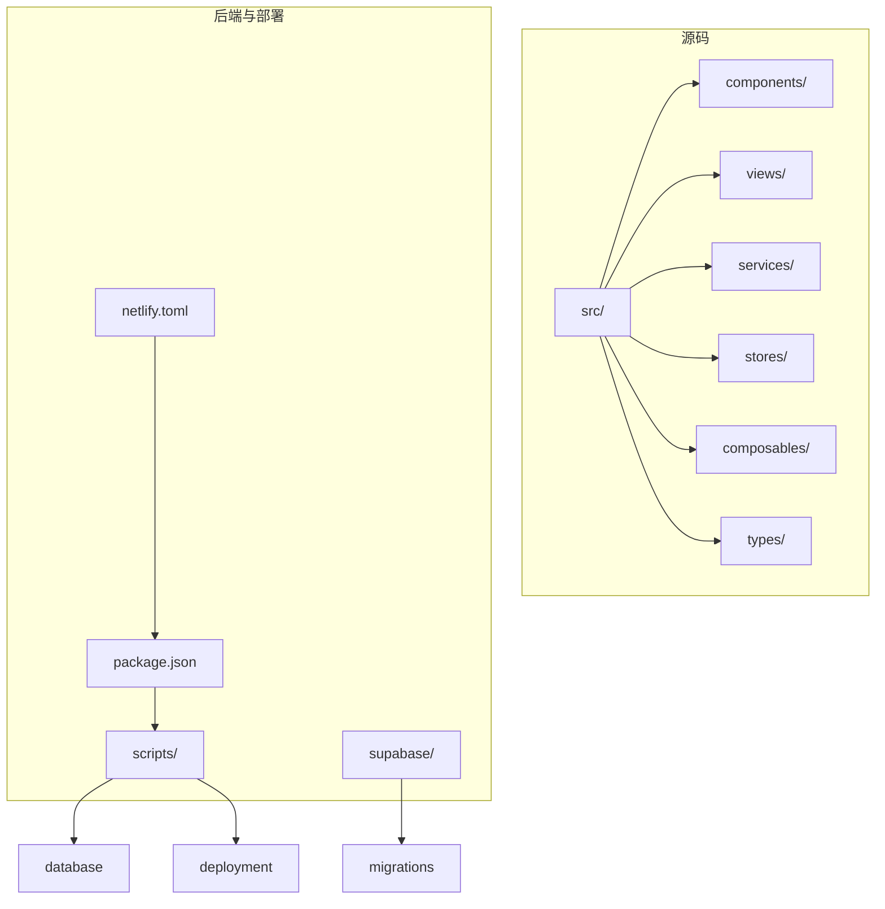
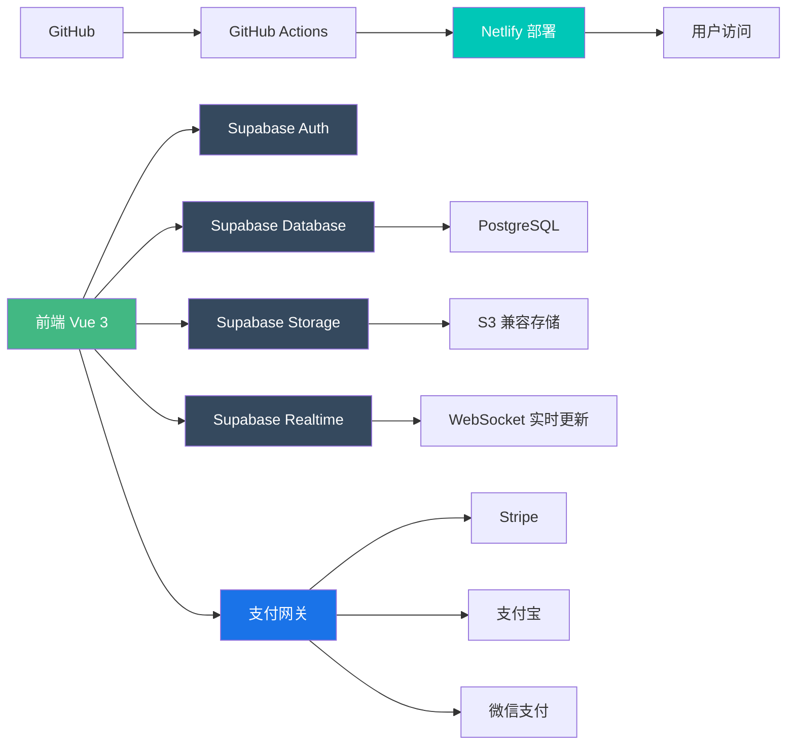
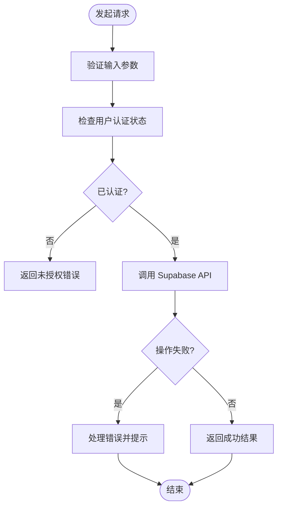
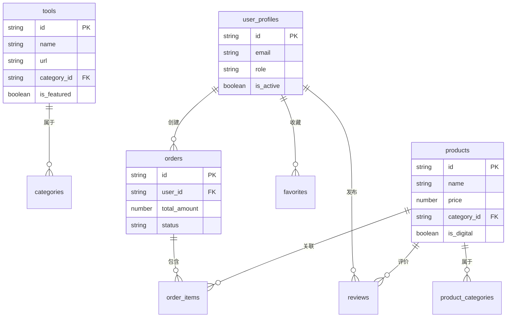

# 系统概述

<cite>
**本文档引用的文件**  
- [package.json](file://package.json)
- [netlify.toml](file://netlify.toml)
- [supabase/config.toml](file://supabase/config.toml)
- [src/lib/supabaseClient.ts](file://src/lib/supabaseClient.ts)
- [src/types/database.ts](file://src/types/database.ts)
- [supabase/migrations/20241224000001_initial_schema.sql](file://supabase/migrations/20241224000001_initial_schema.sql)
- [scripts/deployment/deploy.sh](file://scripts/deployment/deploy.sh)
- [README.md](file://README.md) - *更新了支付模块说明*
- [PAYMENT_SETUP.md](file://PAYMENT_SETUP.md) - *新增支付配置文档*
</cite>

## 更新摘要
**已做更改**  
- 更新了简介部分，补充支付功能增强的相关说明
- 在核心组件中新增支付服务模块描述
- 扩展架构概览，加入真实支付网关集成框架说明
- 更新依赖分析，包含支付相关依赖
- 新增支付系统专项说明章节
- 更新文档引用文件列表，加入新涉及的配置文档

## 目录

1. [简介](#简介)
2. [项目结构](#项目结构)
3. [核心组件](#核心组件)
4. [架构概览](#架构概览)
5. [详细组件分析](#详细组件分析)
6. [依赖分析](#依赖分析)
7. [性能考量](#性能考量)
8. [故障排除指南](#故障排除指南)
9. [支付系统说明](#支付系统说明)
10. [结论](#结论)

## 简介

高级工具导航平台是一个全栈应用，旨在为用户提供高效的工具分类导航、产品商城、评价系统和管理后台。该平台采用现代技术栈构建，前端使用 Vue 3 + TypeScript + Vite，后端服务基于 Supabase，部署流程通过 Netlify 和 GitHub Actions 实现。系统支持普通用户和管理员两种角色，分别对应浏览、收藏、购买等操作和内容管理、订单处理等功能。整体设计注重可扩展性和实时交互能力，利用 Supabase 提供的身份验证、数据库、存储和实时订阅功能，实现高效的数据同步与用户体验。近期更新重点完善了支付模块功能，修复了数据库结构不一致问题，并添加了真实支付网关集成框架，为用户提供更安全可靠的交易体验。

**Section sources**
- [package.json](file://package.json#L1-L93)
- [netlify.toml](file://netlify.toml#L1-L34)
- [README.md](file://README.md#L1-L260) - *更新了支付功能说明*

## 项目结构

项目采用模块化目录结构，清晰划分不同职责区域。`src/` 目录存放前端源码，包括组件、视图、服务、状态管理等；`supabase/` 目录管理数据库迁移脚本和配置；`scripts/` 包含自动化任务脚本，如数据库初始化、部署检查、环境设置等；`public/` 存放静态资源文件；`config/` 包含构建、部署和开发配置。



**Diagram sources**
- [src](file://src#L1-L267)
- [supabase/migrations](file://supabase/migrations#L1-L7)
- [scripts/database](file://scripts/database#L1-L14)
- [scripts/deployment](file://scripts/deployment#L1-L26)

**Section sources**
- [src](file://src#L1-L267)
- [supabase/migrations](file://supabase/migrations#L1-L7)
- [scripts](file://scripts#L1-L26)

## 核心组件

系统核心功能由多个关键模块构成：`toolsService` 负责工具数据的增删改查；`productsService` 管理产品信息与购买流程；`authService` 处理用户认证逻辑；`reviewService` 支持评价与反馈；`favoritesService` 实现收藏功能；`orderService` 管理订单生命周期；`paymentService` 处理多种支付方式的集成与交易流程。这些服务通过统一的 Supabase 客户端与后端交互，并利用 Pinia 进行状态管理，确保数据一致性。新增的支付服务模块支持 Stripe、支付宝和微信支付等多种真实支付网关，提供了安全可靠的交易框架。

**Section sources**
- [src/services/toolsService.ts](file://src/services/toolsService.ts)
- [src/services/productsService.ts](file://src/services/productsService.ts)
- [src/services/authService.ts](file://src/services/authService.ts)
- [src/services/reviewService.ts](file://src/services/reviewService.ts)
- [src/services/favoritesService.ts](file://src/services/favoritesService.ts)
- [src/services/orderService.ts](file://src/services/orderService.ts)
- [src/services/paymentService.ts](file://src/services/paymentService.ts) - *新增支付服务*

## 架构概览

该系统采用前后端分离架构，前端通过 Vite 构建，使用 Vue 3 的组合式 API 和 TypeScript 提高开发效率与类型安全。后端完全依赖 Supabase 提供的 BaaS（Backend as a Service）能力，涵盖身份验证、PostgreSQL 数据库、对象存储和实时数据同步。部署通过 Netlify 托管前端，结合 GitHub Actions 自动化构建与发布流程。最新版本集成了真实支付网关框架，支持 Stripe、支付宝和微信支付，支付流程通过环境变量安全配置，确保交易安全。



**Diagram sources**
- [src/lib/supabaseClient.ts](file://src/lib/supabaseClient.ts#L1-L266)
- [netlify.toml](file://netlify.toml#L1-L34)
- [package.json](file://package.json#L1-L93)
- [src/components/StripePayment.vue](file://src/components/StripePayment.vue) - *新增支付组件*
- [src/components/AlipayPayment.vue](file://src/components/AlipayPayment.vue) - *新增支付组件*
- [src/components/WechatPayment.vue](file://src/components/WechatPayment.vue) - *新增支付组件*

## 详细组件分析

### 前端服务分析

前端通过 `supabaseClient.ts` 封装 Supabase 客户端实例，提供统一的数据库表名、存储桶名和实时频道常量，便于维护和引用。所有服务模块均基于此客户端进行数据操作，支持插入、更新、删除、查询等基本操作，并集成错误处理机制。

#### 服务调用流程图


**Diagram sources**
- [src/lib/supabaseClient.ts](file://src/lib/supabaseClient.ts#L1-L266)
- [src/services/databaseService.ts](file://src/services/databaseService.ts)

**Section sources**
- [src/lib/supabaseClient.ts](file://src/lib/supabaseClient.ts#L1-L266)
- [src/services/databaseService.ts](file://src/services/databaseService.ts)

### 数据模型分析

系统数据库包含多个核心表，如 `tools`（工具）、`products`（产品）、`categories`（分类）、`user_profiles`（用户资料）、`orders`（订单）、`reviews`（评价）等，均在 `types/database.ts` 中定义了完整的 TypeScript 类型接口，确保前后端数据结构一致。

#### 数据模型图


**Diagram sources**
- [src/types/database.ts](file://src/types/database.ts#L1-L395)
- [supabase/migrations/20241224000001_initial_schema.sql](file://supabase/migrations/20241224000001_initial_schema.sql)

## 依赖分析

项目依赖主要分为运行时依赖和开发依赖。运行时依赖包括 Vue、Vue Router、Pinia、Supabase JS 客户端、UUID 等；开发依赖涵盖 Vite、TypeScript、ESLint、Prettier、Vitest 等工具链。所有依赖通过 `package.json` 管理，并由 npm 自动解析。支付功能引入了 Stripe、支付宝和微信支付的 SDK 依赖，通过环境变量安全配置密钥，确保支付交易的安全性。

```mermaid
graph TD
A[应用] --> B[vue@3.5.17]
A --> C[vue-router@4.5.1]
A --> D[pinia@2.3.1]
A --> E[@supabase/supabase-js@2.50.1]
A --> F[uuid@11.1.0]
A --> G[stripe-js]
A --> H[alipay-sdk]
A --> I[wechat-pay-sdk]
B --> G[响应式系统]
C --> H[路由管理]
D --> I[状态管理]
E --> J[数据库与认证]
F --> K[唯一标识生成]
G --> L[在线支付]
H --> M[移动支付]
I --> N[数字支付]
style A fill:#34495e, color:white
```

**Diagram sources**
- [package.json](file://package.json#L1-L93)

**Section sources**
- [package.json](file://package.json#L1-L93)

## 性能考量

项目通过多种方式优化性能：使用 Vite 提升开发服务器启动速度和热更新效率；采用懒加载组件（`LazyComponent.vue`）减少初始加载体积；利用 Supabase 的实时订阅替代轮询；通过 `optimize-build.mjs` 脚本优化生产构建输出；使用 `cacheManager.ts` 实现本地缓存策略，降低重复请求频率。

**Section sources**
- [scripts/performance/optimize-build.mjs](file://scripts/performance/optimize-build.mjs)
- [src/utils/cacheManager.ts](file://src/utils/cacheManager.ts)
- [src/components/common/LazyComponent.vue](file://src/components/common/LazyComponent.vue)

## 故障排除指南

常见问题包括 Supabase 环境变量未配置、数据库连接失败、部署流程中断等。系统在 `supabaseClient.ts` 中加入了环境变量检测逻辑，若未正确设置 `VITE_SUPABASE_URL` 或 `VITE_SUPABASE_ANON_KEY`，会输出警告并降级为模拟数据模式。此外，`scripts/deployment/` 下提供了多个诊断脚本，如 `check-deployment-status.js`、`verify-deployment.js` 等，可用于排查部署问题。对于支付功能，需确保在 `.env` 文件中正确配置支付网关密钥，且密钥未提交至版本控制系统。

**Section sources**
- [src/lib/supabaseClient.ts](file://src/lib/supabaseClient.ts#L5-L20)
- [scripts/deployment/verify-deployment.js](file://scripts/deployment/verify-deployment.js)
- [scripts/deployment/check-deployment-status.js](file://scripts/deployment/check-deployment-status.js)
- [PAYMENT_SETUP.md](file://PAYMENT_SETUP.md) - *新增支付配置指南*

## 支付系统说明

系统现已集成完整的支付功能框架，支持 Stripe、支付宝和微信支付三种主流支付方式。支付配置通过环境变量管理，确保密钥安全。用户在购买产品时，系统会根据配置的支付网关自动加载相应的支付组件，提供流畅的支付体验。管理员可在后台管理支付设置，启用或禁用特定支付方式。所有支付交易记录都会保存在订单系统中，便于对账和管理。

**Section sources**
- [README.md](file://README.md#L200-L250) - *支付配置说明*
- [PAYMENT_SETUP.md](file://PAYMENT_SETUP.md) - *详细支付设置文档*
- [.env.example](file://.env.example) - *环境变量示例*

## 结论

高级工具导航平台通过现代化的技术栈实现了功能丰富且易于维护的全栈应用。其架构设计充分考虑了可扩展性、实时性和部署自动化，适合快速迭代和团队协作。近期对支付模块的完善，修复了数据库结构问题，并集成了真实支付网关框架，显著提升了系统的商业应用能力。新开发者可通过本概述快速理解系统全貌，掌握核心模块职责与交互方式，进而高效参与开发与维护工作。