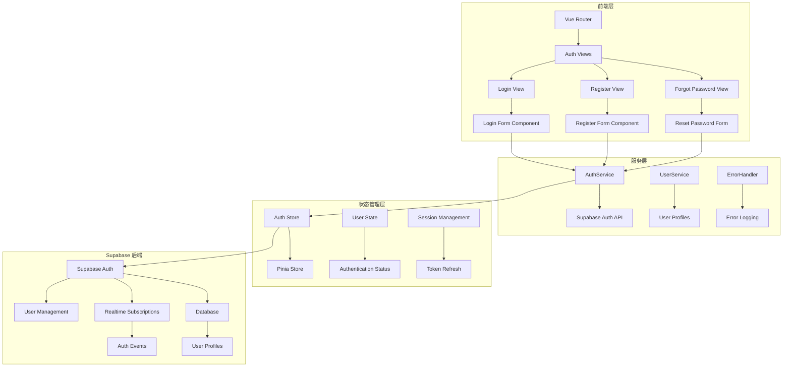
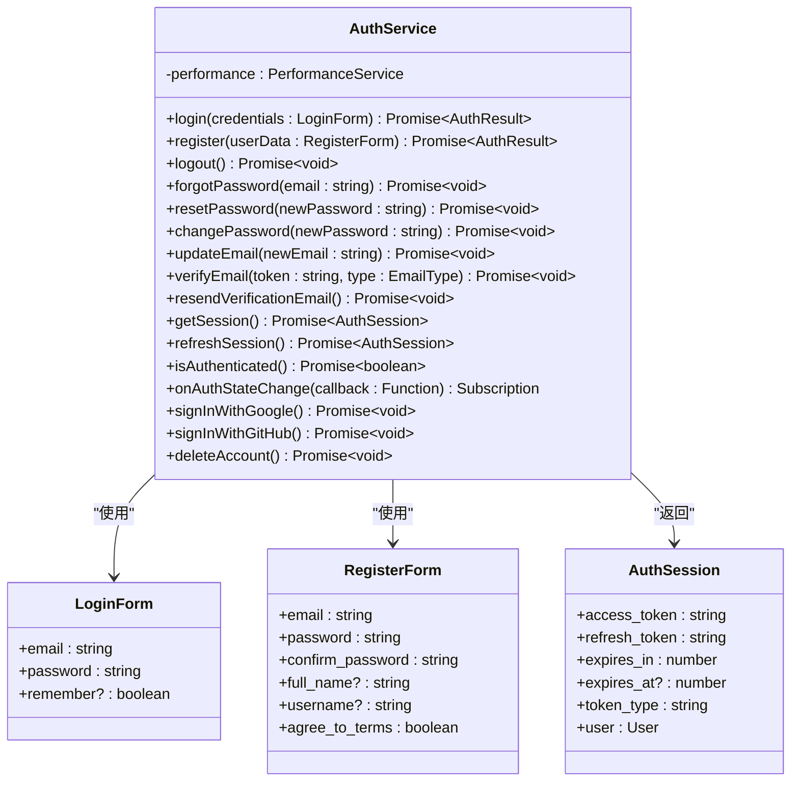
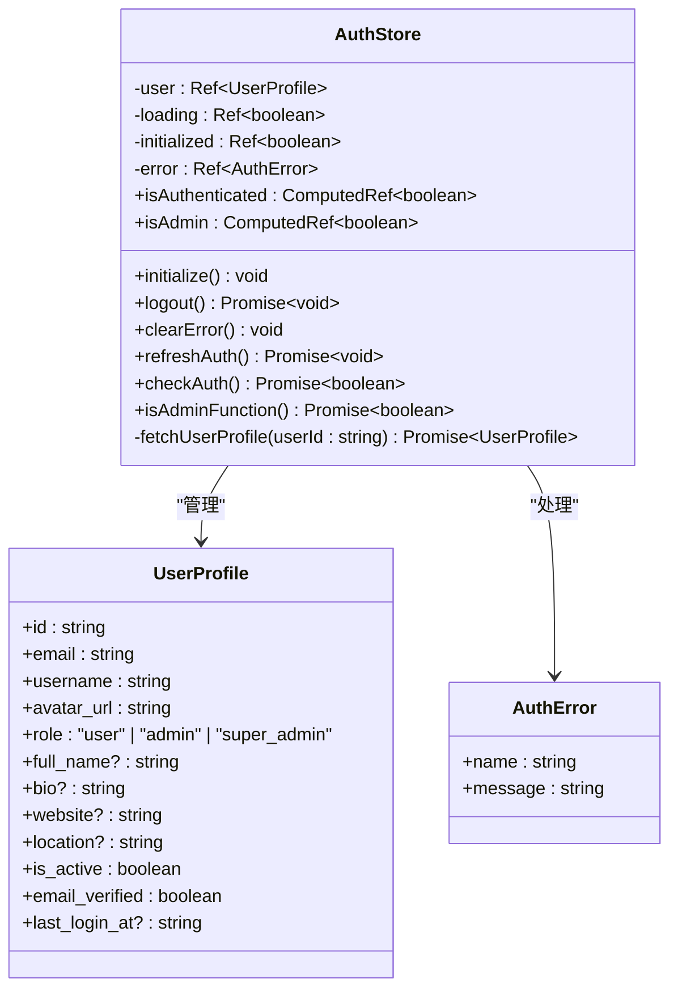
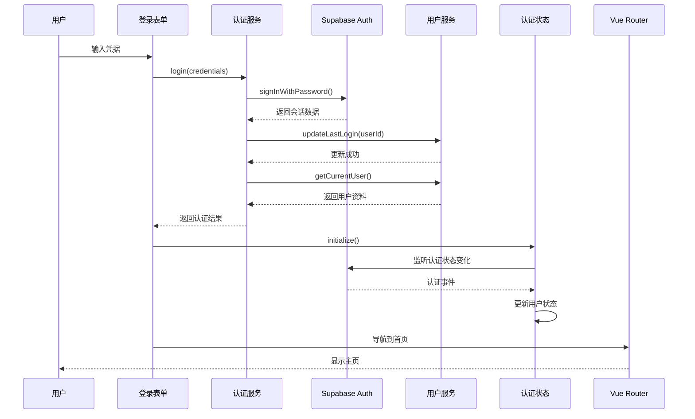
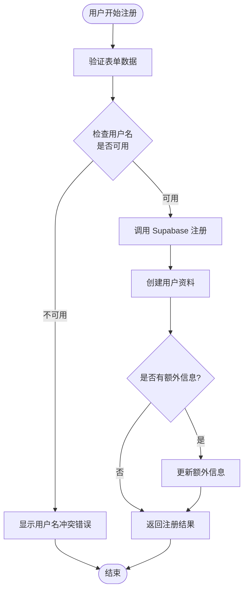
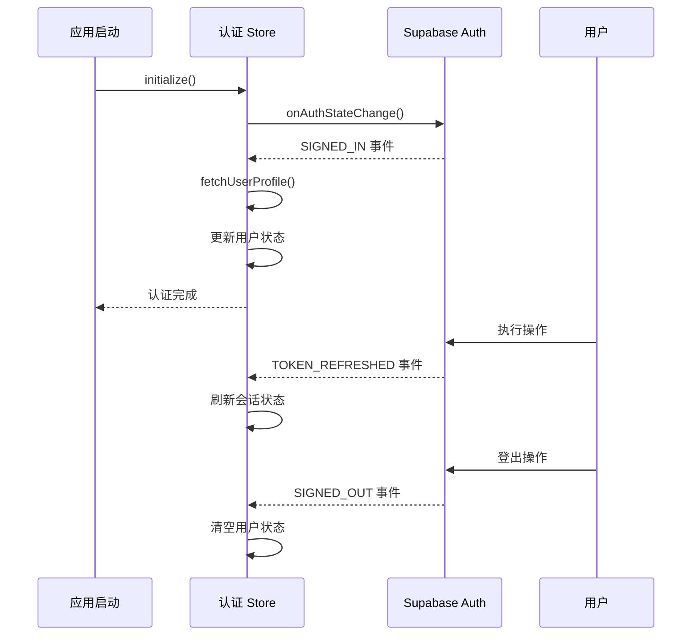
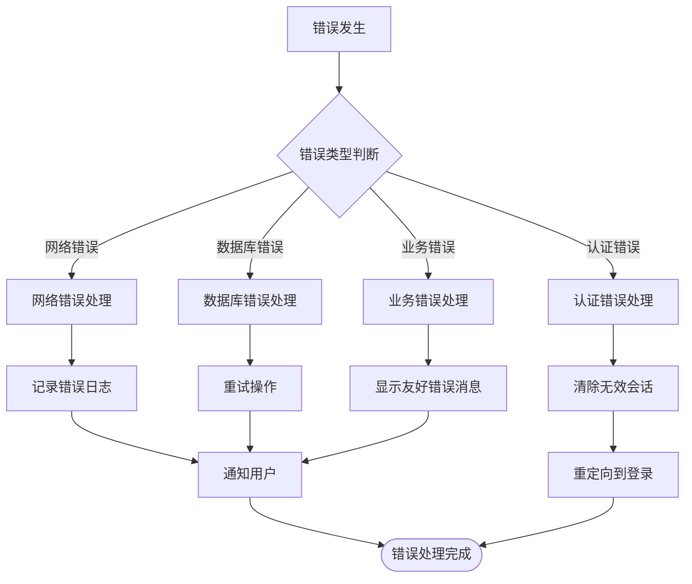
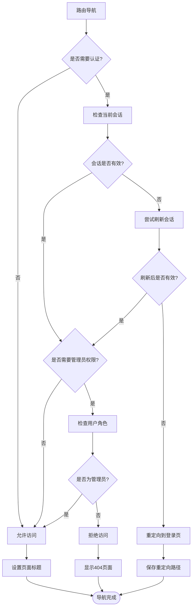

# 认证系统

<cite>
**本文档引用的文件**
- [src/services/authService.ts](file://src/services/authService.ts)
- [src/stores/auth.ts](file://src/stores/auth.ts)
- [src/lib/supabaseClient.ts](file://src/lib/supabaseClient.ts)
- [src/components/auth/LoginForm.vue](file://src/components/auth/LoginForm.vue)
- [src/views/auth/LoginView.vue](file://src/views/auth/LoginView.vue)
- [src/views/auth/RegisterView.vue](file://src/views/auth/RegisterView.vue)
- [src/views/auth/ForgotPasswordView.vue](file://src/views/auth/ForgotPasswordView.vue)
- [src/router/index.ts](file://src/router/index.ts)
- [src/types/index.ts](file://src/types/index.ts)
- [src/utils/errorHandler.ts](file://src/utils/errorHandler.ts)
</cite>

## 目录
1. [简介](#简介)
2. [系统架构概览](#系统架构概览)
3. [核心组件分析](#核心组件分析)
4. [认证流程详解](#认证流程详解)
5. [会话管理机制](#会话管理机制)
6. [错误处理策略](#错误处理策略)
7. [路由守卫与权限控制](#路由守卫与权限控制)
8. [性能优化考虑](#性能优化考虑)
9. [故障排除指南](#故障排除指南)
10. [总结](#总结)

## 简介

本认证系统是一个基于 Vue 3 和 Pinia 的现代化用户认证解决方案，集成了 Supabase Auth 作为后端认证服务。系统提供了完整的用户生命周期管理，包括注册、登录、登出、密码重置等核心功能，同时具备完善的错误处理机制和会话管理策略。

系统采用模块化设计，通过独立的服务层和状态管理层实现关注点分离，确保代码的可维护性和扩展性。认证状态通过 Pinia store 进行全局管理，支持实时状态同步和持久化存储。

## 系统架构概览

**图表来源**
- [src/router/index.ts](file://src/router/index.ts#L1-L50)
- [src/services/authService.ts](file://src/services/authService.ts#L1-L30)
- [src/stores/auth.ts](file://src/stores/auth.ts#L1-L40)

## 核心组件分析

### AuthService - 认证服务层

AuthService 是认证系统的核心服务层，负责与 Supabase Auth API 进行直接交互，提供完整的认证功能。

**图表来源**
- [src/services/authService.ts](file://src/services/authService.ts#L15-L50)
- [src/types/index.ts](file://src/types/index.ts#L400-L420)

### Auth Store - 状态管理层

Auth Store 使用 Pinia 实现全局状态管理，负责维护用户的认证状态、用户资料和错误信息。

**图表来源**
- [src/stores/auth.ts](file://src/stores/auth.ts#L15-L50)
- [src/types/index.ts](file://src/types/index.ts#L100-L120)

**章节来源**
- [src/services/authService.ts](file://src/services/authService.ts#L1-L306)
- [src/stores/auth.ts](file://src/stores/auth.ts#L1-L190)

## 认证流程详解

### 登录流程

**图表来源**
- [src/components/auth/LoginForm.vue](file://src/components/auth/LoginForm.vue#L40-L70)
- [src/services/authService.ts](file://src/services/authService.ts#L20-L50)

### 注册流程

**图表来源**
- [src/views/auth/RegisterView.vue](file://src/views/auth/RegisterView.vue#L200-L250)
- [src/services/authService.ts](file://src/services/authService.ts#L52-L100)

**章节来源**
- [src/components/auth/LoginForm.vue](file://src/components/auth/LoginForm.vue#L1-L122)
- [src/views/auth/RegisterView.vue](file://src/views/auth/RegisterView.vue#L1-L448)

## 会话管理机制

### 认证状态监听

系统通过 Supabase 的实时订阅机制监听认证状态的变化，确保用户状态的实时同步。

**图表来源**
- [src/stores/auth.ts](file://src/stores/auth.ts#L80-L120)

### 令牌刷新策略

系统实现了智能的令牌刷新机制，在以下情况下自动刷新会话：

1. **自动刷新**: 当访问受保护的路由时，如果检测到会话过期，自动尝试刷新
2. **手动刷新**: 用户主动调用刷新方法
3. **错误恢复**: 在认证错误后自动尝试恢复

**章节来源**
- [src/stores/auth.ts](file://src/stores/auth.ts#L80-L150)
- [src/services/authService.ts](file://src/services/authService.ts#L200-L250)

## 错误处理策略

### 分层错误处理

系统采用分层的错误处理策略，针对不同类型的错误采取相应的处理措施。

**图表来源**
- [src/utils/errorHandler.ts](file://src/utils/errorHandler.ts#L50-L150)

### 错误恢复机制

系统实现了多种错误恢复机制：

1. **指数退避重试**: 对于临时性错误，采用指数退避算法进行重试
2. **会话恢复**: 自动尝试刷新过期的认证令牌
3. **降级处理**: 在部分功能不可用时提供基础功能

**章节来源**
- [src/utils/errorHandler.ts](file://src/utils/errorHandler.ts#L1-L331)
- [src/services/authService.ts](file://src/services/authService.ts#L30-L60)

## 路由守卫与权限控制

### 路由守卫机制

系统通过 Vue Router 的前置守卫实现细粒度的权限控制：

**图表来源**
- [src/router/index.ts](file://src/router/index.ts#L350-L398)

### 权限控制实现

系统通过路由元信息实现权限控制：

- `requiresAuth`: 标识页面需要认证才能访问
- `requiresAdmin`: 标识页面需要管理员权限
- 动态权限检查: 在运行时验证用户角色和权限

**章节来源**
- [src/router/index.ts](file://src/router/index.ts#L350-L398)

## 性能优化考虑

### 缓存策略

系统实现了多层缓存策略来提升性能：

1. **会话缓存**: 缓存认证会话信息，减少重复的 API 调用
2. **用户资料缓存**: 缓存用户基本信息，避免重复查询
3. **错误状态缓存**: 缓存最近的错误状态，提供更好的用户体验

### 异步优化

- **并发处理**: 在可能的情况下并行执行多个异步操作
- **防抖节流**: 对频繁的操作进行防抖处理
- **懒加载**: 延迟加载非关键资源

## 故障排除指南

### 常见问题及解决方案

#### 登录失败
- **问题**: 用户无法登录，收到认证错误
- **排查步骤**:
  1. 检查网络连接
  2. 验证邮箱和密码是否正确
  3. 查看浏览器控制台错误信息
  4. 检查 Supabase 服务状态

#### 会话过期
- **问题**: 用户在操作过程中被强制登出
- **解决方案**:
  1. 检查令牌刷新机制是否正常工作
  2. 验证会话超时设置
  3. 实现自动重新登录功能

#### 权限错误
- **问题**: 用户无法访问受保护的页面
- **排查方法**:
  1. 检查用户角色和权限设置
  2. 验证路由守卫配置
  3. 确认用户认证状态

**章节来源**
- [src/utils/errorHandler.ts](file://src/utils/errorHandler.ts#L200-L300)
- [src/services/authService.ts](file://src/services/authService.ts#L280-L306)

## 总结

本认证系统通过模块化的架构设计，实现了完整的用户认证功能。系统的主要特点包括：

1. **模块化设计**: 通过独立的服务层和状态管理层实现关注点分离
2. **实时状态同步**: 基于 Supabase 实时订阅机制实现实时认证状态同步
3. **完善的错误处理**: 分层的错误处理策略和自动恢复机制
4. **灵活的权限控制**: 基于路由守卫的细粒度权限控制
5. **良好的用户体验**: 智能的会话管理和错误提示

系统具有良好的可扩展性和可维护性，能够适应未来功能扩展的需求。通过合理的架构设计和最佳实践的应用，确保了系统的稳定性和可靠性。