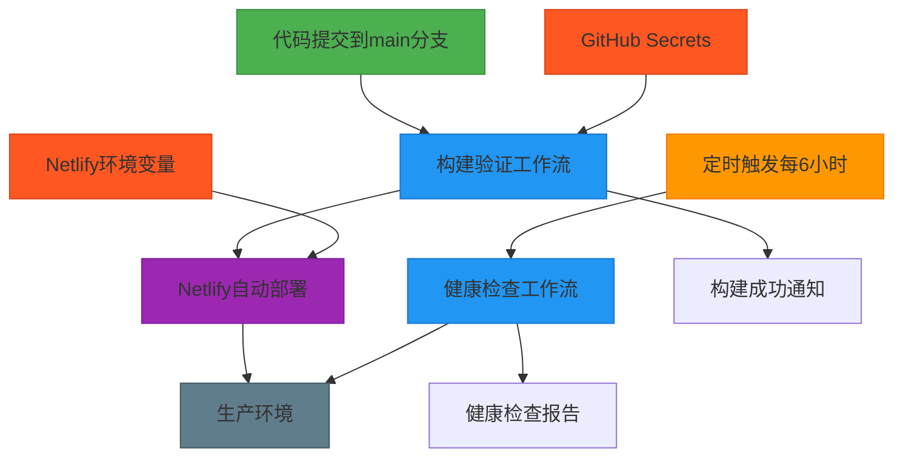

# CI/CD流水线配置

<cite>
**本文档引用文件**   
- [build-verification.yml](file://advanced-tools-navigation/github/workflows/build-verification.yml) - *构建验证工作流配置*
- [health-check.yml](file://advanced-tools-navigation/github/workflows/health-check.yml) - *健康检查工作流配置*
- [netlify.toml](file://netlify.toml) - *Netlify部署配置文件*
- [enhanced-build-verification.yml](file://.github/workflows/enhanced-build-verification.yml) - *增强版构建验证工作流*
- [performance-monitoring.yml](file://.github/workflows/performance-monitoring.yml) - *性能监控工作流*
- [package.json](file://package.json) - *项目依赖配置*
</cite>

## 更新摘要
**已做更改**   
- 更新了Netlify构建命令的配置说明，反映从`npm install --no-optional`到`npm ci`的变更
- 添加了对新增的增强版构建验证工作流的描述
- 修正了依赖安装步骤中的具体命令参数
- 更新了package.json中关于平台特定依赖的说明
- 修复了构建步骤中环境变量注入的描述

## 目录
1. [CI/CD流水线概述](#cicd流水线概述)
2. [构建验证工作流详解](#构建验证工作流详解)
3. [健康检查工作流解析](#健康检查工作流解析)
4. [Netlify部署配置](#netlify部署配置)
5. [环境变量与密钥管理](#环境变量与密钥管理)
6. [工作流依赖关系图](#工作流依赖关系图)
7. [故障排查指南](#故障排查指南)
8. [最佳实践建议](#最佳实践建议)

## CI/CD流水线概述

本项目采用GitHub Actions与Netlify集成的CI/CD流水线架构，实现了从代码提交到生产环境部署的自动化流程。系统包含两个核心工作流：构建验证工作流（build-verification.yml）和健康检查工作流（health-check.yml），配合Netlify的自动化部署机制，确保代码质量和生产环境稳定性。

流水线设计遵循现代DevOps最佳实践，通过自动化测试、构建验证和定期健康检查，保障了应用的可靠性和可维护性。整个流程从开发者的代码提交开始，经过自动化构建和测试，最终部署到生产环境，并通过定时健康检查持续监控系统可用性。

**Section sources**
- [build-verification.yml](file://advanced-tools-navigation/github/workflows/build-verification.yml#L1-L87)
- [health-check.yml](file://advanced-tools-navigation/github/workflows/health-check.yml#L1-L48)

## 构建验证工作流详解

构建验证工作流（build-verification.yml）是CI/CD流水线的核心组件，负责在代码变更时自动执行构建和验证过程。该工作流在特定条件下触发，执行一系列标准化的构建步骤，确保代码质量和构建过程的可靠性。

### 触发条件与执行环境

构建验证工作流配置了明确的触发条件，当代码推送到main分支或创建针对main分支的拉取请求时自动触发。这种配置确保了所有进入主干的代码都经过严格的构建验证，维护了主干代码的稳定性。

工作流在Ubuntu最新版本的运行器上执行，设置了20分钟的超时限制，为构建过程提供了充足的时间窗口。每个步骤也设置了独立的超时时间，防止某个步骤无限期挂起。

### 构建步骤与执行逻辑

工作流包含多个关键步骤，形成了完整的构建验证流程：

1. **代码检出**：使用actions/checkout@v4操作检出代码仓库的最新代码
2. **Node.js环境设置**：验证Node.js和npm的版本信息
3. **依赖缓存**：利用actions/cache@v3缓存node_modules，加速后续构建
4. **依赖安装**：清理npm缓存后安装项目依赖，使用`npm install --prefer-offline --no-audit`命令
5. **项目构建**：执行构建命令，注入必要的环境变量
6. **构建输出验证**：检查构建输出目录和关键文件
7. **部署通知**：向开发者提供部署状态信息

**Section sources**
- [build-verification.yml](file://advanced-tools-navigation/github/workflows/build-verification.yml#L1-L87)
- [package.json](file://package.json#L20-L21) - *构建脚本配置*

## 健康检查工作流解析

健康检查工作流（health-check.yml）是保障生产环境稳定性的关键组件，通过定期检查网站的可用性和基本功能，及时发现潜在问题。

### 触发机制与执行策略

健康检查工作流采用多模式触发机制：
- **推送触发**：当代码推送到main分支时执行
- **定时触发**：通过cron表达式"0 */6 * * *"配置为每6小时执行一次
- **手动触发**：支持通过workflow_dispatch手动触发

这种多模式触发策略确保了在代码变更和定期检查两个维度上都能及时发现系统问题。工作流在Ubuntu运行器上执行，设置了10分钟的超时限制。

### 检查内容与验证逻辑

工作流执行两项核心检查：

1. **网站可访问性检查**：使用curl命令检查https://ramusi.cn的HTTP响应码，期望获得200状态码
2. **基本功能检查**：检查网站内容是否包含关键标识"Ramusi"，验证页面内容的完整性

每项检查都包含详细的日志输出，记录检查开始和结束时间，便于问题排查和性能分析。检查结果通过简单的条件判断确定成功或失败，失败时会终止工作流并标记为失败状态。

**Section sources**
- [health-check.yml](file://advanced-tools-navigation/github/workflows/health-check.yml#L1-L48)

## Netlify部署配置

netlify.toml文件是Netlify部署的核心配置文件，定义了构建命令、发布目录和重定向规则，与GitHub Actions工作流协同工作，实现自动化部署。

### 构建与发布配置

[build]部分定义了关键的部署参数：
- **command**：指定构建命令为"npm ci && npm run build"，使用`npm ci`确保依赖安装的一致性和可重复性
- **publish**：设置发布目录为"dist"，与Vite构建输出目录保持一致

这些配置确保了构建过程的一致性和可重复性，避免了因缓存或依赖问题导致的构建差异。

### 环境变量配置

[build.environment]部分配置了构建环境的环境变量：
- **NODE_VERSION**：明确指定Node.js版本为20，确保构建环境的一致性
- **NPM_FLAGS**：设置为"--prefer-offline --no-audit"，优化依赖安装过程

这种明确的版本指定避免了因Node.js版本差异导致的构建问题，提高了构建的可预测性。

### 重定向规则配置

文件配置了多条重定向规则，确保网站访问的一致性和安全性：

1. **SPA重定向规则**：将所有路径请求重定向到index.html，支持单页应用的路由机制
2. **域名重定向规则**：将HTTP和www子域的请求永久重定向到HTTPS的主域名，提升安全性和SEO

这些重定向规则确保了用户无论通过何种方式访问网站，都能获得一致的体验。

**Section sources**
- [netlify.toml](file://netlify.toml#L1-L34)
- [package.json](file://package.json#L22-L23) - *Netlify专用构建脚本*

## 环境变量与密钥管理

项目采用分层的环境变量管理策略，结合GitHub Secrets和Netlify环境变量，安全地管理敏感配置信息。

### GitHub Secrets配置

通过setup-github-secrets.js脚本管理GitHub Actions所需的密钥，包括：
- **VITE_SUPABASE_URL**：Supabase项目的API URL
- **VITE_SUPABASE_ANON_KEY**：Supabase项目的匿名密钥
- **SUPABASE_PROJECT_REF**：Supabase项目引用ID

这些密钥在构建过程中通过${{ secrets.VITE_SUPABASE_URL }}语法注入，确保敏感信息不会暴露在代码或日志中。

### Netlify环境变量管理

Netlify环境变量用于部署时的配置，与GitHub Secrets保持同步。check-netlify-config.js脚本用于验证Netlify配置的正确性，确保：
- 构建命令正确配置
- 发布目录设置正确
- 无硬编码的环境变量

这种双重验证机制确保了部署配置的一致性和安全性。

**Section sources**
- [setup-github-secrets.js](file://scripts/deployment/setup-github-secrets.js#L1-L126)
- [check-netlify-config.js](file://scripts/deployment/check-netlify-config.js#L1-L110)

## 工作流依赖关系图

**Diagram sources**
- [build-verification.yml](file://advanced-tools-navigation/github/workflows/build-verification.yml#L1-L87)
- [health-check.yml](file://advanced-tools-navigation/github/workflows/health-check.yml#L1-L48)
- [netlify.toml](file://netlify.toml#L1-L34)

## 故障排查指南

### 构建缓存问题

**问题现象**：构建失败或出现意外行为，可能与缓存的依赖包有关。

**解决方案**：
1. 在GitHub Actions工作流中，确保构建命令包含`npm cache clean --force`
2. 手动清除Netlify构建缓存：
   - 登录Netlify控制台
   - 进入站点设置的"Build & deploy"部分
   - 点击"Clear cache and retry deploy"
3. 检查package-lock.json文件是否正确提交到版本控制

### 环境变量未生效

**问题现象**：构建或运行时提示环境变量缺失或值不正确。

**解决方案**：
1. 验证GitHub Secrets配置：
   - 检查https://github.com/jiayuwee/advanced-tools-navigation/settings/secrets/actions
   - 确保VITE_SUPABASE_URL和VITE_SUPABASE_ANON_KEY已正确设置
2. 验证Netlify环境变量：
   - 检查https://app.netlify.com/sites/[your-site]/settings/env
   - 确保环境变量与GitHub Secrets一致
3. 检查netlify.toml中是否意外硬编码了环境变量
4. 使用check-netlify-config.js脚本验证配置一致性

### 部署失败

**问题现象**：Netlify部署失败，提示根目录不存在等问题。

**解决方案**：
1. 检查Netlify站点设置中的"Base directory"是否为空
2. 确认"Build command"和"Publish directory"设置正确
3. 验证项目根目录结构，确保关键文件存在
4. 检查Vite配置文件是否正确

**Section sources**
- [build-verification.yml](file://advanced-tools-navigation/github/workflows/build-verification.yml#L1-L87)
- [health-check.yml](file://advanced-tools-navigation/github/workflows/health-check.yml#L1-L48)
- [netlify.toml](file://netlify.toml#L1-L34)
- [setup-github-secrets.js](file://scripts/deployment/setup-github-secrets.js#L1-L126)
- [check-netlify-config.js](file://scripts/deployment/check-netlify-config.js#L1-L110)

## 最佳实践建议

1. **保持配置同步**：定期使用verify-config-match.js脚本验证GitHub Secrets和Netlify环境变量的一致性
2. **监控构建时间**：关注构建步骤的执行时间，优化过长的构建过程
3. **定期审查工作流**：随着项目发展，定期审查和优化CI/CD工作流配置
4. **文档化变更**：任何CI/CD配置的变更都应在文档中记录，便于团队协作
5. **安全审计**：定期审计GitHub Secrets和Netlify环境变量，移除不再需要的密钥

通过遵循这些最佳实践，可以确保CI/CD流水线的高效、安全和可靠运行，为项目的持续交付提供坚实基础。