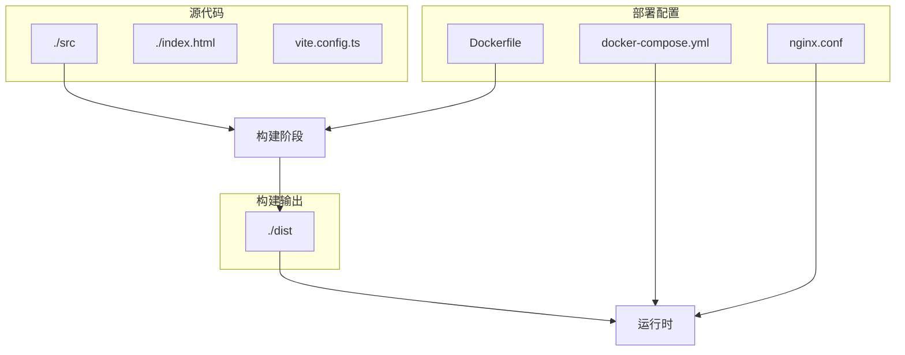
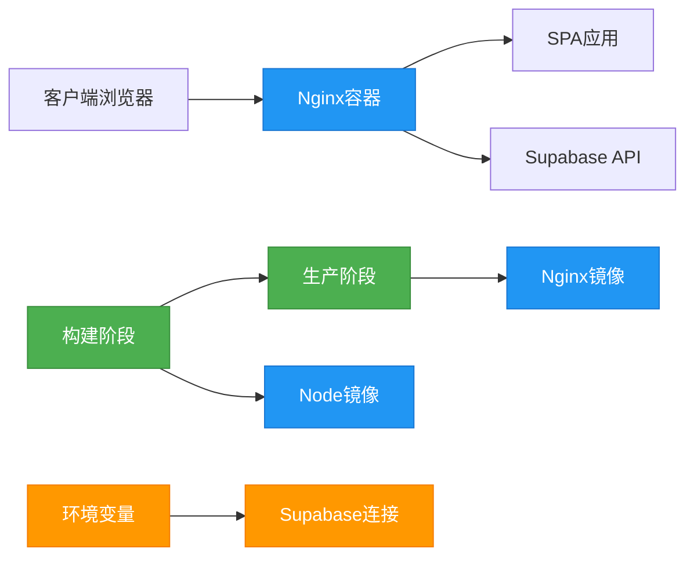
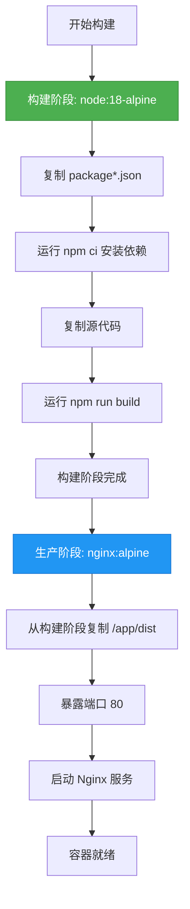
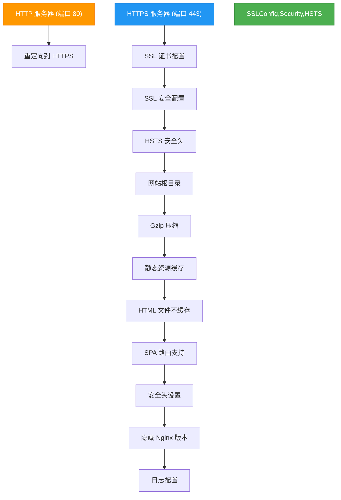
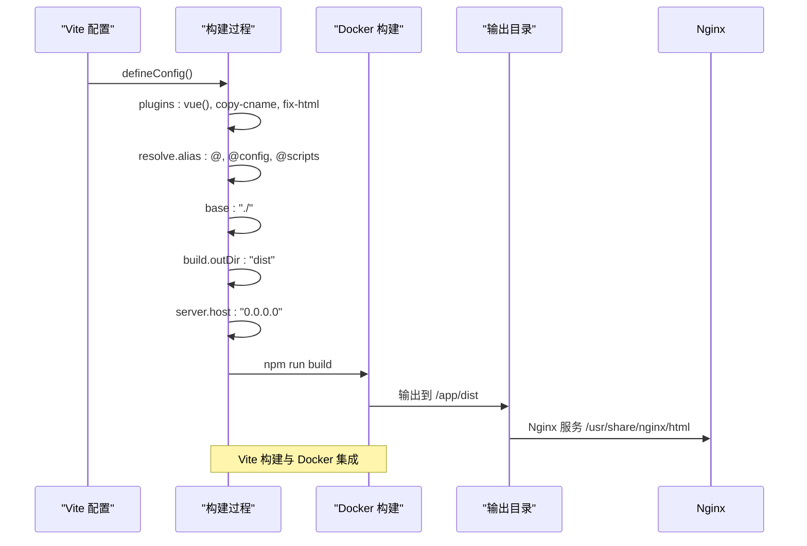
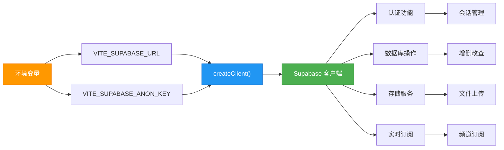
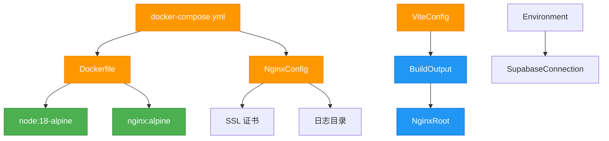

# 容器化部署方案

<cite>
**本文档引用的文件**
- [Dockerfile](file://config/deployment/Dockerfile)
- [docker-compose.yml](file://config/deployment/docker-compose.yml)
- [nginx.conf](file://config/deployment/nginx.conf)
- [vite.config.ts](file://vite.config.ts)
- [supabaseClient.ts](file://src/lib/supabaseClient.ts)
</cite>

## 目录
1. [简介](#简介)
2. [项目结构](#项目结构)
3. [核心组件](#核心组件)
4. [架构概述](#架构概述)
5. [详细组件分析](#详细组件分析)
6. [依赖分析](#依赖分析)
7. [性能考虑](#性能考虑)
8. [故障排除指南](#故障排除指南)
9. [结论](#结论)

## 简介
本文档详细说明了高级工具导航站的容器化部署实现方式，涵盖Docker多阶段构建、docker-compose服务编排、Nginx配置优化、环境变量配置等关键技术细节。

## 项目结构
项目采用分层结构设计，将部署配置集中管理，源代码与构建配置分离，便于维护和部署。



**Diagram sources**
- [Dockerfile](file://config/deployment/Dockerfile#L1-L13)
- [docker-compose.yml](file://config/deployment/docker-compose.yml#L1-L15)
- [vite.config.ts](file://vite.config.ts#L1-L101)

**Section sources**
- [Dockerfile](file://config/deployment/Dockerfile#L1-L13)
- [docker-compose.yml](file://config/deployment/docker-compose.yml#L1-L15)

## 核心组件
文档核心组件包括Docker多阶段构建策略、docker-compose服务编排、Nginx反向代理配置和Vite构建配置。

**Section sources**
- [Dockerfile](file://config/deployment/Dockerfile#L1-L13)
- [docker-compose.yml](file://config/deployment/docker-compose.yml#L1-L15)
- [nginx.conf](file://config/deployment/nginx.conf#L1-L85)
- [vite.config.ts](file://vite.config.ts#L1-L101)

## 架构概述
系统采用前后端分离的容器化部署架构，通过多阶段Docker构建优化镜像大小，使用Nginx作为静态文件服务器和反向代理。



**Diagram sources**
- [Dockerfile](file://config/deployment/Dockerfile#L1-L13)
- [docker-compose.yml](file://config/deployment/docker-compose.yml#L1-L15)
- [nginx.conf](file://config/deployment/nginx.conf#L1-L85)

## 详细组件分析

### Docker多阶段构建分析
Dockerfile采用多阶段构建策略，分离构建环境和运行环境，优化生产镜像大小和安全性。



**Diagram sources**
- [Dockerfile](file://config/deployment/Dockerfile#L1-L13)

**Section sources**
- [Dockerfile](file://config/deployment/Dockerfile#L1-L13)

### docker-compose服务编排分析
docker-compose.yml定义了应用容器的服务编排逻辑，配置端口映射、重启策略和环境变量。

```mermaid
classDiagram
class DockerCompose {
+version : '3.8'
+services : object
+networks : object
}
class WebService {
+build : '.'
+container_name : 'advanced-tools-navigation'
+ports : string[]
+restart : 'unless-stopped'
+environment : string[]
}
class NetworkConfig {
+driver : 'bridge'
}
DockerCompose --> WebService : "包含"
DockerCompose --> NetworkConfig : "包含"
classDef config fill : #FF9800,stroke : #F57C00,color : white;
classDef service fill : #2196F3,stroke : #1976D2,color : white;
class WebService,NetworkConfig service
class DockerCompose config
```

**Diagram sources**
- [docker-compose.yml](file://config/deployment/docker-compose.yml#L1-L15)

**Section sources**
- [docker-compose.yml](file://config/deployment/docker-compose.yml#L1-L15)

### Nginx配置分析
nginx.conf配置了HTTPS重定向、SSL安全设置、静态资源缓存、Gzip压缩和安全头等关键功能。



**Diagram sources**
- [nginx.conf](file://config/deployment/nginx.conf#L1-L85)

**Section sources**
- [nginx.conf](file://config/deployment/nginx.conf#L1-L85)

### Vite构建配置分析
vite.config.ts配置了构建输出路径、别名、插件和服务器设置，与容器化部署紧密集成。



**Diagram sources**
- [vite.config.ts](file://vite.config.ts#L1-L101)

**Section sources**
- [vite.config.ts](file://vite.config.ts#L1-L101)

### Supabase环境配置分析
supabaseClient.ts通过环境变量配置Supabase连接，支持开发和生产环境的无缝切换。



**Diagram sources**
- [supabaseClient.ts](file://src/lib/supabaseClient.ts#L1-L266)

**Section sources**
- [supabaseClient.ts](file://src/lib/supabaseClient.ts#L1-L266)

## 依赖分析
系统依赖关系清晰，前端应用通过环境变量连接Supabase后端服务，容器化部署确保环境一致性。



**Diagram sources**
- [Dockerfile](file://config/deployment/Dockerfile#L1-L13)
- [docker-compose.yml](file://config/deployment/docker-compose.yml#L1-L15)
- [nginx.conf](file://config/deployment/nginx.conf#L1-L85)
- [vite.config.ts](file://vite.config.ts#L1-L101)

**Section sources**
- [Dockerfile](file://config/deployment/Dockerfile#L1-L13)
- [docker-compose.yml](file://config/deployment/docker-compose.yml#L1-L15)

## 性能考虑
容器化部署带来显著性能优势，包括快速启动、资源隔离和可扩展性，同时通过配置优化提升用户体验。

**Section sources**
- [Dockerfile](file://config/deployment/Dockerfile#L1-L13)
- [nginx.conf](file://config/deployment/nginx.conf#L1-L85)
- [vite.config.ts](file://vite.config.ts#L1-L101)

### 构建和部署命令
标准的容器构建和启动命令如下：

```bash
# 构建镜像
docker build -f config/deployment/Dockerfile -t advanced-tools-navigation .

# 启动容器
docker-compose -f config/deployment/docker-compose.yml up -d

# 停止容器
docker-compose -f config/deployment/docker-compose.yml down
```

### 性能优势
- **快速启动**: 容器化应用启动时间显著缩短
- **资源效率**: 多阶段构建减少生产镜像大小
- **缓存优化**: Nginx配置静态资源长期缓存
- **压缩传输**: Gzip压缩减少网络传输量
- **安全传输**: HTTPS和安全头提升安全性

### 资源限制建议
```yaml
# 在 docker-compose.yml 中添加资源限制
services:
  web:
    # ... 其他配置
    deploy:
      resources:
        limits:
          cpus: '0.5'
          memory: 512M
        reservations:
          cpus: '0.2'
          memory: 256M
```

## 故障排除指南
常见问题及解决方案：

**Section sources**
- [Dockerfile](file://config/deployment/Dockerfile#L1-L13)
- [docker-compose.yml](file://config/deployment/docker-compose.yml#L1-L15)
- [nginx.conf](file://config/deployment/nginx.conf#L1-L85)
- [supabaseClient.ts](file://src/lib/supabaseClient.ts#L1-L266)

### 构建失败
- 检查Dockerfile路径是否正确
- 确认package.json存在且格式正确
- 验证网络连接是否正常

### 容器无法启动
- 检查端口是否被占用
- 验证环境变量配置
- 查看容器日志排查错误

### Nginx配置错误
- 验证SSL证书路径
- 检查server_name配置
- 确认文件权限

### Supabase连接问题
- 检查环境变量VITE_SUPABASE_URL和VITE_SUPABASE_ANON_KEY
- 验证Supabase项目状态
- 确认网络连接

## 结论
容器化部署方案通过Docker多阶段构建、docker-compose服务编排和Nginx优化配置，实现了高效、安全、可扩展的部署架构。该方案确保了开发、测试和生产环境的一致性，提升了应用性能和安全性，为高级工具导航站的稳定运行提供了可靠保障。