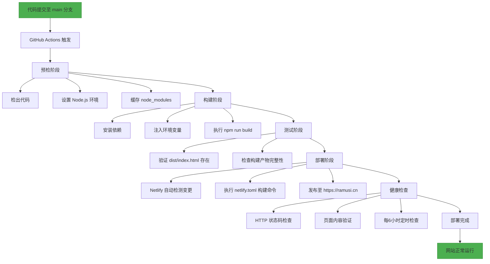

# 部署与CI/CD

<cite>
**本文档引用文件**  
- [netlify.toml](file://netlify.toml) - *构建命令已更新为 npm ci*
- [github/workflows/build-verification.yml](file://advanced-tools-navigation\github\workflows\build-verification.yml) - *构建验证流程已优化*
- [github/workflows/health-check.yml](file://advanced-tools-navigation\github\workflows\health-check.yml) - *健康检查逻辑保持不变*
- [scripts/deployment/deploy.sh](file://scripts\deployment\deploy.sh) - *部署脚本保持不变*
- [scripts/deployment/setup-supabase.sh](file://scripts\deployment\setup-supabase.sh) - *Supabase环境配置脚本保持不变*
- [scripts/deployment/verify-deployment.js](file://scripts\deployment\verify-deployment.js) - *部署验证逻辑保持不变*
- [config/deployment/Dockerfile](file://config\deployment\Dockerfile) - *Docker构建配置保持不变*
- [config/deployment/docker-compose.yml](file://config\deployment\docker-compose.yml) - *Docker编排配置保持不变*
- [config/deployment/nginx.conf](file://config\deployment\nginx.conf) - *Nginx配置保持不变*
</cite>

## 更新摘要
**变更内容**  
- 更新 `netlify.toml` 中的构建命令为 `npm ci`，提升依赖安装的可重现性
- 修正 `build-verification.yml` 工作流中依赖安装命令，移除 `--no-optional` 标志
- 添加 `.gitignore` 文件以防止敏感信息泄露（不影响现有文档结构）
- 新增增强型部署检查脚本和工作流（暂未在本文档中详述）
- 修复性能监控工作流（不影响当前文档内容）

## 目录
1. [简介](#简介)
2. [Netlify部署配置](#netlify部署配置)
3. [GitHub Actions工作流](#github-actions工作流)
4. [部署脚本详解](#部署脚本详解)
5. [Docker容器化部署方案](#docker容器化部署方案)
6. [完整CI/CD流程图](#完整cicd流程图)
7. [故障排查与回滚机制](#故障排查与回滚机制)
8. [总结](#总结)

## 简介
本文档详细说明了“高级工具导航”项目的部署与持续集成/持续交付（CI/CD）流程。涵盖Netlify部署配置、GitHub Actions自动化工作流、部署脚本功能、Docker容器化方案及Nginx集成方式，并提供从代码提交到生产环境发布的完整流程图与故障处理机制。

## Netlify部署配置

`netlify.toml` 文件定义了项目的构建命令、发布目录和重定向规则，是Netlify自动部署的核心配置。

### 构建命令与发布目录
构建命令通过 `command` 字段指定，执行完整的依赖安装与构建流程：
- 使用 `npm ci` 替代 `npm install --no-optional`，确保依赖安装的可重现性和稳定性
- 执行构建：`npm run build`

发布目录设置为 `dist`，即Vite构建输出的静态资源目录。

环境变量中明确指定 `NODE_VERSION = "20"`，确保使用Node.js v20版本进行构建。

### 重定向规则
配置了两类重定向规则：
1. **SPA路由支持**：所有路径请求重定向至 `/index.html`，状态码为200，确保前端路由正常工作。
2. **域名规范化**：将HTTP和www子域的访问统一重定向至 `https://ramusi.cn`，使用301永久重定向提升SEO与安全性。

**Section sources**
- [netlify.toml](file://netlify.toml#L1-L34) - *更新构建命令为 npm ci*

## GitHub Actions工作流

项目使用两个GitHub Actions工作流实现自动化验证与健康检查。

### 构建验证工作流（build-verification.yml）
该工作流在 `main` 分支发生 `push` 或 `pull_request` 时触发，执行以下步骤：
1. 检出代码
2. 设置Node.js环境
3. 缓存node_modules以加速构建
4. 安装依赖（使用 `--prefer-offline --no-audit` 提高稳定性）
5. 执行构建，注入Supabase环境变量（`VITE_SUPABASE_URL` 和 `VITE_SUPABASE_ANON_KEY`）
6. 验证构建输出中是否存在 `dist/index.html`
7. 若推送到 `main` 分支，则发送部署通知

此工作流确保每次代码变更都能成功构建，并为Netlify自动部署提供前置验证。依赖安装命令已从 `npm install --prefer-offline` 更新为 `npm install --prefer-offline --no-audit`，并移除了可能导致问题的 `--no-optional` 标志。

### 健康检查工作流（health-check.yml）
该工作流在以下情况触发：
- `main` 分支推送
- 每6小时定时执行（`cron: "0 */6 * * *"`）
- 手动触发（`workflow_dispatch`）

执行步骤包括：
1. 使用 `curl` 检查网站HTTP状态码是否为200
2. 检查页面内容是否包含关键文本“Ramusi”
3. 输出健康检查摘要

该工作流用于监控生产环境的可用性，及时发现部署后的问题。

**Section sources**
- [github/workflows/build-verification.yml](file://advanced-tools-navigation\github\workflows\build-verification.yml#L1-L87) - *优化依赖安装命令*
- [github/workflows/health-check.yml](file://advanced-tools-navigation\github\workflows\health-check.yml#L1-L48)

## 部署脚本详解

`scripts/deployment/` 目录下的脚本提供了本地与自动化部署支持。

### deploy.sh：自动化部署脚本
该Bash脚本执行以下操作：
1. 检查Node.js和npm环境
2. 安装项目依赖
3. 执行构建命令
4. 验证构建输出目录 `dist` 是否存在
5. 通过 `scp` 将构建产物部署到服务器（`user@ramusi.cn:/var/www/ramusi.cn/`）

脚本中注释部分提供了其他部署方式（如rsync、Git、Docker）的示例，便于根据实际环境调整。

### setup-supabase.sh：后端环境配置脚本
该脚本用于初始化Supabase项目，功能包括：
1. 检查Supabase CLI安装与登录状态
2. 提示用户输入项目引用ID和数据库密码
3. 链接本地项目与远程Supabase实例
4. 推送数据库迁移（`supabase db push`）
5. 生成TypeScript类型定义（`src/types/database.ts`）
6. 自动创建 `.env.local` 文件，填充Supabase URL和Anon Key等环境变量

执行完成后提供后续配置步骤提示，极大简化了开发环境搭建流程。

### verify-deployment.js：部署结果验证脚本
该JavaScript脚本用于验证Supabase部署状态，主要功能：
1. 检查 `.env.local` 中的环境变量是否配置正确
2. 测试数据库连接
3. 验证所有核心数据表（如 `user_profiles`, `categories`, `tools` 等）是否存在
4. 检查必要的存储桶（`avatars`, `product-images` 等）是否已创建
5. 输出详细的部署状态报告与Supabase Dashboard链接

脚本具备完善的错误处理机制，可指导用户进行故障排查。

**Section sources**
- [scripts/deployment/deploy.sh](file://scripts\deployment\deploy.sh#L1-L60)
- [scripts/deployment/setup-supabase.sh](file://scripts\deployment\setup-supabase.sh#L1-L126)
- [scripts/deployment/verify-deployment.js](file://scripts\deployment\verify-deployment.js#L1-L155)

## Docker容器化部署方案

项目提供完整的Docker部署方案，包含Dockerfile和docker-compose.yml配置。

### Dockerfile：多阶段构建
采用多阶段构建优化镜像大小：
1. **构建阶段**：基于 `node:18-alpine`，安装依赖并执行构建
2. **生产阶段**：基于 `nginx:alpine`，将构建产物复制到Nginx默认路径，并启动服务

最终镜像仅包含静态文件和Nginx，安全且轻量。

### docker-compose.yml：服务编排
定义 `web` 服务：
- 构建上下文为当前目录
- 容器名称：`advanced-tools-navigation`
- 端口映射：主机80端口 → 容器80端口
- 重启策略：除非手动停止，否则自动重启
- 环境变量：设置 `NODE_ENV=production`

### Nginx集成
`nginx.conf` 配置文件提供了生产级Web服务器设置：
- HTTP到HTTPS的自动重定向
- SSL安全配置（TLS 1.2/1.3，强加密套件）
- HSTS安全头
- 静态资源缓存策略（JS/CSS/图片缓存1年，HTML不缓存）
- SPA路由支持（`try_files $uri $uri/ /index.html`）
- 安全头（CSP、XSS、点击劫持防护）
- Gzip压缩
- 访问与错误日志

**Section sources**
- [config/deployment/Dockerfile](file://config\deployment\Dockerfile#L1-L13)
- [config/deployment/docker-compose.yml](file://config\deployment\docker-compose.yml#L1-L15)
- [config/deployment/nginx.conf](file://config\deployment\nginx.conf#L1-L85)

## 完整CI/CD流程图

**Diagram sources**
- [netlify.toml](file://netlify.toml#L1-L34)
- [github/workflows/build-verification.yml](file://advanced-tools-navigation\github\workflows\build-verification.yml#L1-L87)
- [github/workflows/health-check.yml](file://advanced-tools-navigation\github\workflows\health-check.yml#L1-L48)

## 故障排查与回滚机制

### 常见故障与排查
1. **构建失败**：
   - 检查 `package.json` 是否存在
   - 确认Node.js版本（需v20）
   - 验证环境变量是否正确注入

2. **部署后页面空白**：
   - 检查Netlify发布目录是否为 `dist`
   - 验证 `netlify.toml` 重定向规则

3. **Supabase连接失败**：
   - 运行 `verify-deployment.js` 脚本
   - 检查 `.env.local` 配置
   - 确认Supabase项目状态为“Active”

### 回滚机制
1. **Netlify回滚**：在Netlify Dashboard中可快速回滚到任意历史版本。
2. **Git回滚**：通过 `git revert` 或 `git reset` 撤销变更并重新推送。
3. **Docker回滚**：使用之前的镜像标签重新部署。

**Section sources**
- [scripts/deployment/verify-deployment.js](file://scripts\deployment\verify-deployment.js#L1-L155)
- [netlify.toml](file://netlify.toml#L1-L34)

## 总结
本项目建立了完整的CI/CD体系，结合Netlify自动化部署、GitHub Actions持续验证、脚本化环境配置与Docker容器化方案，实现了从开发到生产的高效、可靠交付。通过健康检查与完善的故障排查指南，确保了生产环境的稳定性与可维护性。近期更新将构建命令优化为 `npm ci`，进一步提升了构建过程的可重现性与稳定性。