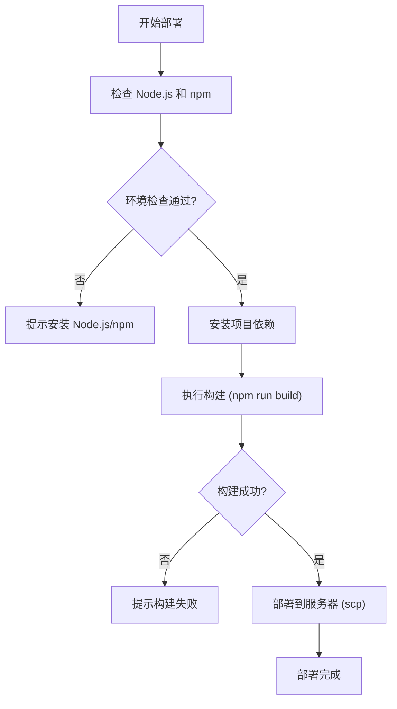
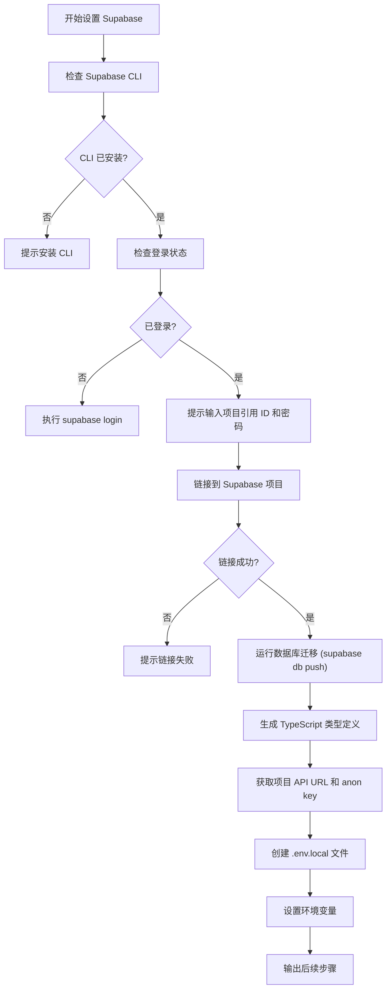
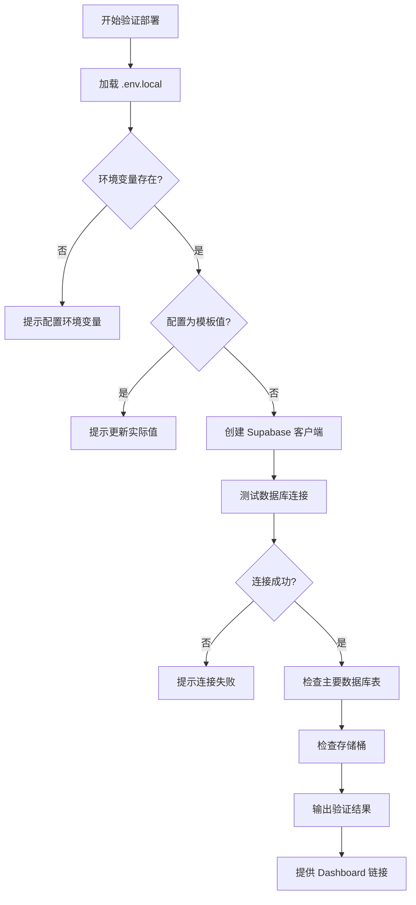
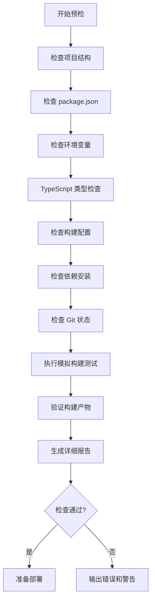
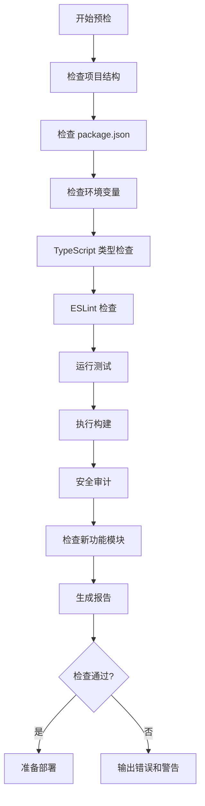
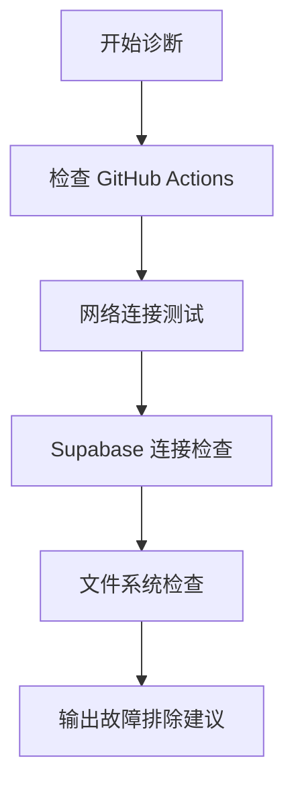

# 部署脚本详解

<cite>
**本文档引用文件**  
- [deploy.sh](file://scripts/deployment/deploy.sh) - *部署执行脚本（Linux/macOS）*
- [deploy.ps1](file://scripts/deployment/deploy.ps1) - *部署执行脚本（Windows）*
- [setup-supabase.sh](file://scripts/deployment/setup-supabase.sh) - *Supabase 环境配置脚本（Linux/macOS）*
- [setup-supabase.ps1](file://scripts/deployment/setup-supabase.ps1) - *Supabase 环境配置脚本（Windows）*
- [verify-deployment.js](file://scripts/deployment/verify-deployment.js) - *部署验证脚本*
- [pre-deploy-check.mjs](file://scripts/deployment/pre-deploy-check.mjs) - *基础预部署检查脚本*
- [enhanced-pre-deploy-check.mjs](file://scripts/deployment/enhanced-pre-deploy-check.mjs) - *增强版预部署检查脚本（新增）*
- [diagnose-deployment.js](file://scripts/deployment/diagnose-deployment.js) - *部署诊断脚本*
</cite>

## 更新摘要
**变更内容**  
- 新增对 `enhanced-pre-deploy-check.mjs` 脚本的详细说明，该脚本为新增的增强版预部署检查工具
- 更新“预检与诊断脚本”章节，增加 `enhanced-pre-deploy-check.mjs` 的功能描述、检查流程和使用示例
- 更新“命令行使用示例”章节，增加 `enhanced-pre-deploy-check.mjs` 的调用方式
- 更新“脚本协作关系”图表，反映新脚本在部署流程中的位置
- 更新文档引用文件列表，包含新增的 `enhanced-pre-deploy-check.mjs`

## 目录
1. [简介](#简介)
2. [部署脚本功能概览](#部署脚本功能概览)
3. [自动化部署流程](#自动化部署流程)
4. [Supabase环境配置](#supabase环境配置)
5. [部署验证机制](#部署验证机制)
6. [预检与诊断脚本](#预检与诊断脚本)
7. [脚本协作关系](#脚本协作关系)
8. [命令行使用示例](#命令行使用示例)
9. [总结](#总结)

## 简介
本文件系统性地解析 `scripts/deployment/` 目录下的核心部署脚本，涵盖跨平台自动化部署、Supabase环境初始化、部署前检查、部署后验证及故障诊断等关键流程。所有脚本均遵循最佳实践，确保部署过程的可靠性与可维护性。

## 部署脚本功能概览
`scripts/deployment/` 目录包含一系列用于自动化部署和环境管理的脚本，主要分为以下几类：
- **部署执行脚本**：`deploy.sh`（Linux/macOS）和 `deploy.ps1`（Windows），负责依赖安装、项目构建和服务器部署。
- **环境配置脚本**：`setup-supabase.sh` 和 `setup-supabase.ps1`，用于初始化 Supabase 项目、运行数据库迁移并生成环境变量。
- **验证与诊断脚本**：`verify-deployment.js` 用于验证部署状态，`diagnose-deployment.js` 用于故障排查。
- **预检脚本**：`pre-deploy-check.mjs` 和 `enhanced-pre-deploy-check.mjs` 在部署前执行全面的健康检查。

**Section sources**
- [deploy.sh](file://scripts/deployment/deploy.sh#L1-L60)
- [deploy.ps1](file://scripts/deployment/deploy.ps1#L1-L38)
- [setup-supabase.sh](file://scripts/deployment/setup-supabase.sh#L1-L126)
- [setup-supabase.ps1](file://scripts/deployment/setup-supabase.ps1#L1-L138)
- [verify-deployment.js](file://scripts/deployment/verify-deployment.js#L1-L155)
- [pre-deploy-check.mjs](file://scripts/deployment/pre-deploy-check.mjs#L1-L370)
- [enhanced-pre-deploy-check.mjs](file://scripts/deployment/enhanced-pre-deploy-check.mjs#L1-L364) - *新增文件*
- [diagnose-deployment.js](file://scripts/deployment/diagnose-deployment.js#L1-L169)

## 自动化部署流程
`deploy.sh` 和 `deploy.ps1` 是跨平台的自动化部署脚本，其核心流程如下：

### Linux/macOS 部署流程 (deploy.sh)


**Diagram sources**
- [deploy.sh](file://scripts/deployment/deploy.sh#L1-L60)

### Windows 部署流程 (deploy.ps1)


**Diagram sources**
- [deploy.ps1](file://scripts/deployment/deploy.ps1#L1-L38)

**Section sources**
- [deploy.sh](file://scripts/deployment/deploy.sh#L1-L60)
- [deploy.ps1](file://scripts/deployment/deploy.ps1#L1-L38)

## Supabase环境配置
`setup-supabase.sh` 和 `setup-supabase.ps1` 脚本用于自动化配置 Supabase 开发环境，确保数据库、类型定义和环境变量的一致性。

### Supabase 初始化流程


**Diagram sources**
- [setup-supabase.sh](file://scripts/deployment/setup-supabase.sh#L1-L126)
- [setup-supabase.ps1](file://scripts/deployment/setup-supabase.ps1#L1-L138)

**Section sources**
- [setup-supabase.sh](file://scripts/deployment/setup-supabase.sh#L1-L126)
- [setup-supabase.ps1](file://scripts/deployment/setup-supabase.ps1#L1-L138)

## 部署验证机制
`verify-deployment.js` 脚本用于验证 Supabase 部署的完整性，确保数据库、表和存储桶均已正确配置。

### 验证流程


**Diagram sources**
- [verify-deployment.js](file://scripts/deployment/verify-deployment.js#L1-L155)

**Section sources**
- [verify-deployment.js](file://scripts/deployment/verify-deployment.js#L1-L155)

## 预检与诊断脚本

### 增强版预部署检查 (enhanced-pre-deploy-check.mjs)
新增的 `enhanced-pre-deploy-check.mjs` 脚本提供了更全面的部署前健康检查功能，相比基础版本增加了实时构建测试和更详细的报告输出。

**检查项包括**：
- 项目文件结构完整性
- `package.json` 脚本与依赖项
- 环境变量配置
- TypeScript 类型检查
- 构建配置检查
- 依赖安装状态
- Git 工作区状态
- **新增：模拟构建测试**（实际执行 `npm run build`）
- **新增：构建产物验证**（检查 `dist` 目录和 `index.html`）



**Diagram sources**
- [enhanced-pre-deploy-check.mjs](file://scripts/deployment/enhanced-pre-deploy-check.mjs#L1-L364) - *新增图表*

### 基础预部署检查 (pre-deploy-check.mjs)
该脚本在部署前执行全面的健康检查，确保项目处于可部署状态。

**检查项包括**：
- 项目文件结构完整性
- `package.json` 脚本与依赖项
- 环境变量配置
- TypeScript 类型检查
- ESLint 代码质量
- 测试套件运行
- 构建输出验证
- 依赖项安全审计
- 新功能模块检查



**Diagram sources**
- [pre-deploy-check.mjs](file://scripts/deployment/pre-deploy-check.mjs#L1-L370)

### 部署诊断 (diagnose-deployment.js)
该脚本用于诊断部署失败的原因，提供详细的故障排除建议。

**诊断流程**：
- 检查 GitHub Actions 工作流状态
- 执行网络连接测试（GitHub API、Netlify API、站点）
- 验证 Supabase 连接
- 检查关键文件和依赖项
- 提供 Context7 推荐的故障排除步骤



**Diagram sources**
- [diagnose-deployment.js](file://scripts/deployment/diagnose-deployment.js#L1-L169)

**Section sources**
- [pre-deploy-check.mjs](file://scripts/deployment/pre-deploy-check.mjs#L1-L370)
- [enhanced-pre-deploy-check.mjs](file://scripts/deployment/enhanced-pre-deploy-check.mjs#L1-L364) - *新增文件*
- [diagnose-deployment.js](file://scripts/deployment/diagnose-deployment.js#L1-L169)

## 脚本协作关系
各脚本之间存在明确的执行顺序和依赖关系：

```mermaid
graph LR
A[pre-deploy-check.mjs] --> B[enhanced-pre-deploy-check.mjs]
B --> C[setup-supabase.sh/.ps1]
C --> D[deploy.sh/.ps1]
D --> E[verify-deployment.js]
E --> F[diagnose-deployment.js]
style A fill:#f9f,stroke:#333
style B fill:#9cf,stroke:#333
style C fill:#bbf,stroke:#333
style D fill:#f96,stroke:#333
style E fill:#6f9,stroke:#333
style F fill:#f66,stroke:#333
click A "file://scripts/deployment/pre-deploy-check.mjs" "pre-deploy-check.mjs"
click B "file://scripts/deployment/enhanced-pre-deploy-check.mjs" "enhanced-pre-deploy-check.mjs"
click C "file://scripts/deployment/setup-supabase.sh" "setup-supabase.sh"
click D "file://scripts/deployment/deploy.sh" "deploy.sh"
click E "file://scripts/deployment/verify-deployment.js" "verify-deployment.js"
click F "file://scripts/deployment/diagnose-deployment.js" "diagnose-deployment.js"
```



**Diagram sources**
- [pre-deploy-check.mjs](file://scripts/deployment/pre-deploy-check.mjs#L1-L370)
- [enhanced-pre-deploy-check.mjs](file://scripts/deployment/enhanced-pre-deploy-check.mjs#L1-L364) - *新增文件*
- [setup-supabase.sh](file://scripts/deployment/setup-supabase.sh#L1-L126)
- [deploy.sh](file://scripts/deployment/deploy.sh#L1-L60)
- [verify-deployment.js](file://scripts/deployment/verify-deployment.js#L1-L155)
- [diagnose-deployment.js](file://scripts/deployment/diagnose-deployment.js#L1-L169)

## 命令行使用示例

### 部署脚本
```bash
# Linux/macOS
./scripts/deployment/deploy.sh

# Windows
.\scripts\deployment\deploy.ps1
```

### Supabase 配置
```bash
# Linux/macOS
./scripts/deployment/setup-supabase.sh

# Windows
.\scripts\deployment\setup-supabase.ps1
```

### 验证与诊断
```bash
# 验证部署
node scripts/deployment/verify-deployment.js

# 诊断问题
node scripts/deployment/diagnose-deployment.js
```

### 预检
```bash
# 基础预检
node scripts/deployment/pre-deploy-check.mjs

# 增强版预检（推荐）
node scripts/deployment/enhanced-pre-deploy-check.mjs
```

**Section sources**
- [deploy.sh](file://scripts/deployment/deploy.sh#L1-L60)
- [deploy.ps1](file://scripts/deployment/deploy.ps1#L1-L38)
- [setup-supabase.sh](file://scripts/deployment/setup-supabase.sh#L1-L126)
- [setup-supabase.ps1](file://scripts/deployment/setup-supabase.ps1#L1-L138)
- [verify-deployment.js](file://scripts/deployment/verify-deployment.js#L1-L155)
- [pre-deploy-check.mjs](file://scripts/deployment/pre-deploy-check.mjs#L1-L370)
- [enhanced-pre-deploy-check.mjs](file://scripts/deployment/enhanced-pre-deploy-check.mjs#L1-L364) - *新增文件*
- [diagnose-deployment.js](file://scripts/deployment/diagnose-deployment.js#L1-L169)

## 总结
本文档详细解析了 `scripts/deployment/` 目录下的所有核心脚本，涵盖了从环境配置、预检、部署、验证到诊断的完整生命周期。特别新增了对 `enhanced-pre-deploy-check.mjs` 脚本的说明，该脚本通过引入模拟构建测试和实时产物验证，显著提升了部署前检查的准确性和可靠性。这些脚本共同构成了一个健壮、可靠的自动化部署体系，确保开发与生产环境的一致性，并极大提升了部署效率与可维护性。