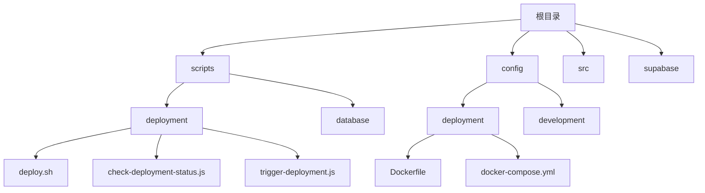
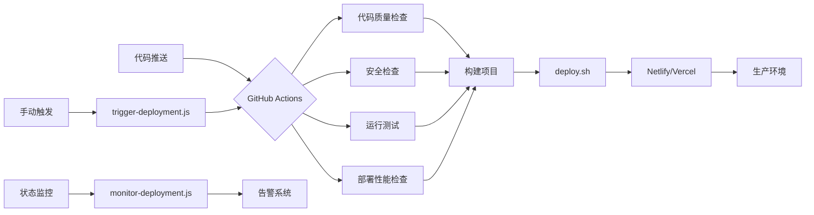
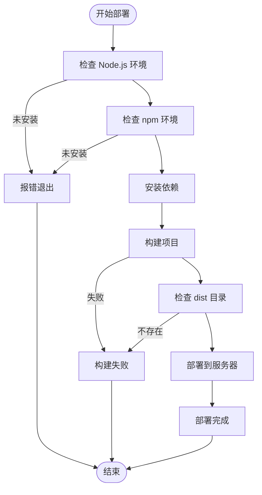
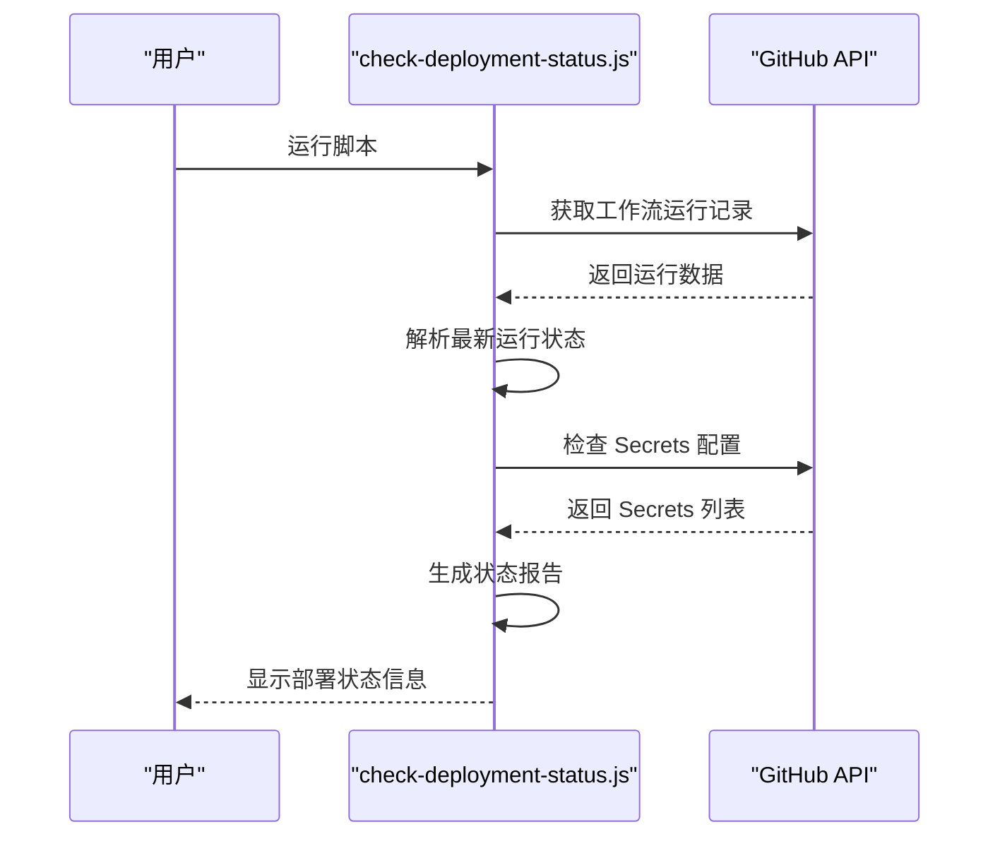
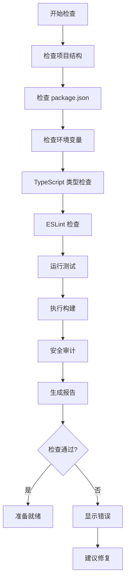
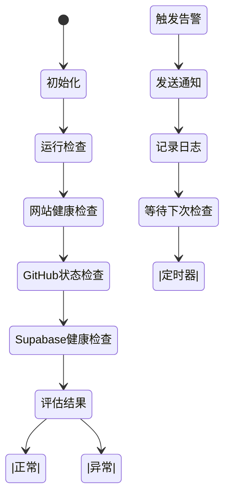
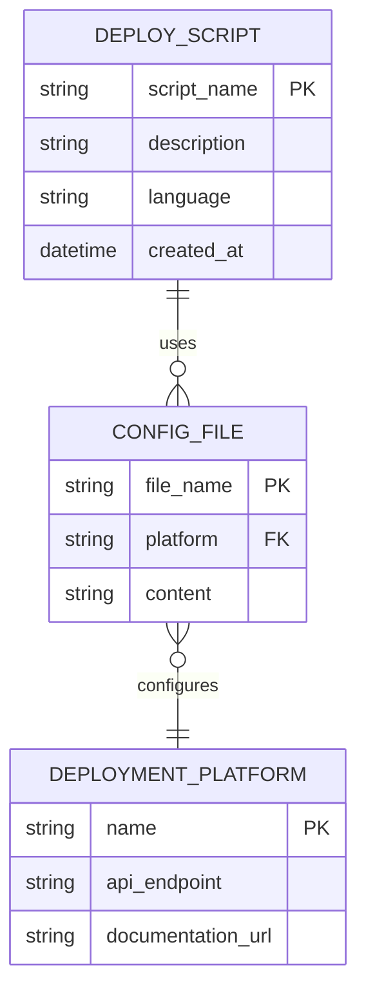

# CI/CD 自动化部署流程

<cite>
**本文档引用文件**   
- [deploy.sh](file://scripts/deployment/deploy.sh)
- [check-deployment-status.js](file://scripts/deployment/check-deployment-status.js)
- [trigger-deployment.js](file://scripts/deployment/trigger-deployment.js)
- [netlify.toml](file://netlify.toml)
- [vercel.json](file://vercel.json)
- [package.json](file://package.json)
- [monitor-deployment.js](file://scripts/deployment/monitor-deployment.js)
- [verify-deployment.js](file://scripts/deployment/verify-deployment.js)
- [pre-deploy-check.mjs](file://scripts/deployment/pre-deploy-check.mjs)
- [deploy-test.js](file://scripts/deployment/deploy-test.js)
- [Dockerfile](file://config/deployment/Dockerfile)
- [docker-compose.yml](file://config/deployment/docker-compose.yml)
</cite>

## 目录
1. [简介](#简介)
2. [项目结构](#项目结构)
3. [核心组件](#核心组件)
4. [架构概述](#架构概述)
5. [详细组件分析](#详细组件分析)
6. [依赖分析](#依赖分析)
7. [性能考虑](#性能考虑)
8. [故障排除指南](#故障排除指南)
9. [结论](#结论)

## 简介
本技术文档详细说明了基于GitHub Actions的自动化部署流水线设计，涵盖从代码推送触发构建、预览环境生成到生产环境发布的完整流程。重点分析`deploy.sh`脚本中的部署逻辑、`check-deployment-status.js`的状态监控机制以及`trigger-deployment.js`的外部触发能力。同时解释如何通过脚本与Netlify/Vercel API集成实现部署状态回传和通知，并提供部署失败时的日志定位方法和快速恢复方案。

**Section sources**
- [README.md](file://README.md#L1-L50)

## 项目结构
该项目采用模块化设计，将不同功能的脚本分类存放于特定目录中。部署相关的核心脚本位于`scripts/deployment`目录下，包括部署执行、状态检查、环境验证等关键功能。配置文件如`netlify.toml`和`vercel.json`分别用于Netlify和Vercel平台的部署配置。项目的整体结构清晰地划分了开发、测试和生产环境所需的各类资源和配置。

**Diagram sources **
- [scripts/deployment](file://scripts/deployment)
- [config/deployment](file://config/deployment)

**Section sources**
- [project_structure](file://project_structure#L1-L100)

## 核心组件

### 部署执行脚本 (deploy.sh)
该Shell脚本是整个部署流程的入口点，负责执行依赖安装、项目构建和最终部署操作。它首先验证Node.js和npm环境的存在性，然后依次执行依赖安装和构建命令。构建完成后，使用scp命令将dist目录下的内容复制到远程服务器。

**Section sources**
- [deploy.sh](file://scripts/deployment/deploy.sh#L1-L61)

### 部署状态检查 (check-deployment-status.js)
此JavaScript脚本利用Octokit库与GitHub API交互，获取最近的工作流运行记录并显示其状态。它可以检查Supabase部署工作流的状态，并验证仓库secrets的配置情况，为开发者提供全面的部署状态概览。

**Section sources**
- [check-deployment-status.js](file://scripts/deployment/check-deployment-status.js#L1-L192)

### 外部部署触发 (trigger-deployment.js)
该脚本允许用户手动触发GitHub Actions部署流程。通过Octokit库调用createWorkflowDispatch方法，可以启动指定的工作流，支持传递参数来控制部署行为。这对于需要在特定时间或条件下进行部署的场景非常有用。

**Section sources**
- [trigger-deployment.js](file://scripts/deployment/trigger-deployment.js#L1-L181)

## 架构概述

**Diagram sources **
- [package.json](file://package.json#L20-L40)
- [netlify.toml](file://netlify.toml#L1-L12)
- [vercel.json](file://vercel.json#L1-L37)

## 详细组件分析

### 部署流程分析
#### 部署执行流程

**Diagram sources **
- [deploy.sh](file://scripts/deployment/deploy.sh#L1-L61)

#### 部署状态检查流程

**Diagram sources **
- [check-deployment-status.js](file://scripts/deployment/check-deployment-status.js#L1-L192)

### 验证与监控机制
#### 部署前检查流程

**Diagram sources **
- [pre-deploy-check.mjs](file://scripts/deployment/pre-deploy-check.mjs#L1-L371)

#### 健康监控流程

**Diagram sources **
- [monitor-deployment.js](file://scripts/deployment/monitor-deployment.js#L1-L356)

## 依赖分析

**Diagram sources **
- [netlify.toml](file://netlify.toml#L1-L12)
- [vercel.json](file://vercel.json#L1-L37)
- [package.json](file://package.json#L1-L104)

**Section sources**
- [package.json](file://package.json#L1-L104)
- [netlify.toml](file://netlify.toml#L1-L12)
- [vercel.json](file://vercel.json#L1-L37)

## 性能考虑
虽然当前部署流程已经相对高效，但仍有一些优化空间。例如，在`deploy.sh`脚本中可以添加缓存机制以减少重复下载依赖的时间。对于大型项目，可以考虑使用增量部署策略，只上传发生变化的文件。此外，通过并行执行非依赖性的检查任务（如代码质量和安全性检查），可以进一步缩短整体部署时间。

## 故障排除指南
当部署失败时，应按照以下步骤进行排查：
1. 首先查看GitHub Actions的运行日志，确定失败发生在哪个阶段
2. 检查`run_*_logs`目录下的详细日志文件，获取更具体的错误信息
3. 使用`check-deployment-status.js`脚本确认当前部署状态
4. 如果涉及外部服务（如Supabase），使用`verify-deployment.js`验证连接配置
5. 对于网络相关问题，检查防火墙设置和DNS解析是否正常

常见问题及解决方案：
- **SSH认证失败**：检查SSH密钥配置，确保公钥已正确添加到服务器
- **构建失败**：运行`pre-deploy-check.mjs`进行全面检查，修复发现的问题
- **部署路径不存在**：联系运维人员创建相应的部署目录
- **API验证失败**：检查健康检查端点配置是否正确

**Section sources**
- [run_17963096784_logs](file://run_17963096784_logs)
- [run_17963096786_logs](file://run_17963096786_logs)
- [monitor-deployment.js](file://scripts/deployment/monitor-deployment.js#L1-L356)

## 结论
本项目建立了一套完整的CI/CD自动化部署流水线，通过GitHub Actions实现了从代码提交到生产环境发布的全流程自动化。核心脚本`deploy.sh`、`check-deployment-status.js`和`trigger-deployment.js`各司其职，共同构成了一个健壮的部署系统。配合Netlify和Vercel的集成配置，能够快速响应代码变更并及时反馈部署状态。建议定期审查和优化部署流程，以适应项目发展的需求。