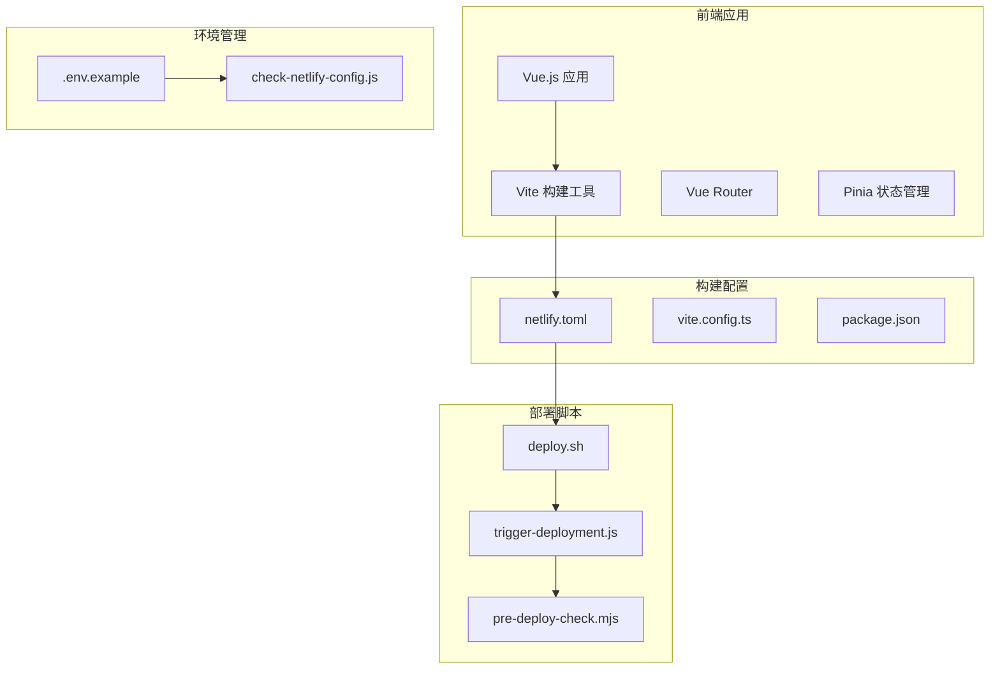
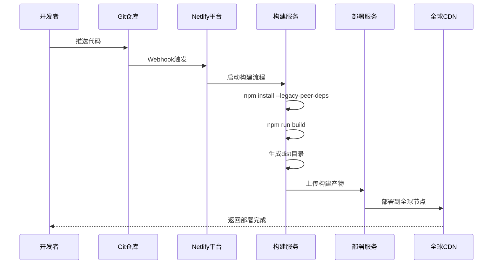
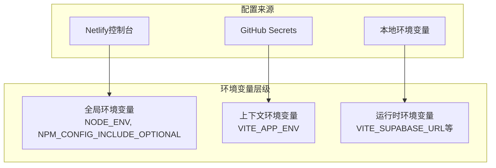
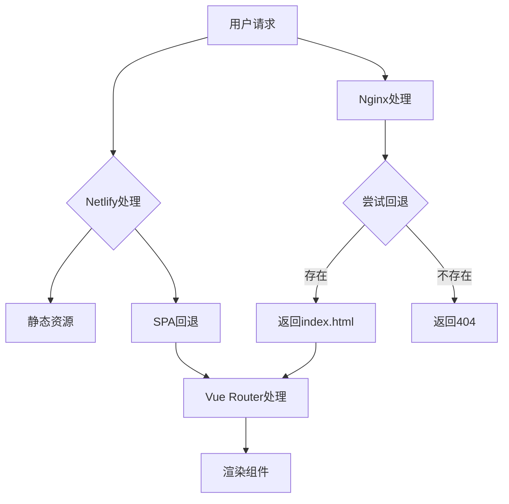
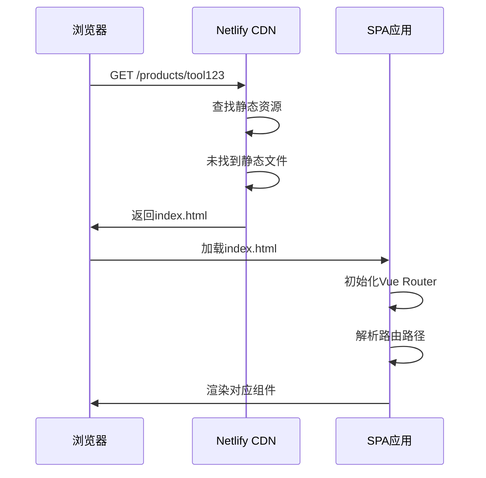
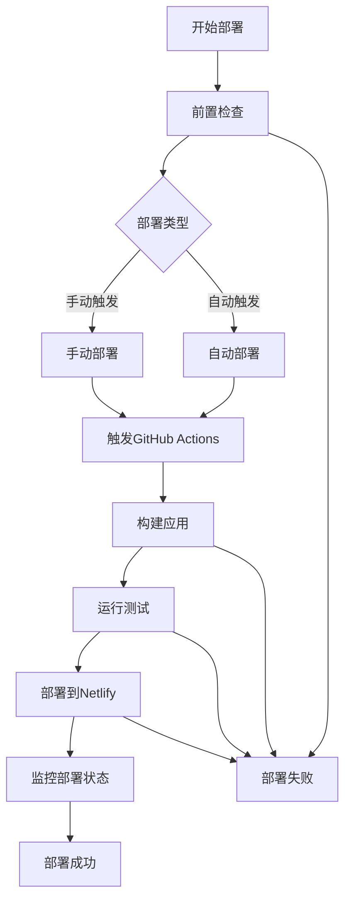
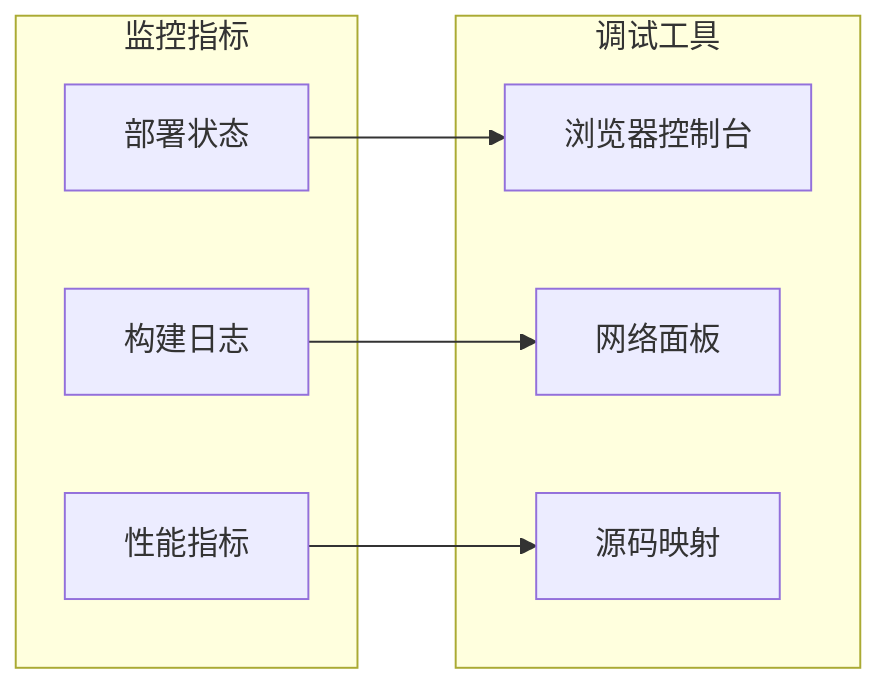

# Netlify 部署配置详解

<cite>
**本文档引用的文件**
- [netlify.toml](file://netlify.toml)
- [vite.config.ts](file://vite.config.ts)
- [package.json](file://package.json)
- [nginx.conf](file://config/deployment/nginx.conf)
- [check-netlify-config.js](file://scripts/deployment/check-netlify-config.js)
- [pre-deploy-check.mjs](file://scripts/deployment/pre-deploy-check.mjs)
- [deploy.sh](file://scripts/deployment/deploy.sh)
- [trigger-deployment.js](file://scripts/deployment/trigger-deployment.js)
- [.env.example](file://.env.example)
- [netlify-domain-migration.js](file://scripts/deployment/netlify-domain-migration.js)
</cite>

## 目录
1. [简介](#简介)
2. [项目结构概览](#项目结构概览)
3. [核心配置文件分析](#核心配置文件分析)
4. [构建流程架构](#构建流程架构)
5. [环境变量管理](#环境变量管理)
6. [与Nginx配置的对比分析](#与nginx配置的对比分析)
7. [单页应用路由支持机制](#单页应用路由支持机制)
8. [部署脚本系统](#部署脚本系统)
9. [故障排查指南](#故障排查指南)
10. [最佳实践建议](#最佳实践建议)
11. [总结](#总结)

## 简介

本文档深入解析了基于Vue.js和Vite构建的现代Web应用在Netlify平台上的部署配置。该项目是一个复杂的单页应用(SPA)，包含了完整的CI/CD流水线、环境变量管理、域名迁移等功能模块。通过分析netlify.toml配置文件及其相关脚本，我们将深入了解Netlify平台的部署机制、构建流程以及与传统Web服务器(Nginx)的配置差异。

## 项目结构概览

该项目采用现代化的前端工程化架构，主要包含以下关键组件：



**图表来源**
- [vite.config.ts](file://vite.config.ts#L1-L104)
- [netlify.toml](file://netlify.toml#L1-L12)
- [deploy.sh](file://scripts/deployment/deploy.sh#L1-L61)

## 核心配置文件分析

### Netlify TOML配置详解

netlify.toml是Netlify平台的核心配置文件，定义了整个应用的构建和部署行为：

```toml
[build]
  # 优化构建命令，使用 --legacy-peer-deps 解决依赖冲突
  command = "npm install --legacy-peer-deps --prefer-offline --no-audit --include=optional && npm run build"
  publish = "dist"

[build.environment]
  NODE_ENV = "production"
  NPM_CONFIG_INCLUDE_OPTIONAL = "true"

[context.production.environment]
  VITE_APP_ENV = "production"
```

#### 构建命令分析

构建命令包含了多个优化选项：
- `--legacy-peer-deps`: 解决依赖版本冲突问题
- `--prefer-offline`: 优先使用本地缓存
- `--no-audit`: 禁用安全审计，加快构建速度
- `--include=optional`: 包含可选依赖

#### 环境变量配置

Netlify提供了分层的环境变量管理：

1. **全局环境变量**: 在`[build.environment]`中定义
2. **上下文特定环境变量**: 在`[context.production.environment]`中定义

**章节来源**
- [netlify.toml](file://netlify.toml#L1-L12)

### Vite配置集成

Vite配置文件与Netlify配置紧密配合：

```typescript
export default defineConfig({
  build: {
    outDir: "dist",
    assetsDir: "assets",
    sourcemap: true,
    minify: "terser",
  },
  base: "/",
})
```

**章节来源**
- [vite.config.ts](file://vite.config.ts#L1-L104)

## 构建流程架构

### 完整构建流程图



**图表来源**
- [netlify.toml](file://netlify.toml#L3-L4)
- [deploy.sh](file://scripts/deployment/deploy.sh#L15-L25)

### 构建优化策略

Netlify平台提供了多种构建优化选项：

1. **依赖缓存**: 利用Netlify的自动依赖缓存机制
2. **并行构建**: 支持多阶段并行构建
3. **增量构建**: 只构建变更的部分
4. **构建预热**: 预热常用依赖包

**章节来源**
- [netlify.toml](file://netlify.toml#L3-L4)

## 环境变量管理

### 环境变量层次结构



**图表来源**
- [netlify.toml](file://netlify.toml#L6-L11)
- [.env.example](file://.env.example#L1-L22)

### 环境变量最佳实践

1. **敏感信息保护**: 使用Netlify控制台或GitHub Secrets存储敏感信息
2. **前缀规范**: 前端环境变量必须以`VITE_`开头
3. **类型安全**: 在TypeScript中定义环境变量类型
4. **默认值处理**: 为每个环境变量提供合理的默认值

**章节来源**
- [.env.example](file://.env.example#L1-L22)
- [check-netlify-config.js](file://scripts/deployment/check-netlify-config.js#L15-L30)

## 与Nginx配置的对比分析

### 配置差异对比表

| 功能特性 | Netlify配置 | Nginx配置 |
|---------|-------------|-----------|
| **构建命令** | `command = "npm install && npm run build"` | 无直接对应 |
| **发布目录** | `publish = "dist"` | `root /var/www/app/dist` |
| **SPA路由** | 自动支持 | 需要配置`try_files $uri $uri/ /index.html;` |
| **静态资源缓存** | 自动配置 | 需要手动配置 |
| **SSL/TLS** | 自动管理 | 需要手动配置 |
| **重定向规则** | 支持 | 需要手动配置 |

### Nginx vs Netlify路由机制



**图表来源**
- [nginx.conf](file://config/deployment/nginx.conf#L55-L65)
- [netlify.toml](file://netlify.toml#L5-L6)

**章节来源**
- [nginx.conf](file://config/deployment/nginx.conf#L1-L86)

## 单页应用路由支持机制

### Netlify的SPA路由处理

Netlify平台自动为单页应用提供路由支持，无需额外配置：

1. **静态资源优先**: 首先尝试匹配静态资源文件
2. **回退到index.html**: 如果找不到静态资源，则回退到index.html
3. **Vue Router接管**: index.html中的JavaScript会接管路由处理

### 实现原理分析



**图表来源**
- [nginx.conf](file://config/deployment/nginx.conf#L55-L65)

**章节来源**
- [nginx.conf](file://config/deployment/nginx.conf#L55-L65)

## 部署脚本系统

### 自动化部署流程



**图表来源**
- [trigger-deployment.js](file://scripts/deployment/trigger-deployment.js#L1-L181)
- [pre-deploy-check.mjs](file://scripts/deployment/pre-deploy-check.mjs#L1-L199)

### 关键部署脚本功能

#### 1. 部署前置检查

```javascript
// 检查项目结构完整性
const requiredFiles = [
  "package.json",
  "vite.config.ts",
  "tsconfig.json",
  "src/main.ts",
  "src/App.vue",
  "index.html",
];

// 检查必需的脚本和依赖
const requiredScripts = ["build", "dev", "preview", "test", "test:run"];
const requiredDeps = ["vue", "vue-router", "pinia", "@supabase/supabase-js"];
```

#### 2. GitHub Actions集成

```javascript
await octokit.rest.actions.createWorkflowDispatch({
  owner: REPO_OWNER,
  repo: REPO_NAME,
  workflow_id: supabaseWorkflow.id,
  ref: "main",
  inputs: {
    force_deploy: "false",
    environment: "production",
  },
});
```

**章节来源**
- [pre-deploy-check.mjs](file://scripts/deployment/pre-deploy-check.mjs#L40-L120)
- [trigger-deployment.js](file://scripts/deployment/trigger-deployment.js#L70-L90)

## 故障排查指南

### 常见部署问题及解决方案

#### 1. 构建失败问题

**症状**: 构建过程中出现依赖安装或编译错误

**排查步骤**:
```bash
# 检查Netlify配置
node scripts/deployment/check-netlify-config.js

# 检查本地依赖
npm install --dry-run

# 检查TypeScript类型
npx vue-tsc --noEmit
```

**解决方案**:
- 使用`--legacy-peer-deps`解决依赖冲突
- 检查package.json中的构建脚本
- 确保所有必需的依赖都已安装

#### 2. 环境变量未生效

**症状**: 应用无法正确识别环境变量

**排查步骤**:
```javascript
// 检查环境变量配置
console.log("VITE_SUPABASE_URL:", process.env.VITE_SUPABASE_URL);
console.log("VITE_APP_ENV:", process.env.VITE_APP_ENV);
```

**解决方案**:
- 在Netlify控制台中设置环境变量
- 确保变量名符合Netlify要求
- 检查变量作用域和优先级

#### 3. 资源404问题

**症状**: 静态资源无法加载

**排查步骤**:
- 检查publish目录配置
- 验证构建输出目录
- 检查CDN缓存状态

**解决方案**:
- 确保构建命令正确生成dist目录
- 检查base路径配置
- 清除CDN缓存

### 部署监控和调试



**章节来源**
- [check-netlify-config.js](file://scripts/deployment/check-netlify-config.js#L1-L111)
- [trigger-deployment.js](file://scripts/deployment/trigger-deployment.js#L150-L180)

## 最佳实践建议

### 1. 配置文件管理

- **分离配置**: 将不同环境的配置分离管理
- **版本控制**: 对配置文件进行版本控制
- **文档化**: 为每个配置项添加注释说明

### 2. 环境变量安全

- **最小权限原则**: 只授予必要的环境变量权限
- **定期轮换**: 定期更新敏感环境变量
- **审计跟踪**: 记录环境变量的修改历史

### 3. 构建优化

- **缓存策略**: 合理配置构建缓存
- **并行处理**: 利用Netlify的并行构建能力
- **增量构建**: 只构建变更的部分

### 4. 监控和告警

- **部署监控**: 实时监控部署状态
- **性能监控**: 监控应用性能指标
- **错误告警**: 设置及时的错误告警机制

## 总结

通过对该项目Netlify部署配置的深入分析，我们可以看到现代Web应用部署的复杂性和灵活性。Netlify平台提供了强大而简洁的配置方式，使得开发者能够专注于业务逻辑，而不必过多关注基础设施的细节。

### 主要优势

1. **简化部署流程**: 通过简单的TOML配置即可实现完整的部署流程
2. **自动优化**: 平台自动处理缓存、压缩、CDN等优化
3. **环境隔离**: 支持多环境配置和独立的环境变量管理
4. **集成CI/CD**: 与GitHub无缝集成，支持自动化部署

### 技术亮点

- **智能路由**: 自动处理SPA路由，无需额外配置
- **构建优化**: 内置多种构建优化选项
- **全球分发**: 利用CDN实现全球快速访问
- **安全可靠**: 提供SSL/TLS加密和DDoS防护

### 未来发展方向

随着Web技术的不断发展，Netlify平台也在持续演进，未来可能会在以下方面有所改进：

- 更加智能化的构建优化
- 更丰富的监控和分析功能
- 更灵活的自定义配置选项
- 更好的开发者体验

通过深入理解这些配置和机制，开发者可以更好地利用Netlify平台的优势，构建高性能、高可用的现代Web应用。