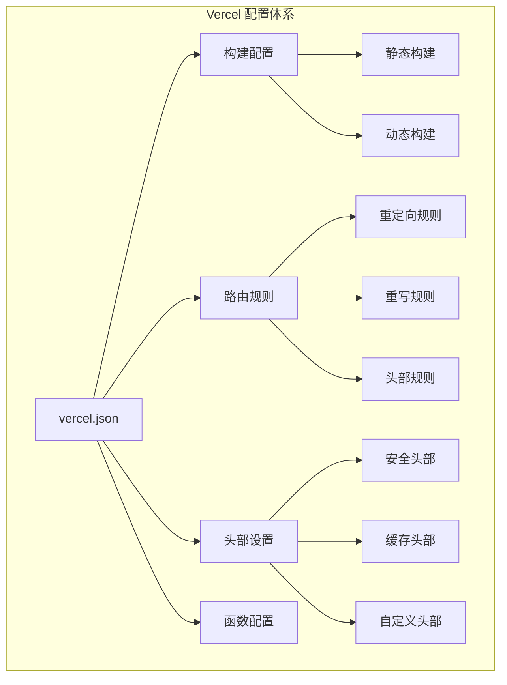
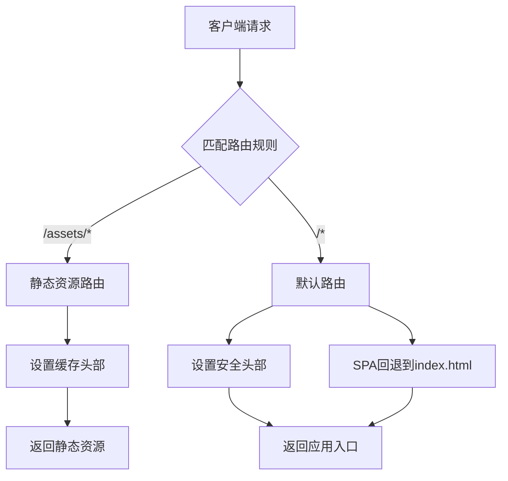
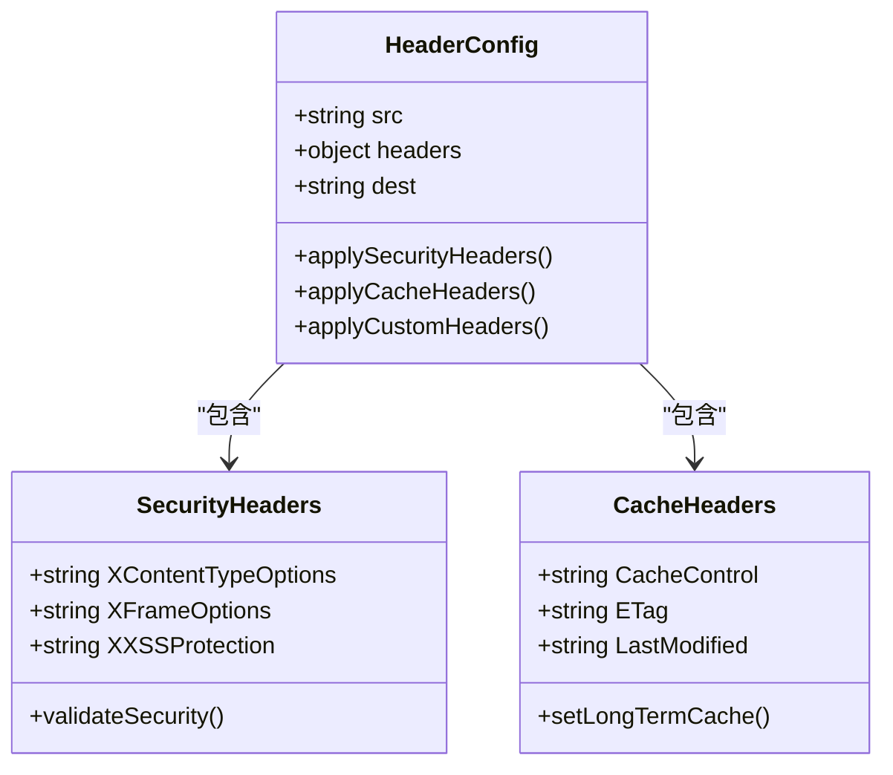
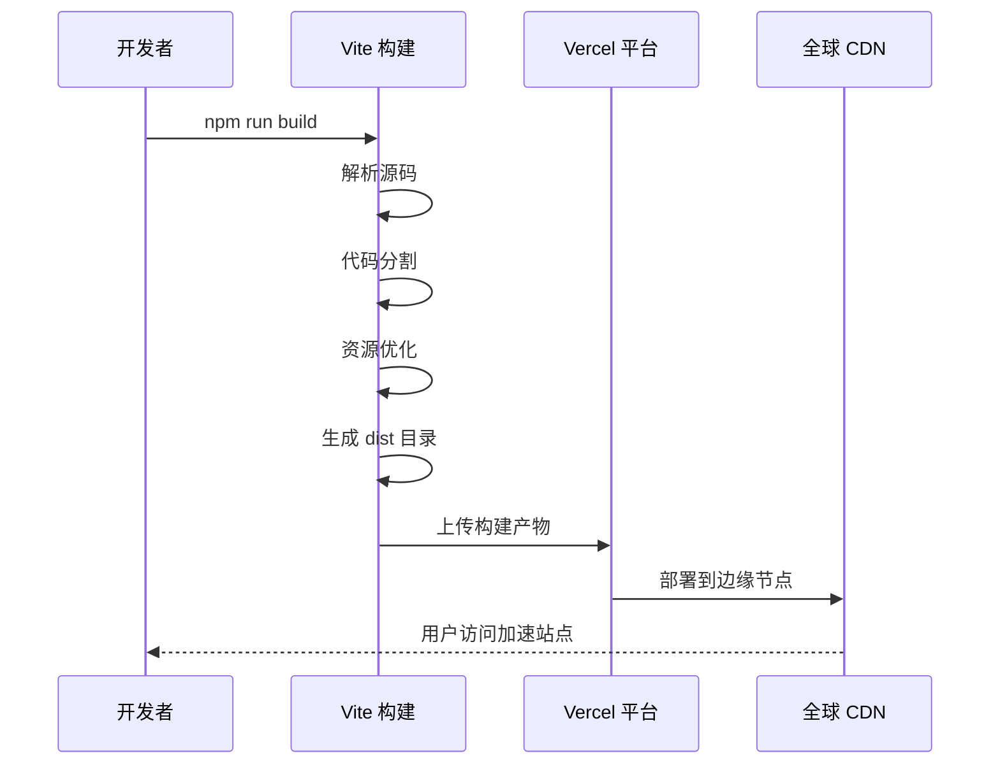
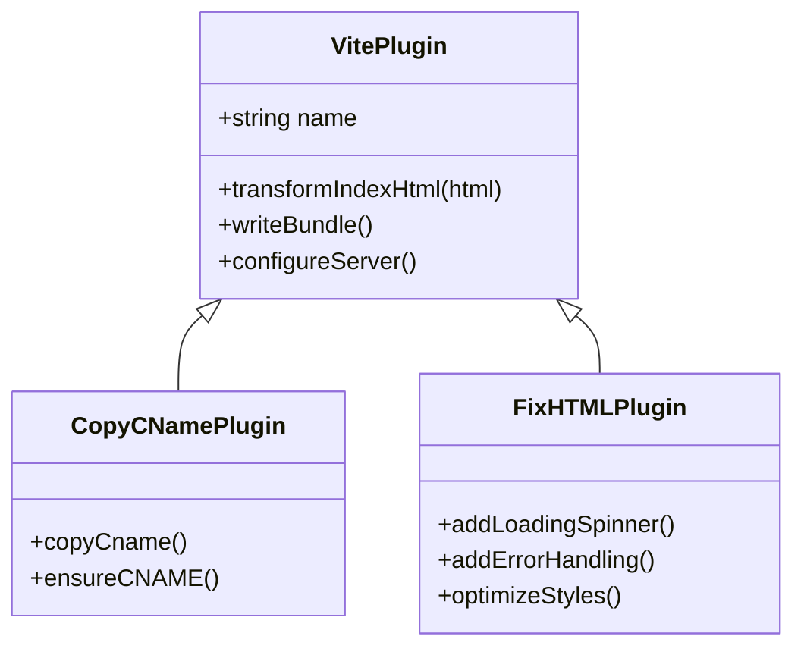
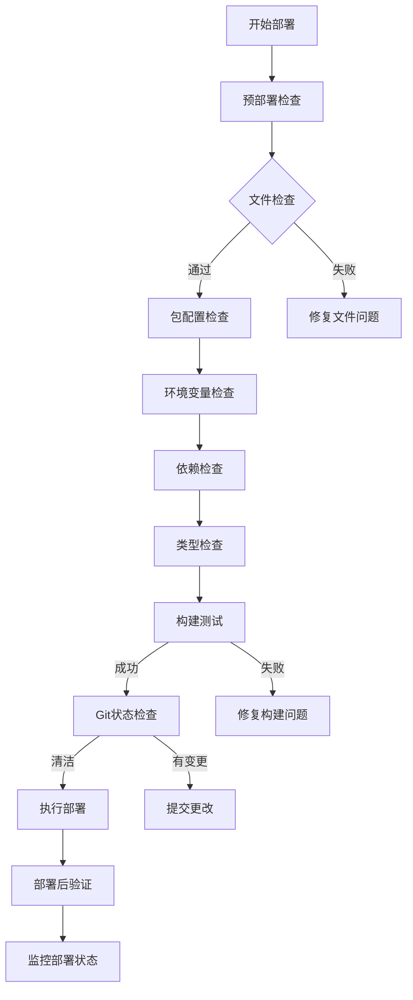
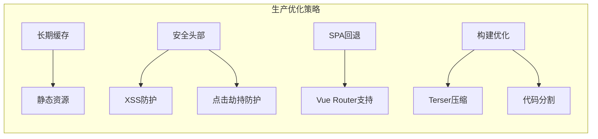
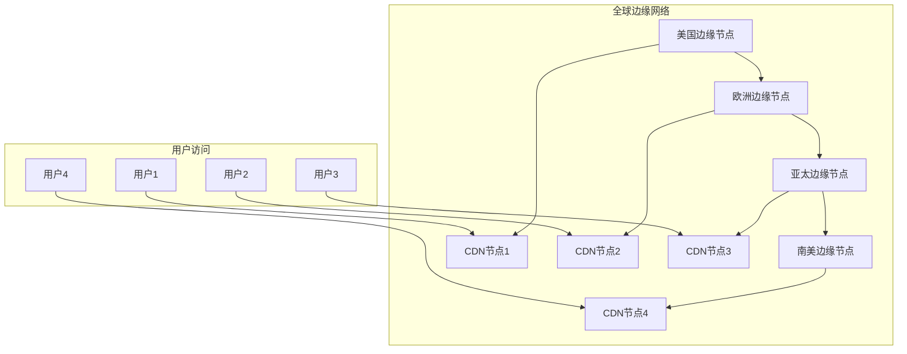
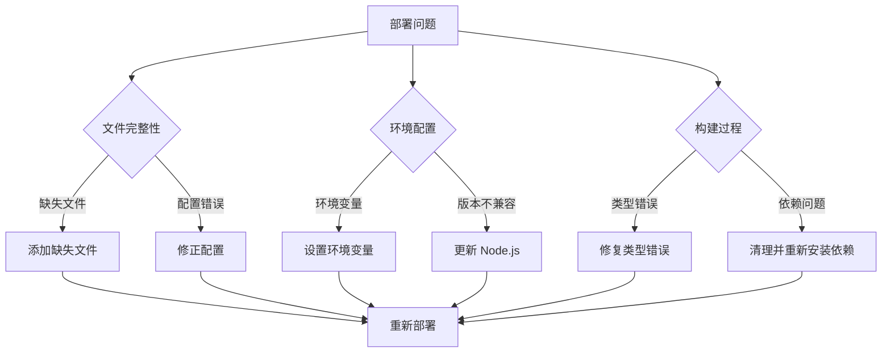
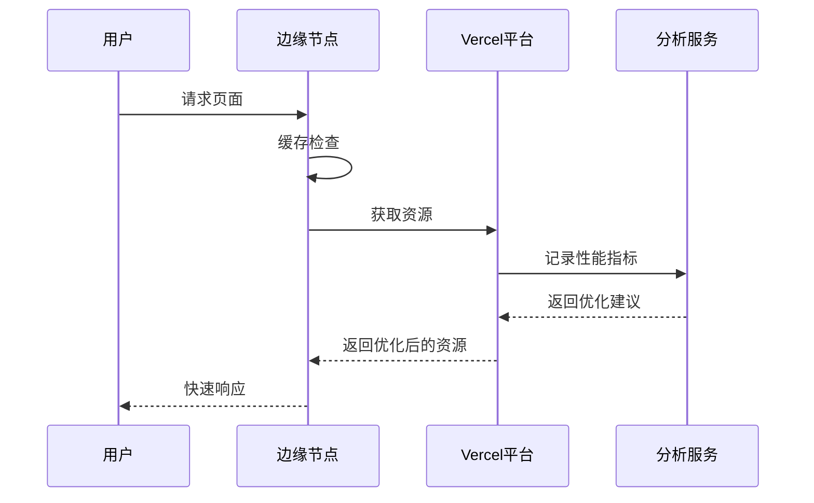

# Vercel 部署配置详解

<cite>
**本文档引用的文件**
- [vercel.json](file://vercel.json)
- [vite.config.ts](file://vite.config.ts)
- [package.json](file://package.json)
- [netlify.toml](file://netlify.toml)
- [scripts/deployment/pre-deploy-check.mjs](file://scripts/deployment/pre-deploy-check.mjs)
- [scripts/deployment/enhanced-pre-deploy-check.mjs](file://scripts/deployment/enhanced-pre-deploy-check.mjs)
</cite>

## 目录
1. [简介](#简介)
2. [Vercel 配置概览](#vercel-配置概览)
3. [核心配置项深度解析](#核心配置项深度解析)
4. [与 Vite 的集成机制](#与-vite-的集成机制)
5. [部署流程与最佳实践](#部署流程与最佳实践)
6. [性能优化策略](#性能优化策略)
7. [故障排除指南](#故障排除指南)
8. [总结](#总结)

## 简介

Vercel 是一个现代化的云平台，专为现代 Web 应用程序设计，提供了卓越的开发者体验和高性能的部署解决方案。本文档将深入解析 Vercel 部署配置的核心要素，包括路由规则、重定向、重写、头部设置以及函数配置，并展示如何与 Vite 构建系统协同工作。

## Vercel 配置概览

Vercel 的配置文件 `vercel.json` 是整个部署系统的控制中心，它定义了应用程序的行为、路由规则和部署参数。



**图表来源**
- [vercel.json](file://vercel.json#L1-L35)

**章节来源**
- [vercel.json](file://vercel.json#L1-L35)

## 核心配置项深度解析

### 基础构建配置

Vercel 使用 `builds` 数组来定义应用程序的构建过程。在我们的配置中，应用程序通过 Vite 构建系统进行静态生成：

```json
{
  "builds": [
    {
      "src": "package.json",
      "use": "@vercel/static-build",
      "config": {
        "distDir": "dist"
      }
    }
  ]
}
```

这个配置的关键特性：
- **源文件识别**：通过 `package.json` 作为入口点
- **构建器选择**：使用官方的 `@vercel/static-build` 构建器
- **输出目录**：指定构建产物位于 `dist` 目录

### 路由规则系统

Vercel 的路由规则是其最强大的功能之一，允许开发者精确控制 URL 映射和请求处理逻辑。



**图表来源**
- [vercel.json](file://vercel.json#L10-L25)

#### 静态资源路由

```json
{
  "src": "/assets/(.*)",
  "headers": {
    "Cache-Control": "public, max-age=31536000, immutable"
  }
}
```

这条规则的作用：
- **路径匹配**：匹配 `/assets/` 下的所有文件
- **缓存策略**：设置长期缓存（1年），标记为不可变
- **性能优化**：减少带宽消耗，提升加载速度

#### 默认路由规则

```json
{
  "src": "/(.*)",
  "headers": {
    "X-Content-Type-Options": "nosniff",
    "X-Frame-Options": "DENY",
    "X-XSS-Protection": "1; mode=block"
  },
  "dest": "/index.html"
}
```

该规则包含三个重要方面：
- **安全头部**：防止 MIME 类型嗅探、点击劫持和 XSS 攻击
- **SPA 回退**：将所有其他路径重定向到 Vue 应用的入口点
- **单页应用支持**：确保前端路由正常工作

### 头部设置策略

Vercel 的头部配置提供了细粒度的 HTTP 控制能力：



**图表来源**
- [vercel.json](file://vercel.json#L10-L25)

**章节来源**
- [vercel.json](file://vercel.json#L1-L35)

## 与 Vite 的集成机制

Vite 作为现代前端构建工具，与 Vercel 的集成展现了最佳的开发体验。

### Vite 配置适配



**图表来源**
- [vite.config.ts](file://vite.config.ts#L1-L104)
- [vercel.json](file://vercel.json#L25-L35)

### 基础路径配置

Vite 的 `base` 配置对于子路径部署至关重要：

```typescript
export default defineConfig({
  base: "/",
  // 其他配置...
});
```

当部署到子路径时，需要调整为：
```typescript
export default defineConfig({
  base: "/your-subpath/",
  // 其他配置...
});
```

### 插件系统集成

Vite 的插件系统为 Vercel 部署提供了额外的功能：



**图表来源**
- [vite.config.ts](file://vite.config.ts#L8-L35)

**章节来源**
- [vite.config.ts](file://vite.config.ts#L1-L104)

## 部署流程与最佳实践

### 部署前检查机制

项目包含了两个级别的部署前检查脚本，确保部署质量：



**图表来源**
- [scripts/deployment/pre-deploy-check.mjs](file://scripts/deployment/pre-deploy-check.mjs#L1-L199)
- [scripts/deployment/enhanced-pre-deploy-check.mjs](file://scripts/deployment/enhanced-pre-deploy-check.mjs#L1-L362)

### 自动化部署脚本

项目提供了多种部署模式的自动化脚本：

```json
{
  "scripts": {
    "build": "vite build",
    "build:vercel": "vite build",
    "build:netlify": "npm ci --include=optional --prefer-offline --no-audit --ignore-scripts && vite build",
    "deploy:test": "vite build --mode test && node scripts/deployment/deploy-test.js",
    "deploy:prod": "vite build --mode production && node scripts/deployment/deploy-prod.js",
    "pre-deploy": "node scripts/deployment/pre-deploy-check.mjs",
    "pre-deploy:enhanced": "node scripts/deployment/enhanced-pre-deploy-check.mjs"
  }
}
```

### 生产环境优化

Vercel 配置中的生产环境优化策略：



**章节来源**
- [package.json](file://package.json#L6-L25)
- [scripts/deployment/pre-deploy-check.mjs](file://scripts/deployment/pre-deploy-check.mjs#L1-L199)

## 性能优化策略

### 缓存策略配置

Vercel 的缓存配置是性能优化的关键：

```json
{
  "src": "/assets/(.*)",
  "headers": {
    "Cache-Control": "public, max-age=31536000, immutable"
  }
}
```

这种配置的优势：
- **31536000 秒** = 1 年缓存期
- **public**：允许代理缓存
- **immutable**：资源永远不会改变

### 边缘计算优势

Vercel 的全球边缘网络提供了以下性能优势：



### 构建优化配置

Vite 的构建配置针对生产环境进行了优化：

```typescript
build: {
  minify: "terser",
  terserOptions: {
    compress: {
      keep_fnames: true,
      keep_classnames: true,
    },
    mangle: {
      keep_fnames: true,
      keep_classnames: true,
    },
  },
  rollupOptions: {
    external: (id: string) => id.startsWith("@rollup/rollup-"),
    output: {
      manualChunks: {
        vendor: ["vue", "pinia"],
      },
    },
  },
}
```

**章节来源**
- [vite.config.ts](file://vite.config.ts#L45-L65)

## 故障排除指南

### 常见部署问题

基于项目中的部署检查脚本，我们可以识别常见的部署问题：



### 调试工具和方法

项目提供了多种调试和验证工具：

1. **类型检查**：`npm run type-check`
2. **构建测试**：`npm run build`
3. **部署验证**：`npm run deploy:verify`
4. **健康检查**：`npm run monitor:health`

### 性能监控

Vercel 提供了内置的性能监控功能：



**章节来源**
- [scripts/deployment/pre-deploy-check.mjs](file://scripts/deployment/pre-deploy-check.mjs#L150-L199)

## 总结

Vercel 部署配置是一个精心设计的系统，它将现代前端技术与云原生部署理念完美结合。通过深入理解 `vercel.json` 的各个配置项，以及与 Vite 构建系统的协同工作，开发者可以构建出高性能、高可用的 Web 应用程序。

### 关键要点回顾

1. **配置简洁性**：Vercel 的配置文件保持了极简主义风格，专注于核心功能
2. **路由灵活性**：强大的路由规则系统支持复杂的 URL 映射需求
3. **安全优先**：内置的安全头部配置确保应用的安全性
4. **性能优化**：长期缓存和边缘计算提供了卓越的性能表现
5. **开发体验**：与 Vite 的无缝集成提供了优秀的开发体验

### 最佳实践建议

- 定期运行部署前检查脚本
- 合理配置缓存策略以平衡性能和更新频率
- 利用 Vercel 的边缘网络特性优化全球访问性能
- 建立完善的监控和告警机制
- 保持配置文件的版本控制和文档化

通过遵循这些原则和实践，开发者可以充分利用 Vercel 平台的强大功能，构建出既快速又安全的现代 Web 应用程序。