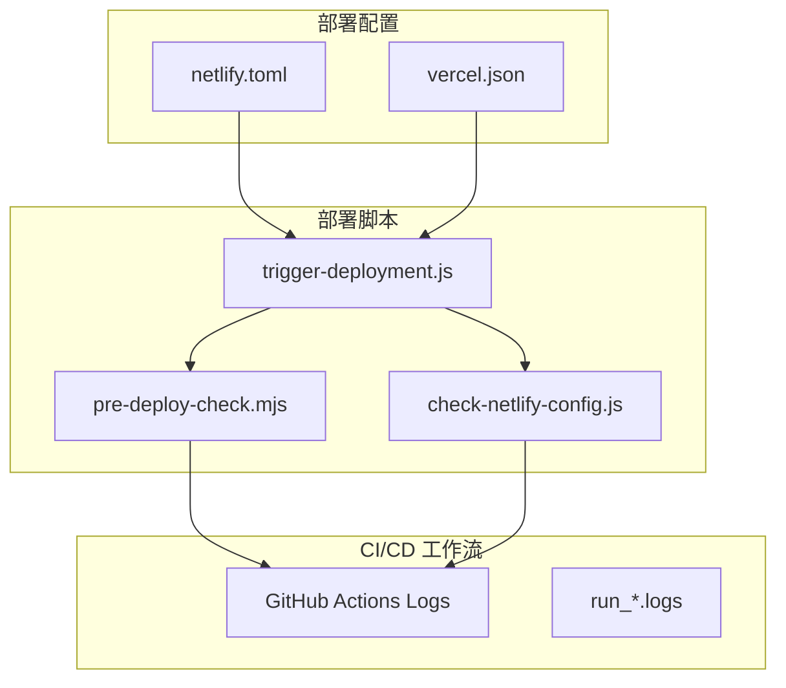
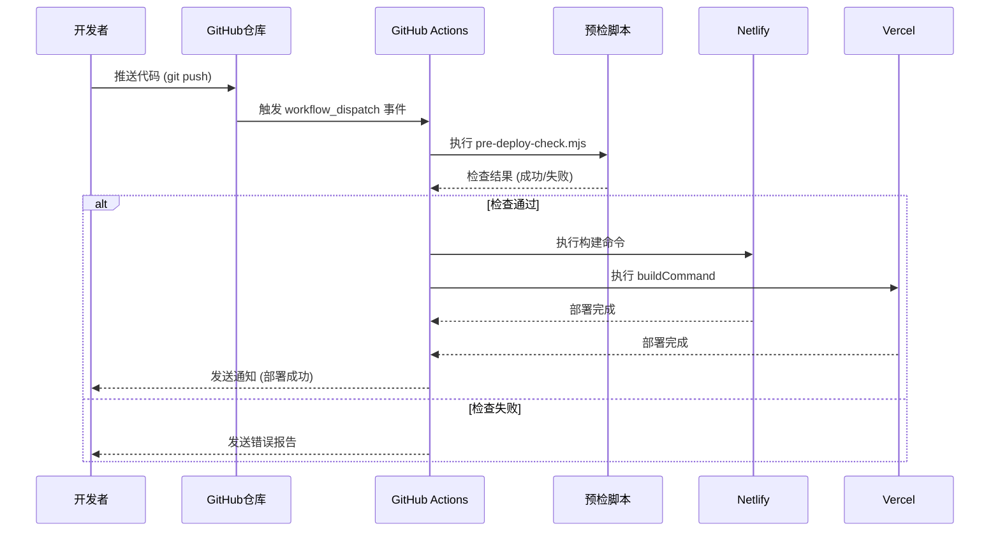
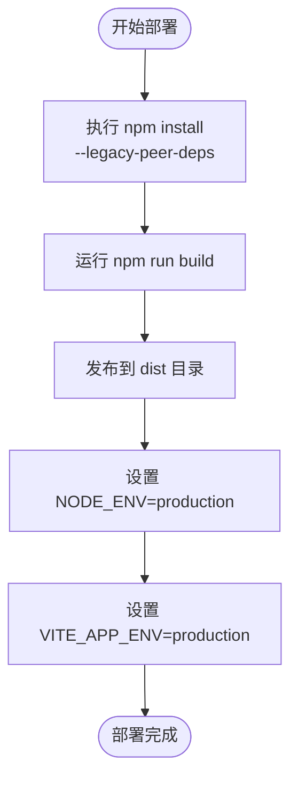
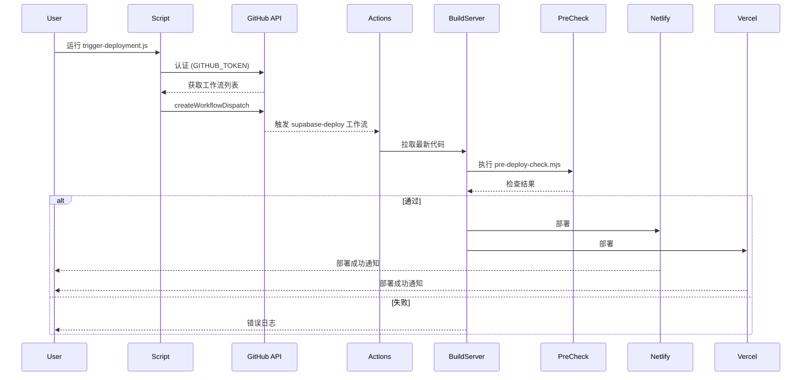

# 云平台部署集成

<cite>
**本文档引用的文件**
- [netlify.toml](file://netlify.toml)
- [vercel.json](file://vercel.json)
- [trigger-deployment.js](file://scripts/deployment/trigger-deployment.js)
- [pre-deploy-check.mjs](file://scripts/deployment/pre-deploy-check.mjs)
- [check-netlify-config.js](file://scripts/deployment/check-netlify-config.js)
</cite>

## 目录
1. [简介](#简介)
2. [项目结构](#项目结构)
3. [核心组件](#核心组件)
4. [架构概述](#架构概述)
5. [详细组件分析](#详细组件分析)
6. [依赖分析](#依赖分析)
7. [性能考虑](#性能考虑)
8. [故障排除指南](#故障排除指南)
9. [结论](#结论)

## 简介
本文深入解析 `netlify.toml` 和 `vercel.json` 两个云部署配置文件的结构与功能，重点描述 Netlify 的构建命令、发布目录、重定向规则及函数配置，并对比 Vercel 平台的路由策略、环境变量管理和边缘函数设置。同时说明如何通过这些配置实现自动化部署、预览环境生成和自定义域名绑定，并结合项目实际工作流展示 CI/CD 触发机制。

## 项目结构
本项目采用模块化设计，主要包含源码目录（src）、配置文件（config）、脚本工具（scripts）以及日志记录等部分。部署相关的核心配置集中在根目录下的 `netlify.toml` 和 `vercel.json` 文件中，而自动化部署流程则由位于 `scripts/deployment/` 目录中的多个 Node.js 脚本驱动。



**Diagram sources**
- [netlify.toml](file://netlify.toml#L1-L12)
- [vercel.json](file://vercel.json#L1-L37)
- [trigger-deployment.js](file://scripts/deployment/trigger-deployment.js#L1-L180)

**Section sources**
- [netlify.toml](file://netlify.toml#L1-L12)
- [vercel.json](file://vercel.json#L1-L37)
- [scripts/deployment](file://scripts/deployment)

## 核心组件
`netlify.toml` 定义了项目的构建命令、发布目录和生产环境变量；`vercel.json` 配置了构建版本、静态资源处理、安全头信息和框架特定设置。两者共同支持多环境部署、缓存优化和安全性增强。

**Section sources**
- [netlify.toml](file://netlify.toml#L1-L12)
- [vercel.json](file://vercel.json#L1-L37)

## 架构概述
系统通过 GitHub Actions 实现完整的 CI/CD 流程：代码推送触发自动测试 → 预部署检查 → 构建打包 → 分别部署至 Netlify 和 Vercel。部署前使用 `pre-deploy-check.mjs` 进行全面验证，确保代码质量、依赖完整性和构建可行性。



**Diagram sources**
- [pre-deploy-check.mjs](file://scripts/deployment/pre-deploy-check.mjs#L1-L370)
- [trigger-deployment.js](file://scripts/deployment/trigger-deployment.js#L1-L180)

## 详细组件分析

### Netlify 配置分析
`netlify.toml` 文件定义了构建流程的关键参数：
- **构建命令**：使用 `npm install --legacy-peer-deps` 解决依赖冲突，确保安装稳定性。
- **发布目录**：指定为 `dist`，即 Vite 构建输出目录。
- **环境变量**：在 `[build.environment]` 中设置全局环境，在 `[context.production.environment]` 中定义生产环境专用变量。

#### Netlify 构建流程图


**Diagram sources**
- [netlify.toml](file://netlify.toml#L1-L12)

**Section sources**
- [netlify.toml](file://netlify.toml#L1-L12)
- [check-netlify-config.js](file://scripts/deployment/check-netlify-config.js#L1-L110)

### Vercel 配置分析
`vercel.json` 提供了更细粒度的控制能力：
- **构建配置**：指定使用 `@vercel/static-build`，输出目录为 `dist`。
- **路由规则**：对 `/assets/*` 启用长期缓存，其他请求统一指向 `index.html` 实现 SPA 路由。
- **安全头**：添加 `X-Content-Type-Options`, `X-Frame-Options`, `X-XSS-Protection` 增强安全性。
- **环境管理**：明确指定 Node.js 版本为 20。

#### Vercel 路由与安全策略
```mermaid
flowchart LR
A[/assets/*] --> B["Cache-Control:<br/>max-age=31536000"]
C[/*] --> D["X-Content-Type-Options: nosniff"]
C --> E["X-Frame-Options: DENY"]
C --> F["X-XSS-Protection: 1; mode=block"]
C --> G[dest: /index.html]
```

**Diagram sources**
- [vercel.json](file://vercel.json#L1-L37)

**Section sources**
- [vercel.json](file://vercel.json#L1-L37)

### 自动化部署流程分析
通过 `trigger-deployment.js` 可手动触发 GitHub Actions 工作流，实现远程部署控制。该脚本利用 Octokit 调用 GitHub API，发送 `workflow_dispatch` 事件来启动部署流水线。

#### 部署触发流程


**Diagram sources**
- [trigger-deployment.js](file://scripts/deployment/trigger-deployment.js#L1-L180)

**Section sources**
- [trigger-deployment.js](file://scripts/deployment/trigger-deployment.js#L1-L180)
- [pre-deploy-check.mjs](file://scripts/deployment/pre-deploy-check.mjs#L1-L370)

## 依赖分析
项目通过 `package.json` 管理依赖，部署时优先使用 `npm ci` 或 `npm install` 安装。CI 环境中启用离线模式和忽略审计以加快安装速度。`pre-deploy-check.mjs` 脚本会验证必需依赖是否存在，确保部署环境一致性。

```mermaid
dependencyGraph
packageJson --> npmInstall
npmInstall --> Build
Build --> Dist
Dist --> Netlify
Dist --> Vercel
preDeployCheck --> packageJson
preDeployCheck --> typeCheck
preDeployCheck --> lint
preDeployCheck --> test
```

**Diagram sources**
- [package.json](file://package.json)
- [pre-deploy-check.mjs](file://scripts/deployment/pre-deploy-check.mjs#L1-L370)

**Section sources**
- [pre-deploy-check.mjs](file://scripts/deployment/pre-deploy-check.mjs#L1-L370)

## 性能考虑
- **Netlify**：通过 `--prefer-offline` 加速依赖安装，减少网络延迟。
- **Vercel**：为静态资源设置一年缓存有效期，显著提升加载性能。
- **通用优化**：构建过程中禁用可选依赖和脚本执行，缩短构建时间。
- **类型检查**：在部署前运行 `vue-tsc --noEmit`，避免运行时类型错误影响性能。

## 故障排除指南
常见问题及解决方案：

| 问题现象 | 可能原因 | 解决方案 |
|--------|--------|--------|
| 构建失败 | 依赖冲突 | 使用 `--legacy-peer-deps` 参数 |
| 页面无法访问 | 路由配置错误 |