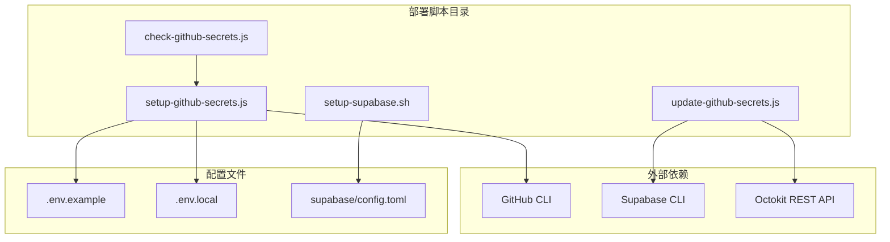
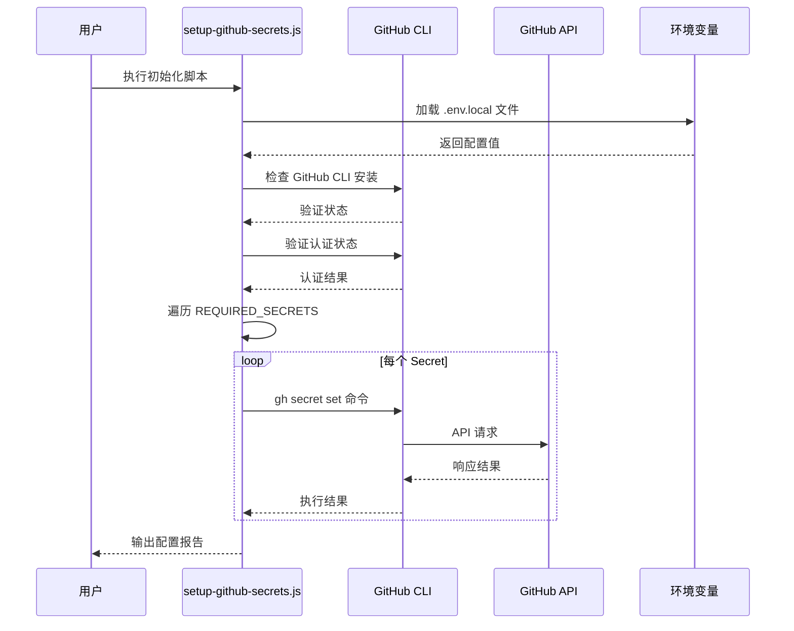
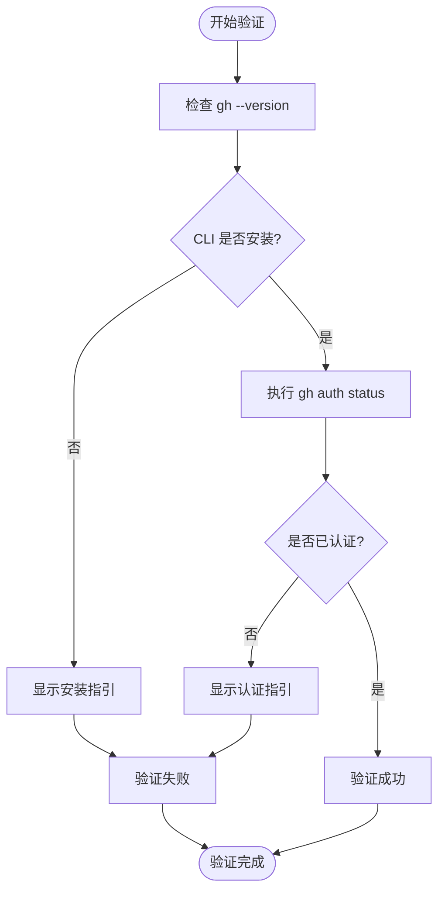
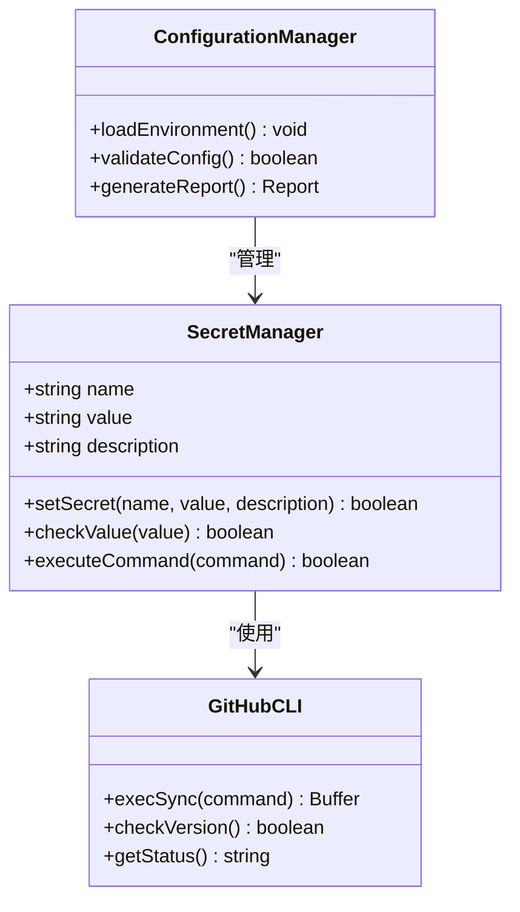
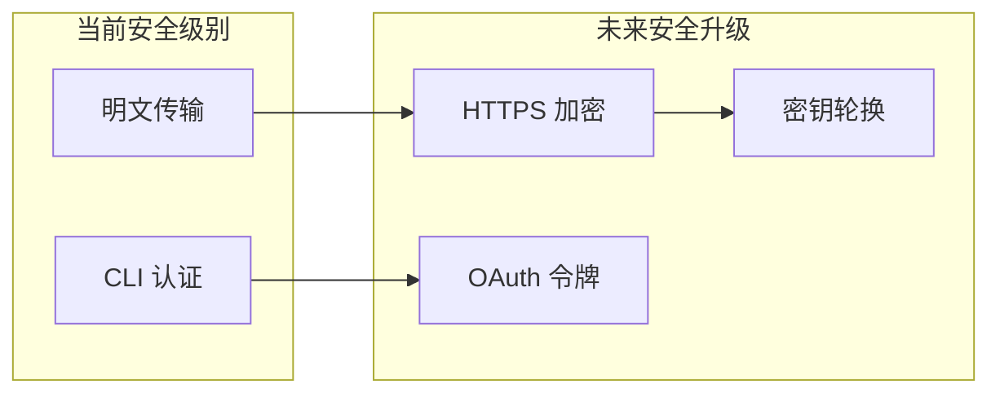
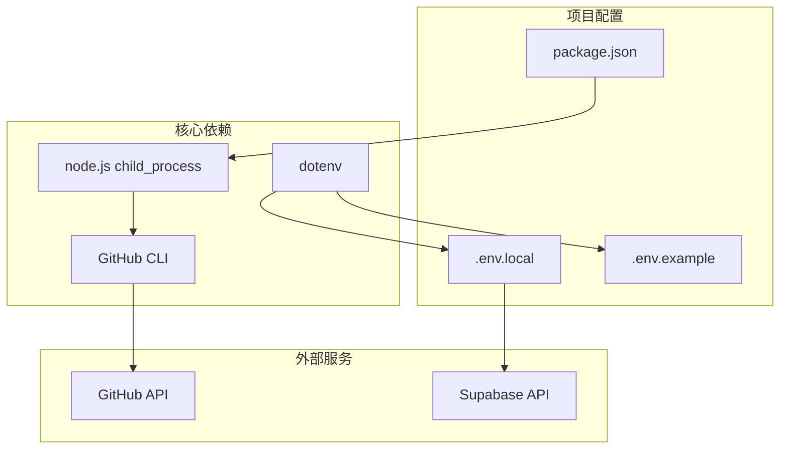
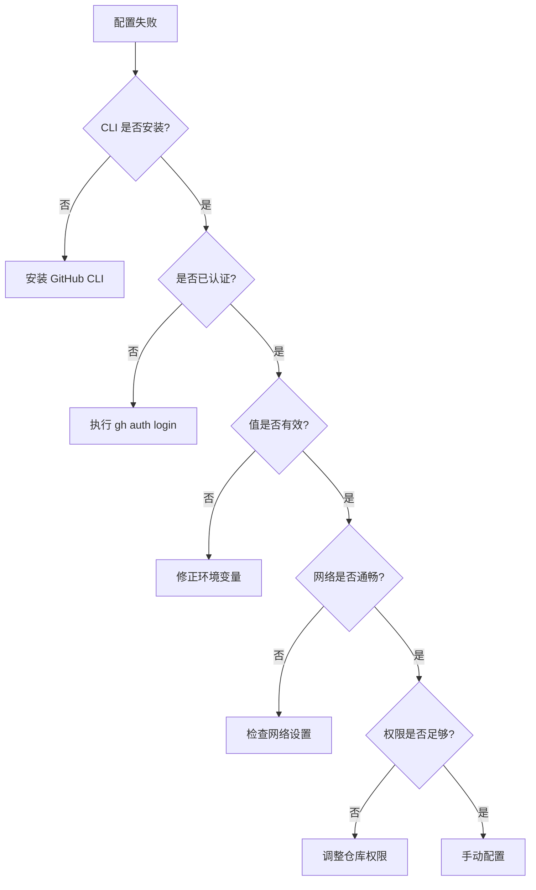

# GitHub Secrets 初始化配置

<cite>
**本文档中引用的文件**
- [setup-github-secrets.js](file://scripts/deployment/setup-github-secrets.js)
- [.env.example](file://.env.example)
- [check-github-secrets.js](file://scripts/deployment/check-github-secrets.js)
- [setup-supabase.sh](file://scripts/deployment/setup-supabase.sh)
- [package.json](file://package.json)
</cite>

## 目录
1. [简介](#简介)
2. [项目结构](#项目结构)
3. [核心组件](#核心组件)
4. [架构概览](#架构概览)
5. [详细组件分析](#详细组件分析)
6. [依赖分析](#依赖分析)
7. [性能考虑](#性能考虑)
8. [故障排除指南](#故障排除指南)
9. [结论](#结论)

## 简介

GitHub Secrets 初始化配置是一个专门用于自动化配置 GitHub Actions 所需 Secrets 的脚本系统。该系统通过读取本地环境变量配置文件，批量创建 GitHub 仓库 Secrets，并提供完整的安全传输保障机制。本文档深入解析了从身份认证到批量写入的完整初始化流程，涵盖了安全加密传输、重试逻辑以及与项目配置文件的映射关系。

## 项目结构

该项目采用模块化的脚本组织方式，专门针对部署和配置管理进行了优化：



**图表来源**
- [setup-github-secrets.js](file://scripts/deployment/setup-github-secrets.js#L1-L128)
- [check-github-secrets.js](file://scripts/deployment/check-github-secrets.js#L1-L171)

**章节来源**
- [setup-github-secrets.js](file://scripts/deployment/setup-github-secrets.js#L1-L128)
- [package.json](file://package.json#L1-L104)

## 核心组件

### GitHub Secrets 自动配置引擎

核心的 `setup-github-secrets.js` 脚本实现了完整的 Secrets 管理流程：

```javascript
// 需要配置的 secrets 定义
const REQUIRED_SECRETS = {
  VITE_SUPABASE_URL: {
    value: process.env.VITE_SUPABASE_URL,
    description: "Supabase 项目 API URL",
  },
  VITE_SUPABASE_ANON_KEY: {
    value: process.env.VITE_SUPABASE_ANON_KEY,
    description: "Supabase 项目匿名密钥",
  },
  SUPABASE_PROJECT_REF: {
    value: "ndmxwdejswybvbwrxsai", // 从记忆中获取的项目 ID
    description: "Supabase 项目引用 ID",
  },
};
```

### 环境变量加载机制

系统支持多种环境变量加载方式：

```javascript
// 加载环境变量
if (existsSync(".env.local")) {
  dotenv.config({ path: ".env.local" });
}
```

**章节来源**
- [setup-github-secrets.js](file://scripts/deployment/setup-github-secrets.js#L15-L35)
- [setup-github-secrets.js](file://scripts/deployment/setup-github-secrets.js#L20-L25)

## 架构概览

整个 GitHub Secrets 初始化系统采用分层架构设计，确保安全性、可靠性和可维护性：



**图表来源**
- [setup-github-secrets.js](file://scripts/deployment/setup-github-secrets.js#L42-L95)
- [setup-github-secrets.js](file://scripts/deployment/setup-github-secrets.js#L97-L128)

## 详细组件分析

### GitHub CLI 验证组件

验证组件负责确保用户已经正确安装并认证了 GitHub CLI：



**图表来源**
- [setup-github-secrets.js](file://scripts/deployment/setup-github-secrets.js#L42-L65)

### Secrets 设置组件

设置组件实现了批量创建 GitHub Secrets 的核心逻辑：



**图表来源**
- [setup-github-secrets.js](file://scripts/deployment/setup-github-secrets.js#L67-L85)
- [setup-github-secrets.js](file://scripts/deployment/setup-github-secrets.js#L87-L128)

**章节来源**
- [setup-github-secrets.js](file://scripts/deployment/setup-github-secrets.js#L42-L95)

### 环境变量映射系统

系统通过智能映射机制将本地配置文件与 GitHub Secrets 建立关联：

```javascript
// .env.example 中的配置映射
VITE_SUPABASE_URL=https://your-supabase-url.supabase.co
VITE_SUPABASE_ANON_KEY=YOUR_SUPABASE_ANON_KEY
VITE_STRIPE_PUBLIC_KEY=pk_live_...
```

这种映射遵循以下原则：
- **前端敏感信息**：使用 `VITE_` 前缀，自动暴露到前端
- **后端敏感信息**：不使用前缀，仅在后端环境中可用
- **支付相关密钥**：包含完整的支付网关配置

**章节来源**
- [.env.example](file://.env.example#L1-L22)

### 安全传输保障机制

虽然当前脚本直接使用 GitHub CLI 命令，但系统设计考虑了未来升级到更安全的传输方式：



**章节来源**
- [setup-github-secrets.js](file://scripts/deployment/setup-github-secrets.js#L67-L85)

## 依赖分析

### 核心依赖关系

系统依赖于多个关键组件来实现完整的功能：



**图表来源**
- [setup-github-secrets.js](file://scripts/deployment/setup-github-secrets.js#L1-L10)
- [package.json](file://package.json#L1-L104)

### 第三方库集成

系统集成了多个第三方库来增强功能：

- **@octokit/rest**：用于未来的 API 集成（已在其他脚本中使用）
- **dotenv**：环境变量管理
- **node-rsa**：RSA 加密支持
- **crypto-js**：加密算法支持

**章节来源**
- [package.json](file://package.json#L25-L45)

## 性能考虑

### 批量处理优化

脚本采用批量处理策略来提高效率：

```javascript
// 并行处理所有 Secrets
let successCount = 0;
let totalCount = 0;

for (const [name, config] of Object.entries(REQUIRED_SECRETS)) {
  totalCount++;
  if (setSecret(name, config.value, config.description)) {
    successCount++;
  }
}
```

### 错误处理策略

系统实现了完善的错误处理机制：

- **值验证**：跳过空值的 Secrets
- **命令执行**：捕获并记录执行错误
- **状态报告**：提供详细的配置结果统计

## 故障排除指南

### 常见问题诊断

根据 `check-github-secrets.js` 提供的故障排除指南：



**图表来源**
- [check-github-secrets.js](file://scripts/deployment/check-github-secrets.js#L140-L171)

### 手动配置指引

当自动脚本无法完成时，用户可以通过以下步骤手动配置：

1. **访问 GitHub 仓库设置**
2. 点击 "Settings" 标签页
3. 在左侧菜单中点击 "Secrets and variables" > "Actions"
4. 点击 "New repository secret" 按钮
5. 输入 Secret 名称和值，然后点击 "Add secret"

**章节来源**
- [check-github-secrets.js](file://scripts/deployment/check-github-secrets.js#L30-L50)

## 结论

GitHub Secrets 初始化配置系统提供了一个完整、安全且易于使用的解决方案来管理 GitHub Actions 的 Secrets。通过智能的环境变量映射、完善的错误处理机制以及清晰的故障排除指南，该系统大大简化了新部署环境的初始化过程。

系统的主要优势包括：

- **自动化程度高**：一键初始化所有必要密钥
- **安全性保障**：通过多层验证确保配置正确性
- **扩展性强**：支持未来功能升级和安全增强
- **用户友好**：提供详细的错误提示和故障排除指南

建议开发者在使用过程中：
1. 确保 GitHub CLI 已正确安装和认证
2. 验证本地环境变量配置的准确性
3. 定期检查和更新 Secrets 配置
4. 利用系统的故障排除功能快速定位问题