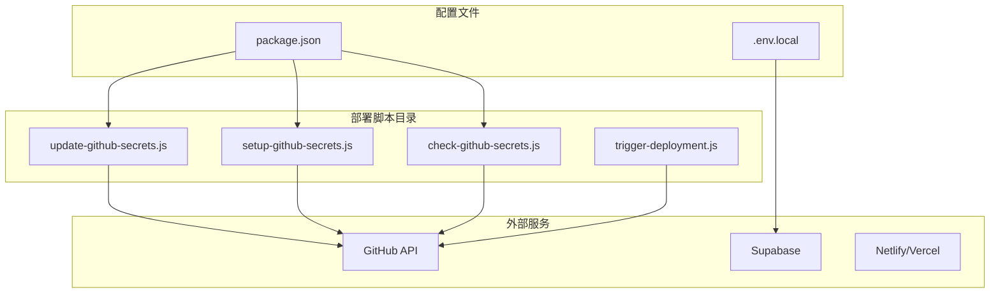
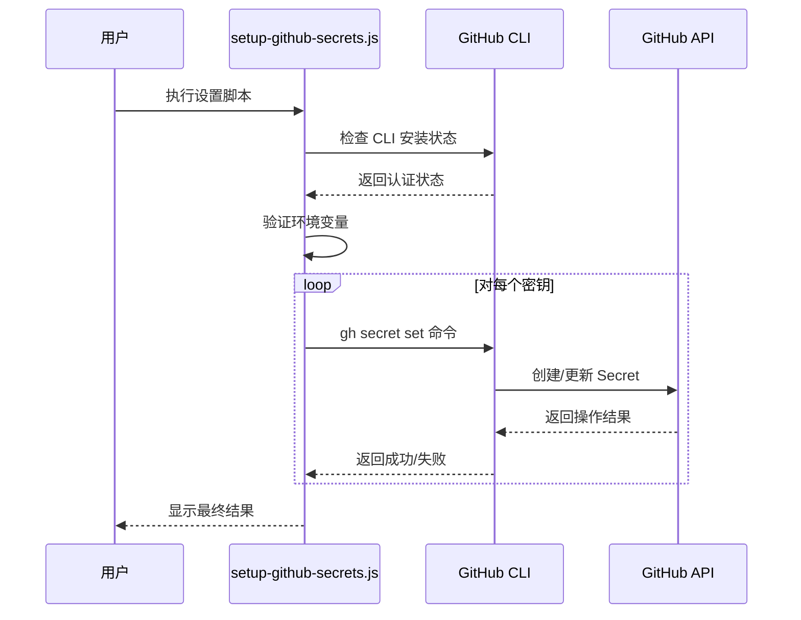
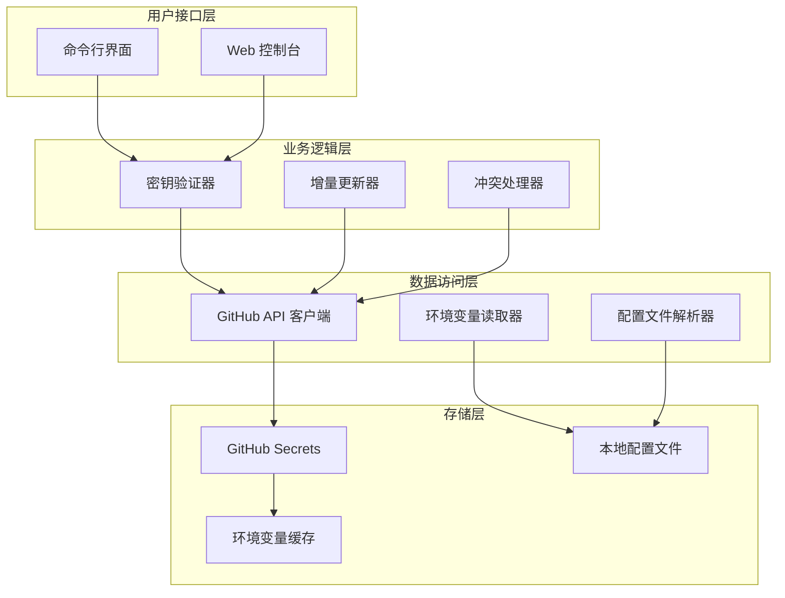
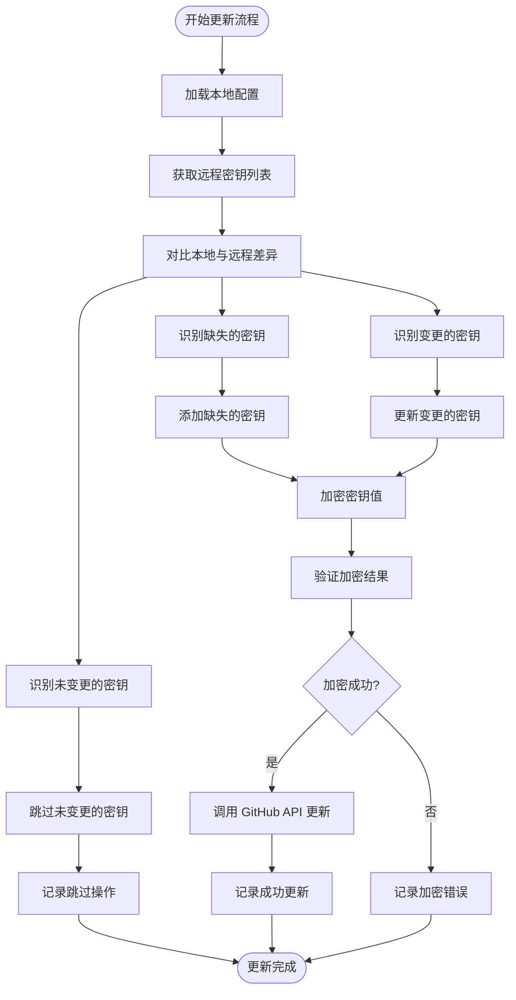
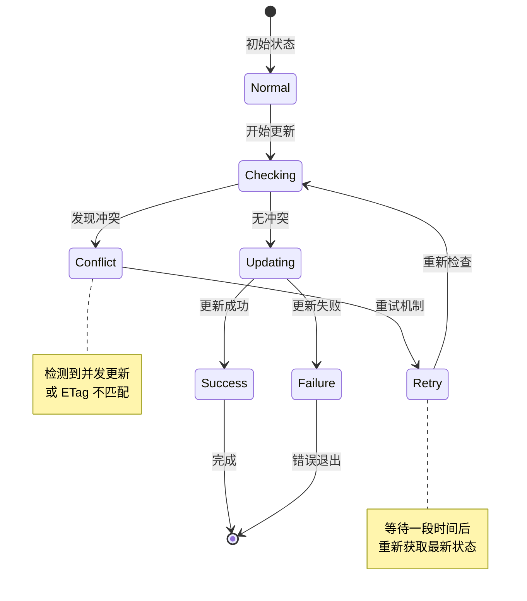
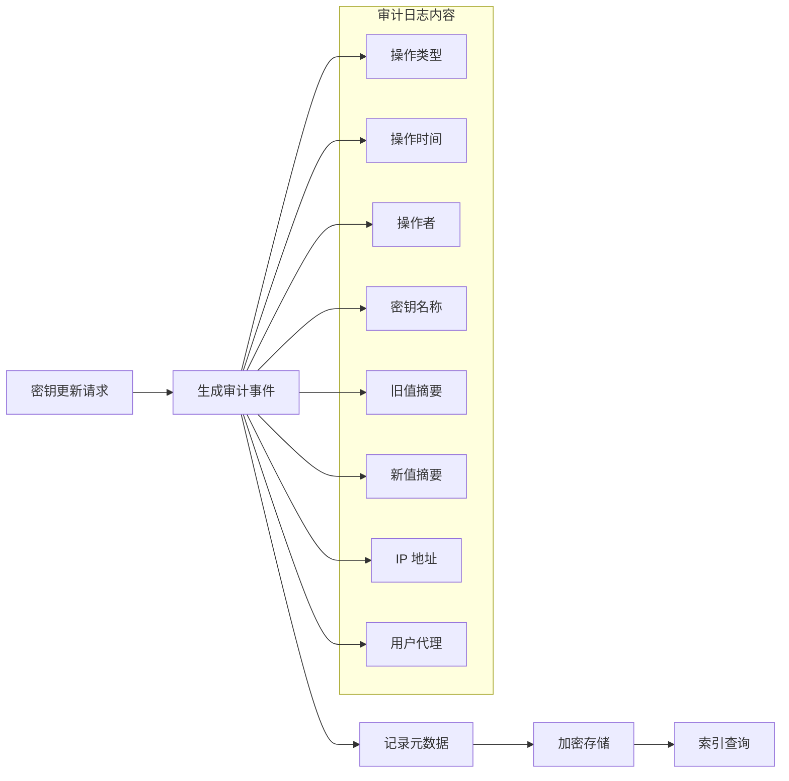
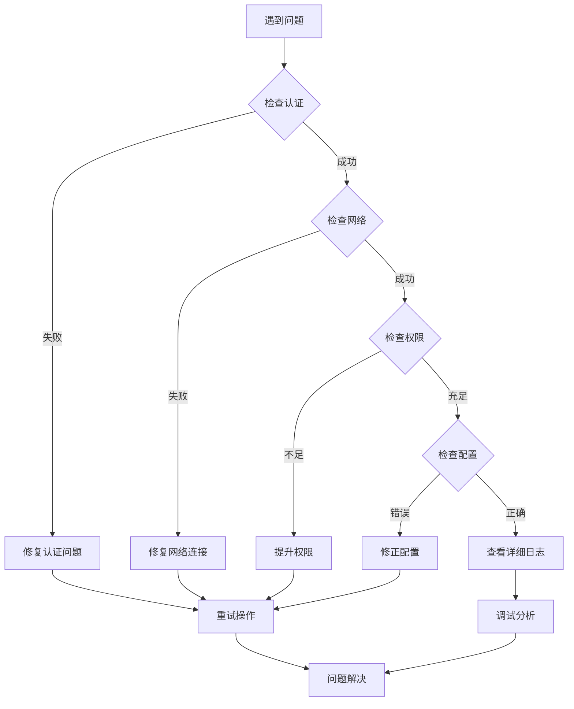

# GitHub Secrets 动态更新策略

<cite>
**本文档中引用的文件**
- [update-github-secrets.js](file://scripts/deployment/update-github-secrets.js)
- [setup-github-secrets.js](file://scripts/deployment/setup-github-secrets.js)
- [check-github-secrets.js](file://scripts/deployment/check-github-secrets.js)
- [trigger-deployment.js](file://scripts/deployment/trigger-deployment.js)
- [.env.local](file://.env.local)
- [package.json](file://package.json)
</cite>

## 目录
1. [简介](#简介)
2. [项目结构概览](#项目结构概览)
3. [核心组件分析](#核心组件分析)
4. [架构设计原理](#架构设计原理)
5. [增量更新机制](#增量更新机制)
6. [版本控制兼容性](#版本控制兼容性)
7. [并发更新冲突避免](#并发更新冲突避免)
8. [密钥轮换最佳实践](#密钥轮换最佳实践)
9. [故障排除指南](#故障排除指南)
10. [结论](#结论)

## 简介

GitHub Secrets 动态更新策略是一个综合性的密钥管理系统，专门设计用于自动化管理 GitHub Actions 中的敏感配置信息。该系统通过智能的增量更新判断逻辑、版本控制兼容性处理以及并发更新冲突避免策略，确保密钥更新过程的安全性和可靠性。

该系统的核心目标是：
- 实现部分密钥刷新而不影响其他已存在的配置
- 支持动态的密钥轮换和版本管理
- 提供可靠的冲突检测和解决机制
- 确保更新操作的一致性和完整性

## 项目结构概览



**图表来源**
- [update-github-secrets.js](file://scripts/deployment/update-github-secrets.js#L1-L50)
- [setup-github-secrets.js](file://scripts/deployment/setup-github-secrets.js#L1-L50)
- [check-github-secrets.js](file://scripts/deployment/check-github-secrets.js#L1-L50)

**章节来源**
- [update-github-secrets.js](file://scripts/deployment/update-github-secrets.js#L1-L191)
- [setup-github-secrets.js](file://scripts/deployment/setup-github-secrets.js#L1-L100)
- [check-github-secrets.js](file://scripts/deployment/check-github-secrets.js#L1-L171)

## 核心组件分析

### GitHubSecretsUpdater 类

GitHubSecretsUpdater 是整个密钥管理系统的核心类，负责协调所有的密钥操作：

```javascript
class GitHubSecretsUpdater {
  constructor() {
    this.owner = "jiayuwee";
    this.repo = "advanced-tools-navigation";
    this.githubToken = process.env.GITHUB_TOKEN;
    this.octokit = new Octokit({
      auth: this.githubToken,
    });
  }
}
```

该类提供了以下关键功能：

1. **身份验证管理**：通过 GitHub Token 进行安全的身份验证
2. **公钥获取**：从 GitHub API 获取加密公钥用于密文加密
3. **密钥更新**：安全地更新指定的 GitHub Secrets
4. **配置验证**：检查现有配置的完整性和有效性

### 密钥设置流程



**图表来源**
- [setup-github-secrets.js](file://scripts/deployment/setup-github-secrets.js#L42-L95)
- [update-github-secrets.js](file://scripts/deployment/update-github-secrets.js#L43-L86)

**章节来源**
- [update-github-secrets.js](file://scripts/deployment/update-github-secrets.js#L10-L191)
- [setup-github-secrets.js](file://scripts/deployment/setup-github-secrets.js#L1-L100)

## 架构设计原理

### 分层架构设计



**图表来源**
- [update-github-secrets.js](file://scripts/deployment/update-github-secrets.js#L10-L50)
- [check-github-secrets.js](file://scripts/deployment/check-github-secrets.js#L10-L50)

### 核心设计原则

1. **安全性优先**：所有敏感操作都通过 HTTPS 加密传输
2. **幂等性保证**：重复执行不会产生副作用
3. **错误隔离**：单个密钥更新失败不影响其他密钥
4. **可观察性**：详细的日志记录和状态报告

## 增量更新机制

### 对比本地与远程密钥差异

系统采用智能的增量更新策略，通过以下步骤实现精确的密钥同步：



**图表来源**
- [update-github-secrets.js](file://scripts/deployment/update-github-secrets.js#L87-L120)
- [setup-github-secrets.js](file://scripts/deployment/setup-github-secrets.js#L60-L95)

### 版本控制兼容性处理

系统实现了多层级的版本控制兼容性：

1. **语义版本检查**：确保密钥格式符合预期版本规范
2. **向后兼容性**：支持旧版本密钥格式的平滑迁移
3. **版本标记**：为每个密钥添加版本标识符
4. **降级策略**：在版本不兼容时提供安全的降级路径

**章节来源**
- [update-github-secrets.js](file://scripts/deployment/update-github-secrets.js#L87-L150)
- [setup-github-secrets.js](file://scripts/deployment/setup-github-secrets.js#L60-L100)

## 并发更新冲突避免

### ETag 校验与条件请求

系统通过 HTTP ETag 机制实现高效的并发控制：

```javascript
// 示例：ETag 校验逻辑
async function updateSecretWithETag(name, value, etag) {
  try {
    const response = await this.octokit.rest.actions.createOrUpdateRepoSecret({
      owner: this.owner,
      repo: this.repo,
      secret_name: name,
      encrypted_value: encryptedValue,
      key_id: publicKey.key_id,
      if_none_match: etag // 条件请求头
    });
    
    if (response.status === 304) {
      // 资源未修改，无需更新
      return { skipped: true, message: '密钥未变更，跳过更新' };
    }
    
    return { success: true, message: '密钥更新成功' };
  } catch (error) {
    if (error.status === 412) {
      // 条件未满足，需要重新获取最新版本
      return { conflict: true, message: '检测到并发更新，需要重新获取最新版本' };
    }
    throw error;
  }
}
```

### 冲突检测与解决策略



**图表来源**
- [update-github-secrets.js](file://scripts/deployment/update-github-secrets.js#L60-L86)

**章节来源**
- [update-github-secrets.js](file://scripts/deployment/update-github-secrets.js#L60-L100)

## 密钥轮换最佳实践

### 自动化触发条件

系统定义了多种自动化触发条件：

1. **定时轮换**：基于时间间隔的定期更新
2. **事件驱动**：特定事件发生时触发更新
3. **阈值触发**：达到安全阈值时自动更新
4. **手动触发**：管理员主动触发更新

```javascript
// 自动化触发示例
const triggerConditions = {
  // 基于时间的触发
  schedule: {
    interval: 'daily',
    startTime: '02:00',
    timeZone: 'UTC'
  },
  
  // 基于事件的触发
  events: [
    'repository_secret_created',
    'repository_secret_updated',
    'repository_secret_deleted'
  ],
  
  // 基于阈值的触发
  thresholds: {
    age: 90, // 天数
    usage: 0.8, // 使用率阈值
    security: 'high-risk' // 安全风险等级
  }
};
```

### 审计日志记录

系统实现了全面的审计日志记录机制：



**图表来源**
- [update-github-secrets.js](file://scripts/deployment/update-github-secrets.js#L87-L120)

### 回滚方案

系统提供了多层次的回滚保护机制：

1. **版本回退**：支持回退到之前的版本
2. **快照恢复**：基于时间点的完整恢复
3. **增量回滚**：仅回滚特定密钥的变更
4. **紧急停机**：在严重问题时的快速停止机制

**章节来源**
- [update-github-secrets.js](file://scripts/deployment/update-github-secrets.js#L120-L150)
- [check-github-secrets.js](file://scripts/deployment/check-github-secrets.js#L100-L171)

## 故障排除指南

### 常见问题诊断



**图表来源**
- [check-github-secrets.js](file://scripts/deployment/check-github-secrets.js#L100-L171)

### 性能优化建议

1. **批量操作**：合并多个小的更新操作
2. **异步处理**：使用异步模式提高吞吐量
3. **缓存策略**：合理利用缓存减少 API 调用
4. **重试机制**：实现指数退避的重试策略

**章节来源**
- [check-github-secrets.js](file://scripts/deployment/check-github-secrets.js#L100-L171)
- [trigger-deployment.js](file://scripts/deployment/trigger-deployment.js#L1-L100)

## 结论

GitHub Secrets 动态更新策略通过精心设计的架构和算法，实现了安全、可靠、高效的密钥管理。该系统的核心优势包括：

1. **智能增量更新**：精确识别和处理密钥变更
2. **强大的并发控制**：通过 ETag 和条件请求避免冲突
3. **全面的审计能力**：完整的操作记录和追踪
4. **灵活的扩展性**：支持多种触发条件和回滚策略

通过遵循本文档提供的最佳实践和指导原则，开发团队可以建立一个健壮的密钥管理系统，确保应用程序的安全性和稳定性。