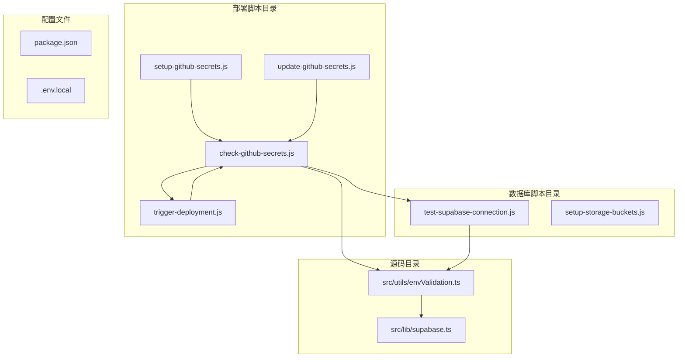
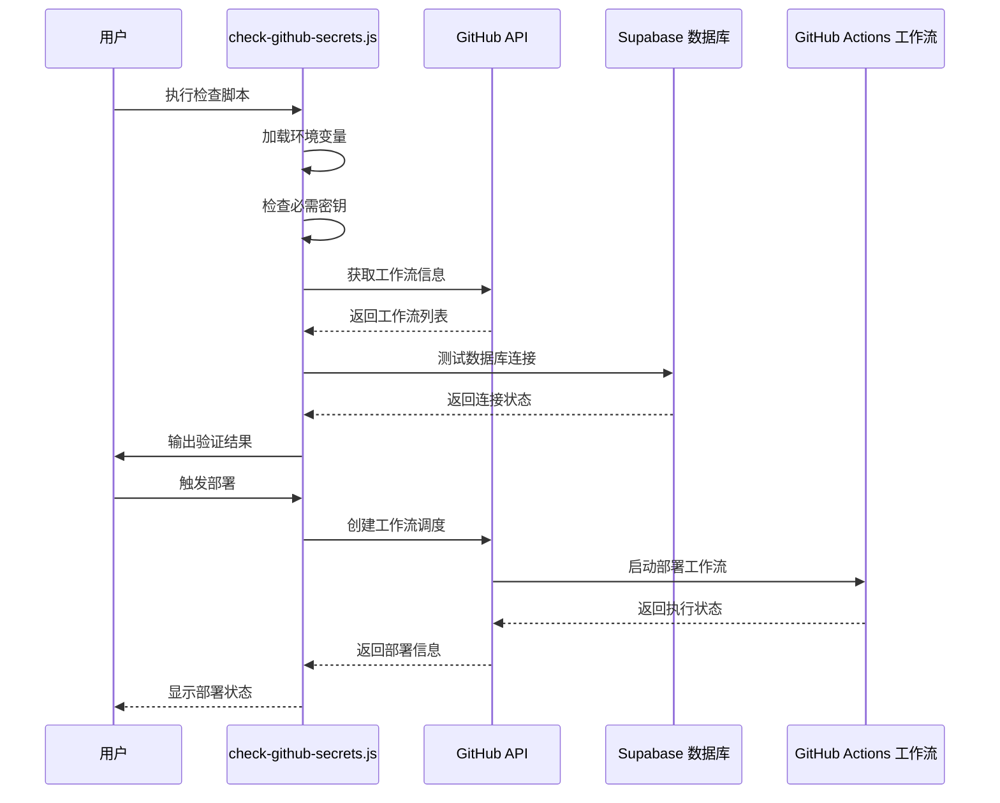
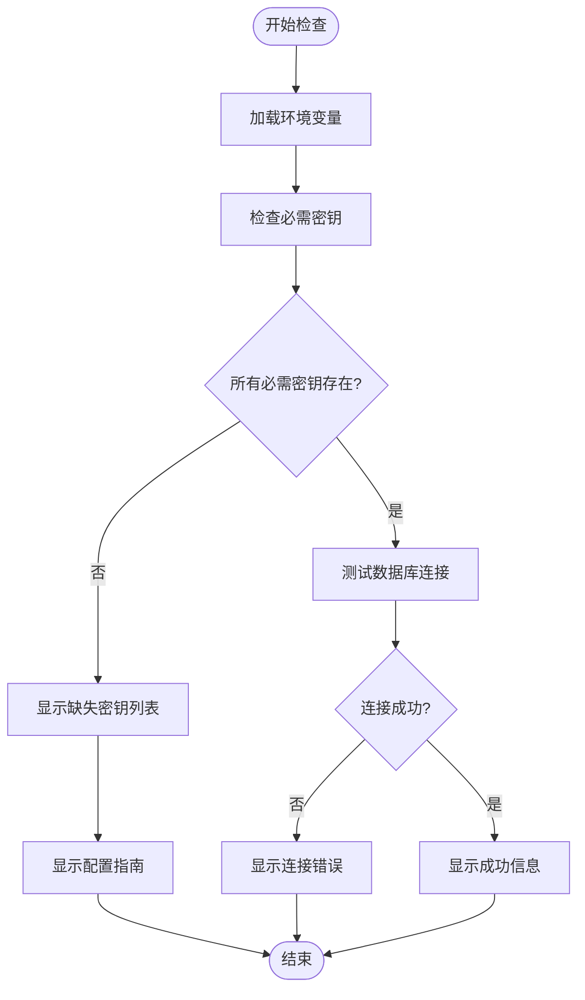
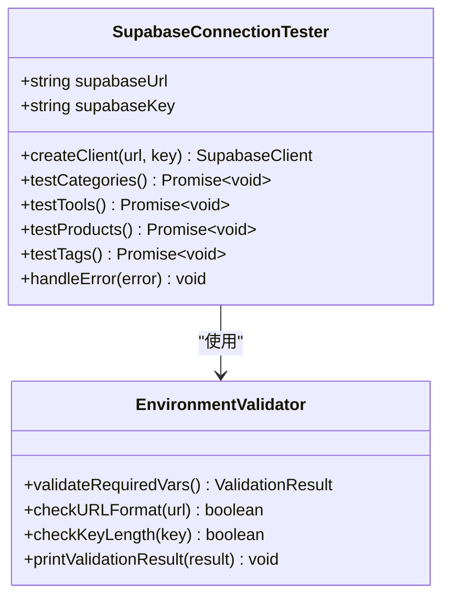
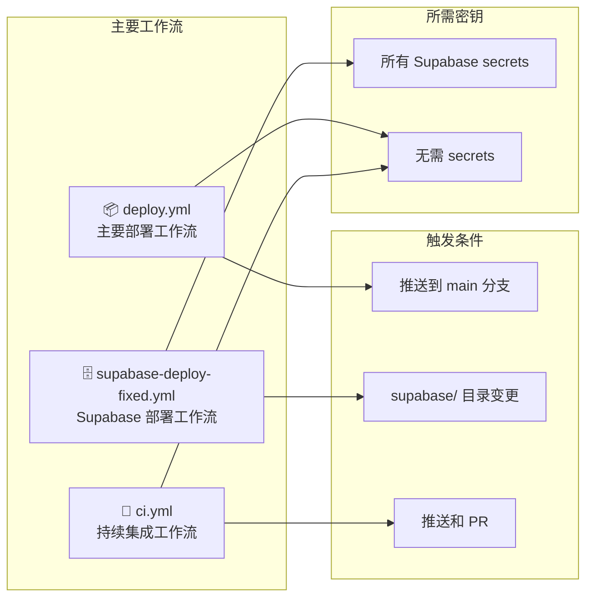
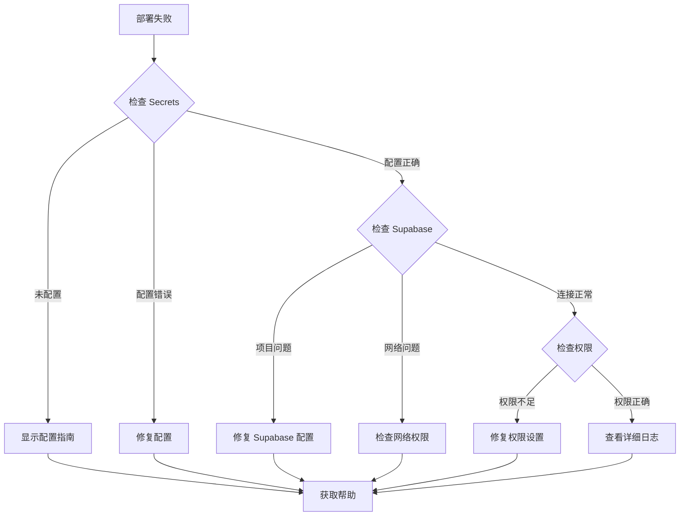

# GitHub Secrets 验证机制

<cite>
**本文档中引用的文件**
- [check-github-secrets.js](file://scripts/deployment/check-github-secrets.js)
- [trigger-deployment.js](file://scripts/deployment/trigger-deployment.js)
- [setup-github-secrets.js](file://scripts/deployment/setup-github-secrets.js)
- [update-github-secrets.js](file://scripts/deployment/update-github-secrets.js)
- [test-supabase-connection.js](file://scripts/database/test-supabase-connection.js)
- [envValidation.ts](file://src/utils/envValidation.ts)
- [package.json](file://package.json)
</cite>

## 目录
1. [简介](#简介)
2. [项目结构概览](#项目结构概览)
3. [核心组件分析](#核心组件分析)
4. [架构概览](#架构概览)
5. [详细组件分析](#详细组件分析)
6. [依赖关系分析](#依赖关系分析)
7. [性能考虑](#性能考虑)
8. [故障排除指南](#故障排除指南)
9. [结论](#结论)

## 简介

GitHub Secrets 验证机制是一个综合性的自动化脚本系统，专门用于验证和管理 GitHub Actions 工作流所需的敏感配置信息。该系统通过 `check-github-secrets.js` 脚本为核心，提供了完整的密钥验证、配置检查和故障排除功能，确保 CI/CD 流水线能够安全可靠地运行。

该系统的主要目标是：
- 自动化验证 GitHub Secrets 的完整性和正确性
- 提供清晰的配置指南和故障排除信息
- 确保 Supabase 数据库连接的安全性
- 支持多种部署场景和工作流类型

## 项目结构概览



**图表来源**
- [check-github-secrets.js](file://scripts/deployment/check-github-secrets.js#L1-L171)
- [trigger-deployment.js](file://scripts/deployment/trigger-deployment.js#L1-L181)
- [test-supabase-connection.js](file://scripts/database/test-supabase-connection.js#L1-L112)

**章节来源**
- [check-github-secrets.js](file://scripts/deployment/check-github-secrets.js#L1-L171)
- [package.json](file://package.json#L1-L104)

## 核心组件分析

### GitHub Secrets 验证脚本

`check-github-secrets.js` 是整个验证机制的核心组件，负责：

1. **密钥配置检查**：验证必需的 GitHub Secrets 是否已正确配置
2. **本地环境变量验证**：检查 `.env.local` 文件中的配置
3. **Supabase 连接测试**：验证数据库连接的可用性
4. **工作流信息展示**：提供相关工作流的详细说明
5. **故障排除指南**：提供常见问题的解决方案

### 部署触发机制

`trigger-deployment.js` 提供了手动触发 GitHub Actions 工作流的功能，支持：

1. **工作流发现**：自动识别可用的部署工作流
2. **权限验证**：确保 GitHub Token 具有足够的权限
3. **部署监控**：实时跟踪部署状态和进度
4. **错误处理**：提供详细的错误信息和解决方案

**章节来源**
- [check-github-secrets.js](file://scripts/deployment/check-github-secrets.js#L15-L171)
- [trigger-deployment.js](file://scripts/deployment/trigger-deployment.js#L20-L181)

## 架构概览



**图表来源**
- [check-github-secrets.js](file://scripts/deployment/check-github-secrets.js#L15-L50)
- [trigger-deployment.js](file://scripts/deployment/trigger-deployment.js#L20-L80)

## 详细组件分析

### 密钥验证组件



**图表来源**
- [check-github-secrets.js](file://scripts/deployment/check-github-secrets.js#L15-L80)

#### 必需密钥清单

系统验证以下必需的 GitHub Secrets：

1. **SUPABASE_ACCESS_TOKEN**
   - 描述：Supabase 访问令牌
   - 获取方式：从 Supabase Dashboard > Settings > API > Personal access tokens 获取

2. **SUPABASE_PROJECT_REF**
   - 描述：项目引用 ID
   - 获取方式：从项目 URL 中获取

3. **VITE_SUPABASE_URL**
   - 描述：项目 API URL
   - 获取方式：从 Supabase Dashboard > Settings > API 获取

4. **VITE_SUPABASE_ANON_KEY**
   - 描述：项目匿名密钥
   - 获取方式：从 Supabase Dashboard > Settings > API 获取

#### 本地环境变量检查

```javascript
// 环境变量验证逻辑
if (supabaseUrl && supabaseKey) {
  console.log("✅ 本地环境变量已配置");
  console.log(`   VITE_SUPABASE_URL: ${supabaseUrl.substring(0, 30)}...`);
  console.log(`   VITE_SUPABASE_ANON_KEY: ${supabaseKey.substring(0, 20)}...`);
  testSupabaseConnection();
} else {
  console.log("❌ 本地环境变量未配置");
  console.log("   请检查 .env.local 文件中的配置");
}
```

**章节来源**
- [check-github-secrets.js](file://scripts/deployment/check-github-secrets.js#L15-L80)

### 数据库连接测试组件



**图表来源**
- [test-supabase-connection.js](file://scripts/database/test-supabase-connection.js#L15-L80)
- [envValidation.ts](file://src/utils/envValidation.ts#L15-L100)

#### 连接测试流程

数据库连接测试包含四个主要测试用例：

1. **分类数据测试**：验证 `categories` 表的访问权限
2. **工具数据测试**：验证 `tools` 表及其关联数据
3. **产品数据测试**：验证 `products` 表及其关联数据
4. **标签数据测试**：验证 `tags` 表的基本访问

每个测试都会：
- 执行相应的 SQL 查询
- 捕获并处理可能的错误
- 提供详细的测试结果信息

**章节来源**
- [test-supabase-connection.js](file://scripts/database/test-supabase-connection.js#L20-L112)

### 工作流信息组件



**图表来源**
- [check-github-secrets.js](file://scripts/deployment/check-github-secrets.js#L100-L130)

#### 工作流类型说明

1. **主要部署工作流 (`deploy.yml`)**
   - 触发条件：推送到 main 分支
   - 功能：构建和部署到 Netlify
   - 不需要 Supabase secrets

2. **Supabase 部署工作流 (`supabase-deploy-fixed.yml`)**
   - 触发条件：supabase/ 目录变更或手动触发
   - 功能：部署数据库迁移和前端
   - 需要所有 Supabase secrets

3. **持续集成工作流 (`ci.yml`)**
   - 触发条件：推送和 PR
   - 功能：代码检查和构建测试
   - 不需要 secrets

**章节来源**
- [check-github-secrets.js](file://scripts/deployment/check-github-secrets.js#L100-L130)

### 故障排除组件



**图表来源**
- [check-github-secrets.js](file://scripts/deployment/check-github-secrets.js#L130-L171)

#### 常见故障排除场景

1. **Secrets 未配置或配置错误**
   - 确认所有必需的 secrets 都已添加
   - 检查 secret 值是否正确（无多余空格）

2. **Supabase 项目问题**
   - 确认项目状态为 "Active"
   - 检查项目引用 ID 是否正确
   - 验证访问令牌权限

3. **网络或权限问题**
   - 检查 GitHub Actions 是否启用
   - 确认仓库权限设置正确

**章节来源**
- [check-github-secrets.js](file://scripts/deployment/check-github-secrets.js#L130-L171)

## 依赖关系分析

```mermaid
graph TB
subgraph "外部依赖"
A[dotenv]
B[@supabase/supabase-js]
C[@octokit/rest]
end
subgraph "内部模块"
D[envValidation.ts]
E[supabase.ts]
F[databaseService.ts]
end
subgraph "脚本文件"
G[check-github-secrets.js]
H[trigger-deployment.js]
I[test-supabase-connection.js]
end
G --> A
G --> B
G --> D
H --> C
I --> B
I --> D
D --> E
E --> F
```

**图表来源**
- [check-github-secrets.js](file://scripts/deployment/check-github-secrets.js#L1-L10)
- [package.json](file://package.json#L30-L50)

### 关键依赖说明

1. **dotenv**：用于加载环境变量文件
2. **@supabase/supabase-js**：Supabase 客户端库，用于数据库连接测试
3. **@octokit/rest**：GitHub API 客户端，用于工作流管理和部署触发

### 内部模块依赖

- `envValidation.ts` 提供环境变量验证功能
- `supabase.ts` 封装 Supabase 客户端初始化
- `databaseService.ts` 提供数据库服务接口

**章节来源**
- [check-github-secrets.js](file://scripts/deployment/check-github-secrets.js#L1-L10)
- [package.json](file://package.json#L30-L50)

## 性能考虑

### 连接超时处理

系统实现了智能的连接超时处理机制：

```javascript
// 超时设置示例
const timeoutPromise = new Promise((_, reject) => {
  setTimeout(() => {
    reject(new Error("连接超时"));
  }, 30000); // 30秒超时
});
```

### 并发连接优化

对于多个数据库表的测试，采用顺序执行而非并发执行，避免对数据库造成过大压力。

### 缓存策略

- 环境变量在脚本启动时一次性加载
- GitHub API 响应结果不进行缓存，确保信息的实时性

## 故障排除指南

### 常见验证问题

#### 1. 权限不足错误

**症状**：GitHub API 调用返回 403 错误
**解决方案**：
```bash
# 检查 GitHub Token 权限
gh auth status

# 重新生成具有适当权限的 Token
# 需要 repo 和 workflow 权限
```

#### 2. 密钥缺失问题

**症状**：必需的 GitHub Secrets 未找到
**解决方案**：
- 按照脚本提供的指南配置所有必需的 secrets
- 确保密钥名称完全匹配（区分大小写）

#### 3. 数据库连接失败

**症状**：Supabase 连接测试失败
**解决方案**：
- 验证 Supabase URL 和匿名密钥的正确性
- 检查 Supabase 项目状态是否为 Active
- 确认网络连接正常

#### 4. 工作流触发失败

**症状**：无法手动触发 GitHub Actions 工作流
**解决方案**：
- 检查工作流文件是否包含 `workflow_dispatch` 配置
- 确认分支名称正确（通常是 main）
- 验证 GITHUB_TOKEN 权限设置

### 调试技巧

1. **启用详细日志**：设置 `DEBUG=true` 环境变量
2. **单独测试连接**：使用 `npm run secrets:check` 单独运行验证脚本
3. **检查网络连接**：确保能够访问 GitHub 和 Supabase 服务
4. **验证配置文件**：仔细检查 `.env.local` 文件的内容

**章节来源**
- [check-github-secrets.js](file://scripts/deployment/check-github-secrets.js#L130-L171)
- [trigger-deployment.js](file://scripts/deployment/trigger-deployment.js#L120-L147)

## 结论

GitHub Secrets 验证机制通过 `check-github-secrets.js` 脚本提供了一个全面而强大的解决方案，用于确保 CI/CD 流水线的安全性和可靠性。该系统具有以下优势：

### 主要特性

1. **自动化验证**：自动检测和报告配置问题
2. **全面覆盖**：涵盖所有必需的密钥和配置项
3. **用户友好**：提供清晰的配置指南和故障排除信息
4. **实时监控**：支持工作流状态的实时跟踪
5. **错误处理**：完善的错误处理和恢复机制

### 最佳实践建议

1. **定期验证**：定期运行 `npm run secrets:check` 确保配置正确
2. **权限最小化**：仅授予必要的 GitHub Token 权限
3. **安全存储**：使用 GitHub Secrets 存储敏感信息
4. **文档维护**：及时更新配置文档和故障排除指南
5. **监控告警**：设置工作流失败的监控和告警机制

### 未来改进方向

1. **增强自动化**：增加自动修复功能
2. **扩展支持**：支持更多类型的部署配置
3. **可视化界面**：开发图形化的配置管理界面
4. **集成测试**：增加端到端的部署测试功能
5. **多环境支持**：支持开发、测试、生产等多个环境的独立配置

通过这个验证机制，开发者可以更加自信地进行 CI/CD 部署，减少因配置错误导致的部署失败，提高开发效率和部署成功率。