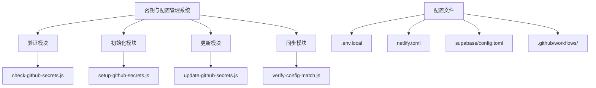
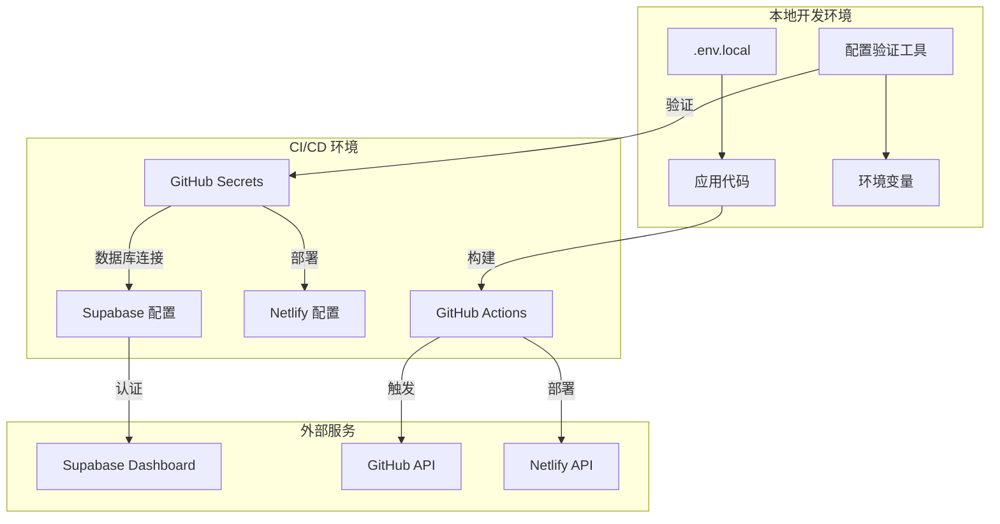
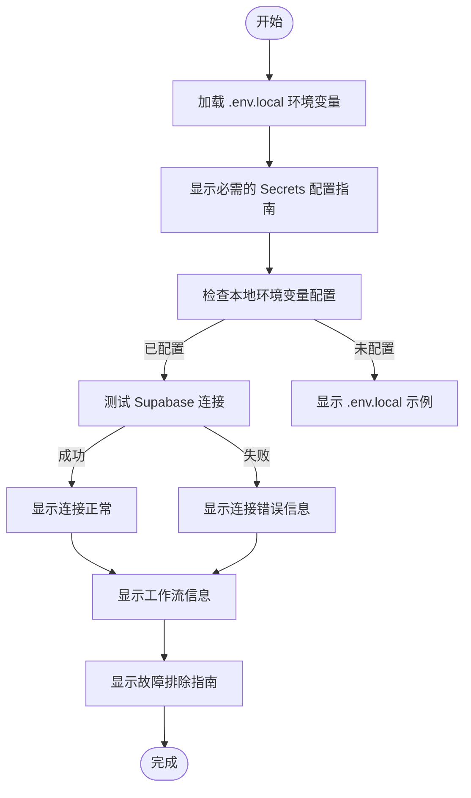
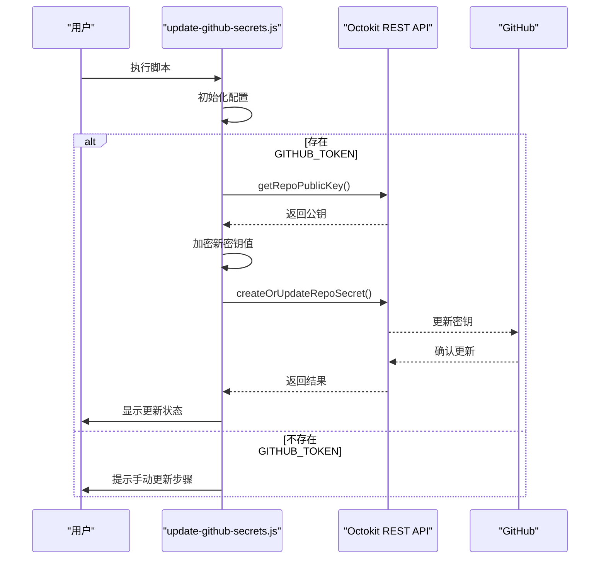
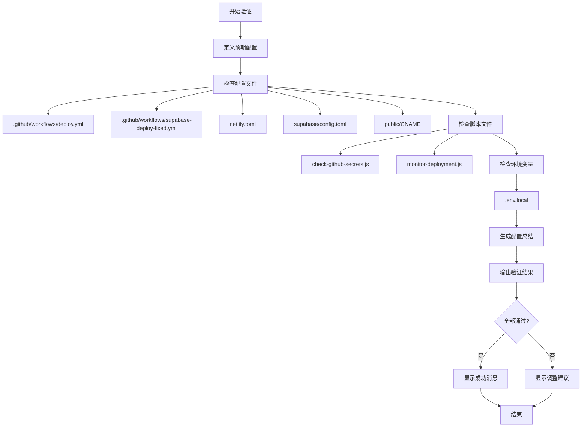
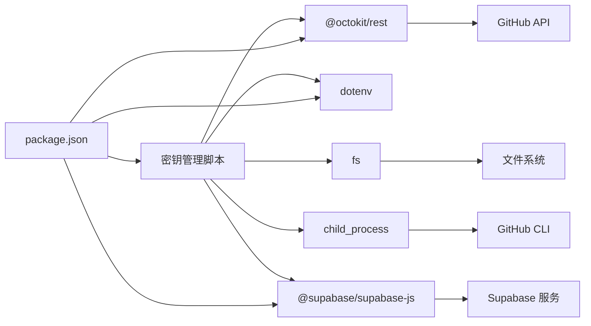

# 密钥与配置管理

<cite>
**本文档引用的文件**
- [check-github-secrets.js](file://scripts/deployment/check-github-secrets.js)
- [setup-github-secrets.js](file://scripts/deployment/setup-github-secrets.js)
- [update-github-secrets.js](file://scripts/deployment/update-github-secrets.js)
- [verify-config-match.js](file://scripts/deployment/verify-config-match.js)
- [.env.local](file://.env.local)
- [supabaseClient.ts](file://src/lib/supabaseClient.ts)
- [package.json](file://package.json)
- [netlify.toml](file://netlify.toml)
- [GITHUB_AUTOMATION_GUIDE.md](file://docs/deployment/GITHUB_AUTOMATION_GUIDE.md)
</cite>

## 目录
1. [引言](#引言)
2. [项目结构](#项目结构)
3. [核心组件](#核心组件)
4. [架构概述](#架构概述)
5. [详细组件分析](#详细组件分析)
6. [依赖分析](#依赖分析)
7. [性能考虑](#性能考虑)
8. [故障排除指南](#故障排除指南)
9. [结论](#结论)

## 引言
本项目实现了一套完整的密钥管理与配置同步机制，确保开发、部署和运行时环境的安全性与一致性。系统通过多个专用脚本协同工作，实现了GitHub Secrets的验证、初始化、更新以及本地与远程配置的一致性检查。

## 项目结构
项目中的密钥与配置管理功能主要集中在`scripts/deployment`目录下，相关配置文件分布在根目录和特定配置目录中。



**Diagram sources**
- [scripts/deployment](file://scripts/deployment)
- [config](file://config)

**Section sources**
- [scripts/deployment](file://scripts/deployment)
- [.env.local](file://.env.local)

## 核心组件
系统的核心组件包括四个主要的管理脚本：`check-github-secrets.js`用于验证密钥完整性，`setup-github-secrets.js`负责初始化配置，`update-github-secrets.js`处理密钥更新，以及`verify-config-match.js`确保配置一致性。

**Section sources**
- [check-github-secrets.js](file://scripts/deployment/check-github-secrets.js)
- [setup-github-secrets.js](file://scripts/deployment/setup-github-secrets.js)
- [update-github-secrets.js](file://scripts/deployment/update-github-secrets.js)
- [verify-config-match.js](file://scripts/deployment/verify-config-match.js)

## 架构概述
整个密钥与配置管理系统采用分层架构设计，从环境变量加载到API调用，再到自动化工作流集成，形成了完整的安全管理体系。



**Diagram sources**
- [.env.local](file://.env.local)
- [package.json](file://package.json)
- [netlify.toml](file://netlify.toml)

## 详细组件分析

### check-github-secrets.js 分析
该脚本负责验证GitHub Secrets的完整性，提供详细的配置指导和连接测试功能。



**Diagram sources**
- [check-github-secrets.js](file://scripts/deployment/check-github-secrets.js)

**Section sources**
- [check-github-secrets.js](file://scripts/deployment/check-github-secrets.js#L1-L170)

### setup-github-secrets.js 分析
此脚本实现了GitHub Secrets的自动化配置，利用GitHub CLI进行安全的密钥设置。

```mermaid
classDiagram
class GitHubSecretsSetup {
+REPO : string
+REQUIRED_SECRETS : object
-checkGitHubCLI() : boolean
-setSecret(name, value, description) : boolean
+main() : Promise~void~
}
class EnvironmentLoader {
+existsSync()
+dotenv.config()
}
class ProcessManager {
+execSync()
+process.exit()
}
GitHubSecretsSetup --> EnvironmentLoader : "使用"
GitHubSecretsSetup --> ProcessManager : "使用"
GitHubSecretsSetup --> "GitHub CLI" : "调用"
```

**Diagram sources**
- [setup-github-secrets.js](file://scripts/deployment/setup-github-secrets.js)

**Section sources**
- [setup-github-secrets.js](file://scripts/deployment/setup-github-secrets.js#L1-L127)

### update-github-secrets.js 分析
该组件提供了密钥更新功能，包含验证现有密钥、加密新值和更新操作的完整流程。



**Diagram sources**
- [update-github-secrets.js](file://scripts/deployment/update-github-secrets.js)

**Section sources**
- [update-github-secrets.js](file://scripts/deployment/update-github-secrets.js#L1-L190)

### verify-config-match.js 分析
这个关键组件确保了本地配置与远程部署配置的一致性，防止因配置不匹配导致的部署问题。



**Diagram sources**
- [verify-config-match.js](file://scripts/deployment/verify-config-match.js)

**Section sources**
- [verify-config-match.js](file://scripts/deployment/verify-config-match.js#L1-L254)

## 依赖分析
密钥管理系统依赖于多个外部库和工具，形成了复杂的依赖网络。



**Diagram sources**
- [package.json](file://package.json)
- [scripts/deployment](file://scripts/deployment)

**Section sources**
- [package.json](file://package.json#L1-L103)

## 性能考虑
虽然密钥管理脚本主要在部署前执行，不直接影响运行时性能，但其效率对开发体验有重要影响。各脚本都采用了异步操作和错误处理机制，确保在出现问题时能够快速反馈。

## 故障排除指南
当密钥或配置出现问题时，可以按照以下步骤进行排查：

**Section sources**
- [check-github-secrets.js](file://scripts/deployment/check-github-secrets.js#L118-L148)
- [GITHUB_AUTOMATION_GUIDE.md](file://docs/deployment/GITHUB_AUTOMATION_GUIDE.md#L1-L200)

## 结论
该项目建立了一套完善的密钥与配置管理机制，通过多个专用脚本实现了密钥的验证、初始化、更新和配置同步。这种分而治之的设计方法提高了系统的可维护性和安全性，为持续集成和持续部署提供了可靠的基础。