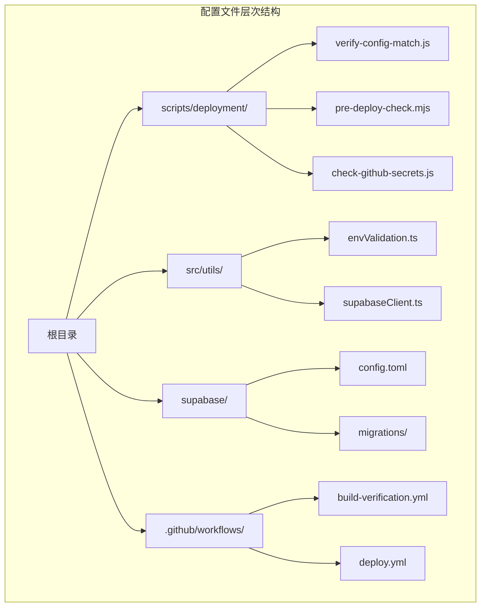
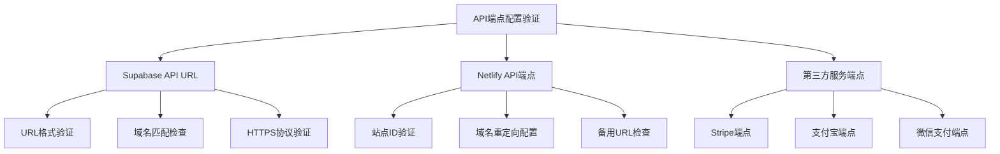
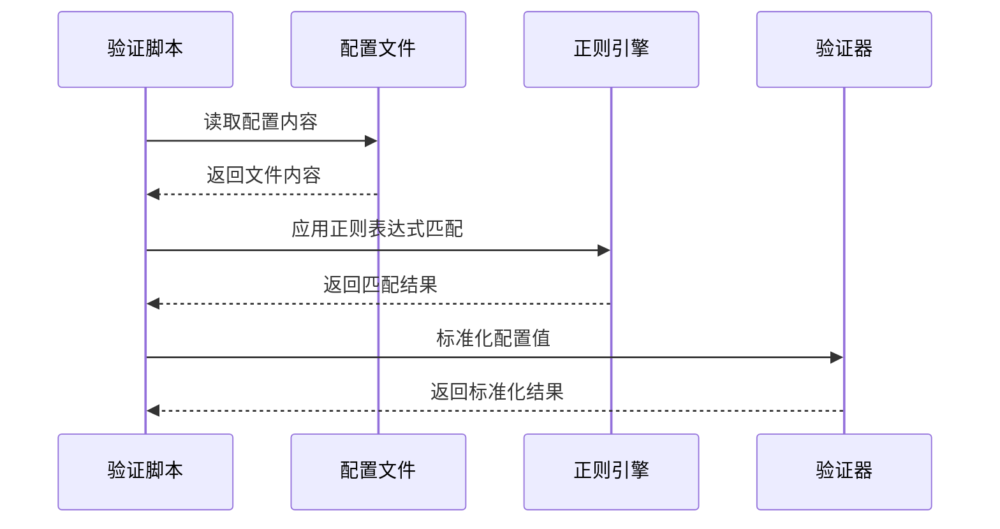
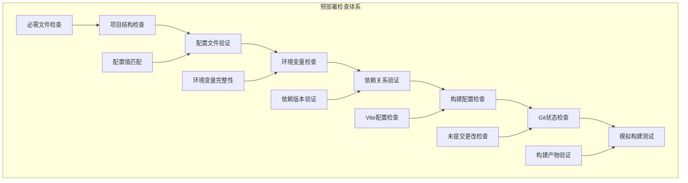
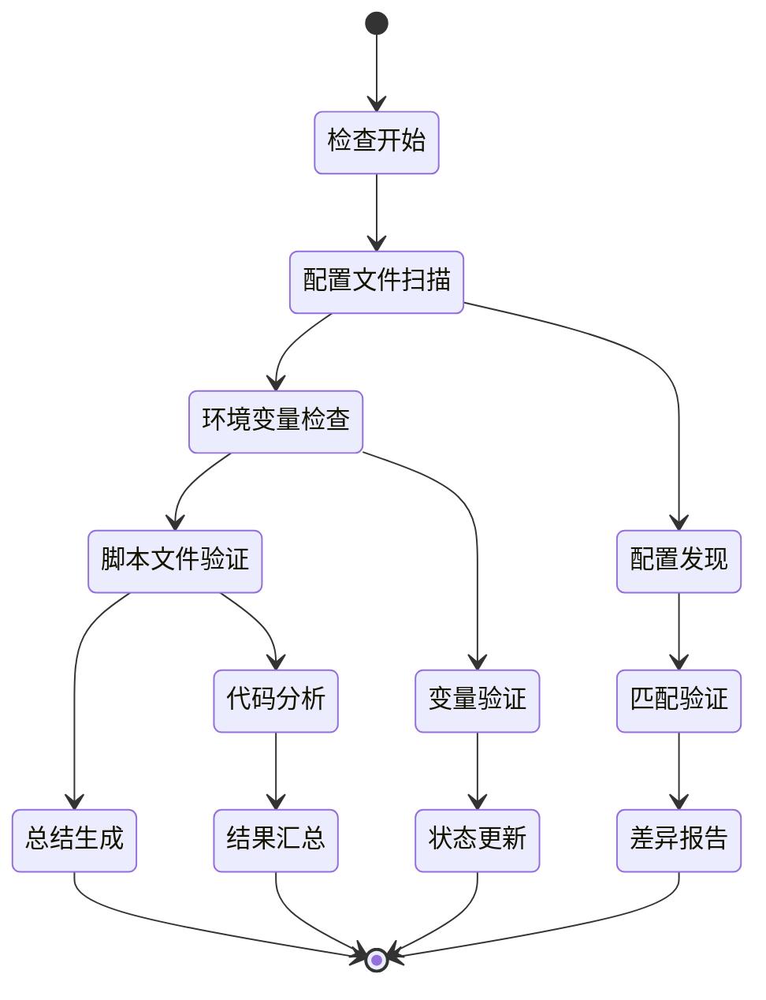
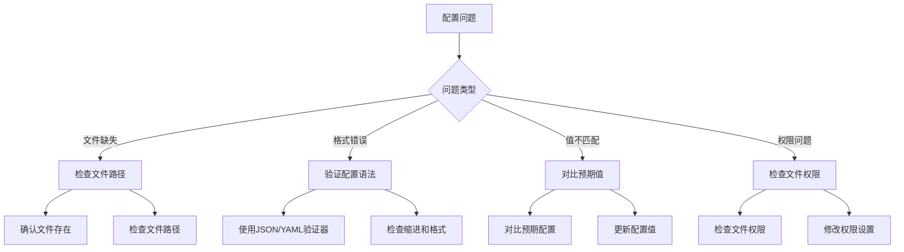

# 配置一致性校验机制

<cite>
**本文档中引用的文件**
- [verify-config-match.js](file://scripts/deployment/verify-config-match.js)
- [pre-deploy-check.mjs](file://scripts/deployment/pre-deploy-check.mjs)
- [enhanced-pre-deploy-check.mjs](file://scripts/deployment/enhanced-pre-deploy-check.mjs)
- [check-github-secrets.js](file://scripts/deployment/check-github-secrets.js)
- [envValidation.ts](file://src/utils/envValidation.ts)
- [supabaseClient.ts](file://src/lib/supabaseClient.ts)
- [netlify.toml](file://netlify.toml)
- [supabase/config.toml](file://supabase/config.toml)
- [build-verification.yml](file://.github/workflows/build-verification.yml)
- [deploy.yml](file://.github/workflows/deploy.yml)
</cite>

## 目录
1. [简介](#简介)
2. [项目结构概览](#项目结构概览)
3. [核心配置校验组件](#核心配置校验组件)
4. [配置比对范围分析](#配置比对范围分析)
5. [解析与标准化处理](#解析与标准化处理)
6. [差异分析机制](#差异分析机制)
7. [预部署检查体系](#预部署检查体系)
8. [自动检测与修复](#自动检测与修复)
9. [典型配置漂移案例](#典型配置漂移案例)
10. [最佳实践与故障排除](#最佳实践与故障排除)
11. [总结](#总结)

## 简介

配置一致性校验机制是现代Web应用部署流水线中的关键组成部分，它确保本地开发环境与远程部署环境之间的配置完全一致。本文档深入分析了`verify-config-match.js`脚本如何实现这一目标，包括其比对范围、解析处理逻辑、差异分析算法以及在预部署检查中的重要作用。

该机制通过多层次的配置验证，覆盖了API端点、功能开关、第三方服务凭证等关键配置要素，为开发者提供了完整的配置一致性保障体系。

## 项目结构概览

该项目采用模块化的配置管理架构，将不同类型的配置文件分散在多个目录中：



**图表来源**
- [verify-config-match.js](file://scripts/deployment/verify-config-match.js#L1-L255)
- [envValidation.ts](file://src/utils/envValidation.ts#L1-L293)

## 核心配置校验组件

### verify-config-match.js 核心架构

`verify-config-match.js`是配置一致性校验的核心脚本，它实现了全面的配置比对功能：

```javascript
// 预期的配置值（基于用户的实际项目）
const expectedConfig = {
  github: {
    owner: "jiayuwee",
    repo: "advanced-tools-navigation",
  },
  netlify: {
    siteId: "spiffy-torrone-5454e1",
    domain: "ramusi.cn",
  },
  supabase: {
    projectRef: "ndmxwdejswybvbwrxsai",
    url: "https://your-supabase-project.supabase.co",
  },
};
```

该脚本通过以下核心组件实现配置验证：

1. **配置文件检查器**：扫描多个配置文件中的关键配置项
2. **脚本文件验证器**：检查部署脚本中的硬编码配置
3. **环境变量验证器**：确保本地环境变量配置正确
4. **配置摘要生成器**：提供清晰的配置指导信息

**章节来源**
- [verify-config-match.js](file://scripts/deployment/verify-config-match.js#L1-L30)

### 配置文件扫描机制

脚本定义了详细的配置文件扫描规则：

```javascript
const configFiles = [
  {
    path: ".github/workflows/deploy.yml",
    checks: [
      { pattern: /ramusi\.cn/, expected: "ramusi.cn", description: "域名配置" },
      {
        pattern: /spiffy-torrone-5454e1/,
        expected: "spiffy-torrone-5454e1",
        description: "Netlify 站点 ID",
      },
    ],
  },
  // ... 更多配置文件检查规则
];
```

这种模式化的设计使得配置验证具有高度的可扩展性和维护性。

**章节来源**
- [verify-config-match.js](file://scripts/deployment/verify-config-match.js#L32-L85)

## 配对比对范围分析

### API端点配置验证

配置校验机制覆盖了应用中所有关键的API端点配置：



**图表来源**
- [verify-config-match.js](file://scripts/deployment/verify-config-match.js#L40-L85)
- [supabase/config.toml](file://supabase/config.toml#L1-L50)

### 功能开关配置检查

系统通过严格的正则表达式匹配来验证各种功能开关：

```javascript
// 功能开关检查示例
{
  pattern: /VITE_DEBUG_MODE\s*=\s*"true"/,
  expected: "VITE_DEBUG_MODE=true",
  description: "调试模式开关"
},
{
  pattern: /VITE_ENABLE_ANALYTICS\s*=\s*"true"/,
  expected: "VITE_ENABLE_ANALYTICS=true",
  description: "分析统计开关"
}
```

### 第三方服务凭证验证

脚本特别关注第三方服务的凭证配置，包括：

- **Supabase凭证**：项目引用ID、访问令牌、匿名密钥
- **Netlify凭证**：站点ID、认证令牌
- **支付服务凭证**：Stripe公钥/私钥、支付宝应用ID、微信商户号

**章节来源**
- [verify-config-match.js](file://scripts/deployment/verify-config-match.js#L86-L120)
- [check-github-secrets.js](file://scripts/deployment/check-github-secrets.js#L15-L50)

## 解析与标准化处理

### 配置提取策略

配置校验机制采用了多种配置提取策略：



**图表来源**
- [verify-config-match.js](file://scripts/deployment/verify-config-match.js#L87-L110)

### 标准化处理流程

系统实现了统一的配置标准化处理流程：

1. **原始配置提取**：从各种配置文件中提取原始配置值
2. **格式规范化**：统一配置值的格式和命名约定
3. **类型验证**：确保配置值符合预期的数据类型
4. **范围检查**：验证配置值是否在合理范围内

### 环境变量标准化

环境变量配置通过专门的验证机制进行标准化：

```typescript
// 环境变量验证接口
interface EnvConfig {
  supabaseUrl: string;
  supabaseAnonKey: string;
  appEnv: "development" | "production" | "test";
  appVersion: string;
  debugMode: boolean;
  enableAnalytics: boolean;
}
```

**章节来源**
- [envValidation.ts](file://src/utils/envValidation.ts#L1-L30)
- [verify-config-match.js](file://scripts/deployment/verify-config-match.js#L170-L200)

## 差异分析机制

### 自动检测不一致项

配置校验脚本通过智能的差异分析算法自动检测配置不一致：

```javascript
function checkFile(filePath, checks) {
  try {
    const content = readFileSync(filePath, "utf8");
    const results = [];

    for (const check of checks) {
      const matches = content.match(check.pattern);
      if (matches) {
        console.log(`  ✅ ${check.description}: 找到匹配项`);
        results.push({ ...check, status: "found", matches });
      } else {
        console.log(`  ❌ ${check.description}: 未找到匹配项`);
        results.push({ ...check, status: "missing" });
      }
    }
    return results;
  } catch (error) {
    console.log(`  ⚠️  无法读取文件: ${error.message}`);
    return checks.map((check) => ({
      ...check,
      status: "error",
      error: error.message,
    }));
  }
}
```

### 差异分类与优先级

系统将配置差异分为三个等级：

1. **致命错误**：导致应用无法正常运行的关键配置缺失
2. **严重警告**：可能影响功能但不会导致崩溃的配置问题
3. **轻微警告**：优化建议或最佳实践相关的配置问题

### 修复建议生成

当检测到配置差异时，系统会自动生成针对性的修复建议：

```javascript
// 生成配置总结
function generateConfigSummary() {
  console.log("\n📋 配置总结");
  console.log("=====================================");
  console.log("根据您的项目，以下是正确的配置值：");
  
  console.log("🔐 GitHub Secrets 应该配置为：");
  console.log(`- SUPABASE_PROJECT_REF: ${expectedConfig.supabase.projectRef}`);
  console.log(`- VITE_SUPABASE_URL: ${expectedConfig.supabase.url}`);
  console.log("- SUPABASE_ACCESS_TOKEN: [从 Supabase Dashboard 获取]");
  console.log("- VITE_SUPABASE_ANON_KEY: [从 Supabase Dashboard 获取]");
}
```

**章节来源**
- [verify-config-match.js](file://scripts/deployment/verify-config-match.js#L87-L179)

## 预部署检查体系

### 多层次检查架构

预部署检查体系采用分层验证架构：



**图表来源**
- [enhanced-pre-deploy-check.mjs](file://scripts/deployment/enhanced-pre-deploy-check.mjs#L1-L100)
- [pre-deploy-check.mjs](file://scripts/deployment/pre-deploy-check.mjs#L1-L100)

### check-github-secrets.js 集成

该脚本专门负责GitHub Secrets的配置检查：

```javascript
// GitHub Secrets 配置检查指南
const requiredSecrets = [
  {
    name: "SUPABASE_ACCESS_TOKEN",
    description: "Supabase 访问令牌",
    howToGet: "从 Supabase Dashboard > Settings > API > Personal access tokens 获取",
  },
  {
    name: "SUPABASE_PROJECT_REF",
    description: "项目引用 ID",
    howToGet: "从项目 URL 中获取，您的项目 ID: ndmxwdejswybvbwrxsai",
  },
];
```

### 与CI/CD流水线的集成

配置校验机制深度集成到CI/CD流水线中：

```yaml
# GitHub Actions 工作流集成
- name: 🔍 验证配置匹配性
  run: |
    node scripts/deployment/verify-config-match.js
    echo "✅ 配置验证通过"
```

**章节来源**
- [check-github-secrets.js](file://scripts/deployment/check-github-secrets.js#L15-L50)
- [build-verification.yml](file://.github/workflows/build-verification.yml#L1-L50)

## 自动检测与修复

### 实时配置监控

系统实现了实时的配置监控机制：



**图表来源**
- [verify-config-match.js](file://scripts/deployment/verify-config-match.js#L214-L255)

### 智能修复建议

当检测到配置问题时，系统会提供智能的修复建议：

1. **配置模板生成**：自动生成正确的配置文件模板
2. **环境变量设置指南**：提供详细的环境变量配置说明
3. **GitHub Secrets配置向导**：指导用户正确配置GitHub Secrets
4. **部署脚本更新建议**：针对发现的问题提供具体的修复方案

### 预防性配置检查

系统不仅检测现有配置问题，还具备预防性检查能力：

```javascript
// 预防性检查示例
if (optionalVars.VITE_APP_ENV === "production") {
  if (optionalVars.VITE_DEBUG_MODE === "true") {
    warnings.push("生产环境建议关闭调试模式 (VITE_DEBUG_MODE=false)");
  }
  if (optionalVars.VITE_ENABLE_ANALYTICS !== "true") {
    warnings.push("生产环境建议启用分析 (VITE_ENABLE_ANALYTICS=true)");
  }
}
```

**章节来源**
- [verify-config-match.js](file://scripts/deployment/verify-config-match.js#L214-L255)
- [envValidation.ts](file://src/utils/envValidation.ts#L103-L154)

## 典型配置漂移案例

### 案例一：域名配置漂移

**问题描述**：
开发环境中使用的域名与生产环境不一致，导致API调用失败。

**检测过程**：
```javascript
// 检测域名配置
{
  pattern: /ramusi\.cn/,
  expected: "ramusi.cn",
  description: "域名配置"
}
```

**修复方案**：
1. 更新`.env.local`文件中的域名配置
2. 修改`netlify.toml`中的域名设置
3. 更新Supabase配置中的重定向URL

### 案例二：Supabase凭证失效

**问题描述**：
Supabase项目引用ID或访问令牌过期或配置错误。

**检测机制**：
```javascript
// 检查环境变量配置
try {
  const envContent = readFileSync(".env.local", "utf8");
  if (envContent.includes(expectedConfig.supabase.url)) {
    console.log("✅ VITE_SUPABASE_URL 配置正确");
  } else {
    console.log("❌ VITE_SUPABASE_URL 可能不正确");
    console.log(`   应该是: ${expectedConfig.supabase.url}`);
  }
} catch (error) {
  console.log("⚠️  未找到 .env.local 文件");
}
```

**修复流程**：
1. 从Supabase Dashboard重新获取项目引用ID
2. 更新`.env.local`文件中的配置
3. 重新运行配置验证脚本

### 案例三：GitHub Secrets配置遗漏

**问题描述**：
部署流水线中缺少必要的GitHub Secrets配置。

**检测与修复**：
```javascript
// 检查GitHub Secrets配置
const requiredSecrets = [
  "SUPABASE_ACCESS_TOKEN",
  "SUPABASE_PROJECT_REF", 
  "VITE_SUPABASE_URL",
  "VITE_SUPABASE_ANON_KEY",
];

// 自动生成配置指南
console.log("🔧 配置步骤:");
console.log("1. 访问 GitHub 仓库");
console.log('2. 点击 "Settings" 标签页');
console.log('3. 在左侧菜单中点击 "Secrets and variables" > "Actions"');
console.log('4. 点击 "New repository secret" 按钮');
```

**章节来源**
- [verify-config-match.js](file://scripts/deployment/verify-config-match.js#L170-L200)
- [check-github-secrets.js](file://scripts/deployment/check-github-secrets.js#L15-L80)

## 最佳实践与故障排除

### 配置管理最佳实践

1. **版本控制配置文件**：确保所有配置文件都纳入版本控制
2. **环境隔离**：为不同环境使用不同的配置文件
3. **敏感信息保护**：使用环境变量存储敏感信息
4. **自动化验证**：在每次部署前自动验证配置一致性

### 常见问题诊断



### 故障排除清单

**配置验证失败**：
1. 检查`.env.local`文件是否存在且格式正确
2. 验证所有必需的环境变量是否已设置
3. 确认GitHub Secrets配置完整
4. 运行`npm run config:verify`重新验证

**部署失败**：
1. 检查CI/CD流水线中的配置验证步骤
2. 确认所有部署前检查都通过
3. 验证构建产物的配置正确性
4. 检查网络连接和第三方服务可用性

### 预防措施

1. **定期配置审计**：每月运行一次配置一致性检查
2. **自动化监控**：设置配置变化的自动监控告警
3. **团队培训**：确保团队成员熟悉配置管理流程
4. **文档维护**：及时更新配置管理文档

**章节来源**
- [enhanced-pre-deploy-check.mjs](file://scripts/deployment/enhanced-pre-deploy-check.mjs#L300-L363)
- [check-github-secrets.js](file://scripts/deployment/check-github-secrets.js#L120-L171)

## 总结

配置一致性校验机制是现代Web应用部署流水线中的关键基础设施。通过`verify-config-match.js`及其相关组件，系统实现了全面的配置验证、差异检测和自动修复功能。

### 核心优势

1. **全面覆盖**：涵盖API端点、功能开关、第三方服务凭证等所有关键配置要素
2. **智能检测**：通过正则表达式和模式匹配实现精准的配置差异检测
3. **自动化修复**：提供详细的修复建议和配置模板
4. **集成友好**：无缝集成到CI/CD流水线和预部署检查体系中

### 技术创新

- **模块化设计**：各组件职责明确，便于维护和扩展
- **正则表达式驱动**：灵活应对各种配置格式和变化
- **多层次验证**：从文件级别到环境变量级别的全方位检查
- **实时反馈**：即时提供配置状态和修复建议

### 应用价值

该配置一致性校验机制显著提升了应用部署的可靠性和效率，减少了因配置问题导致的部署失败和生产环境故障，为团队提供了强有力的配置管理保障。

通过持续的改进和优化，这套配置校验体系将继续为现代Web应用的稳定部署提供坚实的技术支撑。