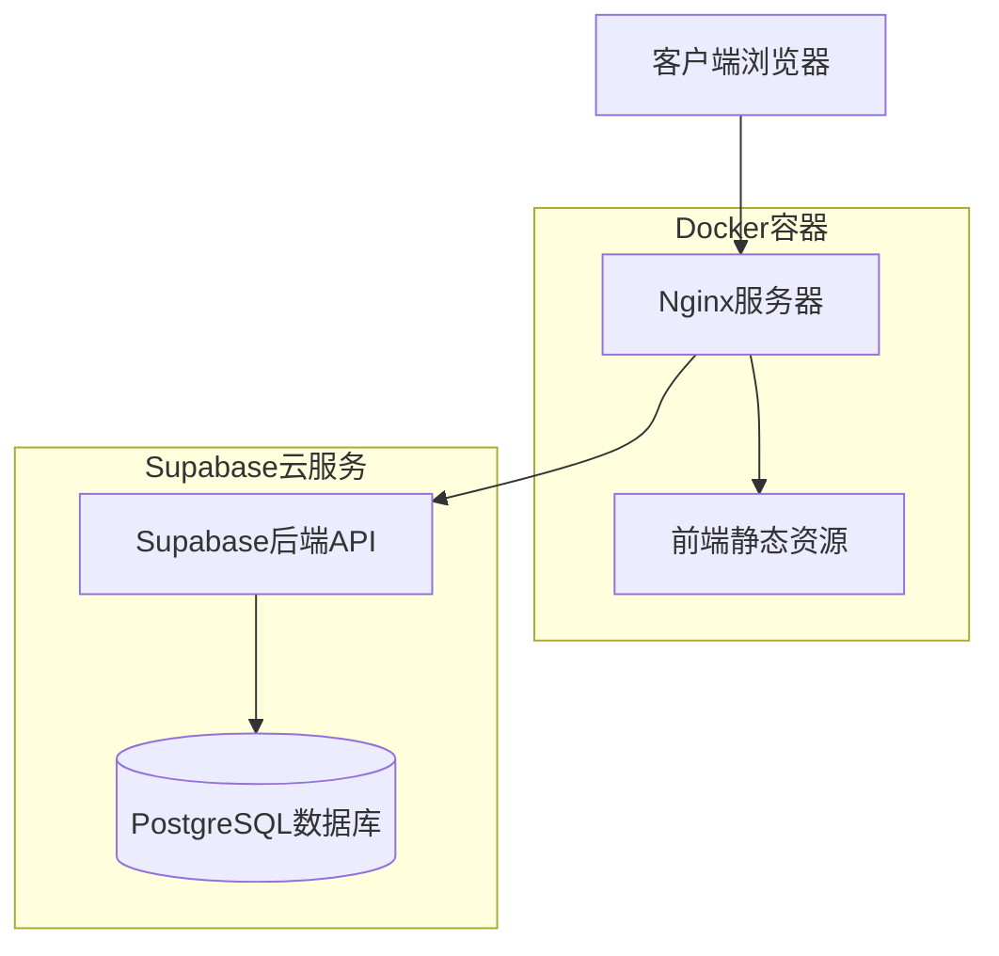
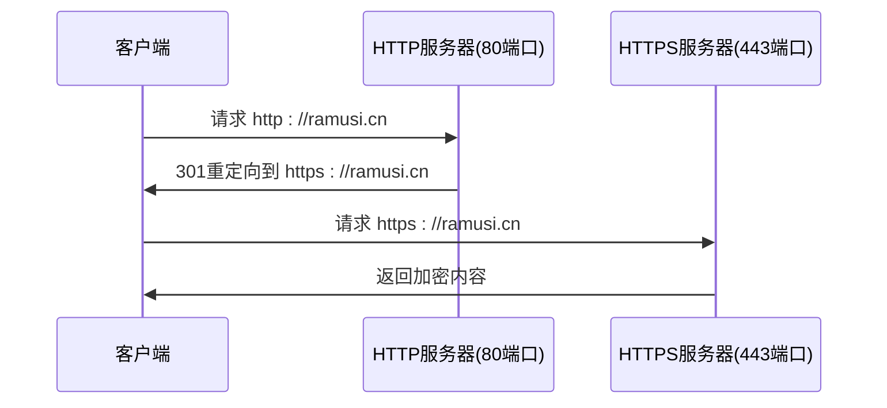
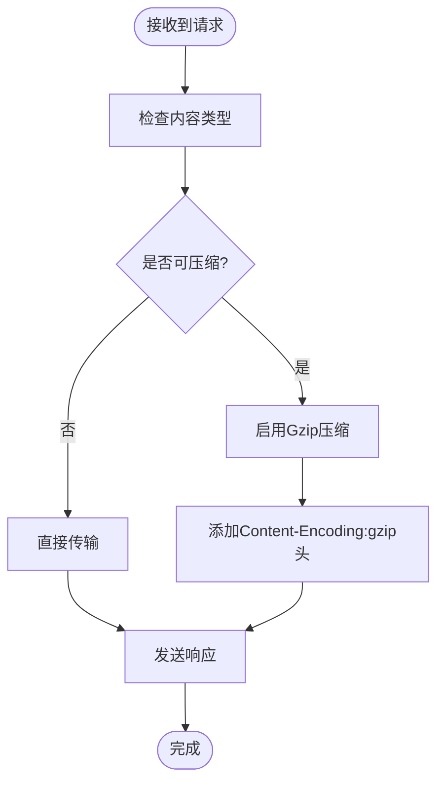
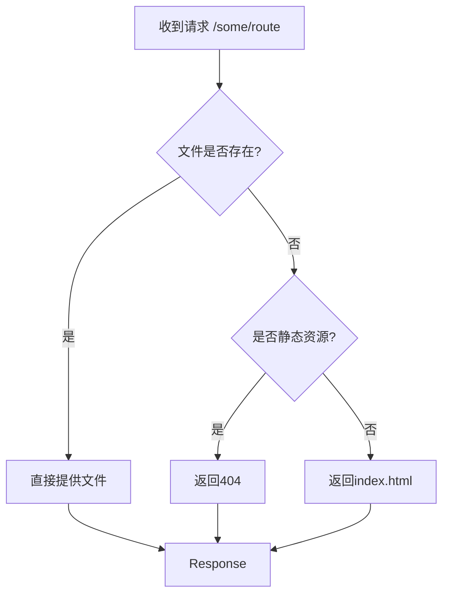
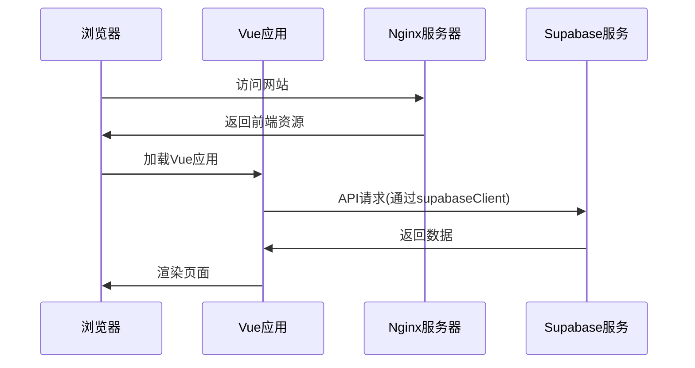

# Web服务器配置

<cite>
**本文档引用的文件**
- [nginx.conf](file://config/deployment/nginx.conf)
- [Dockerfile](file://config/deployment/Dockerfile)
- [docker-compose.yml](file://config/deployment/docker-compose.yml)
- [vite.config.ts](file://vite.config.ts)
- [supabaseClient.ts](file://src/lib/supabaseClient.ts)
</cite>

## 目录
1. [项目结构与部署架构](#项目结构与部署架构)
2. [Nginx核心配置解析](#nginx核心配置解析)
3. [HTTP服务器块详细分析](#http服务器块详细分析)
4. [静态资源处理策略](#静态资源处理策略)
5. [SPA前端路由支持](#spa前端路由支持)
6. [安全头配置](#安全头配置)
7. [反向代理与Supabase集成](#反向代理与supabase集成)
8. [常见错误诊断与修复](#常见错误诊断与修复)

## 项目结构与部署架构

本项目采用现代化的前后端分离架构，前端使用Vue框架构建单页应用（SPA），后端通过Supabase提供API服务。部署架构基于Docker容器化技术，通过Nginx作为反向代理服务器处理所有HTTP请求。



**Diagram sources**
- [nginx.conf](file://config/deployment/nginx.conf)
- [Dockerfile](file://config/deployment/Dockerfile)

**Section sources**
- [docker-compose.yml](file://config/deployment/docker-compose.yml)
- [nginx.conf](file://config/deployment/nginx.conf)

## Nginx核心配置解析

Nginx配置文件定义了两个server块：一个用于HTTP到HTTPS的重定向，另一个用于处理HTTPS请求。这种配置确保了所有流量都通过安全连接传输。



**Diagram sources**
- [nginx.conf](file://config/deployment/nginx.conf#L1-L20)

**Section sources**
- [nginx.conf](file://config/deployment/nginx.conf#L1-L85)

## HTTP服务器块详细分析

HTTPS服务器块配置了SSL证书、安全协议和性能优化选项。监听443端口并启用HTTP/2以提高页面加载速度。

### 监听端口与SSL配置
服务器监听IPv4和IPv6的443端口，使用TLSv1.2和TLSv1.3安全协议，并配置了ECDHE密钥交换算法以确保前向安全性。

### Gzip压缩启用
Gzip压缩已启用，对文本类资源进行6级压缩，有效减少传输数据量，提升页面加载性能。



**Diagram sources**
- [nginx.conf](file://config/deployment/nginx.conf#L30-L50)

**Section sources**
- [nginx.conf](file://config/deployment/nginx.conf#L25-L55)

## 静态资源处理策略

Nginx配置了精细的静态资源缓存策略，根据不同文件类型设置不同的缓存行为。

### 静态资源路径映射
通过location指令精确匹配不同类型的静态资源：

```mermaid
erDiagram
ASSETS ||--o{ STATIC : "包含"
FAVICON ||--o{ STATIC : "包含"
HTML ||--o{ STATIC : "包含"
class ASSETS {
+expires 1y
+Cache-Control public, immutable
}
class FAVICON {
+expires 1y
+Cache-Control public, immutable
}
class HTML {
+expires -1
+Cache-Control no-cache
}
```

**Diagram sources**
- [nginx.conf](file://config/deployment/nginx.conf#L57-L75)

**Section sources**
- [nginx.conf](file://config/deployment/nginx.conf#L57-L75)

## SPA前端路由支持

为支持前端history模式路由，配置了fallback机制，确保用户访问任意路由时都能正确加载应用。

### 默认首页设定
根目录配置指向dist/index.html，这是Vue应用的入口文件。

### history模式fallback
当请求的URI不存在时，Nginx会返回index.html，让前端路由接管导航。



**Diagram sources**
- [nginx.conf](file://config/deployment/nginx.conf#L77-L82)

**Section sources**
- [nginx.conf](file://config/deployment/nginx.conf#L77-L82)

## 安全头配置

实施了全面的安全策略，包括HSTS、CSP和其他安全头，保护应用免受常见Web攻击。

### 跨域资源共享（CORS）处理
虽然Nginx本身没有显式配置CORS头，但通过Supabase客户端库在应用层面处理跨域请求。

### 安全相关配置
- **X-Frame-Options**: 设置为SAMEORIGIN，防止点击劫持攻击
- **X-XSS-Protection**: 启用浏览器XSS过滤器
- **X-Content-Type-Options**: 设置为nosniff，防止MIME类型嗅探
- **Content-Security-Policy**: 限制资源加载源，增强安全性

**Section sources**
- [nginx.conf](file://config/deployment/nginx.conf#L84-L85)

## 反向代理与Supabase集成

尽管当前Nginx配置中未直接体现反向代理规则，但前端应用通过环境变量配置与Supabase后端通信。

### API请求转发机制
前端代码中通过supabaseClient与Supabase API交互：



**Diagram sources**
- [supabaseClient.ts](file://src/lib/supabaseClient.ts)
- [nginx.conf](file://config/deployment/nginx.conf)

**Section sources**
- [supabaseClient.ts](file://src/lib/supabaseClient.ts#L1-L245)
- [vite.config.ts](file://vite.config.ts#L50-L102)

## 常见错误诊断与修复

### 404错误诊断
404错误通常由以下原因引起：
1. 静态资源路径错误
2. 构建产物未正确部署
3. Nginx根目录配置不正确

**修复方案**：
- 确认dist目录存在且包含必要文件
- 检查Nginx的root指令指向正确的构建输出目录
- 验证Docker卷挂载是否正确

### 502错误诊断
502 Bad Gateway错误表明Nginx无法连接到上游服务器。

**可能原因**：
1. Supabase服务不可达
2. 网络连接问题
3. SSL证书配置错误

**修复方案**：
- 检查Supabase项目URL和密钥配置
- 验证网络连通性
- 确认SSL证书路径和权限

**Section sources**
- [nginx.conf](file://config/deployment/nginx.conf)
- [Dockerfile](file://config/deployment/Dockerfile)