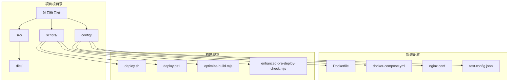
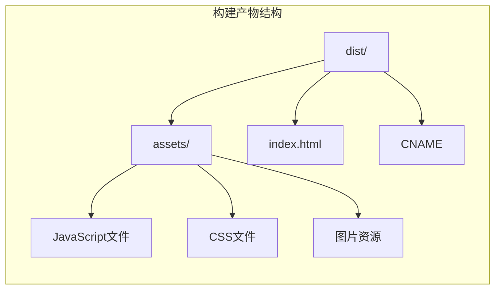

# 容器化配置

<cite>
**本文档引用的文件**
- [Dockerfile](file://config/deployment/Dockerfile)
- [docker-compose.yml](file://config/deployment/docker-compose.yml)
- [package.json](file://package.json)
- [vite.config.ts](file://vite.config.ts)
- [deploy.sh](file://scripts/deployment/deploy.sh)
- [deploy.ps1](file://scripts/deployment/deploy.ps1)
- [optimize-build.mjs](file://scripts/performance/optimize-build.mjs)
- [enhanced-pre-deploy-check.mjs](file://scripts/deployment/enhanced-pre-deploy-check.mjs)
</cite>

## 目录
1. [简介](#简介)
2. [项目结构概览](#项目结构概览)
3. [多阶段构建架构](#多阶段构建架构)
4. [开发与生产环境对比](#开发与生产环境对比)
5. [基础镜像选择分析](#基础镜像选择分析)
6. [依赖安装优化策略](#依赖安装优化策略)
7. [构建产物复制机制](#构建产物复制机制)
8. [最终镜像轻量化处理](#最终镜像轻量化处理)
9. [安全性和性能配置](#安全性和性能配置)
10. [常见构建问题及解决方案](#常见构建问题及解决方案)
11. [总结](#总结)

## 简介

本文档详细分析了Ramusi工具导航站项目的容器化配置，重点关注Dockerfile中的多阶段构建流程。该项目采用现代化的前端技术栈，使用Vue 3、TypeScript和Vite构建工具，通过精心设计的Docker多阶段构建实现高效的容器化部署。

## 项目结构概览

项目采用了清晰的目录结构，将部署相关配置集中放在`config/deployment`目录下：



**图表来源**
- [Dockerfile](file://config/deployment/Dockerfile#L1-L14)
- [docker-compose.yml](file://config/deployment/docker-compose.yml#L1-L16)

## 多阶段构建架构

项目采用了经典的两阶段Docker构建模式，这种架构显著提升了构建效率和最终镜像的安全性：

```mermaid
flowchart TD
Start([开始构建]) --> BuildStage[构建阶段<br/>node:18-alpine]
BuildStage --> Workdir[设置工作目录<br/>WORKDIR /app]
Workdir --> CopyPackage[复制package.json<br/>COPY package*.json ./]
CopyPackage --> InstallDeps[安装依赖<br/>RUN npm ci]
InstallDeps --> CopySource[复制源代码<br/>COPY . .]
CopySource --> BuildApp[构建应用<br/>RUN npm run build]
BuildApp --> ProductionStage[生产阶段<br/>nginx:alpine]
ProductionStage --> CopyDist[复制构建产物<br/>COPY --from=build]
CopyDist --> ExposePort[暴露端口<br/>EXPOSE 80]
ExposePort --> StartNginx[启动Nginx<br/>CMD ["nginx", "-g", "daemon off;"]]
StartNginx --> End([构建完成])
BuildStage -.-> BuildInfo[Node.js 18<br/>Alpine Linux<br/>轻量级基础镜像]
ProductionStage -.-> ProdInfo[Nginx Alpine<br/>静态文件服务<br/>高性能Web服务器]
```

**图表来源**
- [Dockerfile](file://config/deployment/Dockerfile#L1-L14)

**章节来源**
- [Dockerfile](file://config/deployment/Dockerfile#L1-L14)

## 开发与生产环境对比

### 开发环境特点

开发环境主要关注快速迭代和调试功能：

- **Node.js版本**: 使用Node.js 18 LTS版本，确保稳定性和兼容性
- **Alpine Linux**: 轻量级操作系统，减少镜像体积
- **完整依赖树**: 包含开发依赖，支持热重载和调试功能
- **源码映射**: 启用source map，便于调试

### 生产环境特点

生产环境专注于性能、安全和资源效率：

- **精简基础镜像**: 使用nginx:alpine，仅包含必要的运行时组件
- **静态文件服务**: Nginx专门用于提供静态文件服务
- **无开发依赖**: 排除不必要的开发工具和依赖
- **安全加固**: 非root用户运行（虽然当前配置中未显式指定）

## 基础镜像选择分析

### Node.js 18 Alpine镜像

```dockerfile
FROM node:18-alpine AS build
```

**选择理由**：
- **稳定性**: Node.js 18是长期支持版本，提供稳定的API和性能
- **安全性**: Alpine Linux具有最小化的攻击面
- **体积优势**: 相比标准Linux发行版，Alpine镜像体积更小
- **包管理**: 内置apk包管理器，支持快速安装系统依赖

### Nginx Alpine镜像

```dockerfile
FROM nginx:alpine
```

**选择理由**：
- **高性能**: Nginx作为反向代理和静态文件服务器，性能优异
- **内存效率**: Alpine版本占用更少内存资源
- **安全性**: 最小化安装，减少潜在的安全漏洞
- **配置灵活性**: 支持丰富的配置选项，满足不同部署需求

**章节来源**
- [Dockerfile](file://config/deployment/Dockerfile#L1-L14)

## 依赖安装优化策略

### npm ci vs npm install

项目在构建阶段使用了`npm ci`而非`npm install`：

```dockerfile
RUN npm ci
```

**优势对比**：
- **确定性安装**: `npm ci`确保依赖版本完全一致，避免版本冲突
- **速度提升**: 跳过依赖解析步骤，构建速度更快
- **完整性检查**: 验证package-lock.json的一致性
- **清理旧依赖**: 自动清理node_modules目录，保持清洁

### 依赖复制策略

```dockerfile
COPY package*.json ./
```

**优化策略**：
- **层缓存利用**: 将package.json单独复制，只有依赖变更时才重新安装
- **增量构建**: 依赖更新时，后续步骤可以利用缓存的依赖层
- **网络优化**: 减少不必要的文件传输，提升构建效率

**章节来源**
- [Dockerfile](file://config/deployment/Dockerfile#L1-L14)
- [package.json](file://package.json#L1-L104)

## 构建产物复制机制

### 多阶段构建复制

```dockerfile
COPY --from=build /app/dist /usr/share/nginx/html
```

**复制策略分析**：
- **跨阶段通信**: 利用Docker的多阶段构建特性，在不同阶段间传递数据
- **路径映射**: 将构建阶段的输出目录映射到Nginx的默认Web根目录
- **权限继承**: 保持文件权限和所有权的一致性
- **增量更新**: 只复制必要的构建产物，排除开发文件

### 构建产物结构

基于项目的Vite配置，构建产物包含以下关键文件：



**图表来源**
- [vite.config.ts](file://vite.config.ts#L1-L104)

**章节来源**
- [Dockerfile](file://config/deployment/Dockerfile#L1-L14)
- [vite.config.ts](file://vite.config.ts#L1-L104)

## 最终镜像轻量化处理

### 镜像体积优化

项目通过多种策略实现镜像体积的最小化：

1. **多阶段构建**: 只保留最终需要的文件
2. **Alpine基础镜像**: 使用轻量级Linux发行版
3. **选择性复制**: 只复制必要的构建产物
4. **无冗余依赖**: 排除开发工具和测试框架

### 性能优化配置

```dockerfile
EXPOSE 80
CMD ["nginx", "-g", "daemon off;"]
```

**配置优化**：
- **端口暴露**: 明确声明应用监听的端口
- **守护进程**: 使用daemon模式运行Nginx，确保容器持续运行
- **健康检查**: 支持容器编排系统的健康检查机制

**章节来源**
- [Dockerfile](file://config/deployment/Dockerfile#L1-L14)

## 安全性和性能配置

### 安全性考虑

虽然当前Dockerfile没有显式配置非root用户运行，但项目可以通过以下方式增强安全性：

```dockerfile
# 增强安全性的示例配置
RUN addgroup -g 1000 node && adduser -u 1000 -G node -s /bin/sh -D node
USER node
```

**安全最佳实践**：
- **非root用户**: 避免以root用户运行应用，减少安全风险
- **最小权限原则**: 只授予应用运行所需的最低权限
- **文件权限控制**: 确保文件权限适当，防止意外访问

### 性能优化措施

项目在多个层面实现了性能优化：

1. **Vite构建优化**:
   ```typescript
   build: {
     minify: "terser",
     terserOptions: {
       compress: { keep_fnames: true, keep_classnames: true },
       mangle: { keep_fnames: true, keep_classnames: true },
     },
   }
   ```

2. **构建产物优化**:
   - 代码分割：将vendor库分离
   - Tree Shaking：移除未使用的代码
   - 压缩优化：启用JavaScript和CSS压缩

3. **部署脚本优化**:
   - 并行执行：使用多线程构建
   - 缓存利用：智能缓存构建结果

**章节来源**
- [vite.config.ts](file://vite.config.ts#L1-L104)
- [optimize-build.mjs](file://scripts/performance/optimize-build.mjs#L1-L435)

## 常见构建问题及解决方案

### 依赖下载超时

**问题描述**: 在网络不稳定的情况下，npm install可能会超时

**解决方案**:
```bash
# 使用离线模式
npm install --prefer-offline --no-audit

# 设置超时时间
npm config set timeout 60000

# 使用淘宝镜像
npm config set registry https://registry.npmmirror.com
```

### 权限错误

**问题描述**: Docker构建过程中可能出现文件权限问题

**解决方案**:
```dockerfile
# 添加权限修复步骤
RUN chown -R node:node /app
RUN chmod -R 755 /app
```

### 层缓存失效

**问题描述**: Docker层缓存未能有效利用

**解决方案**:
```dockerfile
# 优化COPY指令顺序
COPY package*.json ./
RUN npm ci
COPY . .
RUN npm run build
```

### 构建内存不足

**问题描述**: 大型项目构建时可能出现内存不足

**解决方案**:
```yaml
# docker-compose.yml中的资源配置
services:
  web:
    build: .
    mem_limit: 1g
    shm_size: 1g
```

### 端口冲突

**问题描述**: 容器启动时端口被占用

**解决方案**:
```bash
# 检查端口占用
netstat -tulpn | grep :80

# 修改容器端口映射
ports:
  - "8080:80"
```

**章节来源**
- [deploy.sh](file://scripts/deployment/deploy.sh#L1-L61)
- [deploy.ps1](file://scripts/deployment/deploy.ps1#L1-L39)

## 总结

Ramusi工具导航站项目的Docker容器化配置展现了现代前端应用的最佳实践。通过精心设计的多阶段构建流程，项目实现了以下关键目标：

### 核心优势

1. **高效的构建流程**: 多阶段构建显著提升了构建效率和镜像安全性
2. **优化的镜像体积**: 通过Alpine基础镜像和选择性复制，实现了最小化的容器体积
3. **灵活的部署配置**: 支持多种部署场景和环境配置
4. **完善的监控机制**: 包含构建检查、性能优化和错误处理

### 技术亮点

- **Node.js 18 + Alpine**: 提供稳定且轻量的基础环境
- **Vite构建优化**: 实现快速构建和代码分割
- **Nginx静态服务**: 提供高性能的静态文件服务
- **自动化部署**: 支持多种部署脚本和CI/CD集成

### 未来改进方向

1. **安全增强**: 添加非root用户运行配置
2. **监控完善**: 集成健康检查和日志收集
3. **资源优化**: 进一步优化内存和CPU使用
4. **扩展支持**: 添加更多部署选项和配置模板

这个容器化配置为前端应用提供了标准化、可维护和高性能的部署解决方案，是现代Web应用开发的重要基础设施。