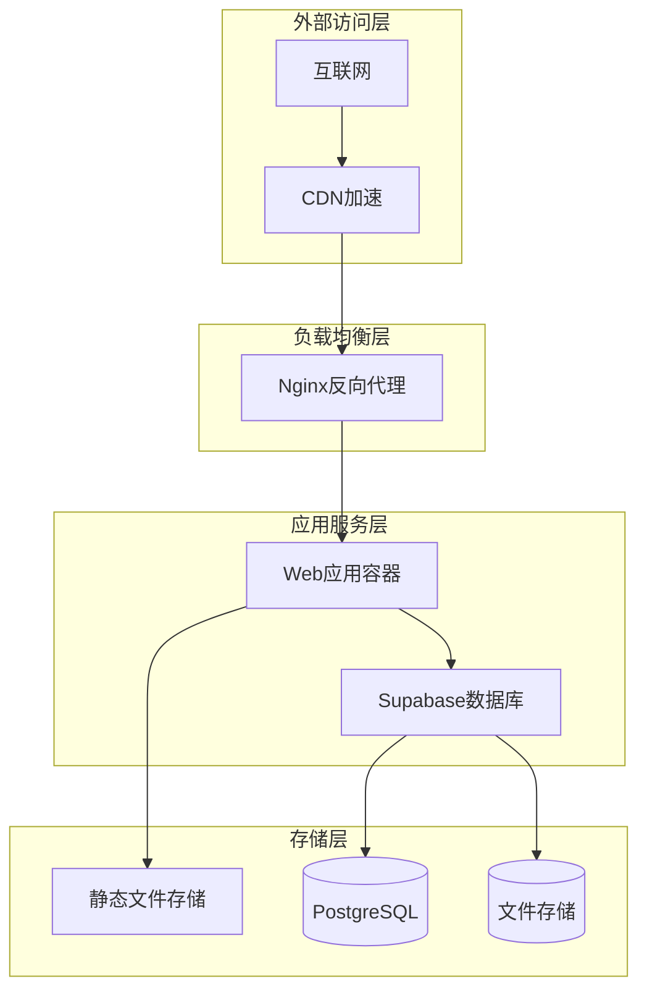
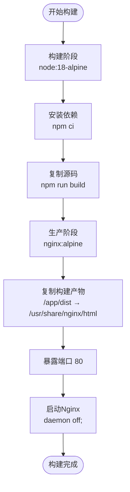
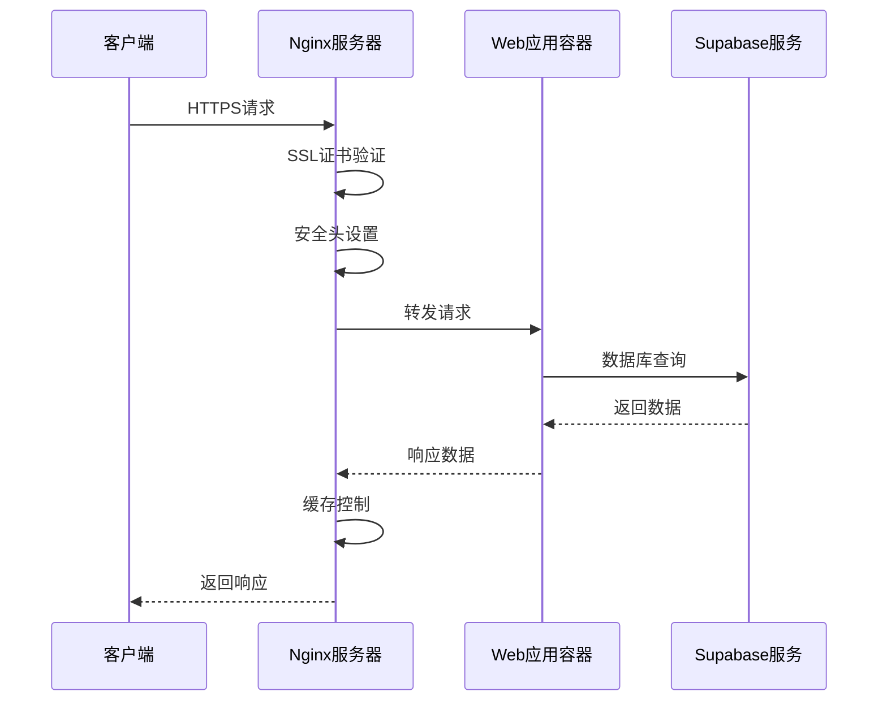
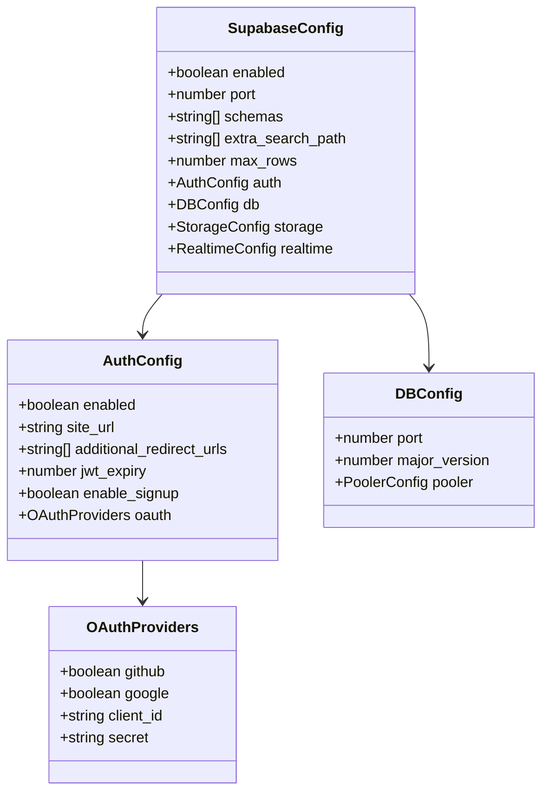
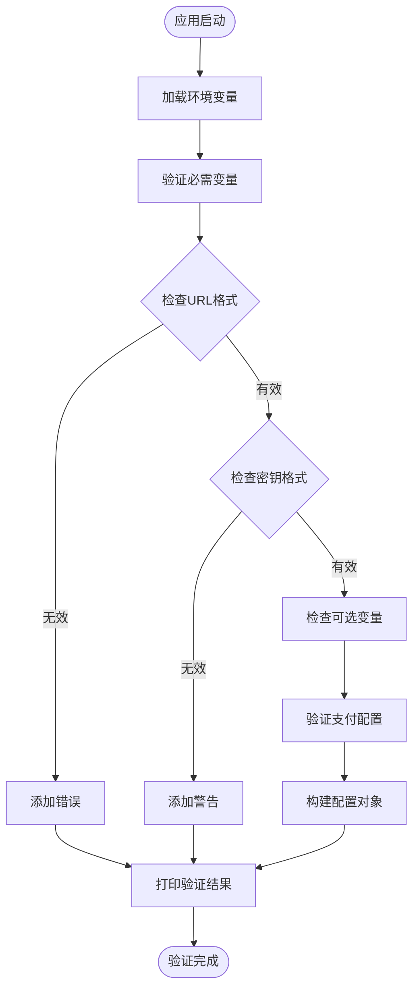
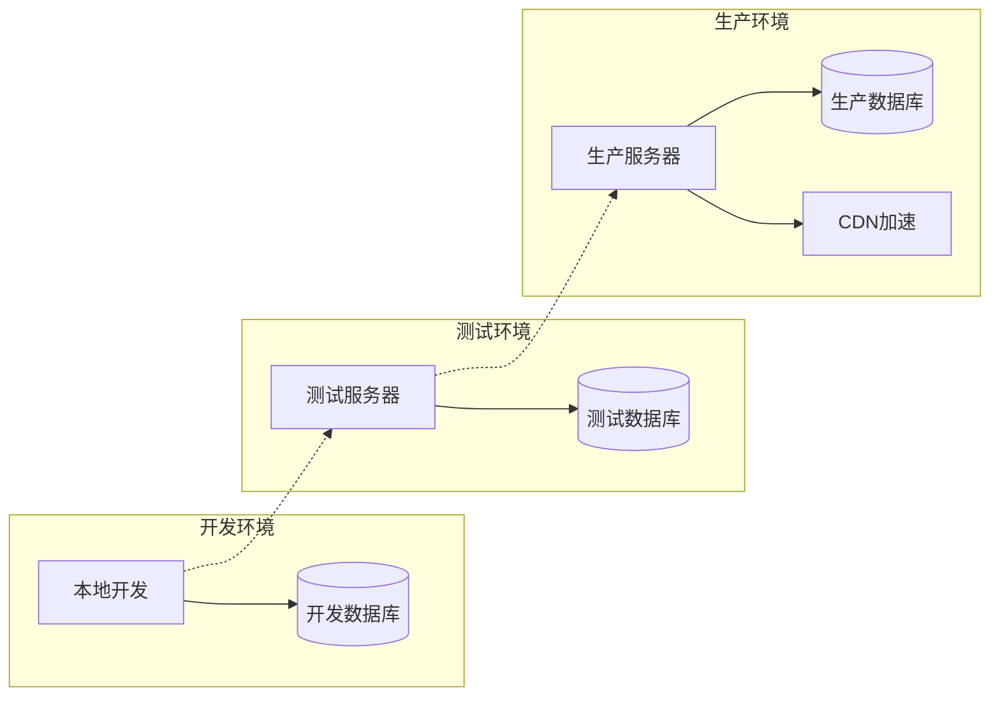
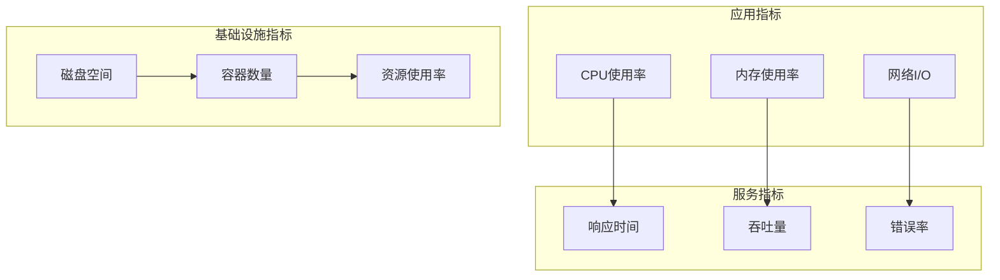

# 服务编排配置

<cite>
**本文档引用的文件**
- [docker-compose.yml](file://config/deployment/docker-compose.yml)
- [Dockerfile](file://config/deployment/Dockerfile)
- [nginx.conf](file://config/deployment/nginx.conf)
- [config.toml](file://supabase/config.toml)
- [deploy.sh](file://scripts/deployment/deploy.sh)
- [netlify.toml](file://netlify.toml)
- [vite.config.ts](file://vite.config.ts)
- [supabaseClient.ts](file://src/lib/supabaseClient.ts)
- [envValidation.ts](file://src/utils/envValidation.ts)
- [App.vue](file://src/App.vue)
</cite>

## 目录
1. [项目概述](#项目概述)
2. [服务编排架构](#服务编排架构)
3. [核心服务配置](#核心服务配置)
4. [网络与通信配置](#网络与通信配置)
5. [环境变量管理](#环境变量管理)
6. [部署策略分析](#部署策略分析)
7. [故障排除指南](#故障排除指南)
8. [性能优化建议](#性能优化建议)
9. [总结](#总结)

## 项目概述

本项目是一个现代化的工具导航网站，采用前后端分离架构，通过Docker Compose实现服务编排。项目集成了Supabase作为后端数据库服务，使用Nginx作为反向代理服务器，并通过多种部署方式确保系统的高可用性和可扩展性。

### 技术栈概览

- **前端框架**: Vue 3 + TypeScript
- **构建工具**: Vite
- **数据库**: Supabase (PostgreSQL)
- **反向代理**: Nginx
- **容器编排**: Docker Compose
- **部署平台**: Netlify (静态部署) + 自托管服务器

## 服务编排架构



**图表来源**
- [docker-compose.yml](file://config/deployment/docker-compose.yml#L1-L16)
- [nginx.conf](file://config/deployment/nginx.conf#L1-L86)

## 核心服务配置

### Web应用服务

Web应用服务是整个系统的核心，负责提供用户界面和业务逻辑处理。

```yaml
web:
  build: .
  container_name: advanced-tools-navigation
  ports:
    - "80:80"
  restart: unless-stopped
  environment:
    - NODE_ENV=production
```

**服务特性分析**：

1. **构建配置**：
   - 使用多阶段构建：Node.js构建阶段 → Nginx运行阶段
   - 构建上下文为`.`，即Dockerfile所在目录
   - 自动重启策略：除非手动停止否则永不重启

2. **端口映射**：
   - 主机端口80映射到容器内部端口80
   - 支持HTTP协议的完全访问

3. **环境配置**：
   - NODE_ENV设置为production，启用生产环境优化
   - 后续可以添加更多环境变量如数据库连接信息

### Dockerfile多阶段构建



**图表来源**
- [Dockerfile](file://config/deployment/Dockerfile#L1-L14)

**章节来源**
- [docker-compose.yml](file://config/deployment/docker-compose.yml#L1-L16)
- [Dockerfile](file://config/deployment/Dockerfile#L1-L14)

## 网络与通信配置

### Nginx反向代理配置

Nginx作为反向代理服务器，提供了完整的SSL配置和安全防护。



**图表来源**
- [nginx.conf](file://config/deployment/nginx.conf#L1-L86)

### 网络配置特点

1. **SSL/TLS配置**：
   - 支持TLSv1.2和TLSv1.3协议
   - 强加密套件：ECDHE-ECDSA-AES128-GCM-SHA256等
   - HSTS头部设置，强制HTTPS访问

2. **安全头配置**：
   - X-Frame-Options: SAMEORIGIN
   - X-Content-Type-Options: nosniff
   - X-XSS-Protection: 1; mode=block
   - Content-Security-Policy: 严格的安全策略

3. **缓存策略**：
   - 静态资源1年缓存期
   - HTML文件无缓存
   - Gzip压缩提升传输效率

**章节来源**
- [nginx.conf](file://config/deployment/nginx.conf#L1-L86)

## 环境变量管理

### Supabase配置管理

Supabase作为后端数据库服务，其配置直接影响整个应用的功能。



**图表来源**
- [config.toml](file://supabase/config.toml#L1-L128)

### 环境验证机制



**图表来源**
- [envValidation.ts](file://src/utils/envValidation.ts#L1-L293)

**章节来源**
- [config.toml](file://supabase/config.toml#L1-L128)
- [envValidation.ts](file://src/utils/envValidation.ts#L1-L293)

## 部署策略分析

### 多环境部署架构



### 部署脚本分析

部署脚本提供了多种部署方式的选择：

1. **rsync部署**：增量同步，适合频繁更新
2. **scp部署**：简单直接，适合小规模部署
3. **Git部署**：版本控制集成
4. **Docker部署**：容器化部署，推荐用于生产环境

**章节来源**
- [deploy.sh](file://scripts/deployment/deploy.sh#L1-L61)

## 故障排除指南

### 常见部署问题及解决方案

#### 1. 服务启动顺序错误

**问题现象**：
- Web应用无法连接到Supabase数据库
- 容器启动时出现"Connection refused"错误

**排查步骤**：
```bash
# 检查容器状态
docker-compose ps

# 查看特定服务日志
docker-compose logs web

# 检查网络连接
docker-compose exec web ping supabase-db
```

**解决方案**：
- 添加`depends_on`依赖关系
- 实现健康检查机制
- 使用初始化脚本等待数据库就绪

#### 2. 网络不通问题

**问题现象**：
- 容器间无法通信
- 外部无法访问服务

**排查步骤**：
```bash
# 检查网络配置
docker network ls

# 进入容器测试网络
docker-compose exec web sh

# 测试端口连通性
telnet supabase-db 54322
```

**解决方案**：
- 确认网络驱动类型
- 检查防火墙设置
- 验证端口映射配置

#### 3. 数据卷未持久化

**问题现象**：
- 容器重启后数据丢失
- 配置文件被覆盖

**排查步骤**：
```bash
# 检查卷挂载
docker volume ls

# 查看卷内容
docker-compose exec web ls -la /app

# 检查挂载点
docker inspect advanced-tools-navigation
```

**解决方案**：
- 使用命名卷而非绑定挂载
- 配置卷备份策略
- 实现数据迁移脚本

### 性能监控指标



## 性能优化建议

### 1. 缓存策略优化

- **静态资源缓存**：设置长期缓存策略
- **API响应缓存**：实现智能缓存机制
- **数据库查询缓存**：优化查询语句和索引

### 2. 负载均衡优化

- **多实例部署**：水平扩展应用实例
- **会话粘性**：保持用户会话一致性
- **健康检查**：自动剔除故障实例

### 3. 数据库性能优化

- **连接池配置**：合理设置连接数
- **查询优化**：使用索引和分区
- **读写分离**：分离读写操作

## 总结

本项目通过Docker Compose实现了完整的微服务架构，涵盖了从前端应用到数据库的完整技术栈。主要特点包括：

1. **模块化设计**：清晰的服务边界和职责划分
2. **容器化部署**：标准化的构建和部署流程
3. **多环境支持**：灵活的配置管理和部署策略
4. **高可用性**：完善的故障处理和监控机制

通过合理的服务编排和配置管理，项目能够适应从本地开发到生产部署的各种场景需求，为用户提供稳定可靠的服务体验。