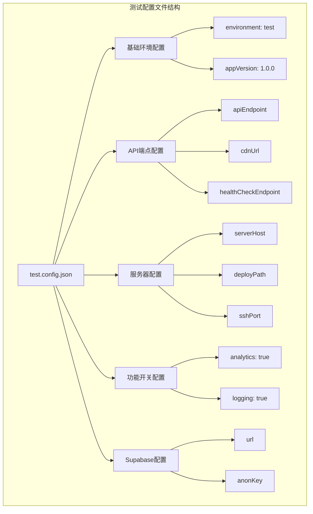
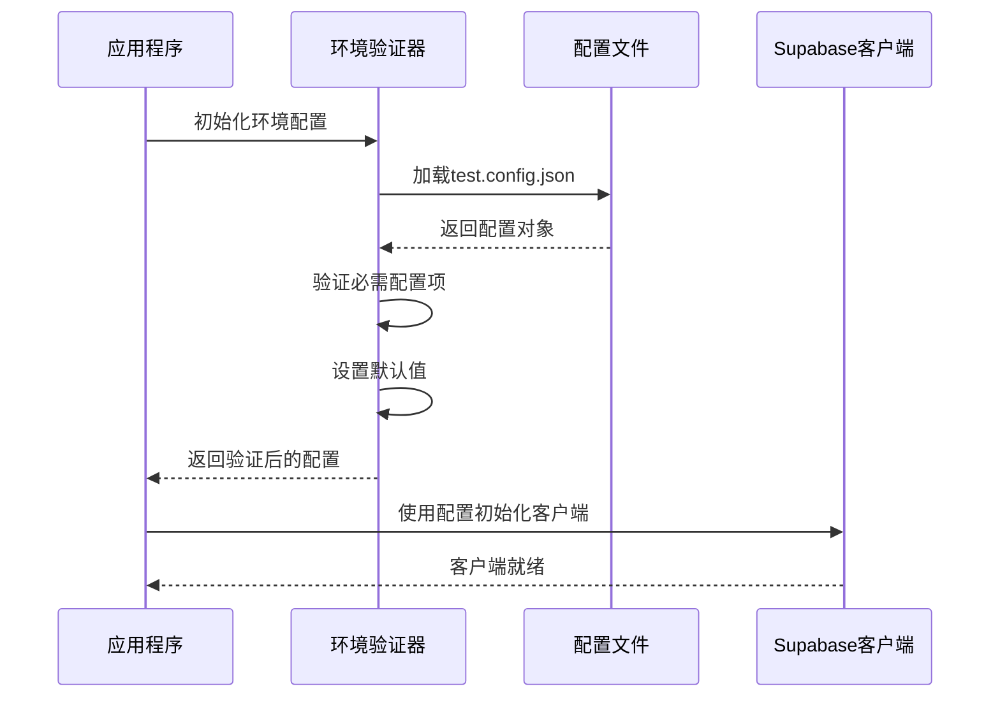
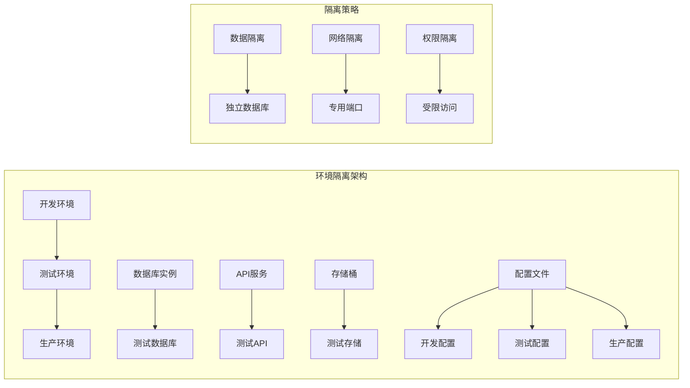
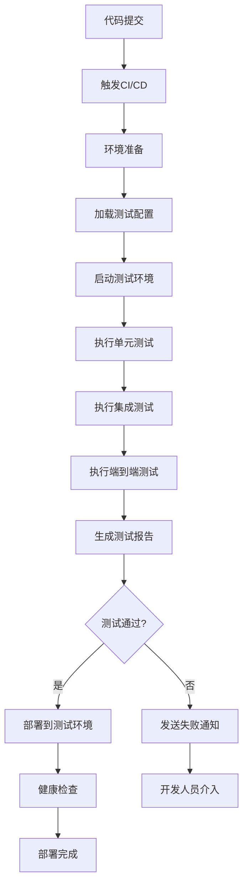
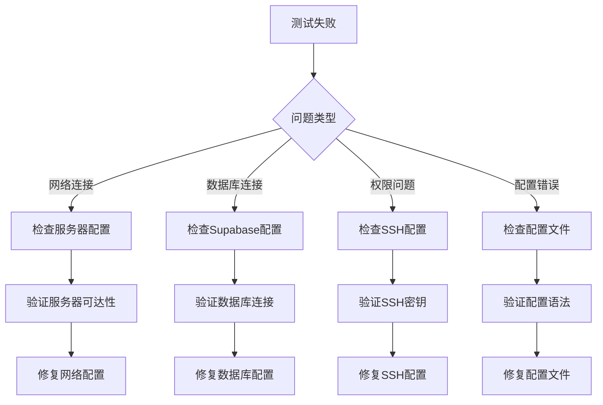

# 测试环境配置

<cite>
**本文档引用的文件**
- [test.config.json](file://config/deployment/test.config.json)
- [envValidation.ts](file://src/utils/envValidation.ts)
- [supabaseClient.ts](file://src/lib/supabaseClient.ts)
- [databaseService.ts](file://src/services/databaseService.ts)
- [deploy-test.js](file://scripts/deployment/deploy-test.js)
- [vitest.config.ts](file://vitest.config.ts)
- [setup.ts](file://src/tests/setup.ts)
- [services.test.ts](file://src/tests/integration/services.test.ts)
- [config.toml](file://supabase/config.toml)
</cite>

## 目录
1. [简介](#简介)
2. [测试配置文件结构](#测试配置文件结构)
3. [核心配置项详解](#核心配置项详解)
4. [配置加载机制](#配置加载机制)
5. [测试环境隔离机制](#测试环境隔离机制)
6. [CI/CD流水线中的应用](#cicd流水线中的应用)
7. [测试脚本集成](#测试脚本集成)
8. [调试与故障排除](#调试与故障排除)
9. [最佳实践](#最佳实践)
10. [总结](#总结)

## 简介

测试环境配置是现代软件开发中确保应用程序质量的关键基础设施组件。本文档详细阐述了`test.config.json`文件在测试环境中的重要作用，包括其作为模拟数据注入、功能开关控制、API端点重定向和日志级别设定的核心配置机制。

测试环境配置不仅仅是简单的参数集合，它是一个完整的生态系统，负责协调开发、测试和生产环境之间的差异，确保测试过程的可靠性和一致性。通过精心设计的配置文件，开发团队可以在隔离的环境中验证应用程序的功能，而无需影响生产系统。

## 测试配置文件结构

测试配置文件位于`config/deployment/test.config.json`，采用标准JSON格式，提供了全面的测试环境配置选项：



**图表来源**
- [test.config.json](file://config/deployment/test.config.json#L1-L18)

**章节来源**
- [test.config.json](file://config/deployment/test.config.json#L1-L18)

## 核心配置项详解

### 环境标识配置

测试配置文件首先通过`environment`字段明确标识当前运行环境为测试环境：

```json
{
  "environment": "test"
}
```

这个配置项的重要性在于：
- **环境识别**：帮助应用程序识别当前运行环境，从而加载相应的配置
- **功能开关**：根据环境类型启用或禁用特定功能
- **日志级别**：控制不同环境下的日志输出级别

### API端点重定向配置

测试环境中的API端点配置确保应用程序能够正确连接到测试环境的服务：

```json
{
  "apiEndpoint": "https://api-test.example.com",
  "cdnUrl": "https://cdn-test.example.com",
  "healthCheckEndpoint": "/health"
}
```

这些配置的作用：
- **API端点重定向**：将应用程序的API请求路由到测试环境的后端服务
- **CDN资源定位**：确保静态资源从测试环境的CDN获取
- **健康检查**：提供测试环境服务状态监控接口

### 服务器部署配置

服务器相关的配置确保测试环境的部署和访问：

```json
{
  "deployUser": "deploy_user",
  "serverHost": "test.example.com",
  "deployPath": "/var/www/test",
  "sshPort": 22
}
```

这些配置支持：
- **远程部署**：通过SSH协议将构建产物部署到测试服务器
- **用户权限**：指定具有部署权限的系统用户
- **路径映射**：定义文件在服务器上的存储位置

### 功能开关配置

功能开关允许动态控制测试环境中的各种功能：

```json
{
  "features": {
    "analytics": true,
    "logging": true
  }
}
```

功能开关的作用：
- **数据分析**：启用或禁用用户行为分析功能
- **日志记录**：控制应用程序日志的输出级别和存储
- **性能监控**：在测试环境中启用性能指标收集

### Supabase数据库配置

测试环境使用独立的数据库实例，确保测试数据不会影响生产数据：

```json
{
  "supabase": {
    "url": "https://fytiwsutzgmygfxnqoft.supabase.co",
    "anonKey": "eyJhbGciOiJIUzI1NiIsInR5cCI6IkpXVCJ9..."
  }
}
```

Supabase配置的关键特性：
- **独立实例**：使用专门的测试数据库实例
- **匿名访问**：通过匿名密钥进行无身份验证的数据访问
- **数据隔离**：确保测试数据与生产数据完全分离

**章节来源**
- [test.config.json](file://config/deployment/test.config.json#L1-L18)

## 配置加载机制

测试环境配置的加载过程涉及多个层次的验证和处理：



**图表来源**
- [envValidation.ts](file://src/utils/envValidation.ts#L199-L251)
- [supabaseClient.ts](file://src/lib/supabaseClient.ts#L1-L20)

### 环境变量验证流程

环境验证器负责确保所有必要的配置项都已正确设置：

```typescript
export function validateEnvironment(): ValidationResult {
  const errors: string[] = [];
  const warnings: string[] = [];
  
  const env = import.meta.env;
  const requiredVars = {
    VITE_SUPABASE_URL: env.VITE_SUPABASE_URL,
    VITE_SUPABASE_ANON_KEY: env.VITE_SUPABASE_ANON_KEY,
  };
  
  // 验证必需的环境变量
  if (!requiredVars.VITE_SUPABASE_URL) {
    errors.push("VITE_SUPABASE_URL 未设置");
  }
  
  return { isValid: errors.length === 0, errors, warnings, config };
}
```

### 配置派生逻辑

应用程序会根据基础配置派生出更详细的配置信息：

```typescript
export function getEnvironmentConfig() {
  const config = initializeEnvironment();
  
  return {
    // 基础配置
    ...config,
    
    // 派生配置
    isProduction: config.appEnv === "production",
    isDevelopment: config.appEnv === "development",
    isTest: config.appEnv === "test",
    
    // 功能开关
    enableLogs: config.debugMode || config.appEnv !== "production",
    enableErrorReporting: config.appEnv === "production",
    enablePerformanceMonitoring: config.enableAnalytics,
  };
}
```

**章节来源**
- [envValidation.ts](file://src/utils/envValidation.ts#L40-L150)
- [envValidation.ts](file://src/utils/envValidation.ts#L250-L291)

## 测试环境隔离机制

测试环境的隔离机制确保测试活动不会影响其他环境：



### 数据库隔离

测试环境使用独立的Supabase实例，确保测试数据不会污染生产数据：

```typescript
// 测试环境使用的数据库URL
const testSupabaseUrl = "https://fytiwsutzgmygfxnqoft.supabase.co";

// 生产环境使用的数据库URL
const prodSupabaseUrl = import.meta.env.VITE_SUPABASE_URL;
```

### 网络端口隔离

不同的环境使用不同的网络端口，避免冲突：

```json
{
  "sshPort": 22,
  "apiEndpoint": "https://api-test.example.com:8080"
}
```

### 权限控制

测试环境的访问权限受到严格控制：

```json
{
  "deployUser": "deploy_user",
  "sshPort": 22,
  "healthCheckEndpoint": "/health"
}
```

**章节来源**
- [test.config.json](file://config/deployment/test.config.json#L1-L18)
- [supabaseClient.ts](file://src/lib/supabaseClient.ts#L1-L20)

## CI/CD流水线中的应用

测试配置在CI/CD流水线中发挥关键作用，特别是在自动化测试和部署过程中：



### 部署脚本集成

部署脚本通过读取测试配置文件来执行自动化部署：

```javascript
const config = JSON.parse(
  fs.readFileSync(
    path.join(__dirname, '../../config/deployment/test.config.json'),
    'utf-8'
  )
);

// 使用配置进行部署
console.log('正在连接到:', `${config.deployUser}@${config.serverHost}:${config.deployPath}`);
execSync(`scp -r -P ${config.sshPort} ${distPath}/* ${config.deployUser}@${config.serverHost}:${config.deployPath}`, {
  stdio: 'inherit'
});
```

### 健康检查机制

CI/CD流水线包含健康检查步骤，验证测试环境的可用性：

```javascript
// 健康检查端点
const healthCheckEndpoint = config.healthCheckEndpoint || '/health';

// 执行健康检查
const healthCheckBuffer = execSync(
  `curl -I -s ${config.apiEndpoint}${healthCheckEndpoint}`
);

if (!healthCheckResponse.includes('200 OK')) {
  throw new Error('健康检查失败: 未收到200 OK响应');
}
```

### 测试覆盖率分析

测试配置还支持测试覆盖率分析：

```typescript
// Vitest配置中的覆盖率设置
coverage: {
  provider: "v8",
  reporter: ["text", "json", "html"],
  exclude: [
    "node_modules/",
    "src/tests/",
    "**/*.d.ts",
    "**/*.config.*",
    "dist/",
  ],
}
```

**章节来源**
- [deploy-test.js](file://scripts/deployment/deploy-test.js#L1-L147)
- [vitest.config.ts](file://vitest.config.ts#L1-L30)

## 测试脚本集成

测试配置与各种测试脚本紧密集成，支持不同类型的测试需求：

### 单元测试配置

单元测试使用专门的设置文件来模拟依赖项：

```typescript
// setup.ts中的模拟配置
vi.mock("@/stores/categories", () => ({
  useCategoriesStore: () => ({
    categories: [],
    initialize: vi.fn().mockResolvedValue([]),
    fetchCategories: vi.fn().mockResolvedValue([]),
    getCategoryById: vi.fn(),
    loading: false,
    error: null,
    initialized: false,
  }),
}));
```

### 集成测试配置

集成测试使用真实的数据库连接，但使用测试环境的配置：

```typescript
// services.test.ts中的数据库服务测试
describe("数据库服务测试", () => {
  it("应该能够查询工具数据", async () => {
    const result = await databaseService.query("tools", {
      page: 1,
      limit: 10,
      sortBy: "created_at",
      sortOrder: "desc"
    });
    
    expect(result.data).toBeDefined();
    expect(result.count).toBeGreaterThan(0);
  });
});
```

### 端到端测试配置

端到端测试使用完整的测试环境配置：

```typescript
// e2e测试中的环境配置
describe("用户工作流测试", () => {
  it("应该能够完成完整的用户注册流程", async () => {
    await page.goto("https://test.example.com/register");
    await page.fill("[data-testid='email']", "test@example.com");
    await page.fill("[data-testid='password']", "password123");
    await page.click("[data-testid='register-button']");
    
    // 验证注册成功
    await expect(page.locator("[data-testid='welcome-message']")).toBeVisible();
  });
});
```

**章节来源**
- [setup.ts](file://src/tests/setup.ts#L1-L199)
- [services.test.ts](file://src/tests/integration/services.test.ts#L1-L199)

## 调试与故障排除

当测试行为出现异常时，可以通过调整测试配置文件进行调试和验证：

### 常见问题诊断



### 配置验证工具

应用程序提供了内置的配置验证工具：

```typescript
// 环境验证结果打印
export function printValidationResult(result: ValidationResult): void {
  console.log("🔍 环境变量验证结果:");
  console.log("=".repeat(40));
  
  if (result.isValid) {
    console.log("✅ 环境变量验证通过");
    console.log(`  - 环境: ${result.config?.appEnv}`);
    console.log(`  - Supabase URL: ${result.config?.supabaseUrl}`);
  } else {
    console.log("❌ 环境变量验证失败");
    result.errors.forEach((error, index) => {
      console.log(`  ${index + 1}. ${error}`);
    });
  }
}
```

### 日志级别调整

测试环境支持动态调整日志级别：

```json
{
  "features": {
    "analytics": true,
    "logging": true
  }
}
```

可以通过修改`logging`配置来控制日志输出：

- `logging: true`：启用详细日志记录
- `logging: false`：禁用日志记录以提高性能

### 性能监控配置

测试环境可以启用性能监控：

```json
{
  "features": {
    "analytics": true
  }
}
```

性能监控功能包括：
- 页面加载时间测量
- API响应时间跟踪
- 用户交互事件记录

### 故障排除步骤

1. **检查配置文件语法**
   ```bash
   node -e "require('./config/deployment/test.config.json')"
   ```

2. **验证网络连接**
   ```bash
   ping test.example.com
   curl https://api-test.example.com/health
   ```

3. **检查SSH连接**
   ```bash
   ssh deploy_user@test.example.com -p 22
   ```

4. **验证Supabase连接**
   ```javascript
   const { createClient } = require('@supabase/supabase-js');
   const supabase = createClient(url, anonKey);
   ```

**章节来源**
- [envValidation.ts](file://src/utils/envValidation.ts#L148-L203)

## 最佳实践

基于对测试环境配置的深入分析，以下是推荐的最佳实践：

### 配置管理

1. **版本控制**：将测试配置文件纳入版本控制系统
2. **敏感信息保护**：使用环境变量存储敏感信息
3. **配置验证**：在部署前验证配置文件的有效性
4. **文档维护**：保持配置文档的及时更新

### 环境隔离

1. **数据隔离**：确保测试数据与生产数据完全分离
2. **网络隔离**：使用不同的网络端口和域名
3. **权限控制**：限制测试环境的访问权限
4. **资源隔离**：为测试环境分配独立的计算资源

### 自动化测试

1. **持续集成**：将测试配置集成到CI/CD流水线
2. **自动化部署**：使用配置文件自动部署测试环境
3. **健康检查**：实施自动化的健康检查机制
4. **监控告警**：建立测试环境的监控和告警系统

### 安全考虑

1. **访问控制**：严格控制测试环境的访问权限
2. **数据保护**：确保测试数据的安全性和隐私性
3. **审计日志**：记录测试环境的所有操作
4. **定期清理**：定期清理测试环境中的临时数据

### 性能优化

1. **缓存策略**：合理配置缓存以提高测试性能
2. **并发控制**：控制测试并发数量以避免资源争用
3. **资源监控**：监控测试环境的资源使用情况
4. **负载均衡**：在高负载情况下使用负载均衡

## 总结

测试环境配置是现代软件开发中不可或缺的基础设施组件。通过精心设计的`test.config.json`文件，开发团队能够实现：

1. **环境隔离**：确保测试活动不会影响生产系统
2. **自动化部署**：通过配置文件实现测试环境的自动化部署
3. **灵活配置**：支持动态调整测试环境的各种参数
4. **统一管理**：集中管理测试环境的配置和设置

测试配置文件不仅是一个简单的参数集合，它代表了一个完整的测试生态系统，涵盖了从开发到部署的整个测试生命周期。通过遵循本文档中描述的最佳实践，开发团队可以构建稳定、可靠的测试环境，确保应用程序的质量和可靠性。

随着DevOps和持续交付理念的普及，测试环境配置的重要性只会不断增加。未来的趋势可能包括更智能的配置管理、更精细的环境隔离策略，以及更完善的自动化测试流程。对于任何希望提高软件质量的开发团队来说，理解和掌握测试环境配置都是至关重要的技能。