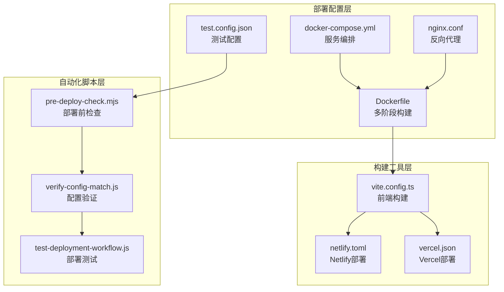
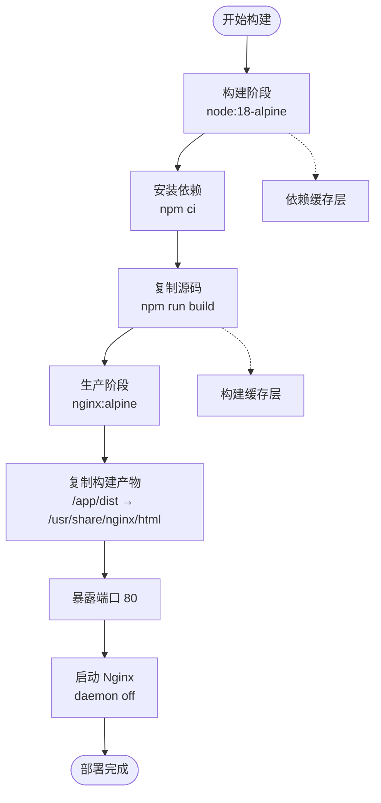
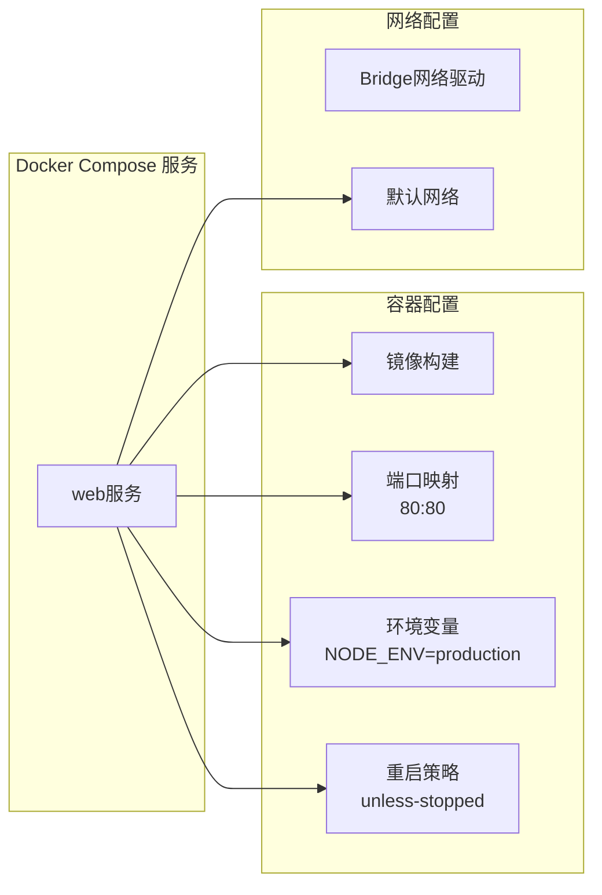
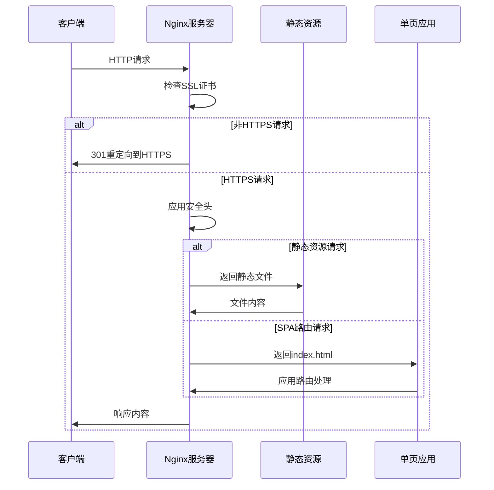
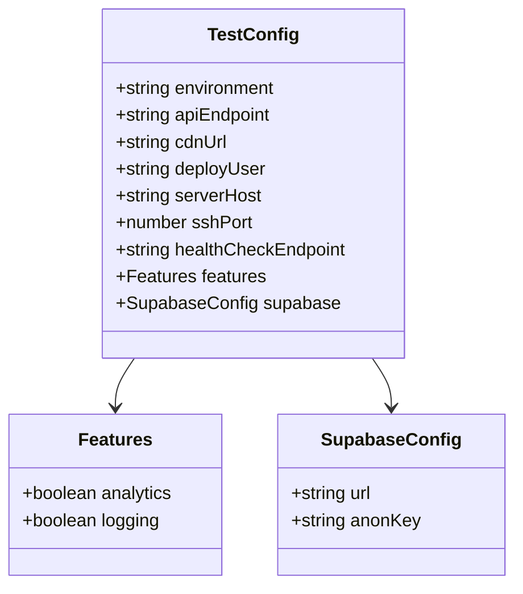
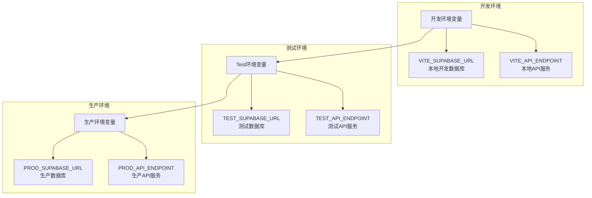
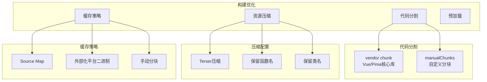
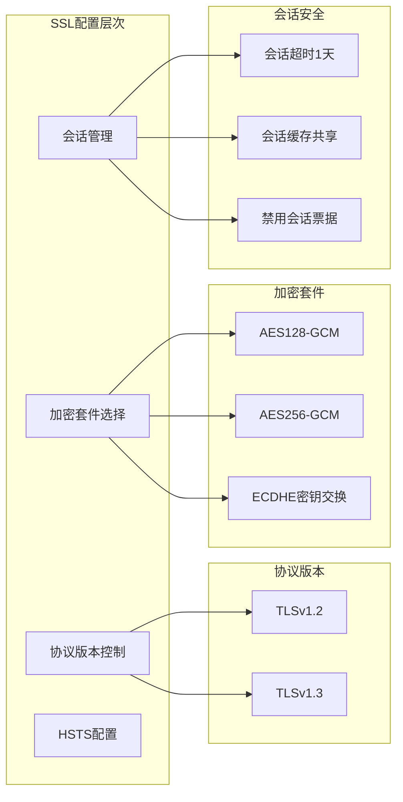
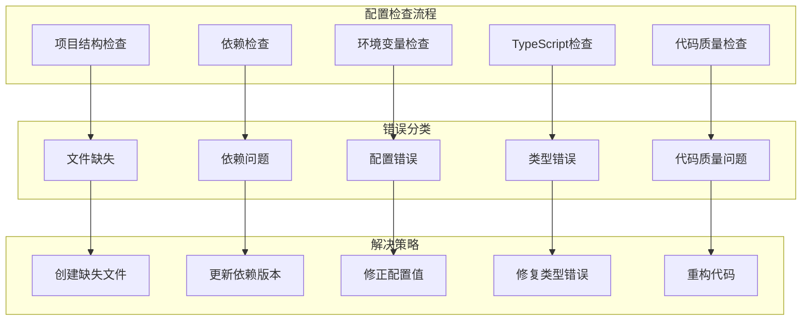
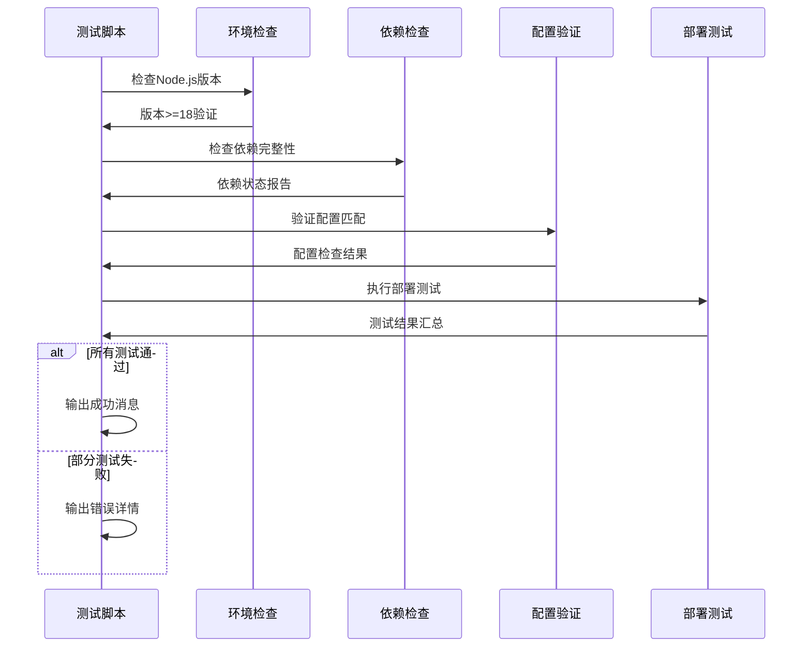

# 部署环境配置

<cite>
**本文档中引用的文件**
- [Dockerfile](file://config/deployment/Dockerfile)
- [docker-compose.yml](file://config/deployment/docker-compose.yml)
- [nginx.conf](file://config/deployment/nginx.conf)
- [test.config.json](file://config/deployment/test.config.json)
- [pre-deploy-check.mjs](file://scripts/deployment/pre-deploy-check.mjs)
- [verify-config-match.js](file://scripts/deployment/verify-config-match.js)
- [test-deployment-workflow.js](file://scripts/deployment/test-deployment-workflow.js)
- [vite.config.ts](file://vite.config.ts)
- [netlify.toml](file://netlify.toml)
- [vercel.json](file://vercel.json)
</cite>

## 目录
1. [简介](#简介)
2. [项目结构概览](#项目结构概览)
3. [Docker容器化部署](#docker容器化部署)
4. [服务编排配置](#服务编排配置)
5. [反向代理与负载均衡](#反向代理与负载均衡)
6. [测试环境配置](#测试环境配置)
7. [多环境部署策略](#多环境部署策略)
8. [性能优化配置](#性能优化配置)
9. [安全配置最佳实践](#安全配置最佳实践)
10. [故障排除指南](#故障排除指南)
11. [总结](#总结)

## 简介

本项目采用现代化的容器化部署架构，支持多环境（开发、测试、生产）的灵活部署策略。通过Docker多阶段构建、Nginx反向代理、自动化测试和监控机制，确保应用在不同环境中的稳定性和安全性。

## 项目结构概览

项目采用模块化的配置管理方式，将部署相关配置集中存储在`config/deployment`目录下：

**图表来源**
- [Dockerfile](file://config/deployment/Dockerfile#L1-L14)
- [docker-compose.yml](file://config/deployment/docker-compose.yml#L1-L16)
- [nginx.conf](file://config/deployment/nginx.conf#L1-L86)

## Docker容器化部署

### 多阶段构建流程

项目采用Docker多阶段构建技术，优化镜像大小并提高构建效率：

**图表来源**
- [Dockerfile](file://config/deployment/Dockerfile#L1-L14)

### 构建阶段详解

**第一阶段（构建阶段）**：
- 基础镜像：`node:18-alpine`（轻量级Alpine Linux）
- 工作目录：`/app`
- 依赖安装：使用`npm ci`确保依赖版本一致性
- 构建过程：执行`npm run build`生成生产环境代码

**第二阶段（生产阶段）**：
- 基础镜像：`nginx:alpine`（轻量级Nginx）
- 静态文件部署：将构建产物从`/app/dist`复制到`/usr/share/nginx/html`
- 端口配置：暴露标准HTTP端口80
- 启动命令：`nginx -g "daemon off;"`

**节来源**
- [Dockerfile](file://config/deployment/Dockerfile#L1-L14)

## 服务编排配置

### Docker Compose 编排逻辑

项目使用Docker Compose进行服务编排，定义了完整的部署环境：

**图表来源**
- [docker-compose.yml](file://config/deployment/docker-compose.yml#L1-L16)

### 环境变量配置

Docker Compose配置中设置了关键的环境变量：

- **NODE_ENV**: 设置为`production`，影响应用的行为模式
- **重启策略**: `unless-stopped`确保容器在非人为停止时自动重启
- **端口映射**: 将主机的80端口映射到容器的80端口

**节来源**
- [docker-compose.yml](file://config/deployment/docker-compose.yml#L1-L16)

## 反向代理与负载均衡

### Nginx 配置架构

项目使用Nginx作为反向代理服务器，提供高性能的静态资源服务和SSL终端：

**图表来源**
- [nginx.conf](file://config/deployment/nginx.conf#L1-L86)

### SSL/TLS 安全配置

Nginx配置实现了严格的安全策略：

- **协议版本**: 支持TLSv1.2和TLSv1.3
- **加密套件**: 使用现代加密算法（AES128-GCM, AES256-GCM）
- **HSTS**: 启用HTTP严格传输安全，强制HTTPS访问
- **会话管理**: 配置SSL会话超时和缓存

### 静态资源优化

配置针对不同类型资源进行了专门优化：

**缓存策略**：
- JavaScript/CSS文件：1年缓存期，immutable标志
- HTML文件：不缓存，每次请求最新内容
- 图片资源：1年缓存期，适合长期缓存

**压缩配置**：
- 启用gzip压缩
- 针对多种文件类型启用压缩
- 设置合理的压缩级别（6）

**节来源**
- [nginx.conf](file://config/deployment/nginx.conf#L1-L86)

## 测试环境配置

### 测试配置文件结构

测试环境配置通过`test.config.json`文件管理，包含完整的测试环境参数：

**图表来源**
- [test.config.json](file://config/deployment/test.config.json#L1-L18)

### 关键配置参数

**基础配置**：
- `environment`: 设置为`test`，标识测试环境
- `serverHost`: 测试服务器域名或IP地址
- `deployPath`: 部署路径`/var/www/test`

**API配置**：
- `apiEndpoint`: 测试API服务地址
- `cdnUrl`: 测试CDN服务地址

**数据库配置**：
- `supabase.url`: Supabase实例URL
- `supabase.anonKey`: 匿名访问密钥

**功能开关**：
- `features.analytics`: 启用分析功能
- `features.logging`: 启用日志记录

**节来源**
- [test.config.json](file://config/deployment/test.config.json#L1-L18)

## 多环境部署策略

### 环境变量设置原则

项目采用分层的环境变量管理策略：

### 端口映射策略

不同环境使用不同的端口映射策略：

**开发环境**：
- Vite开发服务器：`5173`（可配置）
- 自动打开浏览器：`open: true`

**测试环境**：
- 标准HTTP端口：`80`
- HTTPS端口：`443`

**生产环境**：
- 容器端口：`80`（映射到主机80端口）
- SSL端口：`443`

### 网络配置

**开发环境**：
- 主机绑定：`localhost`（仅本地访问）
- CORS配置：宽松的跨域策略

**测试环境**：
- 主机绑定：`0.0.0.0`（允许外部访问）
- 网络隔离：专用测试网络

**生产环境**：
- 主机绑定：`0.0.0.0`（公开访问）
- 安全网关：Nginx反向代理

## 性能优化配置

### 构建优化

Vite配置实现了多项性能优化：

**图表来源**
- [vite.config.ts](file://vite.config.ts#L1-L104)

### 静态资源优化

Nginx配置实现了全面的静态资源优化：

**压缩优化**：
- 启用gzip压缩
- 针对多种文件类型优化
- 设置压缩级别6

**缓存优化**：
- 长期缓存静态资源
- 智能缓存控制头
- CDN友好配置

**安全优化**：
- 内容安全策略（CSP）
- 严格的HTTP安全头
- 防止点击劫持和XSS攻击

**节来源**
- [vite.config.ts](file://vite.config.ts#L1-L104)
- [nginx.conf](file://config/deployment/nginx.conf#L1-L86)

## 安全配置最佳实践

### SSL/TLS配置

项目实现了企业级的SSL/TLS安全配置：

### HTTP安全头配置

Nginx配置实现了全面的HTTP安全头：

**内容安全策略**：
- 默认只允许同源资源
- 允许HTTP和HTTPS资源
- 数据URI和blob URI支持
- 禁用内联JavaScript

**防护头**：
- X-Frame-Options: SAMEORIGIN（防止点击劫持）
- X-Content-Type-Options: nosniff（防止MIME类型嗅探）
- X-XSS-Protection: 1; mode=block（XSS过滤）

**隐私保护**：
- Referrer-Policy: no-referrer-when-downgrade
- 隐藏Nginx版本信息

**节来源**
- [nginx.conf](file://config/deployment/nginx.conf#L1-L86)

## 故障排除指南

### 常见配置错误

基于项目中的自动化检查脚本，以下是常见的配置错误及解决方案：

**图表来源**
- [pre-deploy-check.mjs](file://scripts/deployment/pre-deploy-check.mjs#L1-L199)

### 部署前检查清单

**项目文件检查**：
- 必需文件：`package.json`, `vite.config.ts`, `tsconfig.json`
- 必需目录：`src`, `src/components`, `src/views`
- 构建产物：`dist`目录存在且内容完整

**依赖检查**：
- 生产依赖：Vue, Vue Router, Pinia, Supabase客户端
- 开发依赖：Vite, TypeScript, Vitest
- 脚本配置：build, dev, preview, test, test:run

**环境变量检查**：
- 必需变量：`VITE_SUPABASE_URL`, `VITE_SUPABASE_ANON_KEY`
- 应用配置：`VITE_APP_NAME`, `VITE_APP_URL`
- 环境标识：`VITE_APP_ENV`

**节来源**
- [pre-deploy-check.mjs](file://scripts/deployment/pre-deploy-check.mjs#L1-L199)

### 自动化测试流程

项目提供了完整的部署测试框架：

**图表来源**
- [test-deployment-workflow.js](file://scripts/deployment/test-deployment-workflow.js#L54-L101)

**节来源**
- [test-deployment-workflow.js](file://scripts/deployment/test-deployment-workflow.js#L54-L101)

## 总结

本项目采用了现代化的容器化部署架构，通过以下关键技术实现了高效的多环境部署：

1. **Docker多阶段构建**：优化镜像大小，提高构建效率
2. **Nginx反向代理**：提供高性能的静态资源服务和SSL终端
3. **自动化测试框架**：确保部署质量和配置准确性
4. **环境隔离策略**：支持开发、测试、生产的独立部署
5. **安全配置最佳实践**：实现企业级的安全防护

这种部署架构不仅提高了开发效率，还确保了应用在不同环境中的稳定性和安全性。通过持续集成和自动化测试，团队可以快速迭代并保证代码质量。