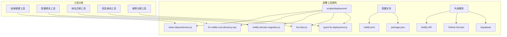
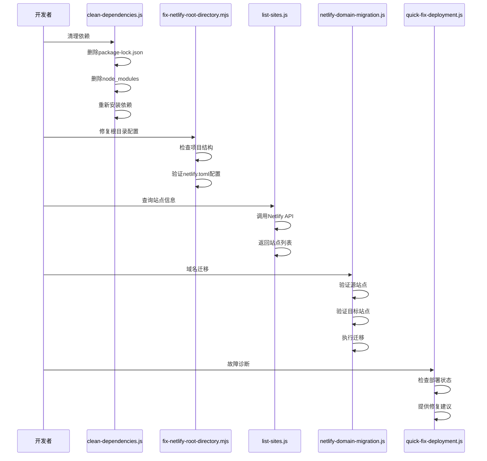
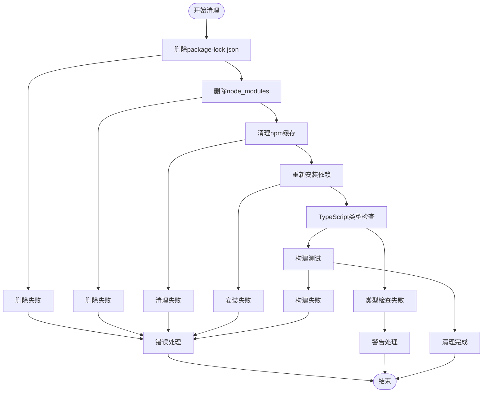
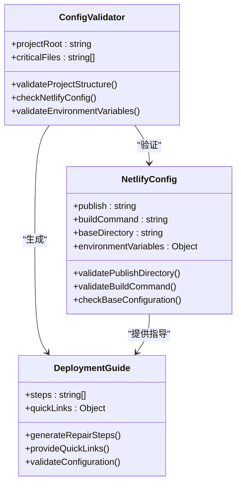
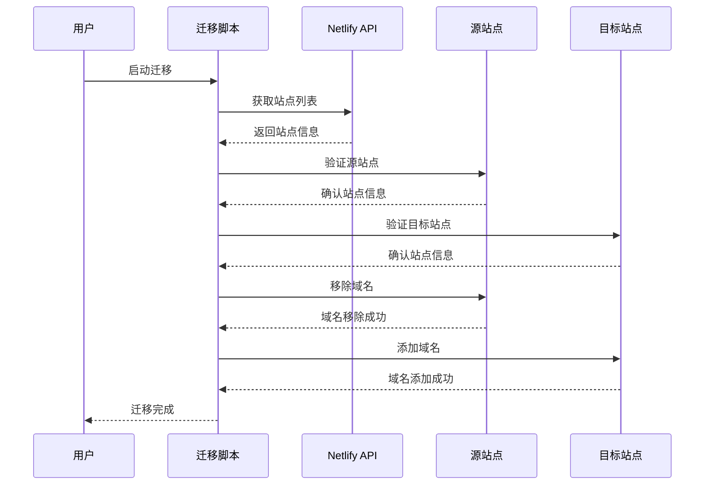
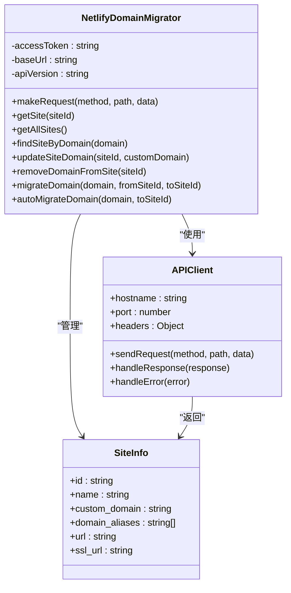
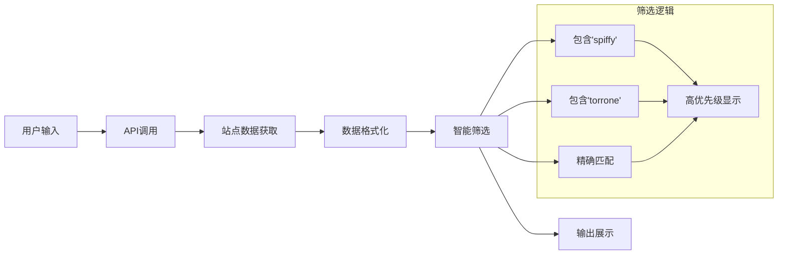
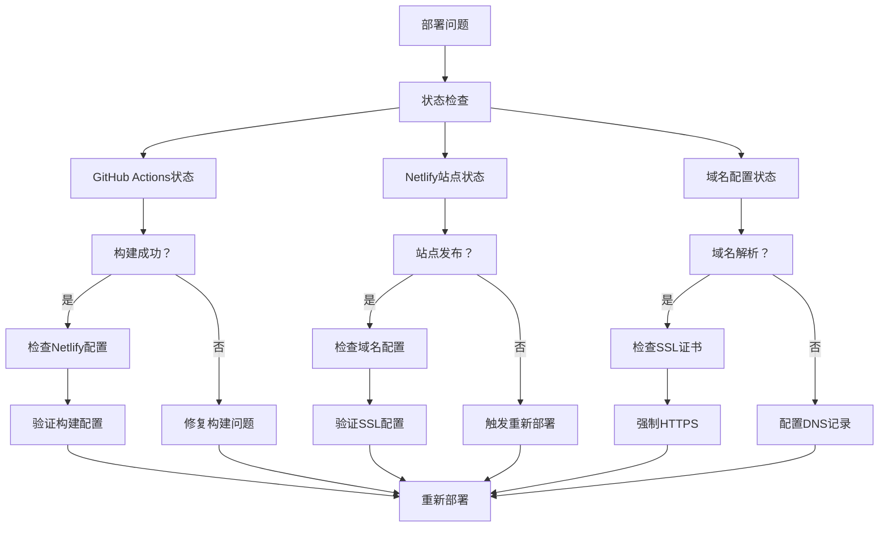
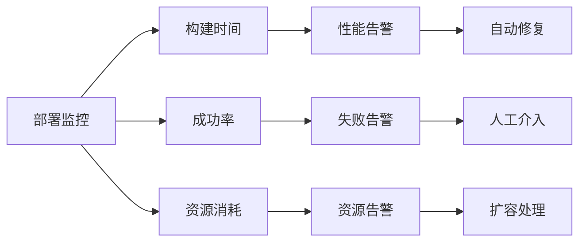

# 辅助部署工具

<cite>
**本文档引用的文件**
- [clean-dependencies.js](file://scripts/deployment/clean-dependencies.js)
- [fix-netlify-root-directory.mjs](file://scripts/deployment/fix-netlify-root-directory.mjs)
- [netlify-domain-migration.js](file://scripts/deployment/netlify-domain-migration.js)
- [list-sites.js](file://scripts/deployment/list-sites.js)
- [quick-fix-deployment.js](file://scripts/deployment/quick-fix-deployment.js)
- [netlify.toml](file://netlify.toml)
- [package.json](file://package.json)
</cite>

## 目录
1. [简介](#简介)
2. [项目结构概览](#项目结构概览)
3. [核心部署工具分析](#核心部署工具分析)
4. [架构设计](#架构设计)
5. [详细工具分析](#详细工具分析)
6. [使用场景与最佳实践](#使用场景与最佳实践)
7. [故障排除指南](#故障排除指南)
8. [总结](#总结)

## 简介

本文档详细介绍了Advanced Tools Navigation项目中的辅助部署工具集。这些工具专门设计用于解决现代Web应用部署过程中的常见问题，包括依赖管理、域名迁移、配置验证和故障诊断等关键环节。通过系统化的工具链，开发者可以快速定位和解决部署过程中的各种挑战。

这些工具体现了Context7最佳实践，采用模块化设计和清晰的错误处理机制，确保部署过程的可靠性和可维护性。每个工具都针对特定的部署场景进行了优化，提供了从基础配置检查到高级域名迁移的完整解决方案。

## 项目结构概览



**图表来源**
- [clean-dependencies.js](file://scripts/deployment/clean-dependencies.js#L1-L89)
- [fix-netlify-root-directory.mjs](file://scripts/deployment/fix-netlify-root-directory.mjs#L1-L122)
- [netlify-domain-migration.js](file://scripts/deployment/netlify-domain-migration.js#L1-L276)
- [list-sites.js](file://scripts/deployment/list-sites.js#L1-L158)
- [quick-fix-deployment.js](file://scripts/deployment/quick-fix-deployment.js#L1-L90)

**章节来源**
- [package.json](file://package.json#L1-L104)
- [netlify.toml](file://netlify.toml#L1-L12)

## 核心部署工具分析

### 工具分类体系

部署工具集按照功能特性分为五个主要类别：

1. **依赖管理工具**：负责清理和优化npm依赖包
2. **配置修复工具**：解决Netlify配置相关问题
3. **域名迁移工具**：自动化域名在不同站点间的迁移
4. **信息查询工具**：提供Netlify站点信息查询功能
5. **故障诊断工具**：提供系统性的部署问题诊断流程

### 工具交互关系



**图表来源**
- [clean-dependencies.js](file://scripts/deployment/clean-dependencies.js#L10-L89)
- [fix-netlify-root-directory.mjs](file://scripts/deployment/fix-netlify-root-directory.mjs#L20-L122)
- [list-sites.js](file://scripts/deployment/list-sites.js#L15-L158)
- [netlify-domain-migration.js](file://scripts/deployment/netlify-domain-migration.js#L100-L200)
- [quick-fix-deployment.js](file://scripts/deployment/quick-fix-deployment.js#L1-L90)

## 详细工具分析

### clean-dependencies.js - 依赖清理专家

#### 功能概述

clean-dependencies.js是一个专门用于清理和重新生成npm依赖包的工具。它通过系统化的清理流程，解决由于依赖版本冲突、缓存问题导致的构建失败。

#### 核心功能流程



**图表来源**
- [clean-dependencies.js](file://scripts/deployment/clean-dependencies.js#L10-L89)

#### 技术实现特点

1. **环境变量优化**：设置`npm_config_target_platform`和`npm_config_target_arch`避免平台特定依赖
2. **强制安装模式**：使用`npm install`而非`npm ci`确保兼容性
3. **多层验证**：包含TypeScript类型检查和构建测试双重验证
4. **错误恢复**：提供详细的故障排除建议

**章节来源**
- [clean-dependencies.js](file://scripts/deployment/clean-dependencies.js#L1-L89)

### fix-netlify-root-directory.mjs - 配置修复大师

#### 功能概述

fix-netlify-root-directory.mjs专门解决Netlify站点配置中的根目录设置问题。它基于Context7最佳实践，提供从问题诊断到解决方案的完整指导。

#### 配置检查矩阵



**图表来源**
- [fix-netlify-root-directory.mjs](file://scripts/deployment/fix-netlify-root-directory.mjs#L20-L80)

#### 修复步骤详解

1. **项目结构检查**：验证关键文件的存在性
2. **配置文件验证**：检查netlify.toml的发布目录和构建命令
3. **环境变量确认**：确保必要的环境变量已正确设置
4. **实时配置指导**：提供Netlify控制台的具体修改步骤

**章节来源**
- [fix-netlify-root-directory.mjs](file://scripts/deployment/fix-netlify-root-directory.mjs#L1-L122)

### netlify-domain-migration.js - 域名迁移专家

#### 功能概述

netlify-domain-migration.js是一个完整的域名迁移解决方案，支持从一个Netlify站点向另一个站点迁移自定义域名。它提供了完整的API封装和错误处理机制。

#### API交互架构



**图表来源**
- [netlify-domain-migration.js](file://scripts/deployment/netlify-domain-migration.js#L100-L200)

#### 核心类设计



**图表来源**
- [netlify-domain-migration.js](file://scripts/deployment/netlify-domain-migration.js#L10-L100)

**章节来源**
- [netlify-domain-migration.js](file://scripts/deployment/netlify-domain-migration.js#L1-L276)

### list-sites.js - 站点信息查询器

#### 功能概述

list-sites.js提供了一个简洁的Netlify站点信息查询界面，支持列出所有站点并筛选可能的目标站点。

#### 查询优化策略



**图表来源**
- [list-sites.js](file://scripts/deployment/list-sites.js#L60-L90)

#### 输出格式设计

工具采用表格形式展示站点信息，包含以下关键字段：
- 序号：便于用户识别
- 站点名称：直观的站点标识
- 站点ID：唯一的站点标识符
- 自定义域名：当前配置的域名信息
- URL：站点的访问地址

**章节来源**
- [list-sites.js](file://scripts/deployment/list-sites.js#L1-L158)

### quick-fix-deployment.js - 故障诊断助手

#### 功能概述

quick-fix-deployment.js提供了一套系统性的部署问题诊断流程，基于Context7最佳实践，涵盖从状态检查到解决方案的完整指导。

#### 诊断流程框架



**图表来源**
- [quick-fix-deployment.js](file://scripts/deployment/quick-fix-deployment.js#L10-L50)

#### 常见问题解决方案

1. **域名未正确配置**：提供DNS记录配置指导
2. **SSL证书问题**：启用强制HTTPS和证书重新生成
3. **构建失败**：检查环境变量和配置文件

**章节来源**
- [quick-fix-deployment.js](file://scripts/deployment/quick-fix-deployment.js#L1-L90)

## 使用场景与最佳实践

### 依赖管理场景

**适用场景**：
- 构建失败且怀疑依赖问题
- CI/CD流水线中的依赖缓存问题
- 多环境部署的依赖一致性检查

**最佳实践**：
```bash
# 在CI/CD流水线中使用
npm run deps:clean

# 开发环境定期清理
npm run deps:clean
```

### 配置修复场景

**适用场景**：
- 新团队成员接手项目
- 项目迁移后的配置检查
- 部署环境变更后的配置验证

**最佳实践**：
```bash
# 定期检查配置
node scripts/deployment/fix-netlify-root-directory.mjs

# 部署前验证
npm run pre-deploy
```

### 域名迁移场景

**适用场景**：
- 站点合并或重组
- 域名所有权变更
- 多站点统一管理

**最佳实践**：
```bash
# 自动迁移域名
node scripts/deployment/netlify-domain-migration.js \
  $NETLIFY_ACCESS_TOKEN \
  ramusi.cn \
  spiffy-torrone-5454e1
```

### 站点管理场景

**适用场景**：
- 多站点环境管理
- 站点权限审计
- 站点健康监控

**最佳实践**：
```bash
# 列出所有站点
node scripts/deployment/list-sites.js $NETLIFY_ACCESS_TOKEN

# 定期检查站点状态
npm run deployment:status
```

### 故障诊断场景

**适用场景**：
- 部署失败后的快速诊断
- 生产环境问题排查
- 团队协作中的问题定位

**最佳实践**：
```bash
# 启动故障诊断
node scripts/deployment/quick-fix-deployment.js

# 结合日志分析
npm run monitor:health
```

## 故障排除指南

### 常见错误及解决方案

#### 依赖清理错误

**错误现象**：clean-dependencies.js执行失败
**可能原因**：
- 磁盘空间不足
- 网络连接问题
- Node.js版本不兼容

**解决方案**：
1. 检查磁盘空间：`df -h`
2. 验证网络连接：`ping registry.npmjs.org`
3. 确认Node.js版本：`node --version`

#### 配置修复失败

**错误现象**：fix-netlify-root-directory.mjs无法正确配置
**可能原因**：
- 项目结构不符合预期
- netlify.toml配置错误
- 权限不足

**解决方案**：
1. 验证项目结构：检查关键文件是否存在
2. 手动编辑netlify.toml
3. 检查Netlify控制台权限

#### 域名迁移失败

**错误现象**：netlify-domain-migration.js迁移中断
**可能原因**：
- API令牌无效
- 源站点不存在
- 目标站点不可访问

**解决方案**：
1. 验证API令牌：`echo $NETLIFY_ACCESS_TOKEN`
2. 检查源站点ID：使用list-sites.js
3. 确认目标站点状态：访问Netlify控制台

### 性能优化建议

#### 构建性能优化

1. **使用缓存策略**：配置npm缓存和依赖缓存
2. **并行构建**：利用多核CPU进行并行编译
3. **增量构建**：只重建变更的部分

#### 网络优化

1. **镜像源配置**：使用国内npm镜像源
2. **代理配置**：配置HTTP代理提高下载速度
3. **离线模式**：在有网络的情况下预先下载依赖

### 监控和告警

#### 关键指标监控



#### 告警阈值设置

- 构建时间超过30分钟
- 部署成功率低于95%
- 内存使用率超过80%

## 总结

Advanced Tools Navigation项目的辅助部署工具集展现了现代Web应用部署的最佳实践。通过模块化的设计理念和系统化的功能划分，这些工具有效地解决了部署过程中的各种挑战。

### 核心价值

1. **效率提升**：自动化处理重复性任务，减少手动操作
2. **质量保证**：通过多层验证确保部署质量
3. **问题诊断**：提供系统性的故障排除流程
4. **最佳实践**：基于Context7标准的工具设计

### 发展方向

1. **智能化增强**：集成AI辅助诊断功能
2. **云原生支持**：扩展对更多云平台的支持
3. **可视化界面**：开发图形化管理界面
4. **社区生态**：建立工具插件生态系统

这些工具不仅解决了当前的部署需求，更为未来的扩展和优化奠定了坚实的基础。通过持续的改进和社区贡献，它们将继续为现代Web应用部署提供强有力的支持。