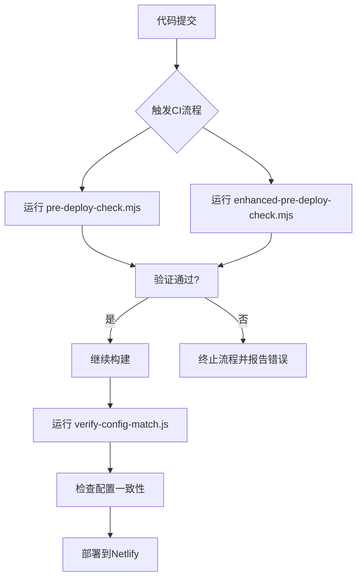
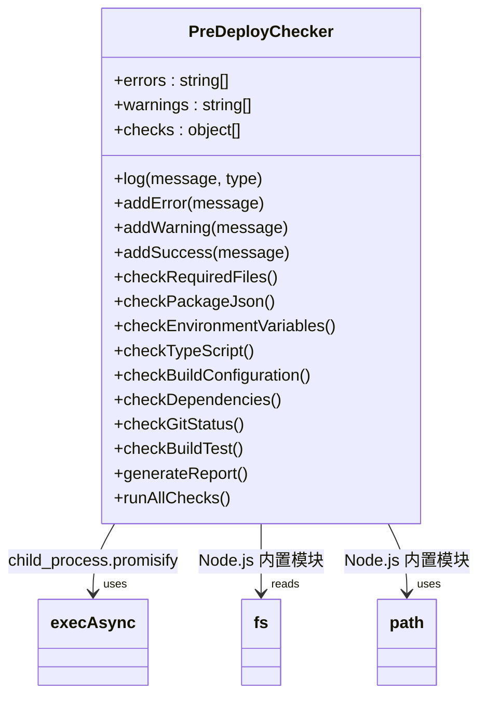
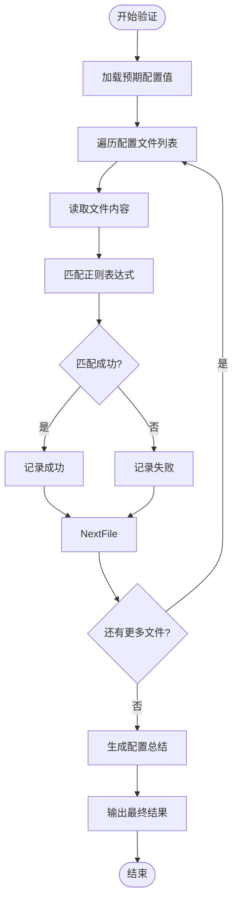
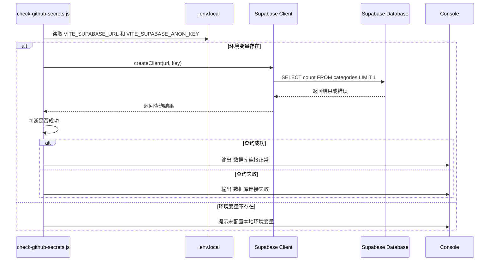
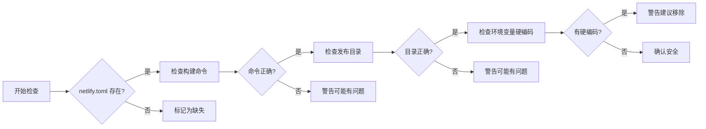

# 部署前置检查脚本

<cite>
**本文档引用文件**  
- [pre-deploy-check.mjs](file://scripts/deployment/pre-deploy-check.mjs)
- [enhanced-pre-deploy-check.mjs](file://scripts/deployment/enhanced-pre-deploy-check.mjs)
- [verify-config-match.js](file://scripts/deployment/verify-config-match.js)
- [check-github-secrets.js](file://scripts/deployment/check-github-secrets.js)
- [check-netlify-config.js](file://scripts/deployment/check-netlify-config.js)
- [netlify.toml](file://netlify.toml)
- [package.json](file://package.json)
</cite>

## 目录
1. [简介](#简介)  
2. [核心检查脚本体系](#核心检查脚本体系)  
3. [pre-deploy-check.mjs 与 enhanced-pre-deploy-check.mjs 功能对比](#pre-deploy-checkmjs-与-enhanced-pre-deploy-checkmjs-功能对比)  
4. [配置一致性验证机制](#配置一致性验证机制)  
5. [GitHub Secrets 检测逻辑分析](#github-secrets-检测逻辑分析)  
6. [Netlify 配置检测机制分析](#netlify-配置检测机制分析)  
7. [自定义新增检查项开发指南](#自定义新增检查项开发指南)  
8. [常见检查失败场景及解决方案](#常见检查失败场景及解决方案)  
9. [结论](#结论)

## 简介

部署前置检查脚本体系是保障项目稳定上线的关键环节。该体系通过自动化脚本在部署前对项目进行全面验证，涵盖 Node.js 版本、依赖完整性、环境变量配置、GitHub Secrets 存在性以及 Netlify 配置匹配度等多个维度。本文档将深入解析 `pre-deploy-check.mjs` 与 `enhanced-pre-deploy-check.mjs` 的功能差异与演进关系，并详细说明各检查模块的实现机制。

**Section sources**  
- [pre-deploy-check.mjs](file://scripts/deployment/pre-deploy-check.mjs#L1-L370)  
- [enhanced-pre-deploy-check.mjs](file://scripts/deployment/enhanced-pre-deploy-check.mjs#L1-L362)

## 核心检查脚本体系

部署前置检查脚本位于 `scripts/deployment/` 目录下，构成一个完整的质量保障链条：

- **pre-deploy-check.mjs**: 基础部署前检查，覆盖项目结构、依赖、测试等基本要素
- **enhanced-pre-deploy-check.mjs**: 增强版检查脚本，引入异步执行和更细粒度的验证
- **verify-config-match.js**: 验证本地与远程配置的一致性
- **check-github-secrets.js**: 检查 GitHub Secrets 的配置状态
- **check-netlify-config.js**: 验证 Netlify 构建配置的正确性

这些脚本通过 npm 脚本（如 `pre-deploy`, `pre-deploy:enhanced`, `config:verify`）集成到 CI/CD 流程中，确保每次部署都经过严格验证。



**Diagram sources**  
- [pre-deploy-check.mjs](file://scripts/deployment/pre-deploy-check.mjs#L1-L370)  
- [enhanced-pre-deploy-check.mjs](file://scripts/deployment/enhanced-pre-deploy-check.mjs#L1-L362)  
- [verify-config-match.js](file://scripts/deployment/verify-config-match.js#L1-L254)

**Section sources**  
- [pre-deploy-check.mjs](file://scripts/deployment/pre-deploy-check.mjs#L1-L370)  
- [enhanced-pre-deploy-check.mjs](file://scripts/deployment/enhanced-pre-deploy-check.mjs#L1-L362)  
- [verify-config-match.js](file://scripts/deployment/verify-config-match.js#L1-L254)

## pre-deploy-check.mjs 与 enhanced-pre-deploy-check.mjs 功能对比

### 功能差异分析

`pre-deploy-check.mjs` 和 `enhanced-pre-deploy-check.mjs` 虽然目标一致，但在实现方式和功能覆盖上存在显著差异。

#### pre-deploy-check.mjs 特点：
- 同步执行模式
- 检查项包括：项目结构、package.json 配置、TypeScript 类型检查、ESLint 代码质量、测试运行、构建验证、依赖安全审计等
- 使用传统回调风格的子进程调用
- 错误与警告分类明确，提供详细的报告输出

#### enhanced-pre-deploy-check.mjs 特点：
- 异步执行模式（使用 `promisify(exec)`）
- 新增 Git 状态检查（工作区是否干净、当前分支信息）
- 更丰富的日志图标系统（ℹ️✅⚠️❌）
- 支持超时控制（如类型检查设置 30 秒超时）
- 构建测试增加耗时统计
- 采用类封装结构，便于扩展



**Diagram sources**  
- [enhanced-pre-deploy-check.mjs](file://scripts/deployment/enhanced-pre-deploy-check.mjs#L1-L362)

### 演进关系

`enhanced-pre-deploy-check.mjs` 是对 `pre-deploy-check.mjs` 的现代化重构，体现了以下演进趋势：

1. **从同步到异步**：利用现代 JavaScript 的异步特性提升执行效率和响应能力
2. **从简单到精细**：增加了 Git 状态监控等更细致的检查维度
3. **从基础到健壮**：引入超时机制防止无限等待，增强脚本稳定性
4. **从单一到可扩展**：清晰的类结构为未来添加新检查项提供了良好基础

两者共存允许团队根据需要选择不同级别的检查强度。

**Section sources**  
- [pre-deploy-check.mjs](file://scripts/deployment/pre-deploy-check.mjs#L1-L370)  
- [enhanced-pre-deploy-check.mjs](file://scripts/deployment/enhanced-pre-deploy-check.mjs#L1-L362)

## 配置一致性验证机制

`verify-config-match.js` 负责比对本地配置与远程部署环境之间的一致性，确保关键参数准确无误。

### 验证范围

该脚本主要验证以下几类配置：

| 配置类型 | 检查文件 | 关键字段 |
|---------|--------|--------|
| GitHub 工作流 | `.github/workflows/*.yml` | 域名、站点ID、仓库名 |
| Netlify 配置 | `netlify.toml` | 发布域名 |
| Supabase 认证 | `supabase/config.toml` | 重定向URL |
| DNS 设置 | `public/CNAME` | 自定义域名 |

### 实现逻辑

脚本通过正则表达式匹配预设的期望值，逐个扫描指定文件中的关键配置项是否存在且正确。



**Diagram sources**  
- [verify-config-match.js](file://scripts/deployment/verify-config-match.js#L1-L254)

此外，脚本还检查相关脚本文件（如 `check-github-secrets.js`）中硬编码的配置值是否一致，形成闭环验证。

**Section sources**  
- [verify-config-match.js](file://scripts/deployment/verify-config-match.js#L1-L254)

## GitHub Secrets 检测逻辑分析

`check-github-secrets.js` 提供了全面的 GitHub Secrets 配置指导和验证功能。

### 检测机制

该脚本并不直接访问 GitHub API 获取 secrets，而是通过以下方式间接验证：

1. **本地环境变量检查**：读取 `.env.local` 文件中的 `VITE_SUPABASE_URL` 和 `VITE_SUPABASE_ANON_KEY`
2. **Supabase 连接测试**：使用本地配置的实际值尝试连接数据库，验证其有效性
3. **配置指南输出**：列出所有必需的 secrets 及其获取方式
4. **工作流说明**：解释不同 GitHub Actions 工作流对 secrets 的需求

### 连接测试流程

当本地环境变量存在时，脚本会创建 Supabase 客户端实例并执行简单的查询操作来测试连接可用性。



**Diagram sources**  
- [check-github-secrets.js](file://scripts/deployment/check-github-secrets.js#L1-L170)

这种设计既避免了敏感信息泄露，又能有效验证配置的正确性。

**Section sources**  
- [check-github-secrets.js](file://scripts/deployment/check-github-secrets.js#L1-L170)

## Netlify 配置检测机制分析

`check-netlify-config.js` 专注于验证 Netlify 构建和部署相关的配置正确性。

### 检查内容

| 检查项 | 验证方式 | 正确示例 |
|-------|--------|--------|
| netlify.toml 存在性 | fs.existsSync | ✅ 文件存在 |
| 构建命令 | 字符串包含检查 | `npm ci && npm run build` |
| 发布目录 | 字符串包含检查 | `publish = "dist"` |
| 环境变量硬编码 | 排除检查 | 不应包含 `VITE_SUPABASE_URL =` |
| 本地环境文件 | 存在性和内容检查 | .env.local 包含必要变量 |
| 构建脚本 | package.json 脚本检查 | scripts.build 存在 |
| Vite 配置 | 配置文件存在性 | vite.config.ts 存在 |

### 实现细节

脚本采用同步文件读取方式，依次检查各项配置。对于 `netlify.toml`，特别关注是否包含硬编码的环境变量，这可能导致安全风险或配置冲突。



**Diagram sources**  
- [check-netlify-config.js](file://scripts/deployment/check-netlify-config.js#L1-L110)

同时，脚本还会提示用户在 Netlify 控制台中正确设置环境变量，形成完整的配置闭环。

**Section sources**  
- [check-netlify-config.js](file://scripts/deployment/check-netlify-config.js#L1-L110)

## 自定义新增检查项开发指南

为现有检查体系添加新的检查项是一项常见需求。以下是开发指南：

### 在 pre-deploy-check.mjs 中添加检查项

1. 在 `PreDeployChecker` 类中定义新方法：
```javascript
// 示例：检查新功能模块
checkNewFeatures() {
  this.log("检查新功能模块...");
  const newFeatureFiles = [
    "src/services/searchService.ts",
    // ...其他文件
  ];
  for (const file of newFeatureFiles) {
    const filePath = path.join(this.projectRoot, file);
    if (!fs.existsSync(filePath)) {
      this.addWarning(`新功能文件缺失: ${file}`);
    }
  }
  this.log("新功能模块检查完成", "success");
}
```

2. 在 `runAllChecks()` 方法中调用新方法：
```javascript
async runAllChecks() {
  // ...其他检查
  this.checkNewFeatures(); // 添加这一行
  return this.generateReport();
}
```

### 在 enhanced-pre-deploy-check.mjs 中添加异步检查

对于需要异步操作的检查（如网络请求），应使用 async/await：

```javascript
async checkExternalAPI() {
  this.log("🔍 检查外部API连通性...");
  try {
    await fetch('https://api.example.com/health');
    this.addSuccess("外部API可访问");
  } catch (error) {
    this.addError(`外部API不可达: ${error.message}`);
  }
}
```

然后在 `runAllChecks()` 中 await 调用。

### 最佳实践

- 使用 `addError()` 和 `addWarning()` 统一处理问题上报
- 保持日志格式一致，使用标准图标前缀
- 对于耗时操作，考虑添加超时保护
- 尽量复用已有工具函数和路径常量
- 添加适当的注释说明检查目的和依据

**Section sources**  
- [pre-deploy-check.mjs](file://scripts/deployment/pre-deploy-check.mjs#L1-L370)  
- [enhanced-pre-deploy-check.mjs](file://scripts/deployment/enhanced-pre-deploy-check.mjs#L1-L362)

## 常见检查失败场景及解决方案

### 1. Node.js 版本不兼容

**错误日志**：
```
❌ Node.js 版本过低，需要 >= 18
```

**原因**：项目要求 Node.js 18+，但当前环境版本较低。

**解决方案**：
- 使用 nvm 安装并切换到 Node.js 18 或更高版本
```bash
nvm install 18
nvm use 18
```

### 2. 依赖安装不完整

**错误日志**：
```
❌ node_modules 目录不存在，请运行 npm install
```

**原因**：缺少依赖包或安装中断。

**解决方案**：
```bash
rm -rf node_modules package-lock.json
npm install --legacy-peer-deps
```

### 3. 环境变量未配置

**错误日志**：
```
❌ 本地环境变量未配置
请检查 .env.local 文件中的配置
```

**解决方案**：
创建 `.env.local` 文件并填入正确值：
```
VITE_SUPABASE_URL=https://your-project.supabase.co
VITE_SUPABASE_ANON_KEY=your-anon-key-here
```

### 4. GitHub Secrets 缺失

**错误日志**：
```
❌ Secrets 未配置或配置错误
```

**解决方案**：
前往 GitHub 仓库 Settings > Secrets and variables > Actions，添加以下 secrets：
- SUPABASE_ACCESS_TOKEN
- SUPABASE_PROJECT_REF  
- VITE_SUPABASE_URL
- VITE_SUPABASE_ANON_KEY

### 5. 构建命令不匹配

**错误日志**：
```
⚠️ 构建命令可能有问题
```

**原因**：`netlify.toml` 中的 command 与实际需求不符。

**解决方案**：
更新 `net