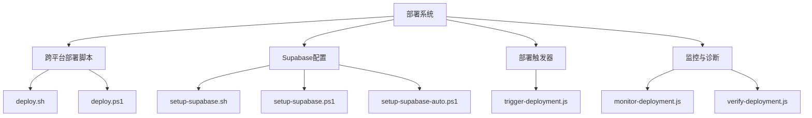
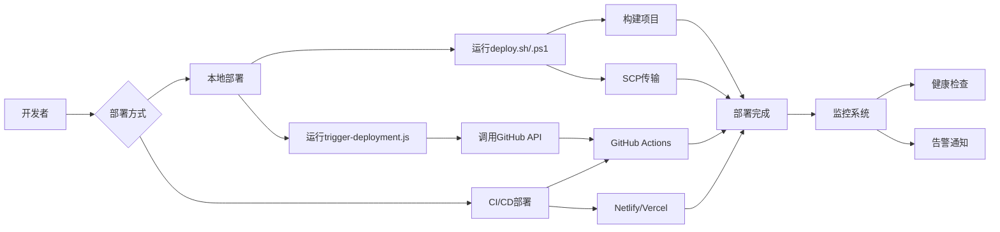
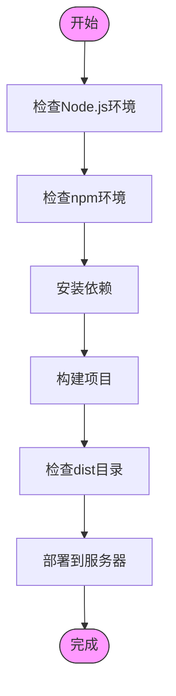
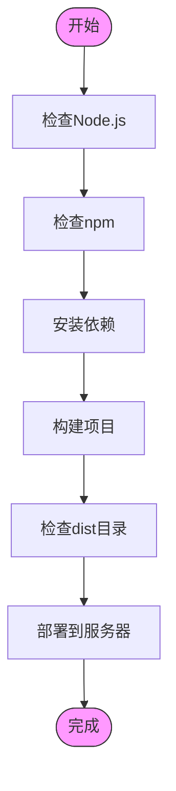
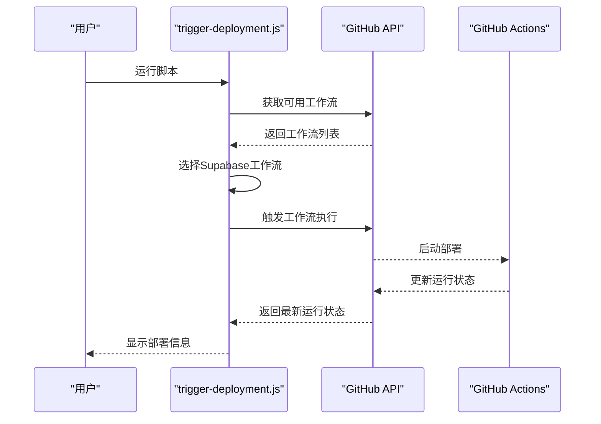
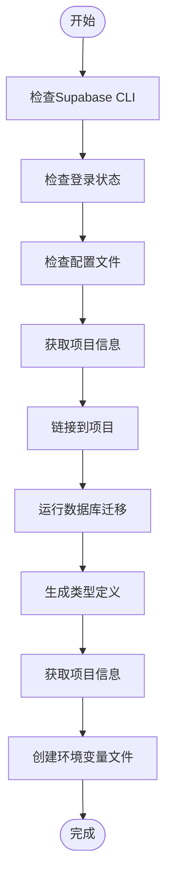
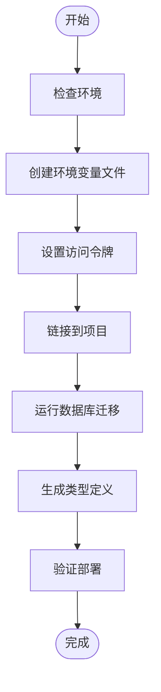
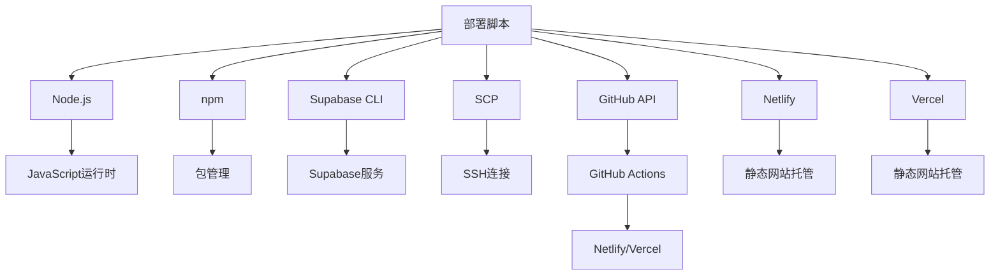

# 部署执行脚本

<cite>
**本文档中引用的文件**
- [deploy.sh](file://scripts/deployment/deploy.sh)
- [deploy.ps1](file://scripts/deployment/deploy.ps1)
- [trigger-deployment.js](file://scripts/deployment/trigger-deployment.js)
- [setup-supabase.sh](file://scripts/deployment/setup-supabase.sh)
- [setup-supabase.ps1](file://scripts/deployment/setup-supabase.ps1)
- [setup-supabase-auto.ps1](file://scripts/deployment/setup-supabase-auto.ps1)
- [netlify.toml](file://netlify.toml)
- [vercel.json](file://vercel.json)
- [package.json](file://package.json)
</cite>

## 目录
1. [简介](#简介)
2. [项目结构](#项目结构)
3. [核心组件](#核心组件)
4. [架构概述](#架构概述)
5. [详细组件分析](#详细组件分析)
6. [依赖分析](#依赖分析)
7. [性能考虑](#性能考虑)
8. [故障排除指南](#故障排除指南)
9. [结论](#结论)

## 简介
本文档全面解析跨平台部署执行脚本，涵盖环境初始化、依赖安装、构建打包及触发部署的核心步骤。重点对比Linux/macOS与Windows平台的部署流程差异，详解自动化部署机制，并提供CI/CD集成的最佳实践。

## 项目结构
项目包含完整的部署脚本体系，支持多平台和多种部署方式。主要部署相关文件位于`scripts/deployment`目录下，配置文件包括`netlify.toml`和`vercel.json`。

**Diagram sources**
- [scripts/deployment](file://scripts/deployment)

**Section sources**
- [scripts/deployment](file://scripts/deployment)

## 核心组件
核心部署组件包括跨平台部署脚本、Supabase配置脚本和部署触发器。这些组件共同构成了完整的自动化部署流水线。

**Section sources**
- [scripts/deployment/deploy.sh](file://scripts/deployment/deploy.sh#L1-L60)
- [scripts/deployment/deploy.ps1](file://scripts/deployment/deploy.ps1#L1-L38)
- [scripts/deployment/trigger-deployment.js](file://scripts/deployment/trigger-deployment.js#L1-L180)

## 架构概述
部署系统采用分层架构，从本地开发到生产环境部署形成完整闭环。系统支持手动和自动两种部署模式，具备完善的监控和验证机制。

**Diagram sources**
- [scripts/deployment/deploy.sh](file://scripts/deployment/deploy.sh#L1-L60)
- [scripts/deployment/deploy.ps1](file://scripts/deployment/deploy.ps1#L1-L38)
- [scripts/deployment/trigger-deployment.js](file://scripts/deployment/trigger-deployment.js#L1-L180)

## 详细组件分析

### 跨平台部署脚本分析
跨平台部署脚本实现了在不同操作系统上的统一部署流程，确保了部署的一致性和可靠性。

#### Linux/macOS部署流程

**Diagram sources**
- [scripts/deployment/deploy.sh](file://scripts/deployment/deploy.sh#L1-L60)

**Section sources**
- [scripts/deployment/deploy.sh](file://scripts/deployment/deploy.sh#L1-L60)

#### Windows部署流程

**Diagram sources**
- [scripts/deployment/deploy.ps1](file://scripts/deployment/deploy.ps1#L1-L38)

**Section sources**
- [scripts/deployment/deploy.ps1](file://scripts/deployment/deploy.ps1#L1-L38)

### 部署触发器分析
`trigger-deployment.js`脚本通过GitHub API实现远程部署触发，支持工作流选择和状态监控。

**Diagram sources**
- [scripts/deployment/trigger-deployment.js](file://scripts/deployment/trigger-deployment.js#L1-L180)

**Section sources**
- [scripts/deployment/trigger-deployment.js](file://scripts/deployment/trigger-deployment.js#L1-L180)

### Supabase配置脚本分析
Supabase配置脚本系列实现了数据库项目的自动化设置，包括链接、迁移和类型生成。

#### Shell配置流程

**Diagram sources**
- [scripts/deployment/setup-supabase.sh](file://scripts/deployment/setup-supabase.sh#L1-L126)

**Section sources**
- [scripts/deployment/setup-supabase.sh](file://scripts/deployment/setup-supabase.sh#L1-L126)

#### PowerShell配置流程

**Diagram sources**
- [scripts/deployment/setup-supabase.ps1](file://scripts/deployment/setup-supabase.ps1#L1-L138)

**Section sources**
- [scripts/deployment/setup-supabase.ps1](file://scripts/deployment/setup-supabase.ps1#L1-L138)

#### 自动化部署流程

**Diagram sources**
- [scripts/deployment/setup-supabase-auto.ps1](file://scripts/deployment/setup-supabase-auto.ps1#L1-L106)

**Section sources**
- [scripts/deployment/setup-supabase-auto.ps1](file://scripts/deployment/setup-supabase-auto.ps1#L1-L106)

## 依赖分析
部署系统依赖多个外部服务和工具，形成了复杂的依赖关系网络。

**Diagram sources**
- [package.json](file://package.json#L1-L103)
- [netlify.toml](file://netlify.toml#L1-L11)
- [vercel.json](file://vercel.json#L1-L36)

**Section sources**
- [package.json](file://package.json#L1-L103)
- [netlify.toml](file://netlify.toml#L1-L11)
- [vercel.json](file://vercel.json#L1-L36)

## 性能考虑
部署系统的性能主要受网络传输、构建时间和API响应速度影响。建议在部署前进行充分的测试和优化。

## 故障排除指南
当部署出现问题时，可按照以下步骤进行排查：

1. 检查环境依赖是否完整
2. 验证配置文件是否正确
3. 查看构建日志中的错误信息
4. 检查网络连接状态
5. 验证API密钥和权限设置

**Section sources**
- [scripts/deployment/verify-deployment.js](file://scripts/deployment/verify-deployment.js#L1-L155)
- [scripts/deployment/monitor-deployment.js](file://scripts/deployment/monitor-deployment.js#L1-L355)

## 结论
本文档详细解析了跨平台部署执行脚本的工作原理和使用方法。通过合理的脚本设计和自动化流程，实现了高效、可靠的部署体验。建议在实际使用中结合CI/CD系统，进一步提升部署效率和稳定性。