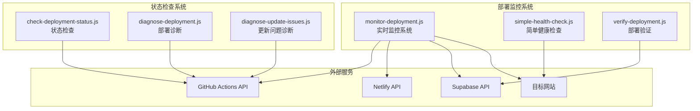
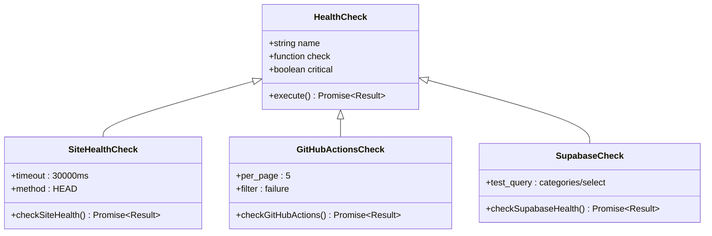
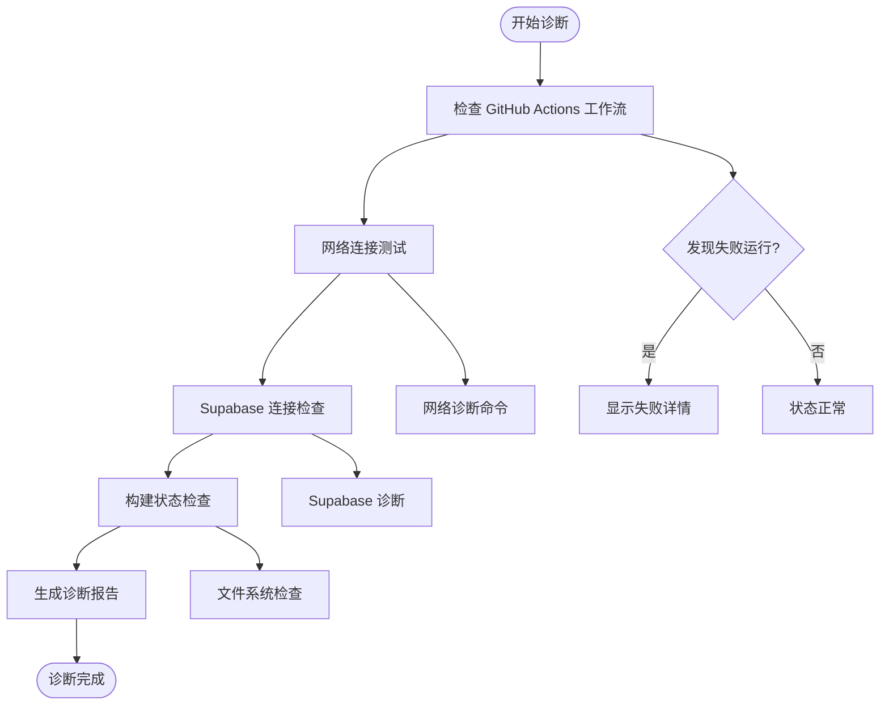
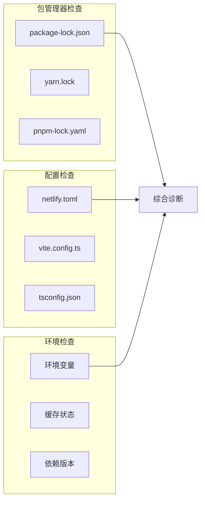
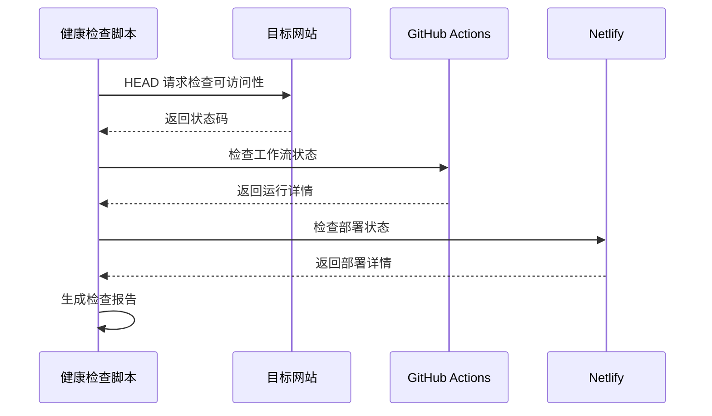
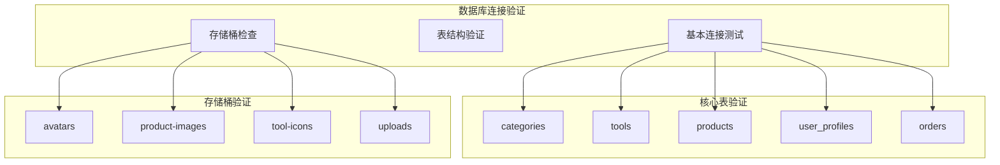
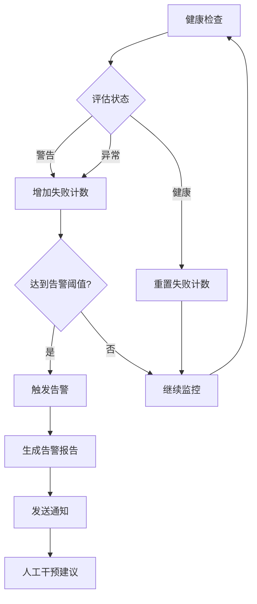

# 部署监控与诊断脚本系统

<cite>
**本文档引用的文件**
- [monitor-deployment.js](file://scripts/deployment/monitor-deployment.js)
- [check-deployment-status.js](file://scripts/deployment/check-deployment-status.js)
- [diagnose-deployment.js](file://scripts/deployment/diagnose-deployment.js)
- [diagnose-update-issues.js](file://scripts/deployment/diagnose-update-issues.js)
- [simple-health-check.js](file://scripts/deployment/simple-health-check.js)
- [verify-deployment.js](file://scripts/deployment/verify-deployment.js)
- [netlify.toml](file://netlify.toml)
- [package.json](file://package.json)
- [README.md](file://README.md)
</cite>

## 目录
1. [简介](#简介)
2. [项目架构概览](#项目架构概览)
3. [核心监控脚本](#核心监控脚本)
4. [诊断工具详解](#诊断工具详解)
5. [健康检查机制](#健康检查机制)
6. [部署验证系统](#部署验证系统)
7. [自动化告警集成](#自动化告警集成)
8. [最佳实践建议](#最佳实践建议)
9. [故障排除指南](#故障排除指南)
10. [总结](#总结)

## 简介

本文档详细介绍了基于 JavaScript 的部署状态监控与问题诊断工具集，该系统为现代 Web 应用提供了全面的部署状态监控、实时进度跟踪、问题诊断和自动化告警功能。系统包含六个核心脚本，每个脚本都有特定的功能定位，共同构成了一个完整的部署监控生态系统。

该工具集特别适用于使用 Vue.js + Vite + Supabase 技术栈的项目，能够有效监控 GitHub Actions 工作流、Netlify 部署、Supabase 数据库连接等关键组件的状态。

## 项目架构概览



**图表来源**
- [monitor-deployment.js](file://scripts/deployment/monitor-deployment.js#L1-L50)
- [check-deployment-status.js](file://scripts/deployment/check-deployment-status.js#L1-L30)

## 核心监控脚本

### monitor-deployment.js - 实时监控引擎

`monitor-deployment.js` 是整个监控系统的核心，提供持续的部署状态监控和智能告警功能。

#### 核心功能特性

- **多维度健康检查**: 包括网站可访问性、GitHub Actions 状态、Supabase 数据库连接
- **智能告警机制**: 基于连续失败次数的阈值告警
- **实时状态更新**: 每5分钟自动检查一次
- **详细的诊断信息**: 提供完整的错误堆栈和状态详情

#### 监控检查项架构



**图表来源**
- [monitor-deployment.js](file://scripts/deployment/monitor-deployment.js#L35-L65)

#### 监控配置参数

系统支持灵活的配置参数，允许根据不同的部署环境调整监控策略：

```javascript
const monitorConfig = {
  checkInterval: 5 * 60 * 1000, // 5分钟检查一次
  maxFailures: 3, // 连续失败3次后告警
  timeout: 30000, // 30秒超时
};
```

**章节来源**
- [monitor-deployment.js](file://scripts/deployment/monitor-deployment.js#L25-L35)

## 诊断工具详解

### diagnose-deployment.js - 综合部署诊断

该脚本基于 Context7 最佳实践，提供全面的部署问题诊断能力。

#### 诊断流程架构



**图表来源**
- [diagnose-deployment.js](file://scripts/deployment/diagnose-deployment.js#L18-L80)

#### Context7 网络诊断方法

脚本实现了 Context7 推荐的网络诊断方法，包括：

1. **DNS 解析测试**: `nslookup ramusi.cn`
2. **SSL 证书验证**: `curl -vI https://ramusi.cn`
3. **连通性测试**: `ping -c 4 ramusi.cn`

**章节来源**
- [diagnose-deployment.js](file://scripts/deployment/diagnose-deployment.js#L149-L167)

### diagnose-update-issues.js - 更新发布问题诊断

专门针对初次发布成功但更新发布失败的场景设计的诊断工具。

#### 诊断检查维度



**图表来源**
- [diagnose-update-issues.js](file://scripts/deployment/diagnose-update-issues.js#L30-L100)

#### 自动修复脚本生成

系统能够根据诊断结果自动生成修复脚本，包含以下步骤：

1. 清理缓存和依赖
2. 统一包管理器配置
3. 重新安装依赖
4. 验证构建过程
5. 运行测试套件

**章节来源**
- [diagnose-update-issues.js](file://scripts/deployment/diagnose-update-issues.js#L200-L250)

## 健康检查机制

### simple-health-check.js - 快速状态验证

提供最基础的健康检查功能，适合快速验证部署状态。

#### 检查流程



**图表来源**
- [simple-health-check.js](file://scripts/deployment/simple-health-check.js#L15-L80)

#### 检查结果可视化

系统使用直观的表情符号来表示不同的状态：

- ✅ 健康状态
- ⚠️ 警告状态  
- ❌ 异常状态
- 💥 错误状态

**章节来源**
- [simple-health-check.js](file://scripts/deployment/simple-health-check.js#L1-L50)

### check-deployment-status.js - 详细状态分析

提供最详细的部署状态检查，包括工作流历史、Secrets 配置等。

#### 状态检查维度

1. **工作流运行状态**: 最近5个运行的成功/失败状态
2. **Supabase 部署状态**: 特定的部署工作流状态
3. **Secrets 配置检查**: 必需的环境变量配置状态
4. **时间线分析**: 部署耗时和时间戳分析

**章节来源**
- [check-deployment-status.js](file://scripts/deployment/check-deployment-status.js#L15-L100)

## 部署验证系统

### verify-deployment.js - 完整部署验证

专注于验证 Supabase 数据库部署的完整性，确保所有必要组件都正确配置。

#### 验证检查清单



**图表来源**
- [verify-deployment.js](file://scripts/deployment/verify-deployment.js#L30-L80)

#### 部署状态总结

验证完成后，系统提供清晰的部署状态总结：

- ✅ 数据库连接正常
- ✅ 所有必要的表都已创建
- ⚠️ 存储桶需要手动创建（如果尚未创建）

**章节来源**
- [verify-deployment.js](file://scripts/deployment/verify-deployment.js#L100-L130)

## 自动化告警集成

### 监控告警机制



**图表来源**
- [monitor-deployment.js](file://scripts/deployment/monitor-deployment.js#L176-L230)

### 告警触发条件

系统采用智能告警机制：

1. **连续失败阈值**: 默认连续3次失败触发告警
2. **关键服务检查**: 仅对关键服务（如网站可访问性、Supabase 连接）进行告警
3. **详细错误报告**: 告警包含完整的错误信息和诊断建议

**章节来源**
- [monitor-deployment.js](file://scripts/deployment/monitor-deployment.js#L230-L280)

## 最佳实践建议

### 基于脚本的自动化告警系统构建

#### 1. 监控脚本组合使用

建议在生产环境中组合使用多个监控脚本：

```bash
# 实时监控
npm run monitor:watch

# 定期健康检查
npm run monitor:health

# 部署验证
npm run deploy:verify
```

#### 2. 告警通知集成

可以将监控脚本集成到现有的告警系统中：

```javascript
// 示例：集成到 Slack 通知
async function sendSlackAlert(message) {
  const webhookUrl = process.env.SLACK_WEBHOOK_URL;
  const payload = {
    text: `🚨 部署监控告警: ${message}`
  };
  
  await fetch(webhookUrl, {
    method: 'POST',
    body: JSON.stringify(payload)
  });
}
```

#### 3. 监控仪表板集成

建议将监控数据集成到监控仪表板中：

- **Prometheus + Grafana**: 用于长期监控和趋势分析
- **自定义仪表板**: 集成到现有的运维平台
- **邮件通知**: 关键告警的邮件通知

### 部署流程优化

#### 1. 预部署检查

在部署前运行预检查脚本：

```bash
npm run pre-deploy
npm run pre-deploy:enhanced
npm run config:verify
```

#### 2. 部署后验证

部署完成后运行验证脚本：

```bash
npm run deploy:verify
npm run test:deployment
```

#### 3. 持续监控

建立持续监控机制：

```bash
# 启动持续监控
npm run monitor:watch

# 定期健康检查
npm run monitor:health
```

## 故障排除指南

### 常见问题诊断

#### 1. GitHub Actions 相关问题

**症状**: GitHub Actions 检查显示失败或无记录

**诊断步骤**:
```bash
# 检查 GitHub Secrets 配置
npm run secrets:check

# 检查工作流状态
npm run deployment:status

# 运行更新问题诊断
npm run diagnose:update
```

**解决方案**:
- 确保 GITHUB_TOKEN 有足够权限
- 检查 Secrets 配置是否完整
- 验证工作流文件语法

#### 2. Supabase 连接问题

**症状**: Supabase 健康检查失败

**诊断步骤**:
```bash
# 运行 Supabase 验证
npm run supabase:verify

# 检查环境变量
cat .env.local | grep SUPABASE

# 测试数据库连接
npm run db:check-wee
```

**解决方案**:
- 更新 Supabase 项目引用
- 检查 API 密钥有效性
- 验证网络连接

#### 3. Netlify 部署问题

**症状**: Netlify 部署状态异常

**诊断步骤**:
```bash
# 检查 Netlify 配置
cat netlify.toml

# 运行健康检查
npm run monitor:health

# 检查构建配置
npm run pre-deploy
```

**解决方案**:
- 验证 netlify.toml 配置
- 检查环境变量设置
- 清理构建缓存

### Context7 故障排除方法

基于 Context7 最佳实践的故障排除步骤：

1. **网络和域名问题**:
   ```bash
   # DNS 解析测试
   nslookup ramusi.cn
   
   # SSL 证书验证
   curl -vI https://ramusi.cn
   
   # 网络连通性测试
   ping -c 4 ramusi.cn
   ```

2. **Netlify 配置检查**:
   - 访问 Netlify Dashboard
   - 确认站点状态为 'Published'
   - 检查构建日志是否有错误
   - 验证环境变量配置

3. **构建和部署流程**:
   ```bash
   # 本地测试构建
   npm run build && npm run preview
   
   # 运行预部署检查
   npm run pre-deploy
   
   # 检查配置匹配
   npm run config:verify
   ```

4. **Supabase 集成**:
   - 验证项目状态: Active
   - 检查 API 密钥有效性
   - 测试数据库连接

**章节来源**
- [diagnose-deployment.js](file://scripts/deployment/diagnose-deployment.js#L100-L168)

## 总结

这套部署监控与诊断脚本系统为现代 Web 应用提供了全面的部署状态监控和问题诊断能力。通过六个核心脚本的协同工作，系统能够：

1. **实时监控**: 持续监控关键服务状态，及时发现异常
2. **智能诊断**: 基于多种诊断方法，准确定位问题根源
3. **自动化告警**: 基于阈值的智能告警机制，减少人工监控成本
4. **完整验证**: 从基础健康检查到深度部署验证的完整流程
5. **故障排除**: 提供详细的故障排除指南和自动修复建议

该系统特别适用于使用 Vue.js + Vite + Supabase 技术栈的项目，能够有效监控 GitHub Actions 工作流、Netlify 部署、Supabase 数据库连接等关键组件的状态。通过合理的配置和使用，可以显著提高部署成功率和系统稳定性。

建议团队根据实际需求选择合适的监控策略，并结合自动化工具实现完整的 DevOps 流程。对于生产环境，建议部署持续监控系统，并建立完善的告警和通知机制，确保能够及时发现和解决问题。