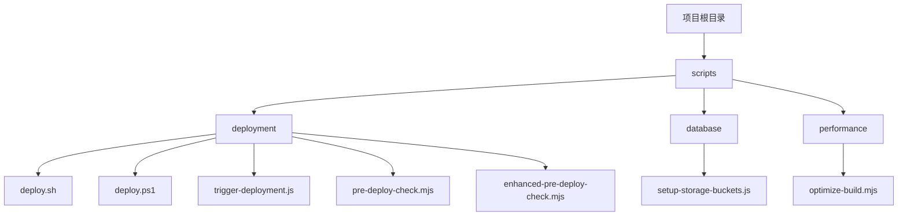
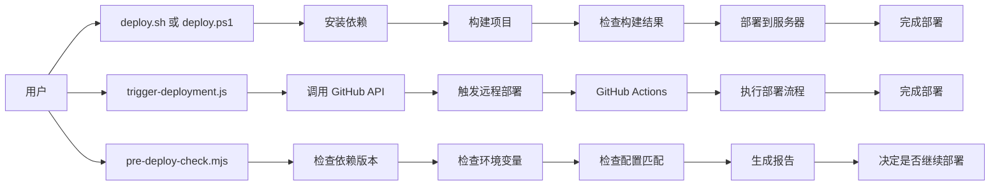
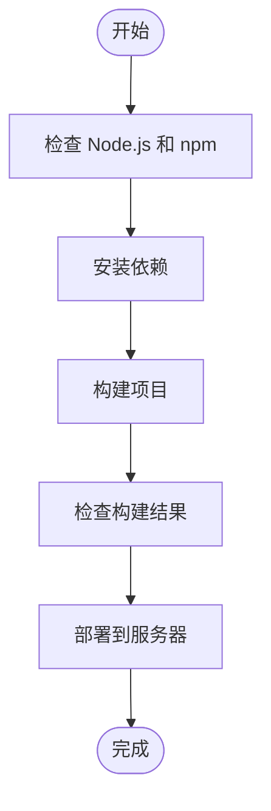
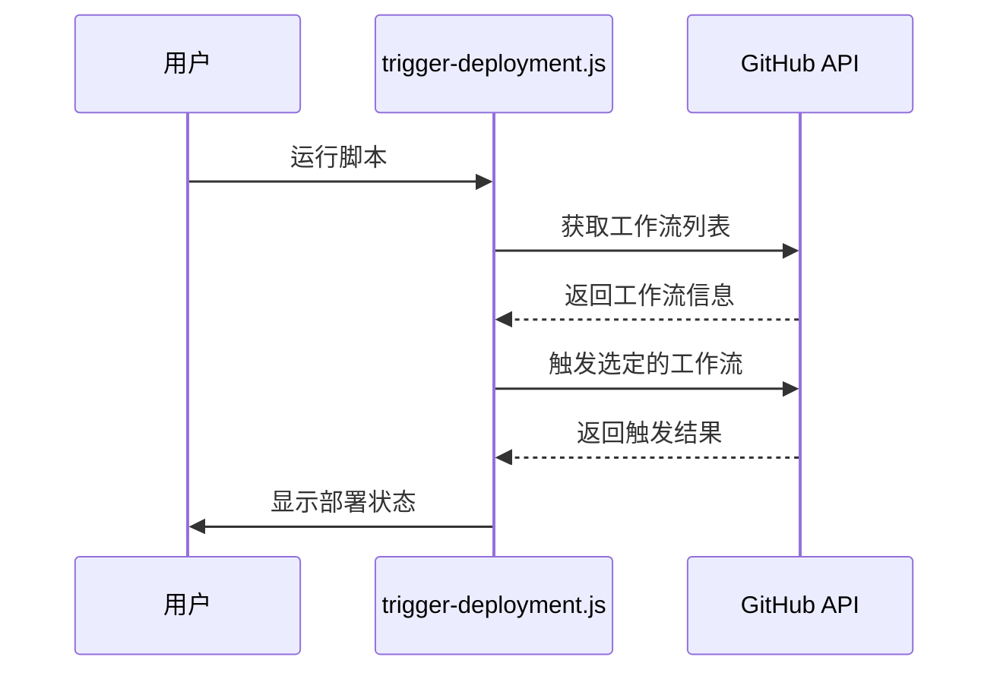
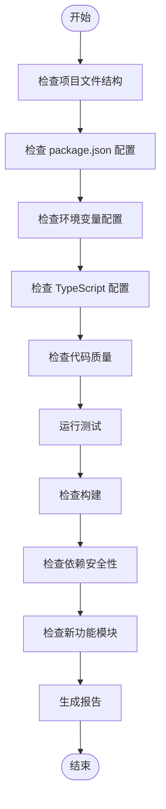
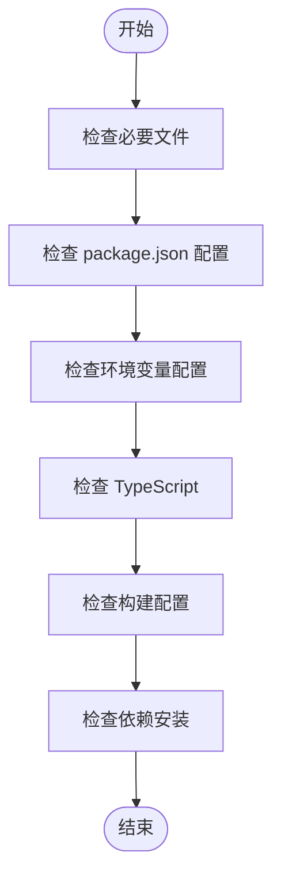
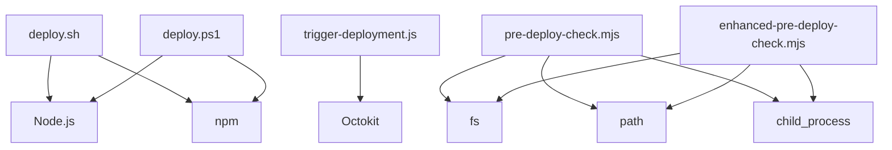

# 部署自动化脚本

<cite>
**本文档引用的文件**
- [deploy.sh](file://scripts/deployment/deploy.sh)
- [deploy.ps1](file://scripts/deployment/deploy.ps1)
- [trigger-deployment.js](file://scripts/deployment/trigger-deployment.js)
- [pre-deploy-check.mjs](file://scripts/deployment/pre-deploy-check.mjs)
- [enhanced-pre-deploy-check.mjs](file://scripts/deployment/enhanced-pre-deploy-check.mjs)
- [netlify.toml](file://netlify.toml)
- [package.json](file://package.json)
- [setup-supabase.sh](file://scripts/deployment/setup-supabase.sh)
- [setup-supabase.ps1](file://scripts/deployment/setup-supabase.ps1)
</cite>

## 目录
1. [简介](#简介)
2. [项目结构](#项目结构)
3. [核心组件](#核心组件)
4. [架构概述](#架构概述)
5. [详细组件分析](#详细组件分析)
6. [依赖分析](#依赖分析)
7. [性能考虑](#性能考虑)
8. [故障排除指南](#故障排除指南)
9. [结论](#结论)

## 简介
部署自动化脚本体系旨在简化和标准化项目的部署流程。该系统包含一系列脚本，用于在不同操作系统下执行部署任务、触发远程部署以及进行部署前检查。这些脚本确保了部署过程的一致性和可靠性，并提供了详细的错误处理机制和日志输出规范。

## 项目结构
项目结构清晰地组织了所有与部署相关的脚本和配置文件。主要的部署脚本位于 `scripts/deployment` 目录中，而数据库相关的脚本则位于 `scripts/database` 目录中。此外，还有一些性能优化脚本位于 `scripts/performance` 目录中。

**图表来源**
- [deploy.sh](file://scripts/deployment/deploy.sh)
- [deploy.ps1](file://scripts/deployment/deploy.ps1)
- [trigger-deployment.js](file://scripts/deployment/trigger-deployment.js)
- [pre-deploy-check.mjs](file://scripts/deployment/pre-deploy-check.mjs)
- [enhanced-pre-deploy-check.mjs](file://scripts/deployment/enhanced-pre-deploy-check.mjs)
- [setup-storage-buckets.js](file://scripts/database/setup-storage-buckets.js)
- [optimize-build.mjs](file://scripts/performance/optimize-build.mjs)

**章节来源**
- [scripts](file://scripts)

## 核心组件
核心组件包括 `deploy.sh` 和 `deploy.ps1` 脚本，它们分别用于在 Unix-like 系统和 Windows 系统上执行部署任务。`trigger-deployment.js` 脚本用于通过 API 触发远程部署，而 `pre-deploy-check.mjs` 和 `enhanced-pre-deploy-check.mjs` 脚本则用于在部署前进行各种检查。

**章节来源**
- [deploy.sh](file://scripts/deployment/deploy.sh)
- [deploy.ps1](file://scripts/deployment/deploy.ps1)
- [trigger-deployment.js](file://scripts/deployment/trigger-deployment.js)
- [pre-deploy-check.mjs](file://scripts/deployment/pre-deploy-check.mjs)
- [enhanced-pre-deploy-check.mjs](file://scripts/deployment/enhanced-pre-deploy-check.mjs)

## 架构概述
整个部署自动化系统的架构由多个相互协作的组件构成。这些组件共同工作以确保部署过程的顺利进行。

**图表来源**
- [deploy.sh](file://scripts/deployment/deploy.sh)
- [deploy.ps1](file://scripts/deployment/deploy.ps1)
- [trigger-deployment.js](file://scripts/deployment/trigger-deployment.js)
- [pre-deploy-check.mjs](file://scripts/deployment/pre-deploy-check.mjs)

## 详细组件分析
### 部署脚本分析
#### deploy.sh 分析
`deploy.sh` 是一个 Bash 脚本，用于在 Unix-like 系统上执行部署任务。它首先检查 Node.js 和 npm 是否已安装，然后安装项目依赖并构建项目。最后，它使用 scp 命令将构建结果部署到远程服务器。

**图表来源**
- [deploy.sh](file://scripts/deployment/deploy.sh)

#### deploy.ps1 分析
`deploy.ps1` 是一个 PowerShell 脚本，功能与 `deploy.sh` 类似，但适用于 Windows 系统。它同样会检查 Node.js 和 npm 的安装情况，安装依赖，构建项目，并使用 scp 命令部署到远程服务器。

**图表来源**
- [deploy.ps1](file://scripts/deployment/deploy.ps1)

### 触发部署脚本分析
#### trigger-deployment.js 分析
`trigger-deployment.js` 脚本使用 Octokit 库来调用 GitHub API，从而触发远程部署。它需要一个具有适当权限的 GitHub Token 来执行此操作。脚本会列出可用的工作流，选择合适的部署工作流，并触发其运行。

**图表来源**
- [trigger-deployment.js](file://scripts/deployment/trigger-deployment.js)

### 预部署检查脚本分析
#### pre-deploy-check.mjs 分析
`pre-deploy-check.mjs` 脚本执行一系列检查，以确保项目在部署前处于正确状态。这些检查包括验证项目文件结构、package.json 配置、环境变量、TypeScript 类型检查、代码质量、测试覆盖率、构建配置和依赖安全性等。

**图表来源**
- [pre-deploy-check.mjs](file://scripts/deployment/pre-deploy-check.mjs)

#### enhanced-pre-deploy-check.mjs 分析
`enhanced-pre-deploy-check.mjs` 提供了更高级的检查功能，包括对必要文件的存在性、package.json 配置、环境变量配置、TypeScript 配置、构建配置和依赖安装的检查。

**图表来源**
- [enhanced-pre-deploy-check.mjs](file://scripts/deployment/enhanced-pre-deploy-check.mjs)

## 依赖分析
部署自动化脚本体系依赖于多个外部工具和库。例如，`deploy.sh` 和 `deploy.ps1` 依赖于 Node.js 和 npm 来管理项目依赖和构建过程。`trigger-deployment.js` 依赖于 Octokit 库来与 GitHub API 交互。`pre-deploy-check.mjs` 和 `enhanced-pre-deploy-check.mjs` 依赖于 Node.js 内置模块如 fs、path 和 child_process 来执行文件操作和命令行调用。

**图表来源**
- [deploy.sh](file://scripts/deployment/deploy.sh)
- [deploy.ps1](file://scripts/deployment/deploy.ps1)
- [trigger-deployment.js](file://scripts/deployment/trigger-deployment.js)
- [pre-deploy-check.mjs](file://scripts/deployment/pre-deploy-check.mjs)
- [enhanced-pre-deploy-check.mjs](file://scripts/deployment/enhanced-pre-deploy-check.mjs)

**章节来源**
- [package.json](file://package.json)

## 性能考虑
为了提高部署效率，可以采取一些措施。例如，在 `deploy.sh` 和 `deploy.ps1` 中使用 `--legacy-peer-deps` 参数来解决依赖冲突问题。此外，可以通过缓存依赖项来减少每次部署时的下载时间。对于大型项目，还可以考虑使用增量构建来加快构建速度。

## 故障排除指南
当遇到部署问题时，可以按照以下步骤进行排查：
1. 检查 Node.js 和 npm 是否已正确安装。
2. 确认 `package.json` 文件中的脚本配置是否正确。
3. 检查 `.env.local` 文件中的环境变量是否设置正确。
4. 查