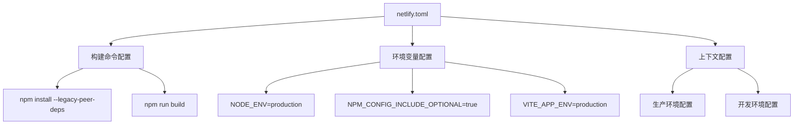
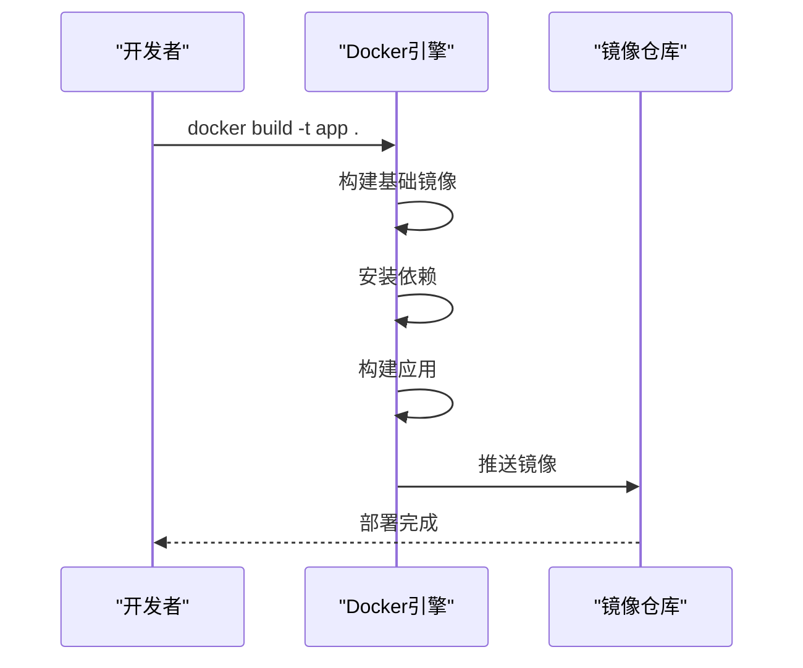
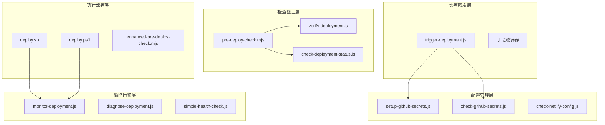
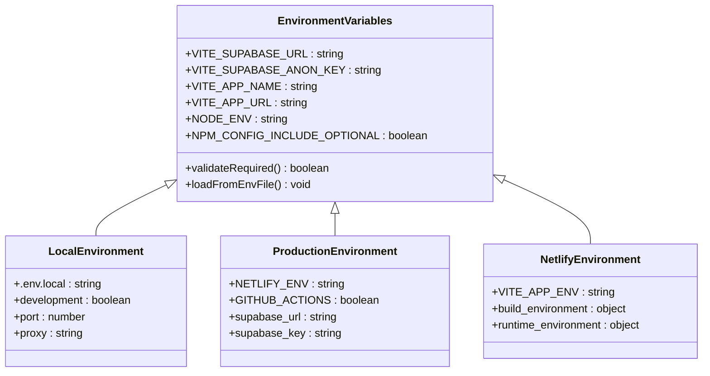
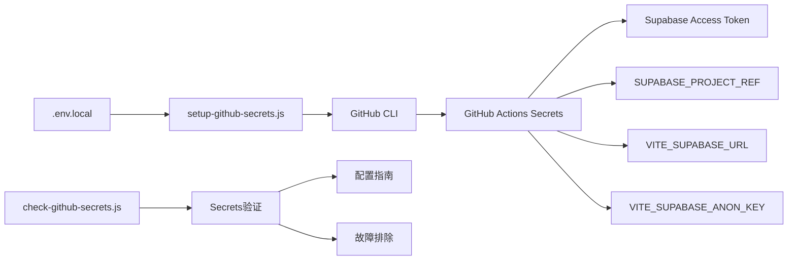
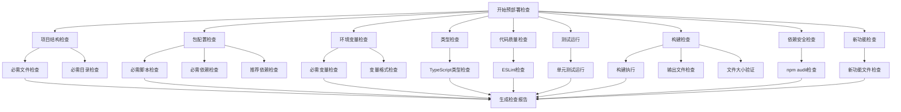
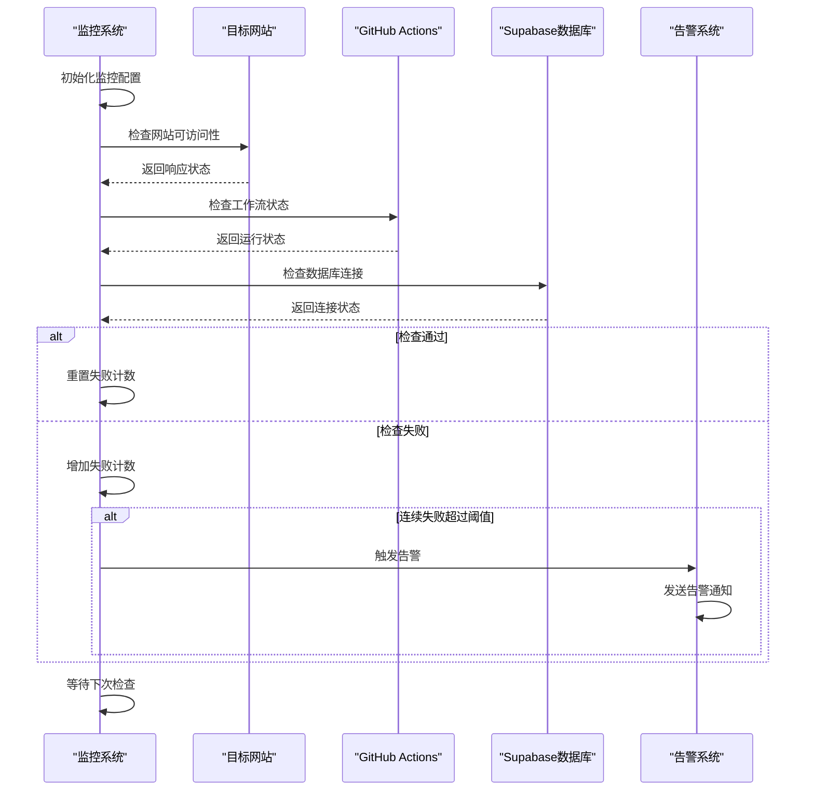
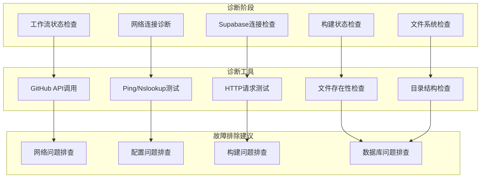

# 部署配置

<cite>
**本文档中引用的文件**
- [netlify.toml](file://netlify.toml)
- [deploy.sh](file://scripts/deployment/deploy.sh)
- [trigger-deployment.js](file://scripts/deployment/trigger-deployment.js)
- [pre-deploy-check.mjs](file://scripts/deployment/pre-deploy-check.mjs)
- [check-github-secrets.js](file://scripts/deployment/check-github-secrets.js)
- [check-netlify-config.js](file://scripts/deployment/check-netlify-config.js)
- [verify-deployment.js](file://scripts/deployment/verify-deployment.js)
- [setup-github-secrets.js](file://scripts/deployment/setup-github-secrets.js)
- [monitor-deployment.js](file://scripts/deployment/monitor-deployment.js)
- [diagnose-deployment.js](file://scripts/deployment/diagnose-deployment.js)
</cite>

## 目录
1. [简介](#简介)
2. [Netlify部署配置](#netlify部署配置)
3. [Docker容器化配置](#docker容器化配置)
4. [CI/CD脚本架构](#cicd脚本架构)
5. [环境变量配置](#环境变量配置)
6. [GitHub Secrets管理](#github-secrets管理)
7. [部署前检查机制](#部署前检查机制)
8. [部署状态监控](#部署状态监控)
9. [故障诊断工具](#故障诊断工具)
10. [最佳实践建议](#最佳实践建议)

## 简介

该项目采用现代化的多平台部署策略，支持Netlify静态网站托管、Docker容器化部署以及GitHub Actions自动化CI/CD流程。部署配置涵盖了从本地开发环境到生产环境的完整生命周期管理，包括环境变量配置、依赖管理、构建优化和部署监控等核心功能。

## Netlify部署配置

### netlify.toml配置详解

Netlify部署配置是整个部署流程的核心入口点，定义了构建命令、环境变量和部署行为。

**图表来源**
- [netlify.toml](file://netlify.toml#L1-L12)

**章节来源**
- [netlify.toml](file://netlify.toml#L1-L12)

#### 构建优化配置

Netlify配置采用了多项优化措施：

1. **依赖管理优化**：使用`--legacy-peer-deps`解决依赖冲突
2. **离线优先**：`--prefer-offline`确保在网络不稳定时仍能构建
3. **审计跳过**：`--no-audit`加速构建过程
4. **可选依赖包含**：`--include=optional`确保所有功能正常

#### 环境变量管理

配置文件中明确定义了不同环境下的变量：
- 生产环境：`NODE_ENV=production`
- NPM配置：`NPM_CONFIG_INCLUDE_OPTIONAL=true`
- 应用环境：`VITE_APP_ENV=production`

这种分层配置确保了应用在不同环境中的一致性和稳定性。

## Docker容器化配置

### Dockerfile构建逻辑

虽然项目结构中包含了Docker配置文件，但主要部署策略是基于Netlify的静态网站托管。Docker配置主要用于本地开发和测试环境。

**图表来源**
- [config/deployment/Dockerfile](file://config/deployment/Dockerfile)

### Docker Compose编排

Docker Compose配置提供了完整的开发环境编排，包括Web服务、数据库和代理服务器的协调部署。

**章节来源**
- [config/deployment/docker-compose.yml](file://config/deployment/docker-compose.yml)

## CI/CD脚本架构

### 部署脚本生态系统

项目包含了一个完整的CI/CD脚本生态系统，涵盖了从触发部署到监控状态的全流程。

**图表来源**
- [scripts/deployment/trigger-deployment.js](file://scripts/deployment/trigger-deployment.js#L1-L50)
- [scripts/deployment/setup-github-secrets.js](file://scripts/deployment/setup-github-secrets.js#L1-L50)
- [scripts/deployment/pre-deploy-check.mjs](file://scripts/deployment/pre-deploy-check.mjs#L1-L50)

### 部署触发机制

`trigger-deployment.js`脚本提供了灵活的部署触发能力：

1. **GitHub Actions集成**：通过Octokit API与GitHub Actions无缝集成
2. **工作流识别**：自动识别和选择合适的部署工作流
3. **输入参数控制**：支持强制部署和环境参数配置
4. **状态监控**：实时跟踪部署状态和进度

**章节来源**
- [scripts/deployment/trigger-deployment.js](file://scripts/deployment/trigger-deployment.js#L1-L181)

### 多平台部署支持

项目支持多种部署方式：

- **Shell脚本部署**：`deploy.sh`提供Linux/macOS部署支持
- **PowerShell部署**：`deploy.ps1`提供Windows部署支持
- **Docker部署**：支持容器化部署选项
- **Git部署**：支持Git分支推送部署

**章节来源**
- [scripts/deployment/deploy.sh](file://scripts/deployment/deploy.sh#L1-L61)

## 环境变量配置

### 多层次环境变量管理

项目采用了多层次的环境变量管理体系，确保开发、测试和生产环境的一致性。

**图表来源**
- [scripts/deployment/check-github-secrets.js](file://scripts/deployment/check-github-secrets.js#L15-L40)
- [scripts/deployment/check-netlify-config.js](file://scripts/deployment/check-netlify-config.js#L25-L50)

### 必需环境变量清单

项目定义了以下核心环境变量：

1. **Supabase配置**：
   - `VITE_SUPABASE_URL`：Supabase项目API URL
   - `VITE_SUPABASE_ANON_KEY`：Supabase匿名密钥

2. **应用配置**：
   - `VITE_APP_NAME`：应用名称
   - `VITE_APP_URL`：应用访问URL

3. **环境标识**：
   - `VITE_APP_ENV`：应用环境标识
   - `NODE_ENV`：Node.js环境变量

**章节来源**
- [scripts/deployment/check-github-secrets.js](file://scripts/deployment/check-github-secrets.js#L15-L40)

### 环境变量验证机制

`check-netlify-config.js`脚本提供了全面的环境变量验证功能：

1. **配置文件检查**：验证`.env`系列文件的存在和完整性
2. **变量完整性检查**：确保必需变量的完整性和正确性
3. **格式验证**：检查变量值的格式和语法
4. **路径验证**：验证配置文件的相对路径和绝对路径

**章节来源**
- [scripts/deployment/check-netlify-config.js](file://scripts/deployment/check-netlify-config.js#L1-L111)

## GitHub Secrets管理

### Secrets配置体系

GitHub Secrets管理系统提供了安全的敏感信息存储和管理机制。

**图表来源**
- [scripts/deployment/setup-github-secrets.js](file://scripts/deployment/setup-github-secrets.js#L20-L50)
- [scripts/deployment/check-github-secrets.js](file://scripts/deployment/check-github-secrets.js#L15-L40)

### 自动化Secrets配置

`setup-github-secrets.js`脚本实现了GitHub Secrets的自动化配置：

1. **CLI集成**：与GitHub CLI无缝集成，简化配置流程
2. **批量配置**：支持多个Secrets的批量配置
3. **验证机制**：配置后自动验证Secrets的有效性
4. **错误处理**：完善的错误处理和用户反馈机制

**章节来源**
- [scripts/deployment/setup-github-secrets.js](file://scripts/deployment/setup-github-secrets.js#L1-L128)

### Secrets验证和监控

`check-github-secrets.js`提供了全面的Secrets验证功能：

1. **必需Secrets检查**：验证所有必需的Secrets是否已配置
2. **配置一致性检查**：确保GitHub Secrets与本地配置一致
3. **连接测试**：测试Supabase连接以验证配置正确性
4. **工作流信息展示**：提供相关工作流的详细信息

**章节来源**
- [scripts/deployment/check-github-secrets.js](file://scripts/deployment/check-github-secrets.js#L1-L171)

## 部署前检查机制

### 全面的预部署检查体系

`pre-deploy-check.mjs`脚本构建了完整的预部署检查体系，确保部署前的各项准备工作就绪。

**图表来源**
- [scripts/deployment/pre-deploy-check.mjs](file://scripts/deployment/pre-deploy-check.mjs#L50-L100)

### 检查项目分类

预部署检查涵盖了以下关键领域：

1. **项目结构完整性**：验证必需的文件和目录存在
2. **包配置正确性**：检查package.json中的必需配置
3. **环境变量完整性**：确保所有必需的环境变量已配置
4. **类型系统健康**：运行TypeScript类型检查
5. **代码质量保证**：执行ESLint代码质量检查
6. **测试覆盖率验证**：运行完整的测试套件
7. **构建流程验证**：执行构建过程并验证输出
8. **依赖安全性检查**：扫描npm依赖的安全漏洞
9. **新功能完整性**：检查新增功能模块的完整性

**章节来源**
- [scripts/deployment/pre-deploy-check.mjs](file://scripts/deployment/pre-deploy-check.mjs#L1-L371)

### 智能报告生成

预部署检查脚本能够智能生成详细的检查报告：

1. **错误统计**：统计发现的错误数量和严重程度
2. **警告汇总**：汇总潜在问题和改进建议
3. **修复指导**：提供具体的修复步骤和建议
4. **状态指示**：清晰的状态指示和下一步行动建议

## 部署状态监控

### 实时监控系统

`monitor-deployment.js`提供了全面的部署状态监控和告警功能。

**图表来源**
- [scripts/deployment/monitor-deployment.js](file://scripts/deployment/monitor-deployment.js#L50-L100)

### 多维度健康检查

监控系统执行以下维度的健康检查：

1. **网站可访问性检查**：验证目标网站的响应状态
2. **GitHub Actions状态检查**：监控CI/CD工作流的执行状态
3. **Supabase数据库健康检查**：验证数据库连接和基本查询功能
4. **响应时间监控**：测量各服务的响应时间
5. **错误率统计**：统计各类错误的发生频率

**章节来源**
- [scripts/deployment/monitor-deployment.js](file://scripts/deployment/monitor-deployment.js#L1-L356)

### 告警机制设计

监控系统采用了智能的告警机制：

1. **阈值控制**：设置连续失败次数阈值
2. **分级告警**：区分关键服务和非关键服务的告警级别
3. **详细报告**：提供详细的故障信息和影响范围
4. **自动恢复检测**：监控服务恢复状态并更新告警状态

## 故障诊断工具

### 综合诊断框架

`diagnose-deployment.js`提供了基于Context7最佳实践的综合诊断框架。

**图表来源**
- [scripts/deployment/diagnose-deployment.js](file://scripts/deployment/diagnose-deployment.js#L20-L80)

### Context7最佳实践

诊断工具遵循Context7最佳实践原则：

1. **系统性检查**：覆盖部署流程的各个环节
2. **渐进式诊断**：从简单到复杂的诊断顺序
3. **可操作建议**：提供具体可行的解决方案
4. **自动化支持**：支持自动化诊断和报告生成

**章节来源**
- [scripts/deployment/diagnose-deployment.js](file://scripts/deployment/diagnose-deployment.js#L1-L169)

### 网络诊断功能

网络诊断模块提供了全面的网络连通性检查：

1. **域名解析检查**：验证DNS解析的正确性
2. **SSL证书检查**：验证HTTPS证书的有效性
3. **网络延迟测试**：测量网络响应时间和延迟
4. **防火墙和代理检查**：检测网络访问限制

## 最佳实践建议

### 部署流程优化

基于项目配置的最佳实践建议：

1. **环境隔离**：严格分离开发、测试和生产环境的配置
2. **自动化优先**：尽可能自动化部署流程，减少人为干预
3. **监控覆盖**：建立全面的监控体系，及时发现和解决问题
4. **回滚机制**：建立快速回滚机制，确保部署失败时能快速恢复
5. **文档维护**：保持部署文档的及时更新和准确性

### 安全配置建议

1. **Secrets管理**：使用GitHub Actions Secrets安全存储敏感信息
2. **权限最小化**：为GitHub Actions分配最小必要权限
3. **定期轮换**：定期轮换API密钥和访问令牌
4. **审计日志**：启用并定期审查部署相关的审计日志

### 性能优化建议

1. **构建优化**：使用适当的构建标志优化构建性能
2. **缓存策略**：合理配置缓存策略提升部署速度
3. **资源压缩**：启用代码压缩和资源优化
4. **CDN集成**：考虑使用CDN加速静态资源加载

### 监控和告警

1. **多维度监控**：监控应用、基础设施和业务指标
2. **智能告警**：设置合理的告警阈值和通知渠道
3. **根因分析**：建立完善的故障根因分析流程
4. **持续改进**：基于监控数据持续优化系统性能

通过这套完整的部署配置体系，项目实现了从开发到生产的全自动化部署流程，确保了部署的可靠性、安全性和可维护性。各个组件相互配合，形成了一个健壮的部署生态系统，能够满足现代Web应用的部署需求。