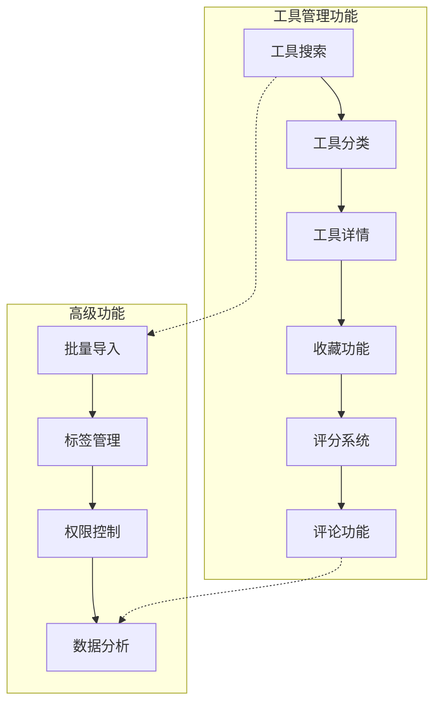
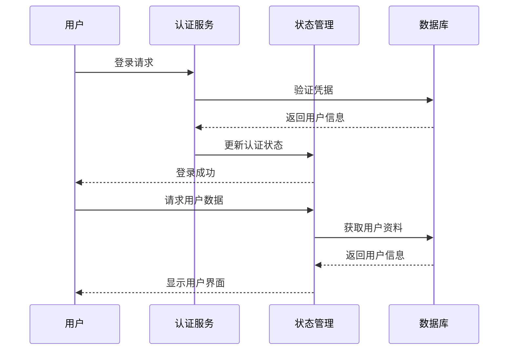
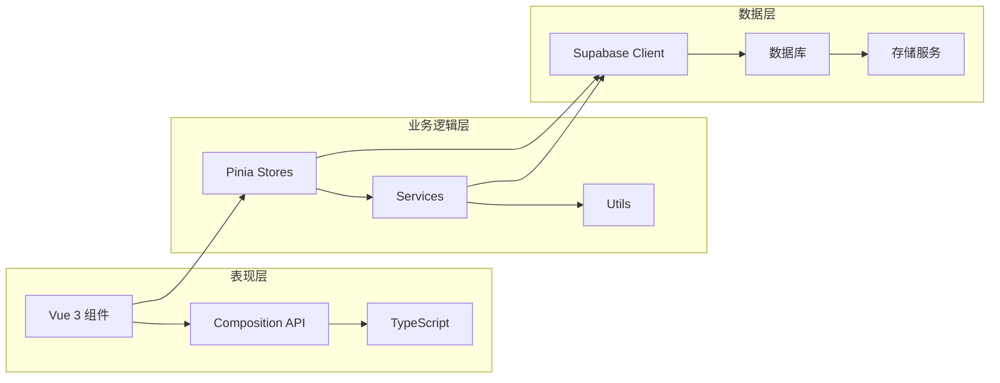
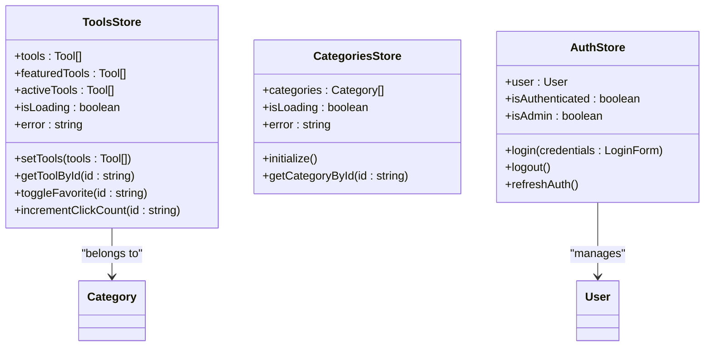
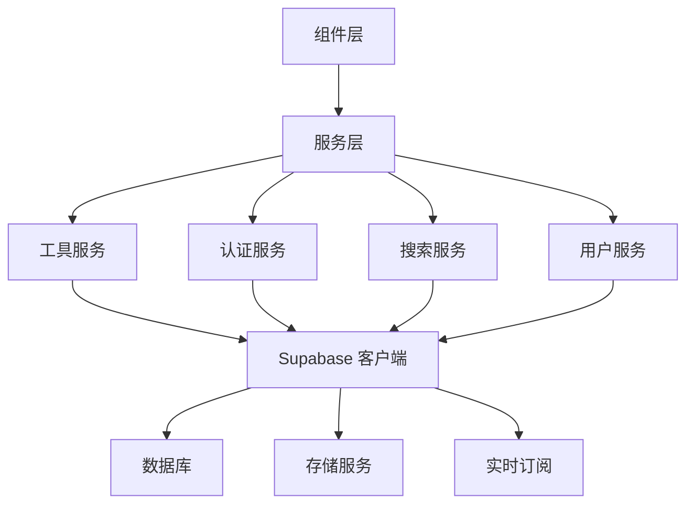
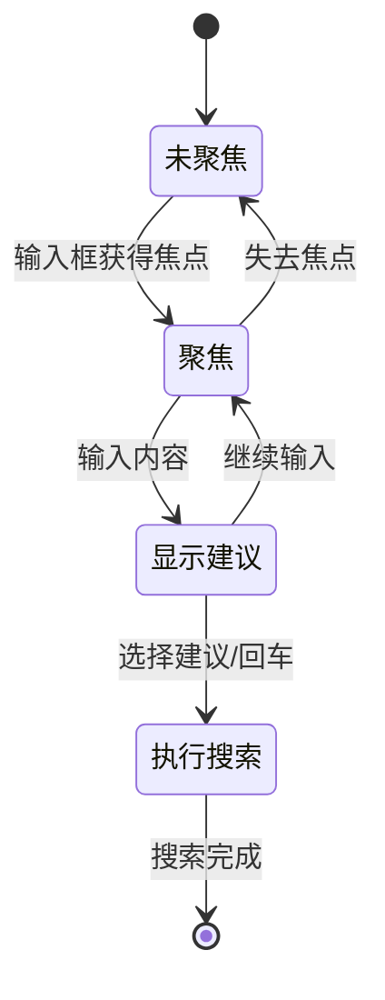
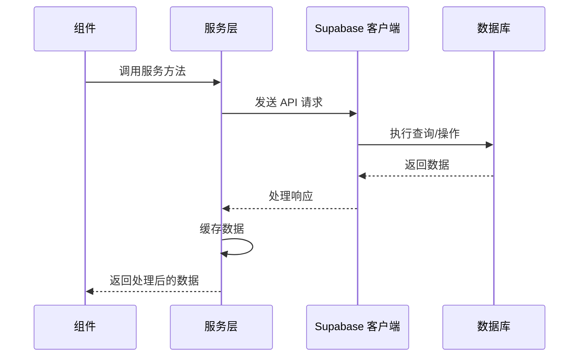
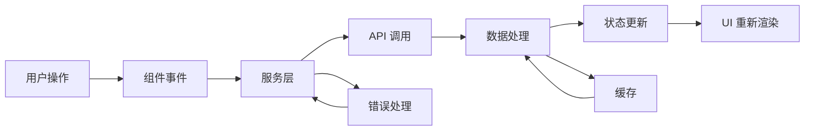
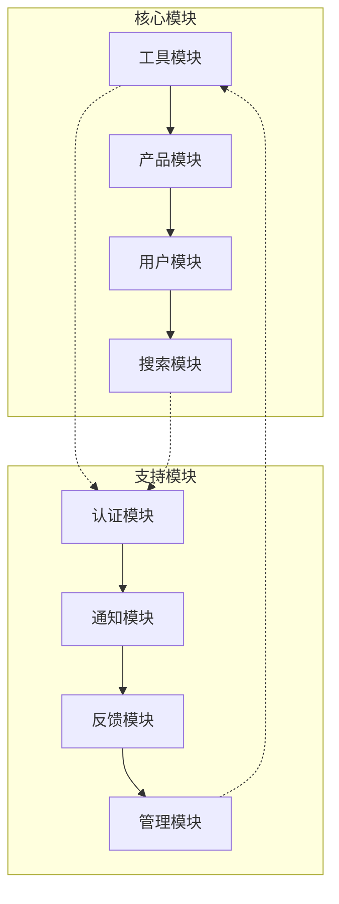

# advanced-tools-navigation 项目概述

<cite>
**本文档引用的文件**
- [README.md](file://README.md)
- [src/main.ts](file://src/main.ts)
- [src/App.vue](file://src/App.vue)
- [src/stores/tools.ts](file://src/stores/tools.ts)
- [src/router/index.ts](file://src/router/index.ts)
- [src/services/toolsService.ts](file://src/services/toolsService.ts)
- [src/lib/supabaseClient.ts](file://src/lib/supabaseClient.ts)
- [src/views/HomeView.vue](file://src/views/HomeView.vue)
- [src/components/search/EnhancedSearchBox.vue](file://src/components/search/EnhancedSearchBox.vue)
- [src/services/searchService.ts](file://src/services/searchService.ts)
- [src/services/authService.ts](file://src/services/authService.ts)
- [src/types/database.ts](file://src/types/database.ts)
- [src/lib/supabase-schema.ts](file://src/lib/supabase-schema.ts)
</cite>

## 目录
1. [项目简介](#项目简介)
2. [核心功能概览](#核心功能概览)
3. [技术架构分析](#技术架构分析)
4. [系统设计模式](#系统设计模式)
5. [关键组件详解](#关键组件详解)
6. [前后端协作机制](#前后端协作机制)
7. [性能优化策略](#性能优化策略)
8. [扩展性和维护性](#扩展性和维护性)
9. [总结与展望](#总结与展望)

## 项目简介

advanced-tools-navigation 是一个现代化的工具导航平台，旨在为用户提供高效、便捷的工具和产品管理体验。该项目采用 Vue 3 + TypeScript + Supabase 的技术栈，结合 Fluent Design 设计语言，打造了一个功能丰富、性能优异的现代化 Web 应用。

### 项目定位

该项目作为一站式工具导航平台，不仅提供工具和产品的展示与管理功能，还集成了用户系统、收藏机制、反馈系统等多个模块，形成了完整的生态系统。它特别适合需要高效管理大量工具和资源的开发者、设计师和其他专业人士。

### 核心价值

- **提升工作效率**：通过智能化的搜索和分类系统，帮助用户快速找到所需的工具和资源
- **简化管理流程**：提供统一的工具管理界面，支持批量操作和自动化管理
- **增强用户体验**：采用现代化的设计语言和交互方式，提供流畅的使用体验
- **确保数据安全**：基于 Supabase 的后端服务，提供可靠的数据存储和安全保障

## 核心功能概览

### 工具管理系统

项目的核心功能是工具管理，包括：



**图表来源**
- [src/services/toolsService.ts](file://src/services/toolsService.ts#L1-L50)
- [src/stores/tools.ts](file://src/stores/tools.ts#L1-L100)

### 用户系统功能



**图表来源**
- [src/services/authService.ts](file://src/services/authService.ts#L1-L100)
- [src/stores/auth.ts](file://src/stores/auth.ts#L1-L50)

### 搜索与发现系统

项目实现了强大的搜索功能，支持：

- **多维度搜索**：支持工具、产品、分类等多种类型的搜索
- **智能建议**：根据用户输入提供实时搜索建议
- **高级筛选**：支持价格范围、分类、标签等多维度过滤
- **个性化推荐**：基于用户行为和偏好提供个性化内容

**章节来源**
- [src/services/searchService.ts](file://src/services/searchService.ts#L1-L200)
- [src/components/search/EnhancedSearchBox.vue](file://src/components/search/EnhancedSearchBox.vue#L1-L300)

## 技术架构分析

### 整体架构风格

项目采用了 MVVM（Model-View-ViewModel）架构模式，结合现代前端开发的最佳实践：



**图表来源**
- [src/main.ts](file://src/main.ts#L1-L50)
- [src/App.vue](file://src/App.vue#L1-L50)

### 技术选型理由

#### Vue 3 + TypeScript
- **响应式系统**：Vue 3 的 Composition API 提供了更灵活的状态管理
- **类型安全**：TypeScript 确保代码质量和开发效率
- **性能优化**：Tree-shaking 和更好的编译优化

#### Supabase
- **开箱即用**：提供完整的后端服务，减少开发成本
- **实时功能**：支持实时数据同步和推送通知
- **安全性**：内置 RLS（Row Level Security）确保数据安全

#### Vite 构建工具
- **快速开发**：热更新和快速打包
- **现代化配置**：支持最新的 Web 标准
- **插件生态**：丰富的插件支持

**章节来源**
- [README.md](file://README.md#L1-L50)
- [src/main.ts](file://src/main.ts#L1-L132)

## 系统设计模式

### 状态管理模式

项目使用 Pinia 作为状态管理解决方案，实现了清晰的状态分离：



**图表来源**
- [src/stores/tools.ts](file://src/stores/tools.ts#L100-L200)
- [src/stores/categories.ts](file://src/stores/categories.ts#L1-L50)
- [src/stores/auth.ts](file://src/stores/auth.ts#L1-L50)

### 服务层架构



**图表来源**
- [src/services/toolsService.ts](file://src/services/toolsService.ts#L1-L100)
- [src/services/authService.ts](file://src/services/authService.ts#L1-L100)

**章节来源**
- [src/services/toolsService.ts](file://src/services/toolsService.ts#L1-L200)
- [src/services/authService.ts](file://src/services/authService.ts#L1-L200)

## 关键组件详解

### 主应用组件

主应用组件负责全局状态管理和路由渲染：

```typescript
// 应用启动流程
const app = createApp(App);
const pinia = createPinia();

app.use(pinia);
app.use(router);

// 异步初始化核心状态
initializeCoreStores()
  .then((success) => {
    if (success) {
      app.mount("#app");
    }
  });
```

### 工具状态管理

工具状态管理实现了完整的 CRUD 操作和智能缓存：

```typescript
// 工具状态接口
interface Tool {
  id: string;
  name: string;
  description: string;
  url: string | null;
  icon: string | null;
  category_id: string | null;
  is_featured: boolean;
  is_favorite?: boolean;
  click_count: number;
  status: 'active' | 'inactive';
  created_at: string;
  updated_at: string;
}
```

### 搜索组件

搜索组件提供了丰富的搜索功能和用户体验：



**图表来源**
- [src/components/search/EnhancedSearchBox.vue](file://src/components/search/EnhancedSearchBox.vue#L1-L200)

**章节来源**
- [src/App.vue](file://src/App.vue#L1-L71)
- [src/stores/tools.ts](file://src/stores/tools.ts#L1-L319)
- [src/components/search/EnhancedSearchBox.vue](file://src/components/search/EnhancedSearchBox.vue#L1-L500)

## 前后端协作机制

### API 通信模式

项目采用 RESTful API 设计，结合 Supabase 的 RPC 函数：



**图表来源**
- [src/services/toolsService.ts](file://src/services/toolsService.ts#L50-L150)
- [src/lib/supabaseClient.ts](file://src/lib/supabaseClient.ts#L1-L100)

### 数据流管理



**图表来源**
- [src/services/toolsService.ts](file://src/services/toolsService.ts#L200-L300)

**章节来源**
- [src/services/toolsService.ts](file://src/services/toolsService.ts#L1-L400)
- [src/lib/supabaseClient.ts](file://src/lib/supabaseClient.ts#L1-L246)

## 性能优化策略

### 缓存机制

项目实现了多层次的缓存策略：

1. **内存缓存**：使用 LRU 缓存算法管理热点数据
2. **本地存储**：持久化搜索历史和用户偏好
3. **HTTP 缓存**：利用浏览器缓存减少网络请求

### 懒加载和代码分割

```typescript
// 路由懒加载
const routes: RouteRecordRaw[] = [
  {
    path: "/tools",
    name: "Tools",
    component: () => import("../views/ToolsView.vue"),
  },
  {
    path: "/products",
    name: "Products",
    component: () => import("../views/ProductsView.vue"),
  },
];
```

### 性能监控

项目集成了性能监控功能，包括：

- **页面加载时间监控**
- **API 响应时间统计**
- **用户交互性能分析**
- **错误率监控**

**章节来源**
- [src/services/toolsService.ts](file://src/services/toolsService.ts#L300-L400)
- [src/router/index.ts](file://src/router/index.ts#L1-L100)

## 扩展性和维护性

### 模块化设计

项目采用高度模块化的设计，便于功能扩展：



### 插件化架构

- **组件插件**：支持自定义组件的动态加载
- **服务插件**：可扩展的服务层架构
- **路由插件**：灵活的路由配置系统

### 版本兼容性

项目保持良好的向后兼容性：

- **TypeScript 版本**：严格遵循语义化版本控制
- **Vue 版本**：支持渐进式升级
- **依赖管理**：定期更新和安全补丁

**章节来源**
- [src/router/index.ts](file://src/router/index.ts#L1-L399)
- [src/main.ts](file://src/main.ts#L1-L132)

## 总结与展望

### 项目优势

1. **技术先进性**：采用最新的前端技术和最佳实践
2. **功能完整性**：覆盖工具导航的各个方面需求
3. **用户体验**：注重交互设计和性能优化
4. **可维护性**：清晰的架构设计和完善的文档

### 发展方向

1. **AI 集成**：引入智能推荐和自然语言处理功能
2. **移动端优化**：进一步完善移动端用户体验
3. **国际化支持**：扩展多语言和本地化功能
4. **微服务架构**：考虑向微服务架构演进

### 对开发者的价值

对于初学者：
- 提供完整的 Vue 3 + TypeScript 项目示例
- 展示现代前端开发的最佳实践
- 包含丰富的组件和工具使用案例

对于高级开发者：
- 提供可扩展的架构设计参考
- 展示复杂状态管理和数据流处理
- 包含性能优化和安全性的实践经验

这个项目不仅是一个实用的工具导航平台，更是现代前端开发技术的综合展示，为开发者提供了宝贵的学习和参考价值。