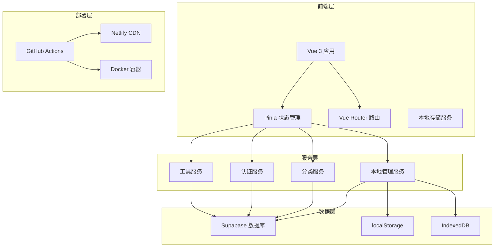
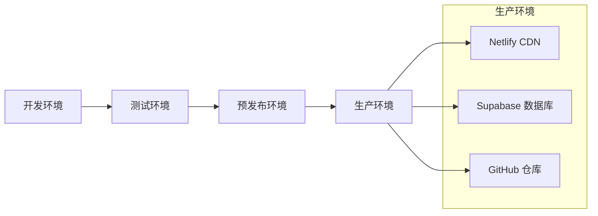

# 🏗️ 技术架构文档

## 📋 概述

本文档详细描述了工具导航站的技术架构，包括前端架构、后端服务、数据库设计、本地管理功能等核心组件的设计和实现。

## 🎯 架构目标

- **高性能**: 快速响应和流畅的用户体验
- **可扩展**: 模块化设计，易于扩展新功能
- **可维护**: 清晰的代码结构和完善的文档
- **离线优先**: 支持离线使用和智能数据同步
- **安全可靠**: 完善的权限控制和数据安全

## 🏗️ 整体架构



## 🎨 前端架构

### 技术栈
- **框架**: Vue 3.4+ (Composition API)
- **构建工具**: Vite 5.0+
- **状态管理**: Pinia 2.1+
- **路由**: Vue Router 4.0+
- **样式**: Tailwind CSS 3.4+
- **类型系统**: TypeScript 5.3+

### 组件架构

```typescript
// 组件层次结构
App.vue
├── AppHeader.vue
├── AppSidebar.vue
├── RouterView
│   ├── HomeView.vue
│   ├── ToolsView.vue
│   ├── ProductsView.vue
│   ├── AdminView.vue
│   │   ├── DashboardView.vue
│   │   ├── AdminToolsView.vue
│   │   ├── ProductsManageView.vue
│   │   └── LocalManagementView.vue
│   └── UserView.vue
└── AppFooter.vue
```

### 状态管理架构

```typescript
// Pinia Stores 架构
stores/
├── auth.ts              // 用户认证状态
├── tools.ts             // 工具数据状态
├── categories.ts        // 分类数据状态
├── products.ts          // 产品数据状态
└── localManagement.ts   // 本地管理状态

// 状态流转
User Action → Component → Store → Service → API/LocalStorage
```

## 🗄️ 数据库架构

### Supabase PostgreSQL 设计

```sql
-- 核心表结构
┌─────────────────┐    ┌─────────────────┐    ┌─────────────────┐
│   categories    │    │      tools      │    │   user_profiles │
├─────────────────┤    ├─────────────────┤    ├─────────────────┤
│ id (UUID)       │◄───┤ category_id     │    │ id (UUID)       │
│ name            │    │ id (UUID)       │    │ user_id         │
│ description     │    │ name            │    │ role            │
│ icon            │    │ description     │    │ avatar_url      │
│ color           │    │ url             │    │ created_at      │
│ parent_id       │    │ icon            │    │ updated_at      │
│ sort_order      │    │ is_featured     │    └─────────────────┘
│ is_active       │    │ click_count     │
│ created_at      │    │ status          │
│ updated_at      │    │ created_by      │◄───┐
└─────────────────┘    │ created_at      │    │
                       │ updated_at      │    │
                       └─────────────────┘    │
                                              │
┌─────────────────┐    ┌─────────────────┐    │
│    favorites    │    │     orders      │    │
├─────────────────┤    ├─────────────────┤    │
│ id (UUID)       │    │ id (UUID)       │    │
│ user_id         │────┤ user_id         │────┘
│ tool_id         │────┤ total_amount    │
│ created_at      │    │ status          │
└─────────────────┘    │ created_at      │
                       │ updated_at      │
                       └─────────────────┘
```

### 数据关系

1. **用户系统**: `auth.users` ↔ `user_profiles`
2. **工具分类**: `categories` ↔ `tools` (一对多)
3. **用户收藏**: `users` ↔ `favorites` ↔ `tools` (多对多)
4. **订单系统**: `users` ↔ `orders` ↔ `order_items` ↔ `products`

### 权限控制 (RLS)

```sql
-- 行级安全策略示例
CREATE POLICY "Users can view active tools" ON tools
  FOR SELECT USING (status = 'active');

CREATE POLICY "Admins can manage tools" ON tools
  FOR ALL USING (
    EXISTS (
      SELECT 1 FROM user_profiles 
      WHERE user_id = auth.uid() 
      AND role IN ('admin', 'super_admin')
    )
  );
```

## 💾 本地管理架构

### 设计原则

1. **离线优先**: 本地数据为主，远程同步为辅
2. **智能同步**: 基于时间戳的冲突检测
3. **数据一致性**: 确保本地和远程数据的一致性
4. **用户体验**: 无缝的离线/在线切换

### 数据流架构

```typescript
// 本地管理数据流
┌─────────────────┐    ┌─────────────────┐    ┌─────────────────┐
│   用户操作      │───▶│   本地存储      │───▶│   离线队列      │
└─────────────────┘    └─────────────────┘    └─────────────────┘
                                │                       │
                                ▼                       ▼
┌─────────────────┐    ┌─────────────────┐    ┌─────────────────┐
│   UI 更新       │◄───│   状态管理      │◄───│   网络检测      │
└─────────────────┘    └─────────────────┘    └─────────────────┘
                                │                       │
                                ▼                       ▼
┌─────────────────┐    ┌─────────────────┐    ┌─────────────────┐
│   数据同步      │◄───│   冲突检测      │◄───│   Supabase API  │
└─────────────────┘    └─────────────────┘    └─────────────────┘
```

### 存储策略

```typescript
// 存储层次结构
localStorage
├── local_tools           // 本地工具数据
├── local_categories      // 本地分类数据
├── user_preferences      // 用户偏好设置
├── offline_queue         // 离线操作队列
├── last_sync_time        // 最后同步时间
└── app_config           // 应用配置

// 数据结构示例
interface LocalTool {
  // 数据库字段
  id?: string;
  name: string;
  description: string;
  url: string;
  categoryId: string;
  
  // 本地管理字段
  localId?: string;
  isLocal?: boolean;
  lastModified?: string;
  syncStatus?: 'pending' | 'synced' | 'conflict';
}
```

## 🔄 服务层架构

### 服务分层

```typescript
// 服务层架构
services/
├── authService.ts        // 认证服务
├── toolsService.ts       // 工具服务
├── categoriesService.ts  // 分类服务
├── productsService.ts    // 产品服务
├── userService.ts        // 用户服务
├── favoritesService.ts   // 收藏服务
└── localStorageService.ts // 本地存储服务

// 服务接口设计
interface BaseService<T> {
  getAll(): Promise<T[]>;
  getById(id: string): Promise<T>;
  create(data: Partial<T>): Promise<T>;
  update(id: string, data: Partial<T>): Promise<T>;
  delete(id: string): Promise<void>;
}
```

### API 设计模式

```typescript
// 统一的 API 响应格式
interface ApiResponse<T> {
  data: T;
  error: string | null;
  success: boolean;
  message?: string;
}

// 错误处理机制
class ErrorHandler {
  static handle(error: any): ApiResponse<null> {
    return {
      data: null,
      error: error.message || 'Unknown error',
      success: false
    };
  }
}
```

## 🚀 部署架构

### CI/CD 流程

```yaml
# GitHub Actions 工作流
name: CI/CD Pipeline
on:
  push:
    branches: [main]
  pull_request:
    branches: [main]

jobs:
  test:
    - 代码检查 (ESLint)
    - 类型检查 (TypeScript)
    - 单元测试 (Vitest)
    
  build:
    - 构建应用 (Vite)
    - 优化资源
    - 生成类型定义
    
  deploy:
    - 部署到 Netlify
    - 更新 Supabase 迁移
    - 健康检查
```

### 部署环境



## 🔒 安全架构

### 认证和授权

```typescript
// 权限控制架构
enum UserRole {
  USER = 'user',
  ADMIN = 'admin',
  SUPER_ADMIN = 'super_admin'
}

// 路由守卫
const requireAuth = (to: RouteLocationNormalized) => {
  const authStore = useAuthStore();
  if (!authStore.isAuthenticated) {
    return '/auth/login';
  }
};

const requireAdmin = (to: RouteLocationNormalized) => {
  const authStore = useAuthStore();
  if (!authStore.isAdmin) {
    return '/403';
  }
};
```

### 数据安全

1. **传输安全**: HTTPS + TLS 1.3
2. **存储安全**: Supabase 行级安全策略
3. **认证安全**: JWT + 刷新令牌机制
4. **输入验证**: 前后端双重验证
5. **权限控制**: 基于角色的访问控制

## 📊 性能优化

### 前端优化

```typescript
// 代码分割
const AdminView = defineAsyncComponent(() => import('./views/AdminView.vue'));
const LocalManagementView = defineAsyncComponent(() => 
  import('./views/admin/LocalManagementView.vue')
);

// 状态持久化
const usePersistedStore = (key: string, store: any) => {
  const state = localStorage.getItem(key);
  if (state) {
    store.$patch(JSON.parse(state));
  }
  
  store.$subscribe((mutation: any, state: any) => {
    localStorage.setItem(key, JSON.stringify(state));
  });
};
```

### 数据库优化

```sql
-- 索引优化
CREATE INDEX CONCURRENTLY idx_tools_category_id ON tools(category_id);
CREATE INDEX CONCURRENTLY idx_tools_status ON tools(status);
CREATE INDEX CONCURRENTLY idx_tools_featured ON tools(is_featured) WHERE is_featured = true;

-- 查询优化
EXPLAIN ANALYZE SELECT t.*, c.name as category_name 
FROM tools t 
JOIN categories c ON t.category_id = c.id 
WHERE t.status = 'active' 
ORDER BY t.sort_order;
```

## 🧪 测试架构

### 测试策略

```typescript
// 测试金字塔
tests/
├── unit/              // 单元测试 (70%)
│   ├── services/     // 服务层测试
│   ├── stores/       // 状态管理测试
│   └── utils/        // 工具函数测试
├── integration/      // 集成测试 (20%)
│   ├── api/         // API 集成测试
│   └── database/    // 数据库测试
└── e2e/             // 端到端测试 (10%)
    ├── user-flows/  // 用户流程测试
    └── admin/       // 管理功能测试
```

### 测试工具

- **单元测试**: Vitest + Vue Test Utils
- **集成测试**: Supertest + Supabase Test Client
- **E2E 测试**: Playwright
- **覆盖率**: c8

## 📈 监控和分析

### 性能监控

```typescript
// 性能指标收集
interface PerformanceMetrics {
  pageLoadTime: number;
  apiResponseTime: number;
  renderTime: number;
  memoryUsage: number;
}

// 错误监控
class ErrorTracker {
  static track(error: Error, context: any) {
    // 发送到监控服务
    console.error('Error tracked:', error, context);
  }
}
```

### 用户分析

```sql
-- 分析数据表
CREATE TABLE analytics (
  id UUID PRIMARY KEY DEFAULT uuid_generate_v4(),
  event_type TEXT NOT NULL,
  event_data JSONB,
  user_id UUID REFERENCES auth.users(id),
  session_id TEXT,
  created_at TIMESTAMP WITH TIME ZONE DEFAULT NOW()
);
```

## 🔮 未来规划

### 技术演进

1. **微前端架构**: 模块化拆分大型应用
2. **GraphQL API**: 更灵活的数据查询
3. **PWA 支持**: 原生应用体验
4. **AI 集成**: 智能推荐和搜索
5. **实时协作**: 多用户实时编辑

### 性能提升

1. **边缘计算**: CDN + Edge Functions
2. **缓存策略**: Redis + 浏览器缓存
3. **数据库优化**: 读写分离 + 分片
4. **资源优化**: WebP + 懒加载
5. **代码优化**: Tree Shaking + 压缩

---

**本文档最后更新时间: 2024-12-19**
